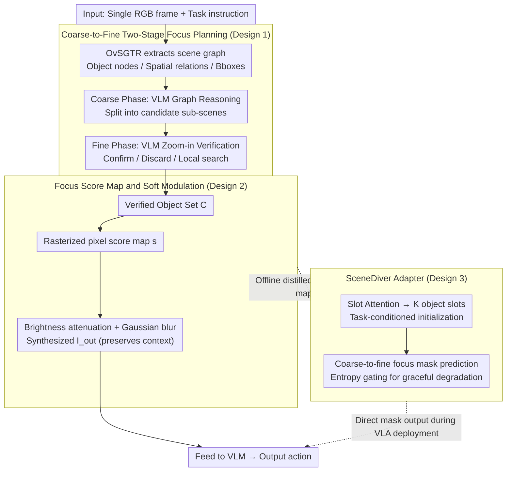

# Dive into the Scene: Breaking the Perceptual Bottleneck in Vision-Language Decision Making via Focus Plan Generation

**Conference**: ICML 2026  
**arXiv**: [2606.04046](https://arxiv.org/abs/2606.04046)  
**Code**: https://future-item.github.io/SceneDiver (Available)  
**Area**: Embodied AI / Robotics / Multimodal VLM  
**Keywords**: VLM, VLA, visual focus planning, scene graph, object hallucination

## TL;DR
SceneDiver filters task-relevant objects and feeds them back to the VLM for decision-making through a two-stage focus planning process: "building a scene graph for coarse-grained sub-scene decomposition, followed by agentic sub-scene verification by the VLM." This explicit reasoning is distilled into a VLA via a Slot Attention adapter, simultaneously mitigating visual hallucinations in both high-level planning and reactive control.

## Background & Motivation
**Background**: Embodied decision-making tasks are typically split into two paths: using a VLM as a high-level task planner and a VLA as an end-to-end reactive controller. The former excels at long-range decomposition but has poor real-time performance, while the latter is real-time but lacks deliberate reasoning.

**Limitations of Prior Work**: Both paths share a "perceptual bottleneck"—in cluttered scenes, VLM/VLA may hallucinate non-existent objects, miss detection, incorrectly bind attributes, or miscount instances of the same category. Figure 1 shows two typical failures: when asked "how many green objects," attention shifts to the background; when asked "the color of the object grasped by the arm," attention is diverted by nearby yellow blocks.

**Key Challenge**: Intuitively, "one-step focusing" (using existing methods like SoM, Multi-Res, or VCD to directly circle key objects) should solve this, but empirical tests show it is ineffective. Reliability in complex scenes requires understanding the topological relationships first; single-step localization cannot isolate task-relevant objects from background distractors of similar colors.

**Goal**: (1) Enable the VLM to autonomously generate a "focus plan" before making decisions, compressing visual input into task-relevant regions. (2) Distill this slow-thinking capability into the VLA, allowing the reactive strategy to benefit while maintaining online inference efficiency.

**Key Insight**: The authors view "focusing" as a multi-step process that can be planned by the VLM itself, using the scene graph as a structural prior to guide coarse-to-fine sub-scene decomposition. Decision-making is modeled as "image modulation"—retaining high frequency and brightness in key regions while softening the background, rather than hard cropping which discards information.

**Core Idea**: Replace one-step focusing with coarse-to-fine focus planning and return the planning result to the VLM/VLA as a "pixel-level focus map + soft modulation," embedding the concept of "see clearly before deciding" into the perception-action loop.

## Method
SceneDiver consists of three sequential components: coarse-grained scene graph reasoning → fine-grained sub-scene verification → focus-modulated image generation; plus a VLA adapter that compresses this explicit process into an end-to-end module.

### Overall Architecture
The input is an RGB frame and a task instruction. First, OvSGTR extracts a scene graph containing object nodes `<ref>`, spatial relations `<pred>`, and bounding boxes `<box>`, which is then textualized and fed to the VLM. The VLM performs graph reasoning to decompose the full image into several candidate sub-scenes. Subsequently, the VLM acts as an agent to perform "zoom-in inspection" sub-scene by sub-scene, deciding to confirm, discard, or perform a local search, resulting in a verified object set $\mathcal{C}$. Finally, $\mathcal{C}$ is rasterized into a pixel-level Focus Score Map $s$, and soft modulation (brightness attenuation + Gaussian blur) is applied to the image to obtain $I_{out}$, which is fed back to the VLM for action generation. During VLA deployment, the explicit two-stage process is skipped, and the distilled adapter predicts the mask directly.

### Key Designs

**1. Coarse-to-Fine Two-Stage Focus Planning: Global partitioning via scene graph followed by agentic sub-scene verification**

While "one-step focusing" (SoM, Multi-Res, VCD) is intuitive, it fails to solve the perceptual bottleneck in complex scenes. Reliable focusing requires understanding the scene topology; single-step localization cannot isolate distractors of the same color. SceneDiver splits the question of "where is worth looking" into two steps: The coarse phase uses the scene graph as a reasoning scaffold, where the VLM outputs structured intermediate states (using `<ref>` for nodes and `<box>` for coordinates) to partition the global scene into local sub-scenes. The fine phase performs "semantic zoom-in" with a restricted field of view for each sub-scene—confirming if candidate objects are in the window, further narrowing the focus if evidence is ambiguous, or searching locally if objects are missing.

The key design philosophy is that the VLM is always the "sole source of truth," while the scene graph is merely a dismissible guide. When image-graph inconsistencies occur, the VLM can select spatially adjacent nodes, discard, or keep ambiguous candidates, preventing detection errors from OvSGTR from propagating downstream. This creates an iterative cognitive cycle of "recognition → understanding → analysis" rather than betting everything on a single localization step.

**2. Focus Score Map and Soft Image Modulation: Translating verified boxes into softened attention rather than hard crops**

After obtaining the verified object set $\mathcal{C}$, how should it be fed back to the VLM? Hard cropping (like SoM) removes the environmental context needed for robot localization and obstacle avoidance. SceneDiver uses differentiable soft modulation: it first generates pixel-level scores $s_{u,v}=\mathbb{I}[\exists k\in\mathcal{C}:(u,v)\in b_k]$, introduces a visibility floor $\beta$ to prevent a completely black background, performs brightness attenuation $I_{dim}=I\odot(\beta+(1-\beta)s)$, and then synthesizes the output via Gaussian blur interpolation:

$$I_{out}=s\odot I_{dim}+(1-s)\odot\mathcal{B}_\sigma(I_{dim}).$$

Target regions retain high brightness and high-frequency details, while the background is simultaneously dimmed and blurred. The essence is "suppressing interference" rather than "discarding information," which is friendlier to error recovery, and differentiable pixel operations can seamlessly interface with any VLM input with low migration costs.

**3. SceneDiver Adapter: Distilling explicit two-stage reasoning into an end-to-end VLA module using Slot Attention**

Iterative graph traversal is too heavy for VLA real-time inference, so slow thinking must be compressed into a lightweight module. The adapter is connected after the cross-modal projector, using Slot Attention to project visual features $F\in\mathbb{R}^{L\times D}$ into $K$ object slots $S\in\mathbb{R}^{K\times D_s}$. Slot initialization $S_{init}\sim\mathcal{N}(\mu(v_{task})+\delta,\sigma_{global})$ is conditioned on $v_{task}$ pooled from task tokens, preventing random initialization from assigning slots to irrelevant textures. Mask prediction follows a coarse-to-fine strategy: the coarse level uses slot semantics, quality, and task context to score $r_k$; the fine level uses an attention map $A\in\mathbb{R}^{K\times L}$ to back-propagate slot semantics to patches, yielding $M_{pred}=\sigma(\sum_k r_k\cdot A_{k,:}+\alpha\cdot\Delta_{patch})$. $\alpha$ is initially near zero, allowing the network to rely on slot-level prediction before progressively introducing spatial corrections.

Slot Attention is chosen because object slots naturally correspond to "graph nodes," and mask prediction naturally corresponds to "two-stage reasoning results." Training uses Hungarian matching to align slots with scene graph objects (dual supervision via Structure Loss + Mask Loss), learning "how to output a focus map" rather than "how to mimic trajectories." During deployment, an entropy-based dynamic gating mechanism is added: if patch uncertainty exceeds a threshold, the mask is skipped and the original image is sent to the VLA, achieving "graceful degradation" in difficult scenes to avoid contaminating the strategy with incorrect masks.

### Loss & Training
The adapter training employs two sets of supervision: Structure Loss to match slots to scene graph nodes, and Mask Loss to make predicted masks approximate the GT focus maps generated by the two-stage process. During deployment, an entropy-based dynamic gate is added: when patch uncertainty exceeds a threshold, the mask is skipped and original observations are fed into the VLA. This ensures "graceful degradation" in difficult scenarios, preventing incorrect masks from polluting the policy.

## Key Experimental Results

### Main Results
Robot Manipulation (30 MuJoCo scenes, 5 seeds, assembling target bricks on a base plate within 30 steps):

| Model | Base SR (%) | + SceneDiver Focus (%) | Absolute Gain |
|------|------|------|------|
| Qwen2.5-VL-7B-AWQ | 14.7 | 28.7 | +14.0 |
| Qwen2.5-VL-32B-AWQ | 21.3 | 31.3 | +10.0 |
| gpt-4o-mini | 28.7 | 34.0 | +5.3 |
| gemini-2.5-flash | 38.7 | 46.7 | +8.0 |

Room Navigation (Base / CS Commonsense / CI Complex Instruction / VA Visual Appearance distractors, 5 seeds):

| Method (Qwen2.5-VL-7B) | Base | CS | CI | VA |
|------|------|------|------|------|
| Base Model | 32.7 | 30.7 | 32.0 | 27.3 |
| SoM | 30.0 | 31.3 | 31.3 | 29.3 |
| Multi-Res | 29.3 | 32.7 | 34.0 | 29.3 |
| VCD | 34.7 | 32.0 | 32.7 | 33.3 |
| SceneDiver | **44.0** | **36.0** | **37.3** | **35.3** |

On LIBERO-Plus (OpenVLA-OFT backbone), the SceneDiver adapter increases robust success rates by up to 9.6%, with an additional inference overhead of only 2.64%.

### Ablation Study

| Configuration | Key Observation | Explanation |
|------|------|------|
| Full SceneDiver | 14.7→28.7 (7B) | Coarse+Fine+Modulation ensemble |
| Coarse stage only | Limited gain | No sub-scene verification; wrong nodes pollute decisions |
| Fine stage only (no graph) | Similar to one-step focus | Lacks global topology to systematically isolate distractors |
| Noisy scene graph (stress test) | Still better than base | VLM is allowed to discard/replace nodes in the graph |
| Disable adapter entropy gate | Errors in ambiguous scenes | Incorrect masks backward-pollute the VLA |

### Key Findings
- Gains primarily come from "topological partitioning followed by local verification." This aligns with the failure analysis in Sec. 4: simple SoM/Multi-Res/VCD provide near-zero or even negative gains in scenes with distractors (e.g., Qwen2.5-VL-7B Base 32.7 → SoM 30.0), whereas SceneDiver lifts the Base to 44.0.
- Open-source models benefit the most: The success rate (SR) for Qwen2.5-VL-7B nearly doubled in manipulation tasks, likely because these models suffer most from visual hallucinations. Gains for closed-source LLMs were smaller but still positive (gpt-4o-mini +5.3).
- Soft modulation is superior to hard cropping: Retaining a brightness floor $\beta$ prevents the robot from losing environmental localization cues, explaining why navigation tasks are more sensitive to modulation parameters than manipulation tasks.
- The adapter keeps overhead at 2.64%, but it should only be enabled when mask confidence is high; otherwise, it must fall back via entropy gating to avoid dragging down the VLA.

## Highlights & Insights
- The design philosophy of "VLM as the sole source of truth, scene graph as a guide" is critical: treating the scene graph as a "dismissible proposal" rather than "ground truth" avoids the direct propagation of OvSGTR errors.
- Soft modulation $I_{out}=s\odot I_{dim}+(1-s)\odot\mathcal{B}_\sigma(I_{dim})$ implements "attention priors" via differentiable pixel operations instead of cropping. This can be seamlessly integrated into any VLM input with low migration costs.
- Using Slot Attention + task-conditioned initialization makes the mapping between "object slots ↔ scene graph nodes" more stable, a technique applicable to any downstream task requiring visual tokens to be compressed into interpretable object representations.
- Entropy gating provides the distilled VLA with the ability to "know what it doesn't know," preventing incorrect masks from leading the end-to-end strategy astray—a valuable addition to any VLA framework relying on auxiliary predictors.

## Limitations & Future Work
- Strong dependence on the detection quality of the external scene graph model (OvSGTR). Although robustness tests were conducted with noisy graphs, performance might collapse for object categories entirely absent from training (extreme open-vocabulary cases).
- The inference cost of two-stage focus planning on the VLM side is expensive, which necessitated the distillation into an adapter; for closed-source API-based VLMs, the cost of multi-round prompts per step would be significant.
- The adapter has currently only been validated on OpenVLA-OFT; its effectiveness on different paradigms (e.g., diffusion policy, π0) remains unknown.
- Soft modulation is sensitive to parameters $\beta$ and $\sigma$. Currently, these are empirical global values; adaptive online adjustment based on the scene is an obvious direction for extension.

## Related Work & Insights
- **vs SoM / Multi-Res / VCD**: These follow the "one-step focus" route, either only annotating, cropping at multiple resolutions, or using contrastive decoding. This paper proves they offer nearly zero gain in embodied decision-making with distractors due to a lack of global topological understanding.
- **vs Brohan et al. (RT/SayCan) High-level Planning**: This route uses VLMs as action sequence planners. SceneDiver does not replace planning but inserts "seeing clearly" before it, serving as a complement.
- **vs Nguyen 2025 / Terra et al. 3D Scene Graph Robots**: These use 3D scene graphs for environment representation to support long-term memory and reachability reasoning. SceneDiver uses 2D scene graphs for single-frame focus planning, targeting the perceptual bottleneck rather than environment modeling.
- **Insight**: The pipeline of "explicit multi-step reasoning → distillation into lightweight end-to-end modules" can be applied to many "VLM slow-thinking / VLA fast-reacting" scenarios, such as VLN, autonomous driving perception enhancement, and multi-object grasping for service robots.

## Rating
- Novelty: ⭐⭐⭐⭐ The combination of using a scene graph as a dismissible prior, soft modulation instead of hard cropping, and Slot Attention distillation for VLA is uncommon in embodied decision-making.
- Experimental Thoroughness: ⭐⭐⭐⭐ Covers manipulation, navigation, and LIBERO-Plus robustness tasks, validates both open and closed-source models, and includes noisy scene graph stress testing.
- Writing Quality: ⭐⭐⭐⭐ Clear storyline with consistent notation; however, few failure cases were showcased.
- Value: ⭐⭐⭐⭐ Provides a plug-and-play perception pre-processing tool for the "VLM-as-planner, VLA-as-executor" paradigm, with particularly significant gains for small open-source models.

<!-- RELATED:START -->

## Related Papers

- [\[ICML 2026\] PSG-Nav: Probabilistic Scene Graph Navigation via Multiverse Decision Making](psg-nav_probabilistic_scene_graph_navigation_via_multiverse_decision_making.md)
- [\[ICLR 2026\] MemoryVLA: Perceptual-Cognitive Memory in Vision-Language-Action Models for Robotic Manipulation](../../ICLR2026/robotics/memoryvla_perceptual-cognitive_memory_in_vision-language-action_models_for_robot.md)
- [\[ICML 2026\] Spatial Memory for Out-of-Vision Manipulation in Vision-Language-Action](spatial_memory_for_out-of-vision_manipulation_in_vision-language-action.md)
- [\[CVPR 2025\] Decision SpikeFormer: Spike-Driven Transformer for Decision Making](../../CVPR2025/robotics/decision_spikeformer_spike-driven_transformer_for_decision_making.md)
- [\[ICML 2026\] StableVLA: Towards Robust Vision-Language-Action Models without Extra Data](stablevla_towards_robust_vision-language-action_models_without_extra_data.md)

<!-- RELATED:END -->
