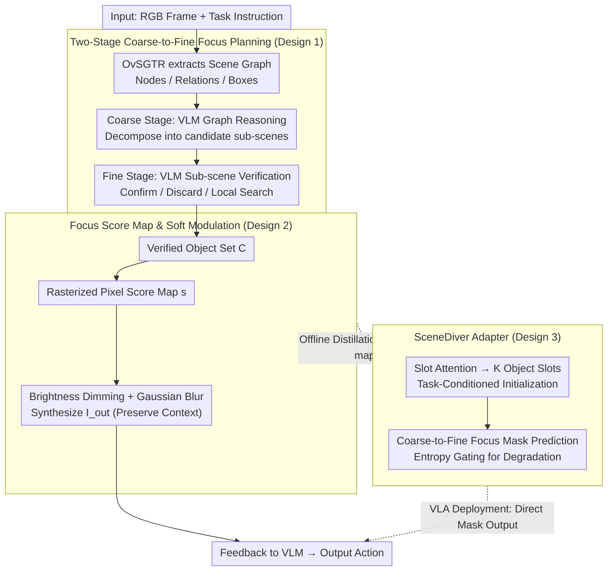

# Dive into the Scene: Breaking the Perceptual Bottleneck in Vision-Language Decision Making via Focus Plan Generation

**Conference**: ICML 2026  
**arXiv**: [2606.04046](https://arxiv.org/abs/2606.04046)  
**Code**: https://future-item.github.io/SceneDiver (Available)  
**Area**: Embodied AI / Robotics / Multimodal VLM  
**Keywords**: VLM, VLA, Visual Focus Planning, Scene Graph, Object Hallucination

## TL;DR
SceneDiver mitigates visual hallucinations in both high-level planning and reactive control by filtering task-related objects before feeding them back into the model. It employs a two-stage focus plan—coarse-grained sub-scene decomposition via scene graphs followed by agentic VLM verification—and distills this explicit reasoning into VLA using a Slot Attention adapter.

## Background & Motivation
**Background**: Embodied decision-making tasks are typically split into two pipelines: VLMs as high-level task planners and VLAs as end-to-end reactive controllers. The former excels at long-horizon decomposition but lacks real-time performance, while the latter is real-time but lacks deliberate reasoning.

**Limitations of Prior Work**: Both pipelines share a "perceptual bottleneck"—in cluttered scenes, VLM/VLAs hallucinate non-existent objects, miss detections, bind attributes incorrectly, or miscount instances of the same class. Figure 1 illustrates two typical failures: attention shifts to the background when asked "how many green objects," and is distracted by a nearby yellow block when asked about the "color of the object held by the arm."

**Key Challenge**: Intuitively, "single-step focusing" (using existing methods like SoM, Multi-Res, or VCD to directly highlight key objects) should solve this. However, empirical tests show it is ineffective—reliable focusing in complex scenes requires understanding the global scene topology first; single-step localization cannot isolate task-relevant objects from similarly colored background distractors.

**Goal**: (1) Enable VLMs to autonomously generate a "focus plan" to compress visual input into task-relevant regions. (2) Distill this "slow-thinking" capability into VLAs, allowing reactive policies to benefit while maintaining online inference efficiency.

**Key Insight**: Focusing is modeled as a multi-step process planned by the VLM itself, guided by scene graphs as structural priors for coarse-to-fine sub-scene decomposition. Decision-making is then modeled via "image modulation"—preserving high frequency and brightness in key regions while softening the background, rather than losing information through hard cropping.

**Core Idea**: Replace single-step focusing with coarse-to-fine focus planning. Return the results to the VLM/VLA as a "pixel-level focus map + soft modulation," embedding the philosophy of "see clearly before acting" into the perception-action loop.

## Method
SceneDiver consists of three sequential components: coarse-grained scene graph reasoning, fine-grained sub-scene verification, and focus-modulated image generation; plus a VLA adapter that compresses this explicit process into an end-to-end module.

### Overall Architecture
The input consists of an RGB frame and a task instruction. First, OvSGTR extracts a scene graph containing object nodes `<ref>`, spatial relations `<pred>`, and bounding boxes `<box>`, which is then textualized for the VLM. The VLM performs graph reasoning to decompose the scene into candidate sub-scenes. Subsequently, the VLM acts as an agent to "zoom and verify" each sub-scene, deciding to confirm, discard, or perform local searches, resulting in a verified object set $\mathcal{C}$. $\mathcal{C}$ is rasterized into a pixel-level Focus Score Map $s$, and soft modulation (brightness attenuation + Gaussian blurring) is applied to generate $I_{out}$, which is fed back to the VLM for action output. For VLA deployment, the explicit stages are bypassed, and the distilled adapter directly predicts the mask.

### Key Designs

**1. Two-Stage Coarse-to-Fine Focus Planning: Global Partitioning via Scene Graphs followed by Agentic Verification**

While single-step focusing (SoM, Multi-Res, VCD) might seem sufficient, it fails the perceptual bottleneck in complex scenes. To reliably focus, one must first understand the scene's topology. SceneDiver splits "where to look" into two steps: the coarse stage uses the scene graph as a reasoning scaffold where the VLM outputs structured intermediates (using `<ref>` for nodes and `<box>` for coordinates) to partition the global scene. The fine stage performs "semantic zooming" with a restricted field of view for each sub-scene—confirming candidates within the window, narrowing the view if evidence is ambiguous, or searching locally if objects are missing.

The design philosophy is that the VLM remains the "sole source of truth," while the scene graph is a "rebuttable guide." If inconsistencies arise, the VLM can pick spatially adjacent nodes or discard fuzzy candidates, preventing OvSGTR detection errors from propagating. This creates an iterative "Identify → Understand → Analyze" cognitive loop.

**2. Focus Score Map and Soft Image Modulation: Translating Verified Boxes into Softened Attention**

How is the verified set $\mathcal{C}$ fed back to the VLM? Hard cropping (like SoM) removes environmental context necessary for robot localization and obstacle avoidance. SceneDiver employs differentiable soft modulation: first, a pixel-level score $s_{u,v} = \mathbb{I}[\exists k \in \mathcal{C} : (u,v) \in b_k]$ is generated. A visibility lower bound $\beta$ is introduced to prevent the background from being completely black. After brightness attenuation $I_{dim} = I \odot (\beta + (1 - \beta) s)$, Gaussian blurring is applied and interpolated by the score:

$$I_{out} = s \odot I_{dim} + (1 - s) \odot \mathcal{B}_\sigma(I_{dim}).$$

Target regions retain high brightness and high-frequency hits, while the background is simultaneously dimmed and blurred. This "suppresses interference" rather than "discarding information," making it robust to failure and easily integrable into VLM inputs.

**3. SceneDiver Adapter: Distilling Explicit Reasoning into VLA via Slot Attention**

Iterative graph traversal is too heavy for VLAs during online inference. The adapter, placed after the cross-modal projector, uses Slot Attention to map visual features $F \in \mathbb{R}^{L \times D}$ to $K$ object slots $S \in \mathbb{R}^{K \times D_s}$. Slots are initialized conditionally using $v_{task}$ (pooled from task tokens) via $S_{init} \sim \mathcal{N}(\mu(v_{task}) + \delta, \sigma_{global})$ to avoid assigning slots to irrelevant textures. Mask prediction follows a coarse-to-fine approach: the coarse level scores $r_k$ using slot semantics and task context, while the fine level uses attention maps $A \in \mathbb{R}^{K \times L}$ to back-propagate slot semantics to patches: $M_{pred} = \sigma(\sum_k r_k \cdot A_{k,:} + \alpha \cdot \Delta_{patch})$.

Slot Attention is chosen because object slots naturally correspond to "graph nodes" and mask prediction corresponds to "two-stage reasoning results." Training uses Hungarian matching to align slots with scene graph objects (Structure Loss + Mask Loss dual supervision).

### Loss & Training
The adapter is trained with two objectives: Structure Loss to match slots to scene graph nodes, and Mask Loss to align predicted masks with the GT focus maps from the two-stage process. During deployment, an entropy-based dynamic gating mechanism is used: if patch uncertainty exceeds a threshold, the mask is bypassed, and the original observation is sent to the VLA to ensure "graceful degradation" and avoid polluting the policy with incorrect masks.

## Key Experimental Results

### Main Results
Robot Manipulation (MuJoCo, 30 scenes, 5 seeds, assemble target brick on base plate within 30 steps):

| Model | Base SR (%) | + SceneDiver Focus (%) | Gain |
|------|------|------|------|
| Qwen2.5-VL-7B-AWQ | 14.7 | 28.7 | +14.0 |
| Qwen2.5-VL-32B-AWQ | 21.3 | 31.3 | +10.0 |
| gpt-4o-mini | 28.7 | 34.0 | +5.3 |
| gemini-2.5-flash | 38.7 | 46.7 | +8.0 |

Room Navigation (Base / CS Commonsense / CI Complex Instr. / VA Visual Appearance distractors, 5 seeds):

| Method (Qwen2.5-VL-7B) | Base | CS | CI | VA |
|------|------|------|------|------|
| Base Model | 32.7 | 30.7 | 32.0 | 27.3 |
| SoM | 30.0 | 31.3 | 31.3 | 29.3 |
| Multi-Res | 29.3 | 32.7 | 34.0 | 29.3 |
| VCD | 34.7 | 32.0 | 32.7 | 33.3 |
| SceneDiver | **44.0** | **36.0** | **37.3** | **35.3** |

On LIBERO-Plus (using OpenVLA-OFT), the SceneDiver adapter increased success rates by up to 9.6% with only 2.64% additional inference overhead.

### Ablation Study

| Configuration | Key Observation | Description |
|------|------|------|
| Full SceneDiver | 14.7→28.7 (7B) | Coarse + Fine + Modulation |
| Coarse stage only | Limited gain | No verification; wrong nodes pollute decisions |
| Fine stage only (No SG) | Similar to SoM | Lacks global topology; cannot systematically split distractors |
| Noisy Scene Graph | Still better than base | VLM is allowed to discard/replace graph nodes |
| Disable Entropy Gating | Errors in fuzzy scenes | Incorrect masks pollute VLA policy |

### Key Findings
- Gains primarily stem from "topological partitioning followed by local verification"—consistent with the failure analysis in Sec. 4: standard methods like SoM/VCD show zero or negative gains in distractor-heavy scenes, while SceneDiver significantly improves performance.
- Open-source models benefit most: Qwen2.5-VL-7B success rates nearly doubled, as these models suffer most from visual hallucinations.
- Soft modulation is superior to hard cropping: preserving the brightness floor $\beta$ maintains environmental cues, which is why navigation is more sensitive to modulation parameters than manipulation.
- The adapter maintains low overhead (2.64%) but must be used with entropy gating to avoid performance degradation in scenarios with high mask uncertainty.

## Highlights & Insights
- The philosophy of "VLM as the sole source of truth and Scene Graph as a guide" is vital: treating the graph as a rebuttable proposal prevents detection errors from propagating.
- Soft modulation $I_{out} = s \odot I_{dim} + (1 - s) \odot \mathcal{B}_\sigma(I_{dim})$ implements "attention priors" via differentiable pixel operations rather than cropping, making it seamlessly compatible with any VLM input.
- The combination of Slot Attention and task-conditioned initialization stabilizes the mapping between object slots and scene graph nodes, a technique useful for any task requiring interpretable object representations from visual tokens.
- Entropy gating provides the distilled VLA with a "know what it doesn't know" capability, a valuable addition to any VLA framework relying on auxiliary predictors.

## Limitations & Future Work
- Strong dependency on the detection quality of the external OvSGTR model; although robust to noise, it may fail on entirely novel object categories (open-vocabulary extremes).
- The two-stage focus plan is computationally expensive on the VLM side. This necessitated the distillation into an adapter; for closed-source APIs, the multi-turn prompting cost per step is significant.
- The adapter has currently only been validated on OpenVLA-OFT; its effectiveness on other paradigms (e.g., diffusion policy, π0) remains unknown.
- Soft modulation is sensitive to parameters $\beta$ and $\sigma$. These are currently empirical global values; adaptive parameter tuning based on the scene is a potential future direction.

## Related Work & Insights
- **vs. SoM / Multi-Res / VCD**: These follow the "single-step focusing" route. Ours proves they offer little gain in embodied decision-making with distractors due to a lack of global topological understanding.
- **vs. High-level Planning (RT/SayCan)**: These use VLMs as action sequence planners. Ours does not replace planning but inserts "seeing clearly" before the planning phase.
- **vs. 3D Scene Graph Robotics**: These use 3D graphs for long-term memory. SceneDiver focuses on 2D graphs for single-frame focus planning to address the perceptual bottleneck.
- **Insights**: The pipeline of "explicit multi-step reasoning $\rightarrow$ distillation into lightweight end-to-end modules" can be applied to many "Slow VLM / Fast VLA" scenarios, such as VLN or multi-object manipulation.

## Rating
- Novelty: ⭐⭐⭐⭐ Using scene graphs as rebuttable priors combined with soft modulation and Slot Attention distillation is a unique combination in embodied AI.
- Experimental Thoroughness: ⭐⭐⭐⭐ Covers manipulation, navigation, and robustness tasks across various models and includes noisy pressure tests.
- Writing Quality: ⭐⭐⭐⭐ Clear storyline with consistent notation; however, more qualitative failure cases could be showcased.
- Value: ⭐⭐⭐⭐ Provides a plug-and-play perceptual pre-processing tool for the "VLM-as-planner, VLA-as-executor" paradigm, particularly beneficial for open-source models.

<!-- RELATED:START -->

## Related Papers

- [\[ICML 2026\] PSG-Nav: Probabilistic Scene Graph Navigation via Multiverse Decision Making](psg-nav_probabilistic_scene_graph_navigation_via_multiverse_decision_making.md)
- [\[ICLR 2026\] MemoryVLA: Perceptual-Cognitive Memory in Vision-Language-Action Models for Robotic Manipulation](../../ICLR2026/robotics/memoryvla_perceptual-cognitive_memory_in_vision-language-action_models_for_robot.md)
- [\[ICML 2026\] Spatial Memory for Out-of-Vision Manipulation in Vision-Language-Action](spatial_memory_for_out-of-vision_manipulation_in_vision-language-action.md)
- [\[CVPR 2025\] Decision SpikeFormer: Spike-Driven Transformer for Decision Making](../../CVPR2025/robotics/decision_spikeformer_spike-driven_transformer_for_decision_making.md)
- [\[ICML 2026\] StableVLA: Towards Robust Vision-Language-Action Models without Extra Data](stablevla_towards_robust_vision-language-action_models_without_extra_data.md)

<!-- RELATED:END -->
