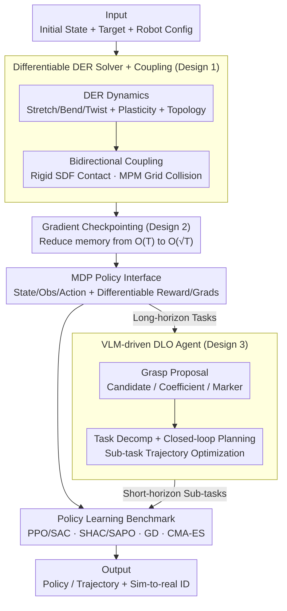

# DLO-Lab: Benchmarking Deformable Linear Object Manipulations with Differentiable Physics

**Conference**: ICML 2026  
**arXiv**: [2606.04206](https://arxiv.org/abs/2606.04206)  
**Code**: Project Page https://dlo-lab-26.github.io/  
**Area**: Robotics  
**Keywords**: Deformable Linear Objects, Differentiable Simulation, Robot Benchmark, Discrete Elastic Rods, Grasp Proposal  

## TL;DR
DLO-Lab develops a differentiable simulator on the Genesis platform using Taichi, featuring a Discrete Elastic Rods (DER) core that supports bidirectional coupling, bending plasticity, and closed-loop topologies. It provides 10 benchmark tasks (rope/cable/rubber band) and a specialized agent using VLM for "grasp proposal + task decomposition," enabling a unified evaluation of PPO, SAC, SHAC, SAPO, CMA-ES, and GD algorithms, with sim-to-real validation via system identification.

## Background & Motivation
**Background**: Manipulation of Deformable Linear Objects (DLOs, e.g., ropes, cables, rubber bands) is a long-standing robotics challenge. Prior work either hard-coded specific tasks (untangling, wiring, shaping) or relied on real-world data, which lacks scalability and generality.

**Limitations of Prior Work**: Existing DLO simulators have significant gaps—neural-network-based ones (Bi-LSTM, GNN, DEFORM) are differentiable but lack physical fidelity; PBD-based ones (XPBD, SoftGym) are fast but use coarse elastic potential models; physical DER models (Elastica, C-IPC, IMC) are high-fidelity but non-differentiable, preventing gradient-based policy optimization; MPM/Spring-Mass differentiable solutions (DaXBench, PhysTwin) struggle with bidirectional coupling between rigid/soft bodies or closed-loop topologies. Consequently, no platform simultaneously offers "elastic potential + bending plasticity + closed-loop topology + bidirectional coupling + differentiability," all of which are essential for realistic DLO manipulation.

**Key Challenge**: The engineering contradiction between physical fidelity (DER/FEM) and differentiability combined with multi-material coupling (autodiff + MPM/SDF bidirectional contact). The former favors implicit timestepping and hard-constraint solvers, while the latter requires explicit timestepping and differentiable contact models.

**Goal**: (1) Build a DLO differentiable simulator possessing all five key characteristics; (2) Design benchmark tasks reflecting unique DLO challenges (topological constraints, grasp sensitivity, long horizons); (3) Provide a "DLO-specific agent" using VLM physical priors for grasp selection and sub-task decomposition to enable RL/optimization for complex tasks; (4) Conduct a cross-evaluation of MFRL, FO-MBRL, trajectory optimization, and evolutionary algorithms on a unified benchmark.

**Key Insight**: Leveraging the Genesis physical engine with Taichi for automatic differentiation. DLOs are represented via DER (midline vertices + adapted frames), soft-coupled with rigid bodies via SDF, and bidirectionally coupled with MPM soft bodies via Eulerian grids. Explicit gradient checkpointing enables differentiability over "arbitrarily long horizons." VLM provides physical priors for "where to grasp and how to decompose" to assist end-to-end policies.

**Core Idea**: By combining a "differentiable DER core + bidirectional coupling + gradient checkpointing + VLM agent," this work systematizes DLO manipulation as a structured benchmark for the first time.

## Method
DLO-Lab is structured into three layers: the underlying physical simulator (Section 3), the middle-layer benchmark task suite (Section 4.1-4.2), and the top-layer DLO agent (Section 4.3).

### Overall Architecture
**Input**: Initial DLO state (vertices + frames), target conditions (e.g., S-shape, looping a ring, bypassing a pillar), and robot configuration/grippers.

**Mechanism**: A self-developed DLO solver runs DER dynamics, performing bidirectional coupling with Genesis's rigid body solver (SDF) and MPM solver (fluids/elastomers). Gradients are calculated via Taichi autodiff, with gradient checkpointing managing long horizons.

**Policy Interface**: Standard MDP interface where state $\mathbf{S}=(\mathbf{x},\dot{\mathbf{x}},\mathbf{r},\mathbf{M},\dot{\mathbf{M}})$ includes DLO vertex poses, rest configurations, and robot joint states. Observations consist of $(\mathbf{x},\dot{\mathbf{x}})\in\mathbb{R}^{N_v\times 6}$ and end-effector poses. Actions are Cartesian target poses (resolved via IK).

**Output**: Differentiable rewards and trajectory gradients $\partial r/\partial a_{0:T}$ for GD/SHAC/SAPO, while also supporting sampling-based RL (PPO/SAC) and black-box optimization (CMA-ES).

### Key Designs

**1. DER-based Differentiable DLO Solver + Bidirectional Coupling: Reconciling high-fidelity physics with differentiability and coupling.**

This is the physical foundation where previous solvers failed—DER implementations (C-IPC, IMC) are physically accurate but use non-differentiable implicit solvers, while differentiable schemes (MPM) struggle with coupling and topologies. DLO-Lab represents DLOs as midline vertices $\mathbf{x}=\{\mathbf{x}_i\in\mathbb{R}^3\}$ and adapted frames. The potential energy comprises stretching $U_s$, bending $U_b$, and twisting $U_t$, integrated via symplectic Euler. Bending plasticity is achieved via yield threshold $\sigma_y$ and creep rate $r_c$ adjusting rest curvature. Coupling is bidirectional: DLO points query rigid body SDFs to compute impulse-based friction responses via a soft exponential factor $f_i=\min(\exp(d/\epsilon_s),1)$, while collisions with MPM soft bodies are handled in the Eulerian grid.

**2. Gradient Checkpointing: Enabling "thousands of steps" of differentiability under finite memory.**

DLO tasks like untangling involve thousands of simulation steps. Standard autodiff saves all intermediate states, causing $\mathcal{O}(T)$ memory explosion. DLO-Lab splits the trajectory into segments, caching the state at the end of each segment to CPU. During the backward pass, it re-simulates segments to reconstruct the local computational graph, reducing memory from $\mathcal{O}(T)$ to $\mathcal{O}(\sqrt{T})$. 

**3. VLM-driven DLO Agent: Outsourcing "where to grasp and how to split" to VLM.**

DLO manipulation suffers from two RL killers: incorrect grasp points make tasks kinematically infeasible, and long horizons lead to sparse rewards. The DLO agent uses VLM for grasp proposals (Candidate mode: selecting from sampled points) and task decomposition (generating a sub-task plan with specific rewards). This combines the semantic/symbolic reasoning of world models with the numerical precision of downstream optimizers.

### Loss & Training
- The simulator is fully differentiable; rewards are designed to be smooth (e.g., smooth contact, smooth SDF distance).
- Benchmarked algorithms: PPO, SAC (MFRL), SHAC, SAPO (FO-MBRL using analytic gradients), GD (trajectory gradient descent), and CMA-ES (gradient-free evolution).
- Sim-to-real transfer: System identification uses the differentiable simulator to minimize the pixel-level difference between simulated and real binary masks, backpropagating gradients to calibrate material parameters (stiffness).

## Key Experimental Results

### Main Results
8 fixed-horizon tasks and 2 long-horizon tasks. Values represent max episodic return.

| Task | PPO | SAC | SHAC | SAPO | GD | CMA-ES |
|------|-----|-----|------|------|-----|--------|
| Coiling | 9.40 | 8.28 | 11.55 | **11.57** | 11.59 | **11.73** |
| Gathering | 39.76 | 40.76 | 40.48 | 40.29 | 39.84 | **47.84** |
| Lifting | 247.38 | 250.29 | 214.24 | 204.54 | **255.55** | **335.59** |
| Separation | 114.31 | **134.71** | 96.29 | 105.27 | 115.52 | 84.86 |
| Slingshot | 6.90 | 7.23 | 6.90 | 6.90 | 6.90 | **11.07** |
| Unknotting | 3.29 | 2.95 | 45.88 | **46.30** | 3.44 | **57.21** |
| Wiring-post | 62.17 | 62.07 | 36.42 | 36.13 | 36.40 | **64.31** |
| Wrapping | 131.08 | 161.85 | 129.90 | 144.36 | 139.98 | **162.68** |

CMA-ES achieved the best results in 6/8 tasks. FO-MBRL (SHAC/SAPO) significantly outperformed PPO/SAC in contact-rich tasks like Unknotting.

### Ablation Study
| Configuration | Key Finding |
|------|----------|
| MFRL vs Traj Opt | Trajectory optimization is significantly more sample-efficient as RL struggles with sparse rewards and high-dim vertex states. |
| FO-MBRL vs MFRL | Analytic gradients allow SHAC/SAPO to maintain optimization direction at contact switches where PPO/SAC fail. |
| CMA-ES vs GD | GD fails in zero-gradient regions (before contact); CMA-ES skips local optima via parallel sampling. |
| Grasp Proposal | "Candidate" mode is the most stable for VLM reasoning. |
| Task Decomp | Closed-loop replanning is essential for multi-phase tasks like Letter Art. |

### Key Findings
- **Differentiability acts as a "contact penetrator"**: For topological tasks like Unknotting, analytic gradients improve performance by 15x over MFRL. However, if rewards depend on yet-to-occur contacts, gradients vanish, allowing CMA-ES to take the lead.
- **Closed-loop policies are harder to learn than open-loop optimization**: PPO/SAC underperform CMA-ES not due to algorithm flaws, but because learning a robust closed-loop policy while exploring is inherently more difficult.
- **CMA-ES robustness** comes from its gradient-free nature and large-scale parallel sampling, which effectively traverses non-smooth reward landscapes.
- **VLM + Decomposition** enables tasks that are otherwise impossible for end-to-end RL.

## Highlights & Insights
- **First comprehensive integration of "DER + Autodiff + Coupling + Checkpoint"**: Provides a gold-standard reference for DLO simulation.
- **Differentiable Sim for System ID**: Using gradients to calibrate physical parameters for sim-to-real transfer is often more impactful than using them solely for policy optimization.
- **VLM as a Structural Prior**: Outsourcing semantic tasks (where to grasp) to VLM while keeping numerical optimization in the simulator avoids VLM's precision weaknesses.
- **Method Selection Heuristic**: Smooth reward/few contacts $\to$ GD; Dense contact/reachable gradient $\to$ SHAC; Sparse contact/topology $\to$ CMA-ES.

## Limitations & Future Work
- DER discretization might require higher resolution for extremely thin cables, hitting performance bottlenecks.
- Bidirectional coupling is limited to rigid and MPM bodies; coupling with textiles or granular media is needed.
- VLM reliability depends on prompt engineering and external APIs; failure case analysis for agents is lacking.
- Sim-to-real gap remains (58% success on Wiring-ring); robust testing against perception drift is required.

## Related Work & Insights
- **vs DaXBench**: DaXBench uses MPM for everything; DLO-Lab uses DER for linear geometry, which is more physically faithful for "slender rods."
- **vs PhysTwin**: PhysTwin lacks bending plasticity and topological constraints, which DLO-Lab handles via the DER core.
- **vs C-IPC / IMC**: These are non-differentiable; DLO-Lab offers a compromise between fidelity and first-order optimization.
- **vs SoftGym / XPBD**: PBD lacks accuracy and closed-loop topology; DLO-Lab uses PBD only for contact while DER handles the main dynamics.

## Rating
- Novelty: ⭐⭐⭐⭐
- Experimental Thoroughness: ⭐⭐⭐⭐⭐
- Writing Quality: ⭐⭐⭐⭐
- Value: ⭐⭐⭐⭐⭐

<!-- RELATED:START -->

## Related Papers

- [\[ICML 2026\] RoboMME: Benchmarking and Understanding Memory for Robotic Generalist Policies](robomme_benchmarking_and_understanding_memory_for_robotic_generalist_policies.md)
- [\[AAAI 2026\] Distributionally Robust Online Markov Game with Linear Function Approximation](../../AAAI2026/robotics/distributionally_robust_online_markov_game_with_linear_function_approximation.md)
- [\[ICML 2026\] Plan in Sandbox, Navigate in Open Worlds: Learning Physics-Grounded Abstracted Experience for Embodied Navigation](plan_in_sandbox_navigate_in_open_worlds_learning_physics-grounded_abstracted_exp.md)
- [\[ACL 2025\] Vulnerability of LLMs to Vertically Aligned Text Manipulations](../../ACL2025/robotics/vulnerability_of_llms_to_vertically_aligned_text_manipulations.md)
- [\[CVPR 2026\] AGENTSAFE: Benchmarking the Safety of Embodied Agents on Hazardous Instructions](../../CVPR2026/robotics/agentsafe_benchmarking_the_safety_of_embodied_agents_on_hazardous_instructions.md)

<!-- RELATED:END -->
