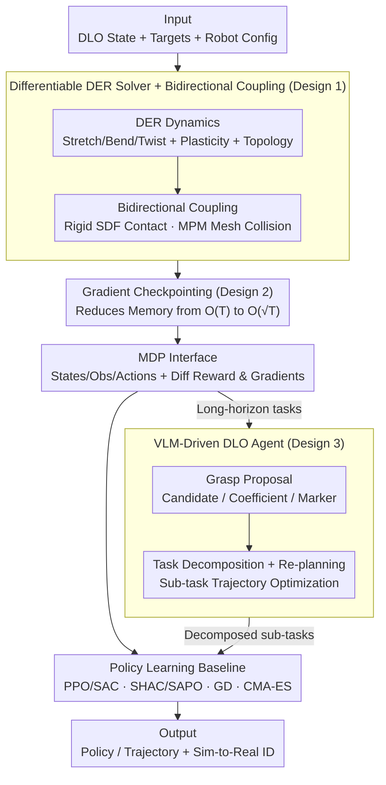

# DLO-Lab: Benchmarking Deformable Linear Object Manipulations with Differentiable Physics

**Conference**: ICML 2026  
**arXiv**: [2606.04206](https://arxiv.org/abs/2606.04206)  
**Code**: Project Page https://dlo-lab-26.github.io/  
**Area**: Robotics  
**Keywords**: Deformable Linear Objects, Differentiable Simulation, Robot Benchmark, Discrete Elastic Rods, Grasp Proposal  

## TL;DR
DLO-Lab develops a differentiable simulator based on Taichi on the Genesis platform, utilizing Discrete Elastic Rods (DER) as its core. It supports bidirectional coupling, bending plasticity, and closed-loop topology. The platform includes 10 benchmark tasks for rope/cable/elastic bands and a specialized agent using VLM for "grasp proposal + task decomposition." It evaluates various policy learning algorithms (PPO/SAC/SHAC/SAPO/CMA-ES/GD) and validates sim-to-real transitions via system identification.

## Background & Motivation
**Background**: Manipulation of Deformable Linear Objects (DLOs, e.g., ropes, cables, elastic bands) is a long-standing robotics challenge. Prior work either hard-coded specific tasks (untangling, wiring, shaping) or relied on real-world data which lacks scalability and generality.

**Limitations of Prior Work**: Existing DLO simulators have various gaps—neural-based ones (Bi-LSTM, GNN, DEFORM) are differentiable but lack physical fidelity; PBD-based ones (XPBD, SoftGym) are fast but have crude elastic potential energy models; DER-based models (Elastica, C-IPC, IMC) are high-fidelity but non-differentiable, preventing gradient-based policy optimization; and differentiable MPM/Spring-Mass solutions (DaXBench, PhysTwin) struggle with bidirectional coupling or closed-loop topologies. Consequently, no single platform provides the five essential features for realistic DLO manipulation: "elastic potential energy + bending plasticity + closed-loop topology + bidirectional coupling + differentiability."

**Key Challenge**: The engineering conflict between physical fidelity (DER/FEM) and differentiability/coupling with other materials (Auto-diff + MPM/SDF bidirectional contact). The former favors implicit time steps and hard constraint solvers, while the latter requires explicit time steps and differentiable contact models.

**Goal**: (1) Build a DLO differentiable simulator possessing all five key features; (2) Design benchmark tasks reflecting DLO-specific challenges (topological constraints, grasp sensitivity, long horizons); (3) Provide a "DLO-specialized agent" using VLM physical priors to automatically select grasp points and decompose sub-tasks; (4) Conduct a horizontal evaluation of MFRL, FO-MBRL, trajectory optimization, and evolutionary algorithms to establish baselines.

**Key Insight**: Using the Genesis physics engine as a base with Taichi for automatic differentiation. DLOs are represented via DER (midline vertices + adapted frames), coupled with rigid bodies via SDF and with MPM soft bodies via Eulerian grid bidirectional collisions. Explicit gradient checkpointing enables differentiability over arbitrary long horizons. VLMs provide physical priors for "where to grasp" and "task decomposition," which are difficult for end-to-end policies.

**Core Idea**: By combining a "differentiable DER kernel + bidirectional coupling + gradient checkpointing + VLM agent," this work systematizes DLO manipulation as a benchmark for the first time.

## Method
DLO-Lab is structured into three layers: the underlying physics simulator (Section 3), the benchmark task suite (Section 4.1-4.2), and the high-level DLO agent (Section 4.3).

### Overall Architecture
**Input**: Initial DLO state (midline vertices + frames), target conditions (e.g., S-shape, looping over a ring, passing through pillars), robot arm configuration, and end-effector.

**Mechanism**: The self-developed DLO solver handles DER dynamics, bidirectional coupling with Genesis's rigid body solver (SDF) and MPM solver (fluids/elastomers). Taichi autodiff computes gradients, with gradient checkpointing managing long horizons.

**Function**: A standard MDP interface where the state $\mathbf{S}=(\mathbf{x},\dot{\mathbf{x}},\mathbf{r},\mathbf{M},\dot{\mathbf{M}})$ includes DLO vertex poses, rest configurations, and robot joint states. Observations consist of $(\mathbf{x},\dot{\mathbf{x}})\in\mathbb{R}^{N_v\times 6}$ and end-effector/joint configurations. Actions are Cartesian target poses for the end-effector (resolved via IK).

**Output**: Differentiable rewards and trajectory gradients $\partial r/\partial a_{0:T}$ for GD/SHAC/SAPO, alongside support for sampling-based RL (PPO/SAC) and black-box optimization (CMA-ES).

### Key Designs

**1. Differentiable DER-based DLO Solver + Bidirectional Coupling: Merging High Fidelity with Differentiability and Coupling**

This is the physical foundation of the platform. DER implementations like C-IPC and IMC are physically accurate but use implicit solvers and are non-differentiable, whereas differentiable MPM/spring-mass schemes struggle with coupling and topology. DLO-Lab represents DLOs as midline vertices $\mathbf{x}=\{\mathbf{x}_i\in\mathbb{R}^3\}$ and adapted frames. The potential energy comprises stretching $U_s$, bending $U_b$, and twisting $U_t$. Dynamics are advanced via explicit symplectic Euler. Bending plasticity is implemented by adjusting the rest curvature based on yield threshold $\sigma_y$ and creep rate $r_c$, while closed-loop topologies connect the start and end of the midline. Coupling is bidirectional: DLO points check rigid body SDFs, and penetration depth $d(\mathbf{p})=r(\mathbf{p})-\mathrm{SDF}(\mathbf{p})$ triggers impulse-based friction responses via a soft exponential factor $f_i=\min(\exp(d/\epsilon_s),1)$, with equal reaction forces applied back to the rigid body. For MPM soft bodies, collisions are detected in the Eulerian grid and repulsive impulses are applied.

**2. Gradient Checkpointing: Enabling Long-Horizon Differentiability under Finite Memory**

DLO tasks like untangling or weaving often exceed a thousand simulation steps. Standard autodiff, which saves all intermediate states, would cause $\mathcal{O}(T)$ memory to explode. DLO-Lab adopts gradient checkpointing by segmenting the trajectory. During the forward pass, states at the end of each segment are cached to CPU, and intermediate GPU computation graphs are discarded. During the backward pass, checkpoints are traversed in reverse order, re-running the segments forward to reconstruct local computation graphs. This reduces memory usage from $\mathcal{O}(T)$ to $\mathcal{O}(\sqrt{T})$, decoupling memory consumption from the number of simulation steps.

**3. VLM-driven DLO Agent: Outsourcing Structural Priors for Grasping and Decomposition**

DLO manipulation faces two RL-killing hurdles: incorrect grasp points make tasks kinematically infeasible, and long-horizon rewards are too sparse for PPO/SAC. The DLO agent outsources these to a VLM. Three prompting modes are used for grasp proposals: Candidate (VLM selects from sampled points), Coefficient (VLM outputs $[0,1]$ normalized positions), and Marker (VLM selects pixel coordinates). Candidate is the most reliable. For task decomposition, the VLM generates a sequence of sub-task reward functions and horizons, which are solved via differentiable trajectory optimization. After execution, the VLM evaluates the result for potential re-planning.

### Loss & Training
- The simulator is fully differentiable; all reward functions are smooth (using techniques like smooth contact and SDF distance smoothing), supporting both sampling-based RL and first-order optimization.
- The platform supports PPO, SAC (MFRL), SHAC, SAPO (FO-MBRL using analytical gradients), GD (direct trajectory gradient descent on actions), and CMA-ES (gradient-free).
- Sim-to-real uses the differentiable simulator for system identification: the simulated rope is projected to a binary mask and compared with real video masks. Gradients are backpropagated to material parameters (stretching/bending stiffness) for automatic calibration.

## Key Experimental Results

### Main Results
Evaluation includes 8 fixed-horizon tasks (Coiling, Gathering, Lifting, Separation, Slingshot, Unknotting, Wiring-post, Wrapping) and 2 long-horizon tasks (Letter Art, Wiring-ring). Results are averaged over 3 seeds.

| Task | PPO | SAC | SHAC | SAPO | GD | CMA-ES |
|------|-----|-----|------|------|-----|--------|
| Coiling | 9.40 | 8.28 | 11.55 | **11.57** | 11.59 | **11.73** |
| Gathering | 39.76 | 40.76 | 40.48 | 40.29 | 39.84 | **47.84** |
| Lifting | 247.38 | 250.29 | 214.24 | 204.54 | **255.55** | **335.59** |
| Separation | 114.31 | **134.71** | 96.29 | 105.27 | 115.52 | 84.86 |
| Slingshot | 6.90 | 7.23 | 6.90 | 6.90 | 6.90 | **11.07** |
| Unknotting | 3.29 | 2.95 | 45.88 | **46.30** | 3.44 | **57.21** |
| Wiring-post | 62.17 | 62.07 | 36.42 | 36.13 | 36.40 | **64.31** |
| Wrapping | 131.08 | 161.85 | 129.90 | 144.36 | 139.98 | **162.68** |

CMA-ES achieved the best results in 6/8 tasks. FO-MBRL (SHAC/SAPO) significantly outperformed PPO/SAC in the topological Unknotting task (46 vs 3), highlighting the role of gradients in contact-intensive tasks. GD performed well on smooth rewards (Coiling) but fell into local optima in complex tasks.

### Ablation Study

| Configuration | Key Finding | Description |
|------|----------|------|
| MFRL vs Traj. Optimization | Traj. opt is more sample-efficient | RL closed-loop policies struggle with high-dimensional states and sparse rewards. |
| FO-MBRL vs MFRL (Unknotting) | 46 vs 3 | Analytical gradients allow optimization through contact switches. |
| CMA-ES vs GD (Lifting) | CMA-ES dominant | When contact is not yet established, gradients are zero; GD fails while CMA-ES explores effectively. |
| Grasp proposal modes | Candidate is most stable | Selecting from discrete candidates aligns better with VLM reasoning capabilities. |
| Decomposition on long-horizon | Re-planning is crucial | Success in multi-stage tasks requires sequential dependency handling via re-planning. |
| Sim-to-real transfer | Differentiable system identification | Zero-shot deployment worked for open-loop tasks; Wiring-ring achieved ~58% success. |

### Key Findings
- **Differentiability as a "Contact Penetrator"**: In topological tasks like Unknotting, analytical gradients improve FO-MBRL performance by 15x over MFRL. However, when rewards depend on contacts that haven't occurred yet (zero gradients), CMA-ES takes the lead.
- **Closed-loop Policies are harder than Trajectory Optimization**: PPO/SAC underperform compared to CMA-ES given similar sample budgets, as learning a robust closed-loop policy while exploring is significantly more difficult.
- **VLM Candidate Mode + Decomposition**: Enables complex multi-stage tasks (Letter Art) that are nearly impossible for end-to-end RL within reasonable sample budgets.
- **Sim-to-real Validation**: Using differentiable physics for system ID allowed for successful zero-shot and closed-loop real-world execution.

## Highlights & Insights
- **First comprehensive integration**: Combining DER, auto-diff, bidirectional coupling, and checkpointing provides a gold-standard DLO benchmark.
- **System ID over Policy Optimization**: Differentiable simulation might be more powerful for calibrating real-world physical parameters (System ID) than for direct policy optimization, ensuring more stable zero-shot transfers.
- **VLM for structural priors**: Using VLMs for semantic tasks (where to grasp, sub-task labels) rather than direct numerical control is a pragmatic and effective integration of foundation models in robotics.

## Limitations & Future Work
- DER resolution limits performance on extremely fine or flexible cables; the bottleneck remains the Taichi kernel and memory for very high discretization levels.
- Coupling currently lacks coverage for textiles (thick cloth) and granular materials (sand).
- VLM reliability depends on external APIs and is sensitive to prompt engineering; no failure analysis of the agent's self-correction was conducted.
- Sim-to-real gap remains (58% success in Wiring-ring), and simultaneous drift in perception/physics parameters hasn't been tested.

## Related Work & Insights
- **vs DaXBench**: DLO-Lab's DER approach is more geometrically faithful to "wire-like" objects than MPM particles and offers better coupling functionality.
- **vs PhysTwin**: Unlike spring-mass systems, DLO-Lab's DER kernel handles bending plasticity and closed-loop topology accurately.
- **vs C-IPC / IMC**: DLO-Lab trades implicit solving for explicit symplectic Euler to achieve differentiability while maintaining high physical fidelity.
- **vs SoftGym / XPBD**: DLO-Lab avoids the accuracy pitfalls of PBD by using it only for friction sub-modules, leaving main dynamics to the DER solver.

## Rating
- Novelty: ⭐⭐⭐⭐
- Experimental Thoroughness: ⭐⭐⭐⭐⭐
- Writing Quality: ⭐⭐⭐⭐
- Value: ⭐⭐⭐⭐⭐

<!-- RELATED:START -->

## Related Papers

- [\[ICML 2026\] RoboMME: Benchmarking and Understanding Memory for Robotic Generalist Policies](robomme_benchmarking_and_understanding_memory_for_robotic_generalist_policies.md)
- [\[AAAI 2026\] Distributionally Robust Online Markov Game with Linear Function Approximation](../../AAAI2026/robotics/distributionally_robust_online_markov_game_with_linear_function_approximation.md)
- [\[ICML 2026\] Plan in Sandbox, Navigate in Open Worlds: Learning Physics-Grounded Abstracted Experience for Embodied Navigation](plan_in_sandbox_navigate_in_open_worlds_learning_physics-grounded_abstracted_exp.md)
- [\[ACL 2025\] Vulnerability of LLMs to Vertically Aligned Text Manipulations](../../ACL2025/robotics/vulnerability_of_llms_to_vertically_aligned_text_manipulations.md)
- [\[CVPR 2025\] Coordinated Manipulation of Hybrid Deformable-Rigid Objects in Constrained Environments](../../CVPR2025/robotics/coordinated_manipulation_hybrid_deformable_rigid_objects.md)

<!-- RELATED:END -->
