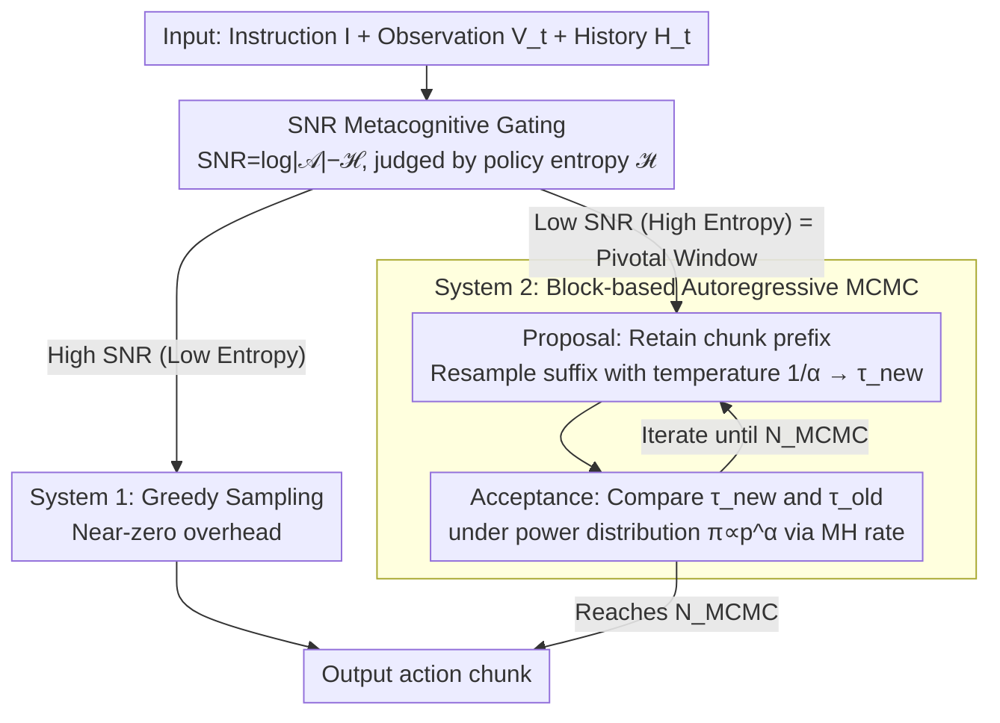

# Drift is a Sampling Error: SNR-Aware Power Distributions for Long-Horizon Robotic Planning

**Conference**: ICML 2026  
**arXiv**: [2605.09537](https://arxiv.org/abs/2605.09537)  
**Code**: None  
**Area**: Robotics / VLA / Inference-Time Compute  
**Keywords**: Vision-Language-Action, Long-Horizon Planning, Instruction Drift, Power Distribution Sampling, MCMC, Metacognitive Control

## TL;DR
This paper proposes CAPS: reinterpreting "instruction drift" as a systematic sampling error. Using SNR ($= \log|\mathcal{A}|-\mathcal{H}$) as a metacognitive switch, it triggers Metropolis-Hastings iterative refinement based on the power distribution $\pi \propto p^\alpha$ only during high-entropy "Pivotal Windows." It outperforms OpenVLA and TACO on RoboTwin, Simpler-WindowX, and Libero-long without additional training.

## Background & Motivation

**Background**: VLA models (OpenVLA, $\pi_0$, $\pi_{0.5}$, etc.) perform excellently on short-horizon tasks but frequently fail in long-horizon operations (dual-arm coordination, multi-step placement). A common failure mode is Instruction Drift—as the task progresses, background noise and irrelevant objects dilute the attention weights of the initial instruction, causing the robot to execute actions that are "locally reasonable but globally incorrect."

**Limitations of Prior Work**: (1) Prompt engineering like Chain-of-Thought cannot break the unidirectionality of open-loop generation; (2) TACO's "generate-verify" paradigm relies on parallel sampling + reranker, but once a single trajectory is not sampled, it cannot be iteratively refined; (3) Global search methods like Tree-of-Thoughts or RoboMonkey use fixed high-compute budgets, which are not suitable for real-time closed-loop robotic constraints.

**Key Challenge**: In continuous control spaces, single-step greedy sampling (low-temperature sampling) easily falls into a "Negative Pivotal Window"—where local probability is high but the path to global success is physically and irreversibly cut off. Conversely, brute-force enumeration search (such as ToT), which works in discrete symbolic reasoning, is infeasible on high-dimensional continuous action manifolds (**Topological Mismatch**).

**Goal**: (1) Redefine the drift problem from a sampling theory perspective; (2) Design a training-free inference-time compute framework that enhances long-horizon robustness without retraining; (3) Invest additional computation only when necessary to maintain real-time performance.

**Key Insight**: Signal Detection Theory—viewing instruction drift as a process where "effective signal decays to noise levels." In statistical physics, sampling from a power distribution $\pi(\tau) \propto p_\theta(\tau)^\alpha, \alpha \ge 1$ is equivalent to performing implicit future lookahead; Karan & Du 2026 proved this in symbolic reasoning, and this paper transfers it to continuous action manifolds.

**Core Idea**: Construct a "dual-process" system—System 1 executes greedily when SNR is high; System 2 initiates iterative MCMC refinement based on the power distribution when SNR drops below a threshold, dynamically trading inference time for long-horizon consistency.

## Method

### Overall Architecture
CAPS runs the following workflow at each decision step:
1. **Metacognitive Gating**: Determines if the current state is in a Pivotal Window based on policy entropy $\mathcal{H}(\pi_\theta(\cdot|H_t))$;
2. **If High SNR (low entropy)**: Directly samples actions greedily (System 1, near-zero overhead);
3. **If Low SNR (high entropy)**: Enters System 2 iteration—
    - **Proposal**: Retains the current action chunk prefix and resamples the suffix using $p_\theta$ with temperature $1/\alpha$ to obtain a candidate $\tau_{new}$;
    - **Acceptance**: Compares $\tau_{new}$ with $\tau_{old}$ using the MH acceptance rate under the power distribution;
    - Iterates for $N_{MCMC}$ times to output the final action chunk.

All computations are performed at inference time without updating any parameters, making it fully plug-in.

### Key Designs

**1. Power Distribution Sampling: Sharpening global trajectory probability equivalent to implicit lookahead**

The flaw of single-step greedy sampling is falling into a Negative Pivotal Window. CAPS's solution is to no longer sample from the original distribution $p_\theta(\tau|I,H_t)$, but from the sharpened power distribution $\pi(\tau) \propto p_\theta(\tau|I,H_t)^\alpha$ ($\alpha \ge 1$). $\alpha > 1$ makes probability peaks sharper ("rich get richer"), suppressing trajectories that are "locally okay but globally failing." The elegance is that MCMC sampling on $\pi$ does not require calculating $\pi$ directly, only the likelihood ratio $(p_\theta(\tau_{new})/p_\theta(\tau_{old}))^\alpha$. Theoretically, Theorem 3.1 proves that under ideal lookahead, the effective horizon satisfies $T_{eff}(\text{CAPS})/T_{eff}(\text{Base}) \approx \epsilon^{1-\alpha}$ (where $\epsilon$ is the single-step drift rate). For $\alpha=2, \epsilon=0.1$, this yields a 10× horizon improvement. Theorem 3.2 further provides an asymptotic lower bound under finite MCMC steps, acknowledging the $O(\rho^N)$ sampling bias. This is the core of reframing "drift" from a modeling problem to a sampling problem.

**2. SNR-based Metacognitive Gating: Investing compute only when refinement is needed**

Running expensive global searches at every step is neither real-time nor necessary—drift occurs more frequently in specific windows. CAPS models "when to start System 2" as optimal control under resource constraints. It defines contextual SNR as the KL divergence of the policy relative to a uniform distribution:

$$\text{SNR}_t = D_{KL}(\pi_\theta \| \mathcal{U}_{\text{unif}}) = \log|\mathcal{A}| - \mathcal{H}(\pi_\theta(\cdot|H_t))$$

Since SNR is strictly negatively correlated linearly with Shannon entropy, $\mathcal{H} > \gamma$ serves as an efficient proxy. Solving $\mathcal{L}(\pi) = \mathbb{E}[\text{Error}] + \lambda \cdot \mathcal{C}(\pi)$ yields hard-threshold switching: high entropy triggers CAPS iterative refinement, while low entropy follows greedy sampling. From an information-geometric perspective, high-entropy moments correspond to "bifurcation points" on the probability manifold—Pivotal Windows where drift is most likely—precisely where computational power is allocated.

**3. Block-based Autoregressive MCMC: Approximating global trajectory targets with local chunk acceptance**

Since running MCMC on an entire trajectory is computationally infeasible, CAPS performs Metropolis-Hastings at the chunk level. The proposal $q(\tau_{new}|\tau_{old})$ is explicitly defined as "retaining the prefix of the current action chunk and resampling the suffix at temperature $1/\alpha$," with the acceptance rate:

$$A = \min\Big(1, \big(p_\theta(\tau_{new})/p_\theta(\tau_{old})\big)^\alpha \cdot \frac{q(\tau_{old}|\tau_{new})}{q(\tau_{new}|\tau_{old})}\Big)$$

Within each chunk, $N_{MCMC}$ rounds of propose+accept are performed, with actions only outputted at chunk boundaries. Why does local refinement maintain global consistency? Because the base model $p_\theta$ implicitly encodes long-horizon priors when making acceptance judgments. Thus, the compromise of "local acceptance + global scoring" bypasses the computational wall of full-trajectory MCMC while leveraging the long-horizon consistency of the base model. The entire process is inference-time only, updates no parameters, and is plug-and-play for any base VLA.

### Loss & Training
- No training; fully inference-time plug-in. Base VLAs used: $\pi_0$ / $\pi_{0.5}$ / OpenVLA.
- Key Hyperparameters: $\alpha$ (sharpening coefficient, typically 2–4), $\gamma$ (entropy threshold), $N_{MCMC}$ (iteration count, trading off inference latency), chunk size.
- Hardware: 4× A100; candidate count 50 (comparable to TACO).
- Sampling temperature for Autoregressive VLA ($\pi_{0.5}$) set to 1.

## Key Experimental Results

### Main Results

Average Success Rate on RoboTwin 1.0:

| Method | Avg SR | Dual Bottles Hard | Mug Hanging Easy |
|------|--------|-------------------|------------------|
| $\pi_0$ | 32.2 | 48.0 | 7.0 |
| $\pi_0$ + TACO | 41.3 | 52.0 | 12.0 |
| **CAPS** | **47.4** | **61.0** | **21.0** |

Simpler-WindowX OOD generalization:

| Task | $\pi_0$ | TACO | **CAPS** | SpatialVLA |
|------|--------|-------|------|-------------|
| Spoon on Towel | 36 | 52 | **57** | 16.7 |
| Carrot on Plate | 42 | 52 | **61** | 25.0 |
| Stack Cubes | 34 | 30 | **37** | 29.2 |
| Eggplant in Basket | 80 | 88 | 87 | 100.0 |
| **Avg** | 48 | 55.5 | **60.5** | 42.7 |

RoboTwin 2.0 ($\pi_{0.5}$ baseline, average of 34 tasks):

| Method | Avg SR |
|------|--------|
| RDT | 34.6 |
| $\pi_{0.5}$ | 59.3 |
| $\pi_{0.5}$ + TACO | 64.0 |
| **$\pi_{0.5}$ + CAPS** | **66.2** |

On Libero-long, $\pi_{0.5}$ + CAPS reaches 98–100% on 5/6 sub-tasks, while OpenVLA only reaches 36–70%.

### Ablation Study

| Configuration | RoboTwin 1.0 Avg |
|------|-----------------|
| $\pi_0$ Baseline (System 1 only) | 32.2 |
| TACO (Parallel sampling + rerank) | 41.3 |
| **CAPS Full** (Dual-process + MCMC + Power Dist) | **47.4** |

The paper appendix also includes sensitivity analyses for $\alpha$ and $N_{MCMC}$. The main results show that CAPS is 6.1pp higher than TACO under the same candidate budget, indicating that active iterative refinement is superior to passive screening.

### Key Findings
- **Drift is a sampling problem, not a modeling problem**: Keeping the base VLA constant and only changing the sampling strategy increases SR by 15pp, verifying the "drift = sampling error" hypothesis.
- **Dual-process is more efficient than parallel sampling**: CAPS only triggers System 2 during high-entropy windows (Pivotal Windows), making its average computational overhead much lower than TACO's global parallel sampling + rerank.
- **Horizon extension aligns with theory**: Theorem 3.1/3.2 predicts a 10× horizon extension for $\alpha=2$; in experiments, long-horizon tasks (Mug Hanging Easy 7→21, Blocks Ranking Size 36→46) showed the most significant gains.
- **OOD Robustness**: The +19pp gain on Carrot on Plate shows that SNR gating triggers more aggressive MCMC under visual noise (low SNR), allowing it to escape local optima.

## Highlights & Insights
- **Problem Reframing**: Elevating the empirical "drift" phenomenon to a sampling theory problem and providing the analytical relation $T_{eff} \propto \epsilon^{1-\alpha}$ makes this a rare robotics paper that is self-consistent from theory to empirical results.
- **Entropy = SNR Bridge**: Unifying "signal detection" and "policy uncertainty" via $\text{SNR}_t = \log|\mathcal{A}| - \mathcal{H}$ provides a zero-overhead metacognitive trigger.
- **Elegant Use of MCMC in Continuous Control**: Using the base model $p_\theta$ as a proposal (resampling suffix at temperature $1/\alpha$) + the power distribution as a target avoids the fixed compute budget issues of Tree-of-Thoughts methods.
- **Training-Free**: Operates entirely at inference time as a plug-in, applicable to any base VLA, making it engineering-friendly.

## Limitations & Future Work
- $\gamma$ is a fixed threshold; although the author provides a derivation in Appendix F, it is not adaptive. Entropy distributions vary significantly across tasks, likely requiring per-task tuning.
- Single-arm drift remains a bottleneck in dual-arm tasks (Block Handover 67/100, Handover Block 38/100), indicating that chunk-based MCMC has limited modeling of coordination constraints.
- Increasing $N_{MCMC}$ directly increases wall-clock time; real-time control scenarios require fine-tuning the precision-latency trade-off (the paper lacks a full latency profile).
- Theorem 3.1/3.2 assumes a constant single-step drift rate $\epsilon$, but in practice $\epsilon$ is highly correlated with scene complexity, potentially overestimating theoretical gains.
- All experiments are in simulation; the sim2real gap on real robots has not been evaluated.

## Related Work & Insights
- **vs. TACO (Yang et al. 2025)**: TACO treats inference as a contextual bandit, relying on a reranker to select the best candidate; CAPS uses MCMC for active iterative refinement, converging even when candidate set quality is low.
- **vs. Tree-of-Thoughts (Yao et al. 2023)**: ToT uses fixed compute for global search, whereas CAPS uses SNR gating for on-demand triggers, making it better suited for real-time control.
- **vs. RoboMonkey (Kwok et al. 2025)**: RoboMonkey trains a specialized verifier, while CAPS is entirely training-free.
- **vs. Karan & Du 2026 (Power sampling in symbolic reasoning)**: Transfers power distribution theory from the symbolic domain to continuous action manifolds, proving the same mathematical framework works across both modalities.

## Rating
- Novelty: ⭐⭐⭐⭐ Re-defining "drift = sampling error" combined with SNR-gated MCMC is a genuinely fresh perspective in the VLA field.
- Experimental Thoroughness: ⭐⭐⭐⭐ Solid comparisons across three benchmarks, multiple baselines, and a training-free setup, though lacking real-robot tests and latency profiles.
- Writing Quality: ⭐⭐⭐⭐ Theory (Theorem 3.1/3.2) and Algorithm (Dual-process pseudocode) coordinate well, though some sections are wordy.
- Value: ⭐⭐⭐⭐ Provides a training-free path for long-horizon performance enhancement for existing VLA models, immediately applicable in engineering.

<!-- RELATED:START -->

## Related Papers

- [\[ICML 2026\] HDFlow: Hierarchical Diffusion-Flow Planning for Long-horizon Tasks](hdflow_hierarchical_diffusion-flow_planning_for_long-horizon_tasks.md)
- [\[ICML 2025\] Closed-loop Long-horizon Robotic Planning via Equilibrium Sequence Modeling](../../ICML2025/robotics/closed-loop_long-horizon_robotic_planning_via_equilibrium_sequence_modeling.md)
- [\[CVPR 2026\] PALM: Progress-Aware Policy Learning via Affordance Reasoning for Long-Horizon Robotic Manipulation](../../CVPR2026/robotics/palm_progress-aware_policy_learning_via_affordance_reasoning_for_long-horizon_ro.md)
- [\[ICML 2026\] TapSampling: Inference-Time Sampling with a Task-Progress-Understanding Verifier for Robotic Manipulation](tapsampling_inference-time_sampling_with_a_task-progress-understanding_verifier_.md)
- [\[AAAI 2026\] ManiLong-Shot: Interaction-Aware One-Shot Imitation Learning for Long-Horizon Manipulation](../../AAAI2026/robotics/manilong-shot_interaction-aware_one-shot_imitation_learning_for_long-horizon_man.md)

<!-- RELATED:END -->
