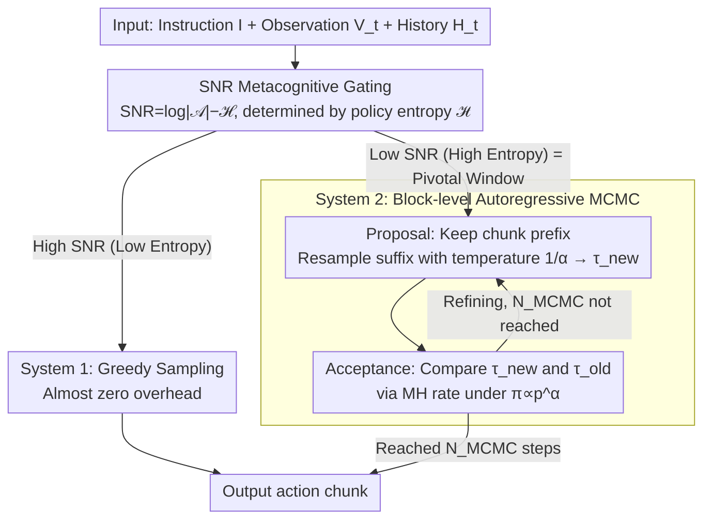

# Drift is a Sampling Error: SNR-Aware Power Distributions for Long-Horizon Robotic Planning

**Conference**: ICML 2026  
**arXiv**: [2605.09537](https://arxiv.org/abs/2605.09537)  
**Code**: None  
**Area**: Robotics / VLA / Inference-time Compute  
**Keywords**: Vision-Language-Action, Long-horizon planning, Instruction drift, Power distribution sampling, MCMC, Metacognitive control

## TL;DR
This paper proposes CAPS: reinterpreting "instruction drift" as a systematic sampling error. It uses SNR ($= \log|\mathcal{A}|-\mathcal{H}$) as a metacognitive switch to trigger Metropolis-Hastings iterative refinement based on a power distribution $\pi \propto p^\alpha$ only during high-entropy "Pivotal Windows." It outperforms OpenVLA and TACO training-free on RoboTwin, Simpler-WindowX, and Libero-long.

## Background & Motivation

**Background**: VLA models (OpenVLA, $\pi_0$, $\pi_{0.5}$, etc.) perform excellently on short-horizon tasks but frequently fail in long-horizon operations (bimanual coordination, multi-step placement). A common failure mode is "Instruction Drift"—as the task progresses, background noise and irrelevant objects gradually dilute the attention weights of the initial instruction, causing the robot to execute actions that are "locally reasonable but globally incorrect."

**Limitations of Prior Work**: (1) Prompt engineering like Chain-of-Thought cannot break the unidirectionality of open-loop generation. (2) The "generate-verify" paradigm of TACO relies on parallel sampling and a reranker for selection, but it cannot iteratively refine a trajectory if a successful one is never sampled. (3) Global search methods like Tree-of-Thoughts and RoboMonkey use a fixed high-computation budget, which is unsuitable for the real-time closed-loop constraints of robotics.

**Key Challenge**: In continuous control spaces, single-step greedy sampling (low-temperature sampling) easily falls into "Negative Pivotal Windows"—where local probability is high but the path to global success is physically and irreversibly cut off. Conversely, brute-force enumeration search (ToT, etc.), which works for discrete symbolic reasoning, is infeasible on high-dimensional continuous action manifolds (**Topological Mismatch**).

**Goal**: (1) Redefine the drift problem from a sampling theory perspective. (2) Design a training-free inference-time compute framework to enhance long-horizon robustness without retraining. (3) Invest extra computation only when necessary to maintain real-time performance.

**Key Insight**: Signal Detection Theory—viewing instruction drift as a process where the "effective signal decays to noise levels." In statistical physics, sampling from a power distribution $\pi(\tau) \propto p_\theta(\tau)^\alpha, \alpha \ge 1$ is equivalent to performing implicit future lookahead. While Karan & Du (2026) demonstrated this in symbolic reasoning, this paper transfers it to continuous action manifolds.

**Core Idea**: Construct a "dual-process" system—System 1 executes greedily during high SNR; System 2 activates iterative MCMC refinement based on the power distribution when SNR falls below a threshold, dynamically trading inference time for long-horizon consistency.

## Method

### Overall Architecture
CAPS runs the following pipeline at each decision step:
1. **Metacognitive Gating**: Determines if the agent is in a "Pivotal Window" based on policy entropy $\mathcal{H}(\pi_\theta(\cdot|H_t))$.
2. **If High SNR (Low Entropy)**: Directly greedy samples the action (System 1, near-zero overhead).
3. **If Low SNR (High Entropy)**: Enters System 2 iteration—
    - **Proposal**: Retains the current action chunk prefix and resamples the suffix using $p_\theta$ with temperature $1/\alpha$ to obtain candidate $\tau_{new}$.
    - **Acceptance**: Compares $\tau_{new}$ with $\tau_{old}$ using the MH acceptance rate under the power distribution.
    - Iterates for $N_{MCMC}$ steps and outputs the final action chunk.

All computations occur at inference time without updating any parameters, making it a complete plug-in solution.

### Key Designs

**1. Power Distribution Sampling: Sharpening global trajectory probabilities as implicit lookahead**

The flaw of single-step greedy sampling is falling into "Negative Pivotal Windows." The solution in CAPS is to no longer sample from the original distribution $p_\theta(\tau|I,H_t)$ but from a sharpened power distribution $\pi(\tau) \propto p_\theta(\tau|I,H_t)^\alpha$ ($\alpha \ge 1$). $\alpha > 1$ makes probability peaks sharper ("rich get richer"), suppressing trajectories that are "locally okay but globally failing." Crucially, MCMC sampling on $\pi$ does not require direct calculation of $\pi$, only the likelihood ratio $(p_\theta(\tau_{new})/p_\theta(\tau_{old}))^\alpha$. Theorem 3.1 proves that under ideal lookahead, the effective horizon $T_{eff}(\text{CAPS})/T_{eff}(\text{Base}) \approx \epsilon^{1-\alpha}$ (where $\epsilon$ is the single-step drift rate). For $\alpha=2, \epsilon=0.1$, this yields a 10× horizon improvement. Theorem 3.2 further provides an asymptotic lower bound under finite MCMC steps, acknowledging the $O(\rho^N)$ sampling bias. This reframes "drift" from a modeling problem to a sampling problem.

**2. SNR-based Metacognitive Gating: Applying compute only when refinement is needed**

Running expensive global searches at every step is neither real-time nor necessary, as drift occurs primarily in specific windows. CAPS models "when to start System 2" as optimal control under resource constraints. It defines contextual SNR as the KL divergence of the policy relative to a uniform distribution:

$$\text{SNR}_t = D_{KL}(\pi_\theta \| \mathcal{U}_{\text{unif}}) = \log|\mathcal{A}| - \mathcal{H}(\pi_\theta(\cdot|H_t))$$

Since SNR is strictly negatively correlated with Shannon entropy, $\mathcal{H} > \gamma$ serves as an efficient proxy criterion. Solving $\mathcal{L}(\pi) = \mathbb{E}[\text{Error}] + \lambda \cdot \mathcal{C}(\pi)$ yields hard-threshold switching: high entropy triggers CAPS iterative refinement, while low entropy follows greedy sampling. From an information geometry perspective, high entropy corresponds to "bifurcation points" on the probability manifold—Pivotal Windows where drift is most likely—precisely where compute is concentrated.

**3. Block-based Autoregressive MCMC: Approximating global trajectory targets with local chunk acceptance**

Running MCMC on entire trajectories is computationally infeasible. CAPS performs Metropolis-Hastings at the chunk level. The proposal $q(\tau_{new}|\tau_{old})$ is defined as "retaining the current action chunk prefix and resampling the suffix with temperature $1/\alpha$," with the acceptance rate:

$$A = \min\Big(1, \big(p_\theta(\tau_{new})/p_\theta(\tau_{old})\big)^\alpha \cdot \frac{q(\tau_{old}|\tau_{new})}{q(\tau_{new}|\tau_{old})}\Big)$$

Within each chunk, $N_{MCMC}$ rounds of propose+accept are performed, and actions are only output at chunk boundaries. Local corrections maintain global consistency because the base model $p_\theta$ implicitly encodes long-term priors during acceptance testing. This compromise bypasses the computational wall of full-trajectory MCMC while leveraging the long-term consistency of the foundation model. This process is plug-and-play for any foundation VLA.

### Loss & Training
- No training required; purely an inference-time plugin. Base VLAs include $\pi_0$, $\pi_{0.5}$, and OpenVLA.
- Key Hyperparameters: $\alpha$ (sharpening coefficient, typically 2–4), $\gamma$ (entropy threshold), $N_{MCMC}$ (iteration count, trading off latency), and chunk size.
- Hardware: 4× A100; 50 candidates (consistent with TACO benchmarks).
- Autoregressive VLA ($\pi_{0.5}$) sampling temperature is set to 1.

## Key Experimental Results

### Main Results

Average Success Rate on RoboTwin 1.0:

| Method | Mean SR | Dual Bottles Hard | Mug Hanging Easy |
| :--- | :--- | :--- | :--- |
| $\pi_0$ | 32.2 | 48.0 | 7.0 |
| $\pi_0$ + TACO | 41.3 | 52.0 | 12.0 |
| **CAPS** | **47.4** | **61.0** | **21.0** |

Simpler-WindowX OOD Generalization:

| Task | $\pi_0$ | TACO | **CAPS** | SpatialVLA |
| :--- | :--- | :--- | :--- | :--- |
| Spoon on Towel | 36 | 52 | **57** | 16.7 |
| Carrot on Plate | 42 | 52 | **61** | 25.0 |
| Stack Cubes | 34 | 30 | **37** | 29.2 |
| Eggplant in Basket | 80 | 88 | 87 | 100.0 |
| **Avg** | 48 | 55.5 | **60.5** | 42.7 |

RoboTwin 2.0 ($\pi_{0.5}$ baseline, average across 34 tasks):

| Method | Avg SR |
| :--- | :--- |
| RDT | 34.6 |
| $\pi_{0.5}$ | 59.3 |
| $\pi_{0.5}$ + TACO | 64.0 |
| **$\pi_{0.5}$ + CAPS** | **66.2** |

On Libero-long, $\pi_{0.5}$ + CAPS achieves 98–100% on 5/6 subtasks, while OpenVLA only reaches 36–70%.

### Ablation Study

| Configuration | RoboTwin 1.0 Avg |
| :--- | :--- |
| $\pi_0$ Baseline (System 1 only) | 32.2 |
| TACO (Parallel sampling + rerank) | 41.3 |
| **CAPS Full** (Dual-process + MCMC + Power Dist) | **47.4** |

The results show CAPS outperforms TACO by 6.1pp under the same candidate budget, indicating that active iterative refinement is superior to passive screening.

### Key Findings
- **Drift is a sampling problem, not a modeling problem**: Keeping the base VLA constant and only changing the sampling strategy results in a 15pp gain, validating the "drift = sampling error" hypothesis.
- **Dual-process is more efficient than parallel sampling**: CAPS only triggers System 2 in high-entropy windows, making average compute overhead significantly lower than TACO's global parallel sampling + reranking.
- **Horizon extension aligns with theory**: Theorem 3.1/3.2 predicts a 10× horizon extension for $\alpha=2$; experimental gains were most significant in long-horizon tasks (Mug Hanging Easy 7→21, Blocks Ranking Size 36→46).
- **OOD Robustness**: The +19pp on Carrot on Plate shows that SNR gating triggers more aggressive MCMC under visual noise (low SNR), allowing the agent to escape local optima.

## Highlights & Insights
- **Problem Reframing**: Elevates the engineering phenomenon of "drift" into a sampling theory problem, providing the analytical relation $T_{eff} \propto \epsilon^{1-\alpha}$.
- **Entropy-SNR Bridge**: Uses $\text{SNR}_t = \log|\mathcal{A}| - \mathcal{H}$ to unify "signal detection" and "policy uncertainty," providing a zero-overhead metacognitive trigger.
- **MCMC for Continuous Control**: Uses the base model $p_\theta$ as a proposal (temperature $1/\alpha$ suffix resampling) + power distribution as the target, avoiding the fixed compute budget issues of Tree-of-Thoughts methods.
- **Training-Free**: A pure inference-time plugin applicable to any base VLA, making it highly deployment-friendly.

## Limitations & Future Work
- $\gamma$ is a fixed threshold; although a derivation is provided in Appendix F, it is not adaptive. Entropy distributions vary greatly across tasks, potentially requiring per-task tuning.
- Single-arm drift remains a bottleneck in bimanual tasks (Block Handover 67/100, Handover Block 38/100), suggesting chunk-based MCMC has limited modeling of coordination constraints.
- Increasing $N_{MCMC}$ directly increases wall-clock time; real-time scenarios require fine-tuning the precision-latency trade-off. Complete latency profiles are not provided.
- Theorem 3.1/3.2 assumes a constant single-step drift rate $\epsilon$, but in reality, $\epsilon$ is highly correlated with scene complexity, likely overestimating theoretical gains.
- All experiments are in simulation; the sim2real gap on real robots remains unweighted.

## Related Work & Insights
- **vs. TACO (Yang et al. 2025)**: TACO treats inference as a contextual bandit, relying on a reranker; CAPS uses MCMC for active iterative refinement, converging even when candidate quality is initially low.
- **vs. Tree-of-Thoughts (Yao et al. 2023)**: ToT uses fixed compute for global search; CAPS uses SNR gating for on-demand triggers, making it better for real-time control.
- **vs. RoboMonkey (Kwok et al. 2025)**: RoboMonkey requires a trained verifier; CAPS is entirely training-free.
- **vs. Karan & Du 2026 (Power sampling in symbolic reasoning)**: Transfers the power distribution theory from the symbolic domain to continuous action manifolds, proving the mathematical framework's cross-modality validity.

## Rating
- Novelty: ⭐⭐⭐⭐ Re-defining "drift = sampling error" + SNR-gated MCMC is a fresh perspective in VLA.
- Experimental Thoroughness: ⭐⭐⭐⭐ Solid comparisons across three benchmarks and multiple baselines, though lacking real-world robot data and latency profiles.
- Writing Quality: ⭐⭐⭐⭐ Good alignment between theory (Theorem 3.1/3.2) and algorithms, though some sections are verbose.
- Value: ⭐⭐⭐⭐ Provides a training-free path for long-horizon performance gains in VLA, ready for immediate engineering application.

<!-- RELATED:START -->

## Related Papers

- [\[ICLR 2026\] Compositional Diffusion with Guided Search for Long-Horizon Planning](../../ICLR2026/robotics/compositional_diffusion_with_guided_search_for_long-horizon_planning.md)
- [\[ICML 2026\] HDFlow: Hierarchical Diffusion-Flow Planning for Long-horizon Tasks](hdflow_hierarchical_diffusion-flow_planning_for_long-horizon_tasks.md)
- [\[ICML 2025\] Closed-loop Long-horizon Robotic Planning via Equilibrium Sequence Modeling](../../ICML2025/robotics/closed-loop_long-horizon_robotic_planning_via_equilibrium_sequence_modeling.md)
- [\[ICML 2026\] TapSampling: Inference-Time Sampling with a Task-Progress-Understanding Verifier for Robotic Manipulation](tapsampling_inference-time_sampling_with_a_task-progress-understanding_verifier_.md)
- [\[ICLR 2026\] SARM: Stage-Aware Reward Modeling for Long Horizon Robot Manipulation](../../ICLR2026/robotics/sarm_stage-aware_reward_modeling_for_long_horizon_robot_manipulation.md)

<!-- RELATED:END -->
## Related Papers

- [\[ICML 2026\] HDFlow: Hierarchical Diffusion-Flow Planning for Long-horizon Tasks](hdflow_hierarchical_diffusion-flow_planning_for_long-horizon_tasks.md)
- [\[ICML 2025\] Closed-loop Long-horizon Robotic Planning via Equilibrium Sequence Modeling](../../ICML2025/robotics/closed-loop_long-horizon_robotic_planning_via_equilibrium_sequence_modeling.md)
- [\[ICML 2026\] TapSampling: Inference-Time Sampling with a Task-Progress-Understanding Verifier for Robotic Manipulation](tapsampling_inference-time_sampling_with_a_task-progress-understanding_verifier_.md)
- [\[AAAI 2026\] ManiLong-Shot: Interaction-Aware One-Shot Imitation Learning for Long-Horizon Manipulation](../../AAAI2026/robotics/manilong-shot_interaction-aware_one-shot_imitation_learning_for_long-horizon_man.md)
- [\[CVPR 2026\] AGiLe: Learning Robust Long-Horizon Manipulation via Affordance-Grounded Bidirectional Latent Planning](../../CVPR2026/robotics/agile_learning_robust_long-horizon_manipulation_via_affordance-grounded_bidirect.md)

<!-- RELATED:END -->
