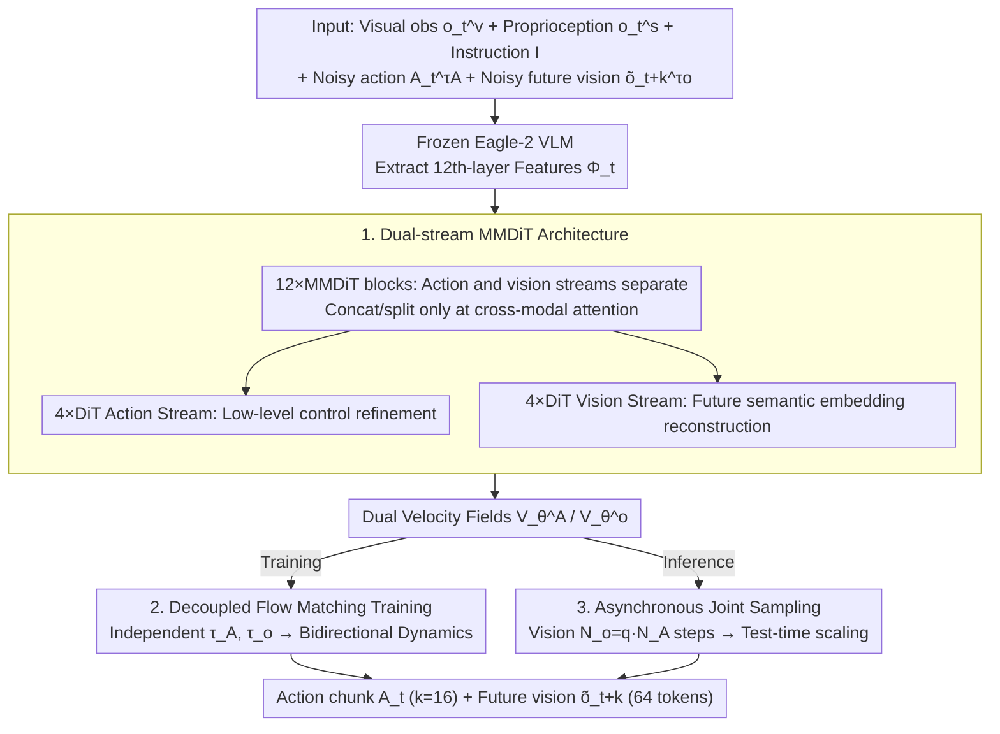

# Dual-Stream Diffusion for World-Model Augmented Vision-Language-Action Model

**Conference**: ICML 2026  
**arXiv**: [2510.27607](https://arxiv.org/abs/2510.27607)  
**Code**: Project page is public (presented as "Project page here" in the paper)  
**Area**: Robotics  
**Keywords**: VLA, World Model, Multi-modal Diffusion, flow matching, asynchronous sampling  

## TL;DR
DUST utilizes a "dual-stream" multi-modal diffusion Transformer (MMDiT) to process action flows and future visual embedding flows in parallel. By employing shared attention for cross-modal fusion, combined with independent noise scheduling and asynchronous action-vision sampling, it enables the VLA to simultaneously learn "what actions to perform" and "what consequences those actions produce." It consistently outperforms GR00T-N1.5+FLARE on RoboCasa, GR-1, and real-world Franka robots.

## Background & Motivation
**Background**: Diffusion-based Vision-Language-Action models (such as $\pi_0$, GR00T-N1.5) are currently the mainstream for general-purpose robotic policies. These use a VLM as the perception head and a diffusion action expert as the execution head, learning action distributions via flow matching.

**Limitations of Prior Work**: Pure VLA models only learn the "observation $\rightarrow$ action" mapping without explicit modeling of "how actions transform the world," leading to a lack of physical common sense and failures in novel scenarios. Previous methods adding world-model objectives fall into two categories, both with structural flaws: (a) **Unified joint diffusion** (PAD/EnerVerse) concatenates action and vision tokens into a single diffusion model—but actions are low-dimensional, temporally smooth trajectories, while vision consists of high-dimensional, spatially complex images; thus, the joint latent space is dominated by vision. (b) **Causal diffusion** (Video Policy/VPP) splits them into two models with unidirectional vision $\rightarrow$ action conditioning—while avoiding modal interference, this completely severs the reverse information flow, preventing actions from influencing visual representation learning.

**Key Challenge**: The zero-sum trade-off between cross-modal fusion (learning together to extract causal coupling) and modality-specific fidelity (handling vastly different statistical properties).

**Goal**: (1) Host two token streams in a single model, allowing each to follow its own denoising path; (2) explicitly learn the bidirectional causal dependency of "action $\leftrightarrow$ future state" rather than unidirectional conditioning; (3) allocate computational power based on modal requirements during inference, turning the overhead of the world model into test-time scaling gains.

**Key Insight**: Borrowing from the MMDiT approach in Stable Diffusion 3—where the two token streams remain separate most of the time and only merge in attention layers—and overlaying it with independent per-modality noise in the style of Diffusion Forcing. This forces the model to predict correct velocity fields under all combinations of "clean action / noisy vision" and "noisy action / clean vision," thereby explicitly performing both forward dynamics (action $\rightarrow$ state) and inverse dynamics (state $\rightarrow$ action) reasoning.

**Core Idea**: Treat action and vision as parallel diffusion streams connected via shared attention, force bidirectional causality with independent noise, and offset the computational cost of high-dimensional vision via asynchronous sampling.

## Method
DUST modifies the standard "frozen VLM + trainable diffusion action expert" skeleton (like GR00T-N1.5). The diffusion module simultaneously outputs action chunks and future visual embeddings. The pipeline consists of architecture design, noise training, and inference sampling.

### Overall Architecture
**Input**: Current visual observation $o_t^v$, proprioception state $o_t^s$, and language instruction $I$. The diffusion process additionally takes noisy actions $A_t^{\tau_A}$ and noisy future visual embeddings $\tilde{o}_{t+k}^{\tau_o}$.

**Backbone**: A frozen Eagle-2 VLM extracts 12th-layer semantic features $\Phi_t$ as conditions. The diffusion module $\pi_\theta$ consists of 12 shared MMDiT blocks followed by 4 modality-specific DiT blocks for each stream.

**Output**: Action chunk $A_t=(a_t,\ldots,a_{t+k-1})$ ($k=16$) and future visual embedding $\tilde{o}_{t+k}$ (in SIGLIP-2 representation space, reduced from 256 tokens to 64 tokens via $2\times 2$ average pooling).

**Goal**: Jointly minimize action flow matching loss and visual flow matching loss during training. During inference, joint sampling is performed, enabling test-time scaling by controlling the ratio $q$ of visual to action denoising steps.

### Key Designs

**1. Dual-stream MMDiT Architecture: Separating streams while fusing at attention interfaces**

Cross-modal fusion and modality-specific fidelity are often at odds. Unified joint diffusion drowns low-dimensional action sequences in high-dimensional spatial vision. Causal diffusion completely severs bidirectional information flow. DUST adopts the MMDiT from Stable Diffusion 3 as a compromise: within each MMDiT block, action and vision streams use separate FFN/LayerNorm modules, only performing temporary concatenation during cross-modal attention for self-attention, before splitting back. Each stream receives a distinct AdaLN timestep embedding (corresponding to $\tau_A$ or $\tau_o$), decoupling dynamics from the base. This architecture ensures modality interaction without forcing a shared latent space that would be dominated by high-dimensional vision.

**2. Decoupled Flow Matching Joint Training: Forcing bidirectional causality via independent noise**

Traditional joint diffusion uses a single $\tau$ for synchronous noise addition, training the model only on the "both dirty / both clean" diagonal, which fails to capture causal asymmetries. DUST independently samples $\tau_A\in[0,1]$ and $\tau_o\in[0,1]$, constructing $A_t^{\tau_A}=\tau_A A_t+(1-\tau_A)\epsilon_A$ and $\tilde{o}_{t+k}^{\tau_o}=\tau_o\tilde{o}_{t+k}+(1-\tau_o)\epsilon_o$. The network outputs two velocity fields $[V_\theta^A, V_\theta^o]$ optimized by their respective flow matching losses:

$$\mathcal{L}_A=\mathbb{E}\|V_\theta^A-(A_t-\epsilon_A)\|^2,\quad \mathcal{L}_{WM}=\mathbb{E}\|V_\theta^o-(\tilde{o}_{t+k}-\epsilon_o)\|^2,\quad \mathcal{L}_{Joint}=\mathcal{L}_A+\lambda_{WM}\mathcal{L}_{WM}\ (\lambda_{WM}=1.0).$$

Independent noise expands the training distribution across the entire 2D grid: configurations with "clean vision + noisy action" force the model to solve "which action leads to this state" (inverse dynamics), and vice versa for forward dynamics.

**3. Vision-Action Asynchronous Joint Sampling: Transforming world model compute into test-time scaling**

Visual diffusion requires many steps to converge, whereas action diffusion can lose performance if over-sampled. Synchronous sampling usually caters to the "bottleneck" modality, wasting compute. DUST decouples these: with action steps $N_A$ and vision steps $N_o=q\cdot N_A$ ($q\in\mathbb{N}$), the process advances with a global vision step size $\Delta\tau_o=1/N_o$. Visual tokens are updated every step, while action tokens are only updated with a larger step size $\Delta\tau_A=q\Delta\tau_o$ when $\tau_A N_o \bmod q=0$. Increasing $q > 1$ allows the world model to iterate more, providing refined future visual signals to the action stream, resulting in a "free lunch" gain of 2–6 pp.

### Loss & Training
- Joint loss $\mathcal{L}_{Joint}=\mathcal{L}_A+1.0\cdot\mathcal{L}_{WM}$. Timestep sampling follows $\tau\sim\mathrm{Beta}((s-\tau)/s;1.5,1.0)$ with $s=0.999$.
- VLM backbone is frozen; the diffusion expert is trained from scratch. 16 action tokens, 1 state token, and 64 future visual tokens enter the MMDiT.
- World model targets use SIGLIP-2 embeddings (not pixels) to avoid wasteful modeling of texture and lighting.

## Key Experimental Results

### Main Results
Evaluated on RoboCasa (24 tasks), GR-1 (24 tasks), and real-world Franka Research 3 (7 tasks). Baselines: GR00T-N1.5, $\pi_0$, $\pi_0$-FAST, and FLARE.

| Dataset | Setting | Metric | Ours (GR00T+DUST) | Prev. SOTA (GR00T+FLARE) | Gain |
|--------|------|------|------|------|------|
| RoboCasa | 100 demos/task | Avg. success (%) | 50.1 | 44.6 | +5.5 |
| RoboCasa | 300 demos/task | Avg. success (%) | 58.5 | 55.3 | +3.2 |
| RoboCasa | 1000 demos/task | Avg. success (%) | 66.3 | 64.6 | +1.7 |
| GR-1 | 300 demos/task | Avg. success (%) | 36.0 | 33.7 | +2.3 |
| GR-1 | 1000 demos/task | Avg. success (%) | 42.0 | 36.3 | +5.7 |
| Franka Real | 7-Task Avg. | Success (%) | 59.9 | 49.5 | +10.4 |

DUST consistently outperforms FLARE across all scales. Real-world performance shows significant gains in PnP, Insert, and Tool-Use tasks, with Cord-insertion jumping from 12.5% to 29.2%.

### Ablation Study

| Configuration | Key Metrics | Note |
|------|----------|------|
| Full DUST | Avg. 58.5 (RoboCasa 300 demos) | Complete model, $q=1$ |
| + test-time scaling ($q>1$) | +2~6 pp | Free accuracy gain by doubling vision denoising steps |
| w/o dual-stream (unified) | Significant drop | Low-dim actions overwhelmed by high-dim vision |
| w/o decoupled noise ($\tau_A=\tau_o$) | Significant drop | Lost forward/inverse dynamics signals |
| Pixel-level world modeling | Performance drop | Model capacity consumed by texture/lighting |
| Joint training | RoboCasa Avg. ↑ | Positive transfer even with heterogeneous data |

### Key Findings
- **Symmetric cross-modal coupling is vital**: The gain from "causal unidirectional $\rightarrow$ dual-stream bidirectional" is larger than "unified $\rightarrow$ causal," indicating that inverse dynamics supervision was previously undervalued.
- **Asynchronous sampling is a "free lunch"**: Increasing vision steps improves results by 2–6 pp, while increasing action steps can be detrimental.
- **Pre-training + Heterogeneous compatibility**: DUST can be pre-trained on action-free videos (vision stream learns, action stream with random noise still learns via inverse dynamics) and shows significant transfer gains.
- **Real-world Gain > Simulation Gain**: +5% in simulation vs. +10% in real-world, suggesting explicit world modeling is particularly effective against OOD/physical perturbations.

## Highlights & Insights
- **Clever reuse of MMDiT**: Adapting an architecture designed for "image + text" in image generation to "action + vision" fits naturally with minimal engineering.
- **Independent noise as implicit curriculum learning**: Different $(\tau_A, \tau_o)$ combinations correspond to sub-tasks like "predict action given future," "predict future given action," or both. A single loss covers them all more elegantly than multiple auxiliary heads.
- **Transferable asynchronous sampling**: Any multi-modal diffusion task where modality dimensions differ greatly can use the $q$ knob to scale higher-dimensional denoising steps independently.
- **Embedding-level efficiency**: Validates that predicting VLM semantic embeddings provides sufficient physical constraints for the policy without the overhead of pixel reconstruction.

## Limitations & Future Work
- The VLM backbone is frozen; future visual embeddings are locked to the SIGLIP-2 space, potentially missing physical details not encoded in the VLM (e.g., fine-grained tactile contact).
- The asynchronous sampling $q$ is a discrete integer selected manually; making it a continuous, adaptive schedule based on uncertainty is an open question.
- Real-world experiments are limited to single-arm Franka; dual-arm, mobile bases, and dexterous hands are not yet covered.
- Training cost is higher than vanilla VLA: calculating two flow matching losses where vision tokens outweigh action tokens by $4\times$ increases VRAM and compute requirements.

## Related Work & Insights
- **vs FLARE (Zheng et al., 2025)**: FLARE uses embedding targets for implicit world modeling but relies on unidirectional feature alignment; DUST uses explicit bidirectional diffusion + independent noise for stronger causal signals.
- **vs PAD / EnerVerse (unified joint diffusion)**: These concatenate action/vision into one sequence; DUST uses MMDiT to "divide and conquer" with controlled fusion.
- **vs Video Policy / VPP (causal diffusion)**: These use two models with unidirectional conditioning; DUST uses a single coupled model, avoiding information bottlenecks.
- **vs Diffusion Forcing (Chen et al., 2025a)**: DUST adapts the per-token noise idea to a per-modality level, which is more stable for modalities with massive dimensional differences.

## Rating
- Novelty: ⭐⭐⭐⭐ Innovative migration of MMDiT to VLA; first use of independent noise + async sampling in robot learning.
- Experimental Thoroughness: ⭐⭐⭐⭐⭐ Comprehensive coverage across simulation (RoboCasa/GR-1/CALVIN/LIBERO), real-world, and pre-training.
- Writing Quality: ⭐⭐⭐⭐ Clear diagrams and derivations; an additional timeline for async sampling would be beneficial.
- Value: ⭐⭐⭐⭐⭐ Provides a strong, concise baseline for "VLA + World Model" research.

<!-- RELATED:START -->

## Related Papers

- [\[ICML 2026\] From Abstraction to Instantiation: Learning Behavioral Representation for Vision-Language-Action Model](from_abstraction_to_instantiation_learning_behavioral_representation_for_vision-.md)
- [\[CVPR 2026\] Global Prior Meets Local Consistency: Dual-Memory Augmented Vision-Language-Action Model for Efficient Robotic Manipulation](../../CVPR2026/robotics/global_prior_meets_local_consistency_dual-memory_augmented_vision-language-actio.md)
- [\[ICLR 2026\] UniVLA: Unified Vision-Language-Action Model](../../ICLR2026/robotics/unified_vision-language-action_model.md)
- [\[ICML 2026\] Discrete Diffusion VLA: Bringing Discrete Diffusion to Action Decoding in Vision-Language-Action Policies](discrete_diffusion_vla_bringing_discrete_diffusion_to_action_decoding_in_vision-.md)
- [\[ICLR 2026\] Unified Diffusion VLA: Vision-Language-Action Model via Joint Discrete Denoising Diffusion Process](../../ICLR2026/robotics/unified_diffusion_vla_vision-language-action_model_via_joint_discrete_denosing_d.md)

<!-- RELATED:END -->
