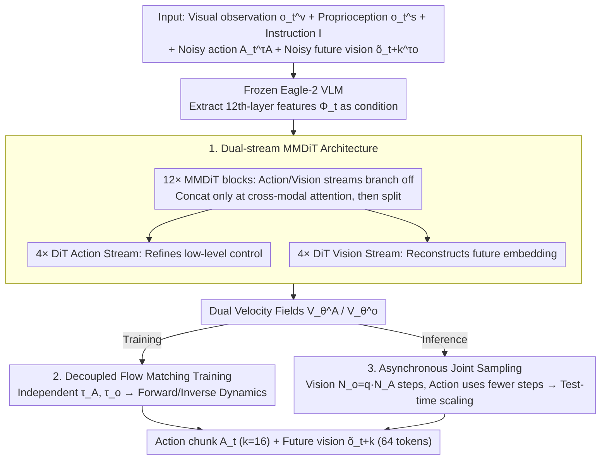

# Dual-Stream Diffusion for World-Model Augmented Vision-Language-Action Model

**Conference**: ICML 2026  
**arXiv**: [2510.27607](https://arxiv.org/abs/2510.27607)  
**Code**: Project page released (Given as "Project page here" in the paper)  
**Area**: Robotics  
**Keywords**: VLA, World Model, Multimodal Diffusion, Flow Matching, Asynchronous Sampling  

## TL;DR
DUST employs a "dual-stream" Multimodal Diffusion Transformer (MMDiT) that aligns action streams alongside future vision embedding streams. Utilizing shared attention for cross-modal fusion, independent noise scheduling, and asynchronous action-vision sampling, DUST enables the VLA to simultaneously learn "what action to take" and "what consequences the action will produce," consistently outperforming GR00T-N1.5+FLARE on RoboCasa, GR-1, and Franka physical robots.

## Background & Motivation
**Background**: Diffusion-based Vision-Language-Action models (such as $\pi_0$, GR00T-N1.5) are currently the mainstream for general-purpose robot policies—using a VLM as the perception head and a diffusion action expert as the execution head, learning action distributions via flow matching.

**Limitations of Prior Work**: Pure VLAs only learn the "observation $\rightarrow$ action" mapping without explicit modeling of "how the action changes the world," leading to a lack of physical common sense and failures in novel scenarios. Previous methods incorporating world-model objectives fall into two categories, both with structural flaws: (a) **Unified joint diffusion** (PAD/EnerVerse) concatenates action and vision tokens into a single diffusion model—however, actions are low-dimensional, temporally smooth trajectories, while vision consists of high-dimensional, spatially complex images, causing the single latent space to be dominated by vision; (b) **Causal diffusion** (Video Policy/VPP) splits them into two models with a unidirectional vision $\rightarrow$ action condition—avoiding modal interference but completely severing the reverse information flow, which prevents actions from influencing vision representation learning.

**Key Challenge**: The zero-sum trade-off between cross-modal fusion (learning together to extract causal coupling) and modality-specific fidelity (handling drastically different statistical properties).

**Goal**: (1) Support two parallel token streams within a single model, allowing them to follow their own denoising paths; (2) Explicitly learn bidirectional causal dependencies between "action $\leftrightarrow$ future state" rather than unidirectional conditioning; (3) Allocate compute power based on modal requirements during inference, converting the world model's overhead into test-time scaling benefits.

**Key Insight**: Inspired by the MMDiT approach in Stable Diffusion 3, the authors allow the two token streams to remain branched most of the time, merging only at attention layers. By overlaying modal-independent noise in the style of diffusion forcing, the model is compelled to predict correct velocity fields under all combinations of "clean action / noisy vision" and "noisy action / clean vision," thereby explicitly performing both forward dynamics (action $\rightarrow$ state) and inverse dynamics (state $\rightarrow$ action) reasoning.

**Core Idea**: Treat action and vision as two parallel diffusion streams, communicating through shared attention, forcing bidirectional causality via independent noise, and absorbing the computational cost of high-dimensional vision through asynchronous sampling.

## Method
DUST modifies the standard "frozen VLM + trainable diffusion action expert" framework (like GR00T-N1.5). The diffusion module simultaneously outputs action chunks and future vision embeddings. The pipeline is divided into architecture, training, and inference.

### Overall Architecture
**Input**: Current visual observation $o_t^v$, proprioceptive state $o_t^s$, language instruction $I$; the diffusion process additionally takes noisy action $A_t^{\tau_A}$ and noisy future vision embedding $\tilde{o}_{t+k}^{\tau_o}$.

**Backbone**: A frozen Eagle-2 VLM extracts 12th-layer semantic features $\Phi_t$ as conditions; the diffusion module $\pi_\theta$ consists of 12 shared MMDiT blocks and 4 modality-specific DiT blocks for each stream.

**Output**: Action chunk $A_t=(a_t,\ldots,a_{t+k-1})$ ($k=16$) + future vision embedding $\tilde{o}_{t+k}$ (in SIGLIP-2 representation space, 256 tokens downsampled to 64 tokens via $2\times 2$ average pooling).

**Goal**: Jointly minimize action flow matching loss and vision flow matching loss during training; perform joint sampling during inference, achieving test-time scaling by controlling the vision/action denoising step ratio $q$.

### Key Designs

**1. Dual-stream MMDiT Architecture: Merging at attention while branching elsewhere**

Cross-modal fusion and modality-specific fidelity are at odds: unified joint diffusion suppresses low-dimensional actions with high-dimensional vision, while causal diffusion severs reverse information flow. DUST adopts the MMDiT from Stable Diffusion 3 as a compromise: within each MMDiT block, action and vision streams use their own FFN/LayerNorm but temporarily concatenate for self-attention at the cross-modal layer before splitting. Each stream receives its own AdaLN timestep embedding (corresponding to $\tau_A$ or $\tau_o$), decoupling dynamics from the start. Post-MMDiT, 4 modal-specific DiT layers refine the output—vision labels focus on semantically consistent reconstruction, while action layers focus on low-level motion.

The core idea is to compress "information exchange" into the attention bottleneck while keeping other computations separate, allowing modal communication without the high-dimensional vision dominating the shared latent space.

**2. Decoupled Flow Matching Joint Training: Forcing bidirectional causality via independent noise**

Traditional joint diffusion uses a single synchronous $\tau$, training the model only on the diagonal where both modalities are equally noisy/clean. DUST independently samples $\tau_A\in[0,1]$ for actions and $\tau_o\in[0,1]$ for vision, constructing $A_t^{\tau_A}=\tau_A A_t+(1-\tau_A)\epsilon_A$ and $\tilde{o}_{t+k}^{\tau_o}=\tau_o\tilde{o}_{t+k}+(1-\tau_o)\epsilon_o$. The network outputs dual velocity fields $[V_\theta^A, V_\theta^o]$, optimized by their respective flow matching losses:

$$\mathcal{L}_A=\mathbb{E}\|V_\theta^A-(A_t-\epsilon_A)\|^2,\quad \mathcal{L}_{WM}=\mathbb{E}\|V_\theta^o-(\tilde{o}_{t+k}-\epsilon_o)\|^2,\quad \mathcal{L}_{Joint}=\mathcal{L}_A+\lambda_{WM}\mathcal{L}_{WM}\ (\lambda_{WM}=1.0).$$

Independent noise expands the training distribution to the entire 2D grid: when "vision is clean + action is noisy," the model is forced to solve "what action leads to this state" (inverse dynamics); the reverse case solves forward dynamics. A single loss function encapsulates all directions of dynamical reasoning.

**3. Vision-action Asynchronous Joint Sampling: Scaling with world model compute dividends**

Vision diffusion requires many steps to converge, whereas too many action steps can degrade performance due to dimensionality differences. DUST decouples them: given action steps $N_A$ and vision steps $N_o=q\cdot N_A$ ($q\in\mathbb{N}$), the process advances with a global vision step size $\Delta\tau_o=1/N_o$. Vision tokens update every step, but action tokens update only when $\tau_A N_o \bmod q=0$ using the larger step $\Delta\tau_A=q\Delta\tau_o$. When $q>1$, the world model performs more iterations, allowing the action stream to benefit from more refined future vision signals.

This provides an inference-time scaling knob—increasing vision steps yields a 2–6 pp improvement, acting as a nearly "free lunch."

### Loss & Training
- Joint loss $\mathcal{L}_{Joint}=\mathcal{L}_A+1.0\cdot\mathcal{L}_{WM}$ with timestep sampling $\tau\sim\mathrm{Beta}((s-\tau)/s;1.5,1.0)$, where $s=0.999$.
- The VLM backbone is frozen; the diffusion expert is trained from scratch. 16 action tokens, 1 state token, and 64 future vision tokens enter the MMDiT.
- The world model objective uses SIGLIP-2 embeddings (not pixels) to avoid wasteful modeling of texture/lighting.

## Key Experimental Results

### Main Results
Testing on RoboCasa (24 tasks), GR-1 (24 tasks), and Franka Research 3 (7 tasks) with baselines GR00T-N1.5, $\pi_0$, $\pi_0$-FAST, and FLARE.

| Dataset | Setting | Metric | Ours (GR00T+DUST) | Prev. SOTA (GR00T+FLARE) | Gain |
|--------|------|------|------|------|------|
| RoboCasa | 100 demos/task | Avg. success (%) | 50.1 | 44.6 | +5.5 |
| RoboCasa | 300 demos/task | Avg. success (%) | 58.5 | 55.3 | +3.2 |
| RoboCasa | 1000 demos/task | Avg. success (%) | 66.3 | 64.6 | +1.7 |
| GR-1 | 300 demos/task | Avg. success (%) | 36.0 | 33.7 | +2.3 |
| GR-1 | 1000 demos/task | Avg. success (%) | 42.0 | 36.3 | +5.7 |
| Franka Real | 7-task Avg. | Success (%) | 59.9 | 49.5 | +10.4 |

DUST consistently outperforms FLARE across all demo scales. The gain over vanilla GR00T-N1.5 is particularly significant (+8.4 pp on RoboCasa 100 demos). On real hardware, it demonstrates improvement across PnP, Insert, and Tool-Use tasks, with Cord-insertion jumping from 12.5% to 29.2%.

### Ablation Study

| Configuration | Key Metric | Description |
|------|----------|------|
| Full DUST | Avg. 58.5 (RoboCasa 300 demos) | Complete model, $q=1$ |
| + test-time scaling ($q>1$) | +2~6 pp | Doubling vision steps yields "free" accuracy |
| w/o dual-stream (to unified joint) | Significant drop | Low-dim actions overwhelmed by high-dim vision |
| w/o decoupled noise ($\tau_A=\tau_o$) | Significant drop | Loss of forward/inverse dynamics signals |
| Pixel-level world-modeling | Drop | Capacity wasted on texture/lighting |
| Joint training (RoboCasa+GR-1+EgoDex) | RoboCasa Avg. ↑ | Positive transfer from heterogeneous data |

### Key Findings
- **Symmetric cross-modal coupling is critical**: The gain from "causal unidirectional $\rightarrow$ dual-stream bidirectional" is larger than "unified $\rightarrow$ causal," suggesting inverse dynamics supervision was previously undervalued.
- **Asynchronous sampling is a free lunch**: Computing vision tokens more frequently improves accuracy by 2–6 pp, whereas increasing action steps can be detrimental.
- **Heterogeneous data compatibility**: DUST can be pre-trained on action-free videos (vision stream learns, action stream with random noise still learns inverse dynamics), providing significant gains for downstream tasks.
- **Real-world gains > Simulation gains**: +5% in simulation vs. +10% in real-world, indicating explicit world modeling helps handle OOD/physical perturbations.

## Highlights & Insights
- **Clever reuse of MMDiT**: Originally for image+text in generation, here it fits action+vision tokens naturally with minimal engineering changes.
- **Independent noise as implicit curriculum**: Different $(\tau_A, \tau_o)$ combinations correspond to different sub-tasks (e.g., predict action given future), which is cleaner than designing multiple auxiliary heads.
- **Transferable asynchronous sampling**: Any multimodal diffusion task with varying dimensional complexity (e.g., video+audio) can use the $q$ knob for free test-time scaling.
- **Embedding-level world models are sufficient**: No need for pixel reconstruction; predicting VLM semantic embeddings provides enough physical constraint.

## Limitations & Future Work
- The frozen VLM backbone locks the future vision embedding space to SIGLIP-2, potentially missing physical details not encoded by the VLM (e.g., fine-grained force or contact states).
- The ratio $q$ is a discrete integer selected manually; adaptive scheduling based on uncertainty is a future direction.
- Real-world verification was limited to a Franka arm; dual-arm, mobile, or dexterous configurations are not yet covered.
- Increased training cost compared to vanilla VLA: calculating two flow matching losses with 4x more vision tokens doubles memory and compute per step.

## Related Work & Insights
- **vs FLARE (Zheng et al., 2025)**: Both use embedding targets for implicit world modeling, but FLARE is unidirectional. DUST uses explicit bidirectional diffusion + independent noise, leading to stronger causal signals.
- **vs PAD / EnerVerse (Unified joint diffusion)**: DUST's branched architecture + asynchronous schedule avoids the information bottleneck where actions are overwhelmed by vision.
- **vs Video Policy / VPP (Causal diffusion)**: Those use two models with unidirectional conditioning; DUST uses one model with bidirectional coupling.
- **vs Diffusion Forcing (Chen et al., 2025a)**: DF proposed per-token noise for causality; DUST simplifies this to per-modality, which is more suitable for robot learning.

## Rating
- Novelty: ⭐⭐⭐⭐ Introducing MMDiT to VLA is creative; the combination of independent noise and asynchronous sampling is a first for robot learning.
- Experimental Thoroughness: ⭐⭐⭐⭐⭐ Comprehensive coverage across simulation (RoboCasa/GR-1/CALVIN/LIBERO) and real hardware.
- Writing Quality: ⭐⭐⭐⭐ Clear diagrams and derivation; an additional timeline for sampling would be helpful.
- Value: ⭐⭐⭐⭐⭐ Provides a clean, strong baseline for "VLA + World Model" that can be directly applied to next-gen robot foundation models.

<!-- RELATED:START -->

## Related Papers

- [\[ICML 2026\] Discrete Diffusion VLA: Bringing Discrete Diffusion to Action Decoding in Vision-Language-Action Policies](discrete_diffusion_vla_bringing_discrete_diffusion_to_action_decoding_in_vision-.md)
- [\[ICML 2026\] From Abstraction to Instantiation: Learning Behavioral Representation for Vision-Language-Action Model](from_abstraction_to_instantiation_learning_behavioral_representation_for_vision-.md)
- [\[CVPR 2026\] Global Prior Meets Local Consistency: Dual-Memory Augmented Vision-Language-Action Model for Efficient Robotic Manipulation](../../CVPR2026/robotics/global_prior_meets_local_consistency_dual-memory_augmented_vision-language-actio.md)
- [\[CVPR 2026\] Chain of World: World Model Thinking in Latent Motion (CoWVLA)](../../CVPR2026/robotics/chain_of_world_world_model_thinking_in_latent_motion.md)
- [\[CVPR 2026\] Motus: A Unified Latent Action World Model](../../CVPR2026/robotics/motus_a_unified_latent_action_world_model.md)

<!-- RELATED:END -->
