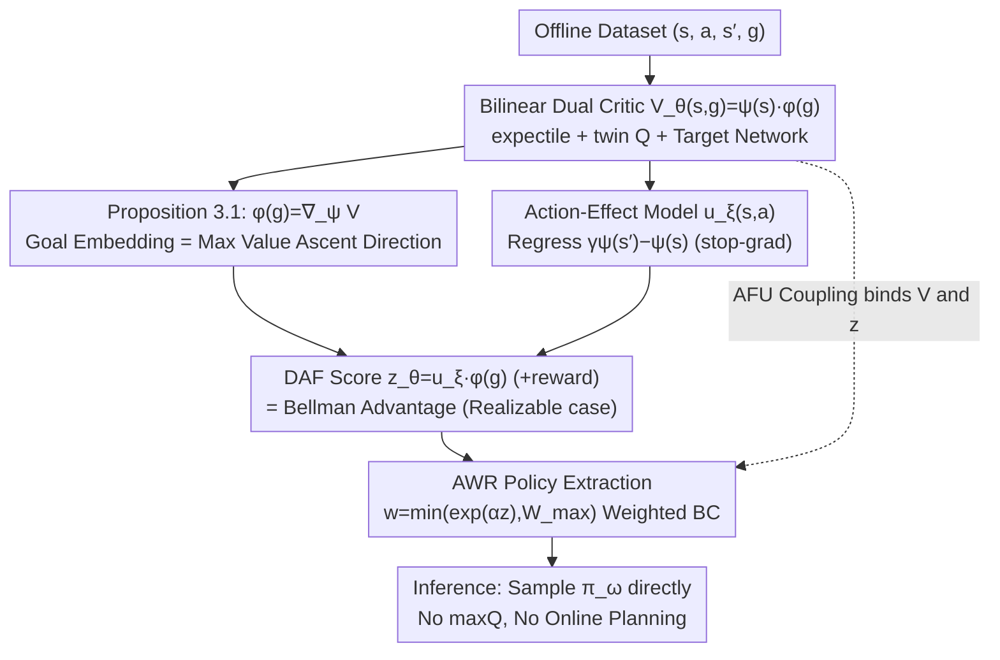

# Dual Advantage Fields

**Conference**: ICML 2026 Workshop on Decision Making  
**arXiv**: [2606.04188](https://arxiv.org/abs/2606.04188)  
**Code**: Unavailable (ICML 2026 Workshop Paper)  
**Area**: Reinforcement Learning / Offline Goal-Conditioned RL  
**Keywords**: Offline GCRL, dual goal representation, bilinear value, advantage weighted regression, policy extraction  

## TL;DR
This paper observes that in the bilinear goal-conditioned value model $V_\theta(s,g)=\psi_\theta(s)^\top\phi_\theta(g)$, the goal embedding $\phi_\theta(g)$ is exactly the gradient direction of the value field with respect to the state embedding. By utilizing an "action-feature displacement predictor" $u_\xi(s,a)\approx\gamma\psi(s')-\psi(s)$ and taking its inner product with the goal embedding, a learning-free Q-network local advantage score is obtained. This approach significantly improves the RLiable aggregated metrics across OGBench long-range navigation, manipulation, and puzzle tasks.

## Background & Motivation

**Background**: Offline goal-conditioned reinforcement learning (GCRL) must simultaneously address two challenges: (1) **long-range reachability**—inferring connectivity between states across multiple steps from a fixed dataset to "stitch" different trajectory segments; (2) **local action selection**—picking the action at the current state that most effectively moves towards the goal. Recent dual goal representation methods (e.g., Park et al. 2024) elegantly solve long-range reachability using bilinear potential functions $V_\theta(s,g)=\psi_\theta(s)^\top\phi_\theta(g)$, which encode metric structures, support cross-trajectory stitching, and generalize to unseen $(s,g)$ pairs.

**Limitations of Prior Work**: The value surface $V_\theta(s,g)$ only indicates "how good the current state is for the goal" but **does not specify which action is better than another**. Two different actions $a_1, a_2$ starting from the same $s$ share the same $V_\theta(s,g)$, but only one might actually move the agent toward the goal—this is a mismatch between **global value vs. local advantage**. Existing solutions either train an additional goal-conditioned Q-network (computationally expensive and decoupled from the value representation) or use hierarchical subgoals (HIQL). The latter excels in long-range navigation but performs poorly in manipulation tasks requiring local counter-intuitive control, such as "performing a pre-grasp before moving to the goal" (where pointing directly at the final goal is incorrect).

**Key Challenge**: The goal is to "preserve the global stitching capability of dual representations while obtaining a local action comparison signal without an extra Q-network." If the "local advantage direction" could be directly read from the pre-trained goal embedding $\phi_\theta(g)$, a lightweight actor-free mechanism could replace a standalone Q-network.

**Goal**: (1) Pair the global value field of dual representations with a newly proposed "local advantage field"; (2) design an actor-free policy extraction objective; (3) verify whether it achieves consistent performance across the full OGBench suite (locomotion + manipulation + puzzle) compared to hierarchical and quasimetric approaches.

**Key Insight**: Under bilinear parameterization, the gradient of the value field with respect to the state embedding has a simple closed form: $\nabla_\psi V_\theta(s,g)=\phi_\theta(g)$. Thus, the **goal embedding itself is "the direction of steepest value ascent in the representation space."** The quality of an action can be measured by the inner product of its induced displacement $\Delta\psi$ in the $\psi$-space and the goal direction $\phi(g)$, transforming policy improvement into a **geometric alignment problem** in the representation space.

**Core Idea**: Learn an action-effect model $u_\xi(s,a)\approx\gamma\psi(s')-\psi(s)$ and define the Dual Advantage Field score as $z_\theta(s,a,g)=u_\xi(s,a)^\top\phi_\theta(g)$. Adding the reward term yields the model-induced Bellman advantage. Using this for Advantage Weighted Regression (AWR) completes policy extraction without ever training a goal-conditioned Q-network.

## Method

### Overall Architecture
DAF decomposes offline GCRL into three model components: (1) a bilinear critic network $V_\theta(s,g)=\psi_\theta(s)^\top\phi_\theta(g)$ (trained with IQL expectile loss); (2) an action-displacement predictor $u_\xi(s,a)$ (trained with regression loss using stop-grad); (3) a policy $\pi_\omega(a|s,c)$ (trained via AWR weighted by DAF scores). During training, these three are updated in parallel within a single batch, alongside twin critics $Q_\theta^{(1)}, Q_\theta^{(2)}$ for pessimistic estimation and target networks for Bellman backup stability. At inference, $\pi_\omega$ is sampled directly **without online planning or maxQ operations**.

The core observation is Proposition 3.1: the gradient of the bilinear $V$ with respect to $\psi$ equals $\phi(g)$; thus, the value difference for any transition $V(s',g)-V(s,g)=\phi(g)^\top(\psi(s')-\psi(s))$ reduces to an inner product.

### Key Designs

**1. DAF Score: Expressing Bellman Advantage as "Displacement $\cdot$ Gradient"**

The dual value field $V_\theta(s,g)$ only reflects state quality but cannot distinguish which action is more progressive as they share the same $V_\theta(s,g)$. DAF notes a simple fact: $\gamma V_\theta(s',g)-V_\theta(s,g)$ expands to $\phi_\theta(g)^\top(\gamma \psi_\theta(s')-\psi_\theta(s))$ (Eq. 7). This allows calculating a scalar advantage score for each offline sample $(s,a,s',g)$:

$$\hat{A}_\theta(s,a,s',g)=r(s,a,g)+\phi_\theta(g)^\top(\gamma\psi_\theta(s')-\psi_\theta(s))$$

This defines GCRL advantage as the inner product of "action-induced feature displacement" and the "goal direction." In the realizable case (where $V^\pi=\psi^\top\phi$ holds exactly), it is strictly equal to the true Bellman advantage $A^\pi(s,a,g)$ (Corollary 3.2 + Appendix F.1). Using this for AWR bypasses the need for a separate Q-network that might be decoupled from $V$ or accumulate bootstrap errors.

**2. Action-Effect Model $u_\xi(s,a)$: Moving $s'$ Dependency to Training Time**

The $\gamma\psi(s')-\psi(s)$ term in $\hat{A}$ requires $s'$, which has high variance if only one sample per $(s,a)$ exists in stochastic environments. DAF learns an action-effect model to predict the discounted displacement in representation space: $u_\xi(s,a)\approx\mathbb{E}_{s'\sim p(\cdot|s,a)}[\gamma\psi_\theta(s')-\psi_\theta(s)]$. The objective is:

$$\mathcal{L}_{\mathrm{ae}}=\mathbb{E}\big[\|u_\xi(s,a)-\mathrm{sg}(\gamma\psi_\theta(s')-\psi_\theta(s))\|_2^2\big]$$

where $\mathrm{sg}$ is stop-gradient, ensuring $u_\xi$ tracks fixed target feature dynamics without interfering with the training of $\psi$. Regressing $u_\xi$ implicitly averages over $s'$, reducing variance and removing the need for $s'$ during inference.

**3. Actor-free Coupling + AWR Policy Extraction: Scoring via Dual Geometry**

With $u_\xi$ and $\phi_\theta(g)$, the DAF score is $z_\theta(s,a,g)=u_\xi(s,a)^\top\phi_\theta(g)$. This is converted into softmax weights $w_\theta=\min\{\exp(\alpha z_\theta),W_{\max}\}$, and the policy $\pi_\omega$ is trained to minimize $-\mathbb{E}[w_\theta\log\pi_\omega(a|s,c)]$. Since $z_\theta$ does not depend on $\omega$, this becomes advantage-weighted behavioral cloning with temperature $\alpha$, prioritizing actions aligned with the goal direction in $\psi$-space. DAF avoids $\max_a Q$ completely, using Perrin-Gilbert’s actor-free coupling (Appendix E) to bind $V_\theta$ and $z_\theta$ via consistency loss.

### Loss & Training
Total loss includes: (1) Bellman/expectile loss for $V_\theta=\psi^\top\phi$ + twin $Q^{(j)}$; (2) $\mathcal{L}_{\mathrm{ae}}$ for $u_\xi$; (3) AWR loss for $\pi_\omega$; (4) Actor-free coupling loss linking $V_\theta$ and $z_\theta$. Hyperparameters include $\alpha$ for temperature, $W_{\max}$ for clipping, and IQL expectile $\tau>0.5$.

## Key Experimental Results

### Main Results
Evaluation on the full OGBench suite (state-based), comparing against HIQL, OTA, MQE, CRL (including DUAL variants), GCIQL, and GCIVL (including DUAL variants). Success rates in [0,1], values are mean ± std.

| Env | Dataset | Dim | DAF | HIQL | OTA | MQE | CRL | CRL DUAL | GCIQL |
|---|---|---|---|---|---|---|---|---|---|
| humanoidmaze | navigate | medium | **0.93±0.03** | 0.91±0.01 | **0.95±0.01** | 0.49±0.09 | 0.59±0.03 | 0.62±0.03 | 0.31±0.04 |
| humanoidmaze | navigate | large | 0.66±0.03 | 0.45±0.04 | **0.83±0.03** | 0.20±0.07 | 0.26±0.03 | 0.21±0.05 | 0.04±0.01 |
| humanoidmaze | stitch | medium | **0.90±0.04** | 0.86±0.03 | **0.92±0.01** | 0.62±0.09 | 0.53±0.03 | 0.57±0.01 | 0.15±0.03 |
| humanoidmaze | stitch | large | **0.48±0.06** | 0.32±0.04 | 0.43±0.04 | 0.18±0.03 | 0.11±0.02 | 0.06±0.03 | 0.02±0.00 |
| antmaze | navigate | teleport | 0.51±0.08 | 0.46±0.03 | 0.53±0.03 | 0.49±0.04 | **0.60±0.01** | 0.57±0.04 | — |

DAF outperforms the second-best OTA by 5 percentage points and HIQL by 16 points on the difficult `humanoidmaze-stitch-large` setting.

### Visualization of Local Counter-Intuitive Behavior (cube-single manipulation)

| Method | High-level direction around cube (pre-grasp) | Behavioral Meaning |
|---|---|---|
| OTA | Pointing to goal placement location | Tries to push directly, but fails without grasp |
| DAF | Pointing to the cube itself | Grasps first, then moves to goal -> Success |

DAF learns that the **local subgoal $\neq$ final goal** geometry by producing a vector field pointing toward the cube during the pre-grasp phase.

### Key Findings
- **DAF gains are largest on stitch datasets**: Stitching requires picking actions that truly progress the state locally where global values might be saturated.
- **Manipulation success stems from local geometry**: Hierarchical methods (OTA/HIQL) often point high-level goals in the wrong direction locally; DAF’s $\phi(g)$ gradient naturally generates pre-grasp behaviors.
- **DUAL variants are not inherently better**: Simply switching to dual goal representation is insufficient; the key is **leveraging the geometry of the representation** to generate advantage signals.
- **Scaling trend is clear**: In `humanoidmaze-large`, the gap between DAF and HIQL expands from +3% to +21%.

## Highlights & Insights
- **"Goal embedding = Value gradient" is an elegant geometric observation**: This interprets the bilinear $\nabla_\psi V_\theta = \phi_\theta(g)$ as a "local improvement direction," providing a minimal policy extraction mechanism usable by any inner-product value function method (e.g., ICVF).
- **Actor-free policy extraction bypasses maxQ**: Avoids the primary source of overestimation in offline continuous control while maintaining policy improvement guarantees.
- **Translatability to Successor Measure framework**: DAF's $u_\xi(s,a)$ is structurally equivalent to Successor Features, allowing the reuse of GPI/GPE tools.
- **Quantifying "Local vs. Global" needs**: Visualizing the vector fields turns the "local subgoal" concept into a concrete geometric diagnostic.

## Limitations & Future Work
- **Strong Assumption: Realizable Bilinear Value**: Theoretical guarantees rely on $V^\pi(s,g)=\psi(s)^\top\phi(g)$ holding exactly.
- **Action-Effect Model Scaling**: Regression of $u_\xi(s,a)$ might underfit in high-dimensional or multimodal action spaces; conditional flow or diffusion models could be alternatives.
- **Lacking Image-based Tasks**: Success on pixel-based observations (e.g., OGBench-Visual) where learning $\psi(s)$ is harder has not been verified.
- **Online Fine-tuning**: Only offline settings were demonstrated; stability in offline-to-online transitions remains to be seen.

## Related Work & Insights
- **vs. HIQL**: HIQL uses hierarchical goals; DAF uses a single layer + local advantage field, showing superiority in manipulation and stitching.
- **vs. OTA / MQE**: DAF provides a unified mechanism for long-range and manipulation without specialized modules.
- **vs. Successor Features**: DAF is simpler as it uses one-step differences rather than full successor accumulations.
- **vs. Dayan & Singh (1996)**: DAF is a modern instantiation of comparative policy improvement within a dual representation framework.

## Rating
- **Novelty**: ⭐⭐⭐⭐ (Clever geometric observation using existing bilinear tools)
- **Experimental Thoroughness**: ⭐⭐⭐⭐ (Full OGBench suite provided; lacks visual tasks)
- **Writing Quality**: ⭐⭐⭐⭐ (Clear formulas and excellent pre-grasp visualization)
- **Value**: ⭐⭐⭐⭐ (Provides a lightweight, Q-network-free policy extraction paradigm)

<!-- RELATED:START -->

## Related Papers

- [\[ICML 2026\] Dual Quaternion SE(3) Synchronization with Recovery Guarantees](dual_quaternion_se3_synchronization_with_recovery_guarantees.md)
- [\[ICML 2026\] Neural Implicit Action Fields: From Discrete Waypoints to Continuous Functions for Vision-Language-Action Models](neural_implicit_action_fields_from_discrete_waypoints_to_continuous_functions_fo.md)
- [\[ICML 2026\] Dual-Stream Diffusion for World-Model Augmented Vision-Language-Action Model](dual-stream_diffusion_for_world-model_augmented_vision-language-action_model.md)
- [\[CVPR 2025\] g3D-LF: Generalizable 3D-Language Feature Fields for Embodied Tasks](../../CVPR2025/robotics/g3d-lf_generalizable_3d-language_feature_fields_for_embodied_tasks.md)
- [\[ACL 2026\] Libra-VLA: Achieving Learning Equilibrium via Asynchronous Coarse-to-Fine Dual-System](../../ACL2026/robotics/libra-vla_achieving_learning_equilibrium_via_asynchronous_coarse-to-fine_dual-sy.md)

<!-- RELATED:END -->
