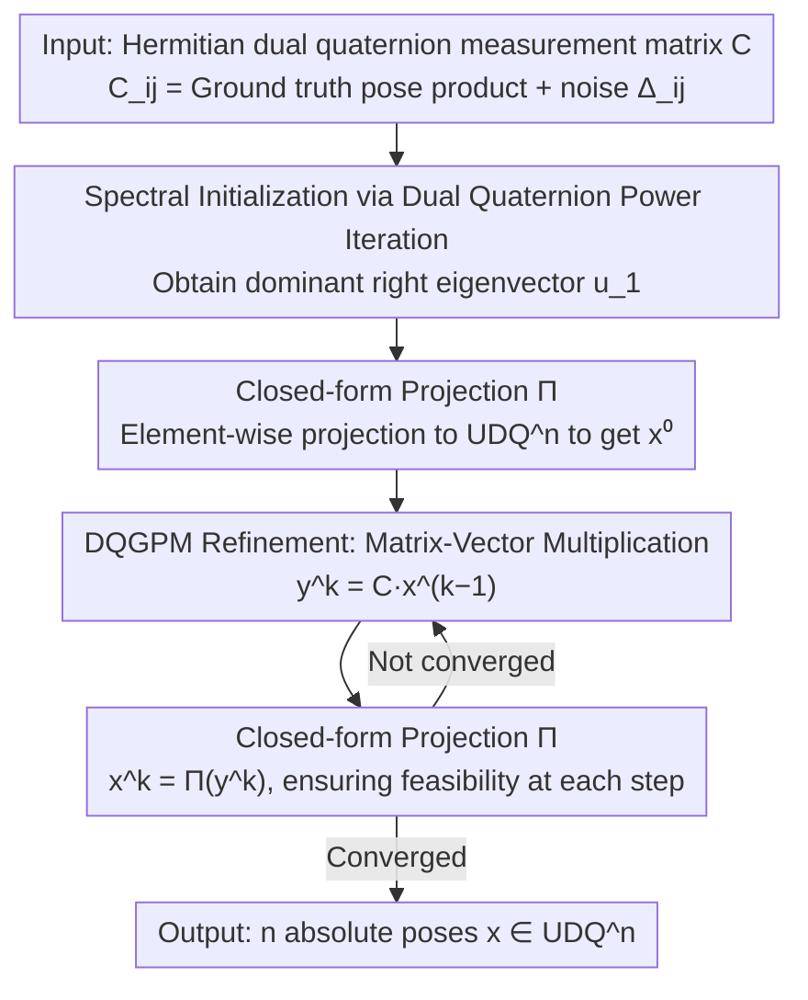

# Dual Quaternion SE(3) Synchronization with Recovery Guarantees

**Conference**: ICML 2026  
**arXiv**: [2602.00324](https://arxiv.org/abs/2602.00324)  
**Code**: https://github.com/jnzhao333/dq_sync  
**Area**: 3D Vision / Optimization / Pose Synchronization  
**Keywords**: SE(3) Synchronization, Dual Quaternions, Spectral Method, Generalized Power Method, Multi-scan Point Cloud Registration  

## TL;DR
This paper parameterizes the SE(3) synchronization problem using Unit Dual Quaternions (UDQ) instead of $4\times4$ matrices. The authors calculate a spectral initialization using power iteration on a Hermitian dual quaternion matrix, followed by iterative refinement using the Dual Quaternion Generalized Power Method (DQGPM) with element-wise projection onto $\mathrm{UDQ}^n$. This approach provides the first finite-step linear convergence guarantee and explicit error bounds for SE(3) synchronization. In multi-scan point cloud registration, it outperforms matrix-based methods in terms of rotation/translation error and computational efficiency.

## Background & Motivation

**Background**: SE(3) synchronization—estimating absolute poses for all nodes from a set of noisy relative poses $T_{ij}$—is a fundamental primitive for SLAM, multi-scan registration, and SfM. Mainstream approaches use $4\times4$ matrices to represent poses and perform spectral relaxation (EIG), semidefinite relaxation (SDR), or Lie algebraic averaging/Riemannian optimization, followed by a rounding step to project the solution back to SE(3).

**Limitations of Prior Work**: Matrix representations suffer from a structural **representation gap**. When using complex numbers for $\mathrm{SO}(2)$, the isometry group of the eigenspace is exactly $\mathrm{SO}(2)$, and rounding reduces to simple normalization. For $\mathrm{SO}(d)$ matrix representations, the isometry group is $\mathrm{O}(d)$, introducing a mild reflection ambiguity solvable by SVD. However, for SE(3), since $\mathrm{SE}(3)=\mathrm{SO}(3)\ltimes\mathbb{R}^3$ is **non-compact**, while the relaxed eigenspace geometry is compact and orthogonal, the relaxed solution stays far from the manifold. Rounding becomes an "imposition of structure" rather than "error correction," necessitating multi-step heuristics (splitting rotation/translation and projecting separately) that are unstable and difficult to analyze.

**Key Challenge**: The goal is to choose a parameterization where the **ambiguity group of the spectral relaxation aligns exactly with the global gauge symmetry of SE(3)**, making rounding a benign projection and enabling theoretical analysis. Dual quaternions provide this alignment—the Unit Dual Quaternion ($\mathrm{UDQ}$) space is a compact 7D manifold that encodes both rotation and translation, and the eigenstructure of Hermitian dual quaternion matrices matches the gauge symmetry of SE(3) synchronization.

**Goal**: (1) Formalize SE(3) synchronization as a QCQP over $\mathrm{UDQ}^n$; (2) Design a two-stage algorithm with theoretical guarantees—spectral initialization + iterative refinement; (3) Provide explicit error bounds and finite-step convergence results related to noise.

**Key Insight**: The authors observe that while dual quaternions $\mathbb{DH}$ form a ring with zero divisors (not a field), where the magnitude is only a dual-valued pseudo-norm and the dominant eigenpair must be defined lexicographically, classic synchronization theory can still be adapted if: (a) the normalization mapping $\mathcal{N}(\cdot)$ on $\mathrm{UDQ}$ is written in closed-form and proven to be Lipschitz; (b) the error is controlled separately using the "primal part + dual part" of the dual numbers. This allows the spectral + GPM analysis framework from matrix cases to be translated to the dual quaternion setting.

**Core Idea**: By representing each pose as a unit dual quaternion $x_i\in\mathrm{UDQ}$, the problem seeks to solve $\min_{\bm{x}\in\mathrm{UDQ}^n}\|\bm{C}-\bm{x}\bm{x}^*\|_F^2$. Initialization is obtained via dual quaternion power iteration on the Hermitian DQ matrix $\bm{C}$, followed by refinement using the DQGPM, where each step projects onto $\mathrm{UDQ}^n$. This ensures every iteration point is automatically feasible and proves linear convergence to an error floor of $O(\|\bm{\Delta}\hat{\bm{x}}\|_2/n)$.

## Method

### Overall Architecture
The input is a Hermitian dual quaternion measurement matrix $\bm{C}\in\mathbb{DH}^{n\times n}$, where $C_{ij}=\hat{x}_i\hat{x}_j^*+\Delta_{ij}$ and $\Delta_{ij}$ represents observation noise. The output is $\bm{x}\in\mathrm{UDQ}^n$, the estimated dual quaternions for $n$ absolute poses. The pipeline consists of two stages:

1. **Spectral Initialization** (Algorithm 1): Power iteration is performed on $\bm{C}$ to obtain the dominant eigenvector $\bm{u}_1\in\mathbb{DH}^n$ (constrained by $\|\bm{u}_1\|_2^2=n$), followed by element-wise projection $\bm{x}^0=\Pi(\bm{u}_1)\in\mathrm{UDQ}^n$.
2. **DQGPM Refinement** (Algorithm 2): Each step involves matrix-vector multiplication $\bm{y}^k=\bm{C}\bm{x}^{k-1}$, followed by projection $\bm{x}^k=\Pi(\bm{y}^k)$, iterating until convergence.

The problem is formulated as a QCQP: $\arg\max_{\bm{x}\in\mathrm{UDQ}^n} \bm{x}^*\bm{C}\bm{x}$ (Proposition 2.1 proves this is equivalent to the original least squares problem, with the objective differing by a constant factor of 2). Relaxing $\mathrm{UDQ}^n$ to the dual quaternion sphere $\|\bm{x}\|_2^2=n$ yields the dominant right eigenvector $\bm{u}_1$ of $\bm{C}$, serving as the spectral estimate. The shared operator throughout both stages is the closed-form projection $\Pi$, which transforms "heuristic rounding" into an analyzable single-step operation.

### Key Designs

**1. Closed-form Projection $\Pi:\mathbb{DH}^n\to\mathrm{UDQ}^n$ and Lipschitz Property of $\mathcal{N}(\cdot)$**

Rounding in matrix methods typically involves a series of heuristics (SVD for rotation, centroid calculation, then translation adjustment), which lacks an analytical form. This paper replaces it with a controllable operator. Single-point normalization $\mathcal{N}(x)$ is defined as: when the primal part $x_{\mathrm{st}}\neq 0$, the closed form is $u_{\mathrm{st}}=x_{\mathrm{st}}/|x_{\mathrm{st}}|$, and the dual part $u_{\mathcal{I}}=x_{\mathcal{I}}/|x_{\mathrm{st}}| - (x_{\mathrm{st}}/|x_{\mathrm{st}}|)\cdot\mathrm{sc}(x_{\mathrm{st}}^*/|x_{\mathrm{st}}|\cdot x_{\mathcal{I}}/|x_{\mathrm{st}}|)$. This step explicitly removes the component in the dual part "parallel" to the primal part, corresponding to the projection of translation onto the rotation direction in SE(3). Lemma 2.5 proves $|\mathcal{N}(y)-z|\le 2|y-z|$, meaning the distance to any feasible point is expanded by at most a factor of 2 after projection. This Lipschitz property allows the spectral error bound $4\|\bm{\Delta}\|_{\mathrm{op}}/\sqrt{n}$ (Proposition 2.4) to be translated to $8\|\bm{\Delta}\|_{\mathrm{op}}/\sqrt{n}$ after projection (Theorem 2.8).

**2. Spectral Initialization via Dual Quaternion Power Iteration**

Relaxing the QCQP $\arg\max_{\bm{x}\in\mathrm{UDQ}^n} \bm{x}^*\bm{C}\bm{x}$ to the dual quaternion sphere $\|\bm{x}\|_2^2=n$ yields the spectral estimate via the dominant right eigenvector. The iteration is $\bm{y}^k=\bm{C}\bm{w}^{k-1}$, $\bm{w}^k=\bm{y}^k\cdot(\|\bm{y}^k\|_2)^{-1}$. It is well-defined as long as $\lambda_{1,\mathrm{st}}\neq 0$ and the primal part of the initial value is not orthogonal to the primal part of the dominant eigenvector. Convergence is controlled by $r=|\lambda_{1,\mathrm{st}}/\lambda_{2,\mathrm{st}}|>1$. Challenges regarding zero divisors in the dual quaternion ring are bypassed by splitting the analysis into two layers—where the primal part dominates convergence and the dual part follows—avoiding issues where vector division might not be well-defined.

**3. DQGPM: Feasible Generalized Power Method with Finite-Step Convergence**

Starting from the spectral initialization, DQGPM alternates between $\bm{y}^k=\bm{C}\bm{x}^{k-1}$ and $\bm{x}^k=\Pi(\bm{y}^k)$. Each $\bm{x}^k$ is "stop-anytime feasible" on $\mathrm{UDQ}^n$. This extends GPM (Journée et al. 2010) to dual quaternions. Theorem 3.2 proves that under noise $\|\bm{\Delta}\|_{\mathrm{op},\mathrm{st}}\le n/350$, the primal part error contracts linearly as $\mathrm{d}_{\mathrm{st}}(\bm{x}^k,\hat{\bm{x}})\le (1/10)^k\cdot\sqrt{n}/25 + (700/53n)\|(\bm{\Delta}\hat{\bm{x}})_{\mathrm{st}}\|_2$. The dual part error also contracts linearly using auxiliary bounds. The final error floor is $O(\|\bm{\Delta}\hat{\bm{x}}\|_2/n)$, which is tighter than the spectral estimate's $O(\|\bm{\Delta}\|_{\mathrm{op}}/\sqrt{n})$ by a factor of $\sqrt{n}$, explaining DQGPM's superior precision under sparse observations.

### Loss & Training
This is not a learning-based method; it is an iterative algorithm. The stopping criterion is based on the threshold of $\|\bm{x}^k-\bm{x}^{k-1}\|_2$. The number of power iteration steps $K_{\mathrm{init}}$ is estimated based on the explicit lower bound provided in Corollary 3.4.

## Key Experimental Results

### Main Results
Synthetic Data: $n$ nodes, relative poses observed on an ER graph (edge probability $p$), with i.i.d. Hermitian dual quaternion noise. Noise levels are marked as (translation noise $\sigma_t$, rotation noise $\sigma_r$). Baselines: EIG (Arrigoni 2016b), SPEC (Doherty 2022), SDR (Rosen 2019).

| Setting (Noise / Observation Rate) | Error_r (DQGPM) | Error_r (SPEC) | Error_r (EIG) | Error_t (DQGPM) | Error_t (SPEC) | Error_t (EIG) |
|---|---|---|---|---|---|---|
| (0.05, 5°), p=0.05 | **0.132 ± 0.042** | 1.639 ± 1.971 | 0.174 ± 0.156 | **0.102 ± 0.032** | 0.480 ± 0.530 | 0.551 ± 1.109 |
| (0.20, 20°), p=0.05 | **0.424 ± 0.060** | 2.035 ± 1.823 | 0.585 ± 0.572 | **0.369 ± 0.078** | 0.660 ± 0.455 | 1.043 ± 1.359 |
| (0.05, 5°), p=0.30 | **0.027 ± 0.001** | 0.032 ± 0.013 | 0.098 ± 0.618 | **0.021 ± 0.001** | 0.023 ± 0.001 | 0.137 ± 0.441 |
| (0.20, 20°), p=0.30 | **0.111 ± 0.005** | 0.141 ± 0.126 | 0.219 ± 0.613 | **0.085 ± 0.005** | 0.090 ± 0.005 | 0.194 ± 0.257 |

Under sparse observations ($p=0.05$), DQGPM's rotation error is roughly 1/10th of SPEC and 1/3rd of EIG, with translation error showing a similar order-of-magnitude advantage. In dense settings ($p=0.30$), the gap narrows but DQGPM remains consistently superior with significantly lower variance. SDR was excluded from the table due to poor scalability.

### Multi-scan Point Cloud Registration (Real Data)

| Dataset (sparse) | Missing | DQGPM Time (s) | DQGPM Err | Best Baseline |
|---|---|---|---|---|
| Bunny | 48.00% | 0.0010 | Best | EIG/SDR 1-2 orders slower |
| Buddha | 66.67% | 0.0021 | Best | Same as above |
| Dragon | 60.44% | 0.0014 | Best | Same as above |
| Armadillo | 58.33% | — | Best | Same as above |

On the Stanford datasets, DQGPM achieves the lowest rotation/translation error in both sparse and dense settings. Each iteration takes milliseconds, making it 1-2 orders of magnitude faster than SDR-based SE-Sync.

### Key Findings
- **Sparse observations highlight the gap**: At $p=0.05$, SPEC degrades toward random results, and EIG variance explodes. DQGPM remains robust, indicating that a small "rounding gap" in unit dual quaternions is critical when data is scarce.
- **Error floor matches theory**: The asymptotic error of DQGPM is $O(\|\bm{\Delta}\hat{\bm{x}}\|_2/n)$, which is tighter than the spectral error by a factor of $\sqrt{n}$. This is most evident in dense settings with large $n$.
- **Efficiency via "No SDP"**: DQGPM relies only on matrix-vector multiplications and element-wise projections. With $O(n^2)$ complexity per step, it is highly efficient on CPUs, whereas SDR-based solvers fail to scale beyond $n>500$.

## Highlights & Insights
- **Representation Alignment**: Comparing $\mathrm{SO}(2)$/$\mathrm{SO}(d)$/$\mathrm{SE}(3)$ gaps side-by-side reveals why matrix methods require "patches" for SE(3) and why dual quaternions are a natural choice. This representation-induced gap analysis can be extended to other manifold optimizations like $\mathrm{Sim}(3)$.
- **Closed-form Projection as Pivot**: Lemma 2.5 elevates projection from a "heuristic step" to an "analyzable operator." This approach is valuable for any "relaxation-rounding" workflow.
- **Primal-Dual Coupling**: The technique of letting the primal part dominate convergence while the dual part follows allows for handling dual number iterations despite pseudo-norms and zero divisors.
- **First SE(3) Sync Guarantee**: Unlike previous GPM-like methods that only provide asymptotic results, this paper gives explicit bounds on the error after $k$ steps, enabling the design of adaptive stopping criteria.

## Limitations & Future Work
- **Tightness of Noise Constant**: Theorem 3.2 requires $\|\bm{\Delta}\|_{\mathrm{op},\mathrm{st}}\le n/350$, which is more stringent than the $n/100$ typical for $\mathrm{SO}(d)$ sync. Empirical results suggest the method works under higher noise, implying the theoretical bound could be tightened.
- **Heterogeneous Noise**: Synthetic experiments assume i.i.d. noise, but SLAM/ICP noise is often correlated and heteroscedastic.
- **GPU Optimization**: Although the algorithm is well-suited for GPUs (matrix-vector products), it is currently implemented on CPU. Engineering a CUDA-based dual quaternion kernel is a logical next step.
- **Gross Outliers**: Current analysis focuses on Gaussian-like noise. Future work could integrate truncated least squares or IRLS to handle completely incorrect loop closures (outliers).

## Related Work & Insights
- **vs SE-Sync (Rosen 2019)**: SE-Sync uses Burer-Monteiro and necessitates SDP verification for global optimality. DQGPM provides convergence guarantees with first-order iterations and is more accurate under sparse observations.
- **vs SPEC (Doherty 2022)**: SPEC uses tensor products of SE(3). DQGPM's success at $p=0.05$ compared to SPEC's failure validates the argument that the matrix representation gap is fatal under sparse data.
- **vs Zhao et al. (2026)**: While concurrent work remains in the matrix domain using anchoring to solve gauge ambiguity, this paper eliminates the ambiguity directly via dual quaternions.

## Rating
- Novelty: ⭐⭐⭐⭐⭐ (First complete theory + algorithm for DQ SE(3) sync)
- Experimental Thoroughness: ⭐⭐⭐⭐ (Solid synthetic + real data, though more noise distributions could be explored)
- Writing Quality: ⭐⭐⭐⭐ (Dense mathematical but clear structure; excellent comparative tables)
- Value: ⭐⭐⭐⭐⭐ (Directly applicable as a backbone for SLAM and SfM without requiring SDP solvers)

<!-- RELATED:START -->

## Related Papers

- [\[ICLR 2026\] Statistical Guarantees for Offline Domain Randomization](../../ICLR2026/robotics/statistical_guarantees_for_offline_domain_randomization.md)
- [\[ICML 2026\] Dual Advantage Fields](dual_advantage_fields.md)
- [\[ICML 2026\] Dual-Stream Diffusion for World-Model Augmented Vision-Language-Action Model](dual-stream_diffusion_for_world-model_augmented_vision-language-action_model.md)
- [\[CVPR 2026\] FLARE: A Failure-Aware Framework for Autonomous Correction and Recovery in Visual-Language Robotic Manipulation](../../CVPR2026/robotics/flare_a_failure-aware_framework_for_autonomous_correction_and_recovery_in_visual.md)
- [\[ICLR 2026\] JanusVLN: Decoupling Semantics and Spatiality with Dual Implicit Memory for Vision-Language Navigation](../../ICLR2026/robotics/janusvln_decoupling_semantics_and_spatiality_with_dual_implicit_memory_for_visio.md)

<!-- RELATED:END -->
