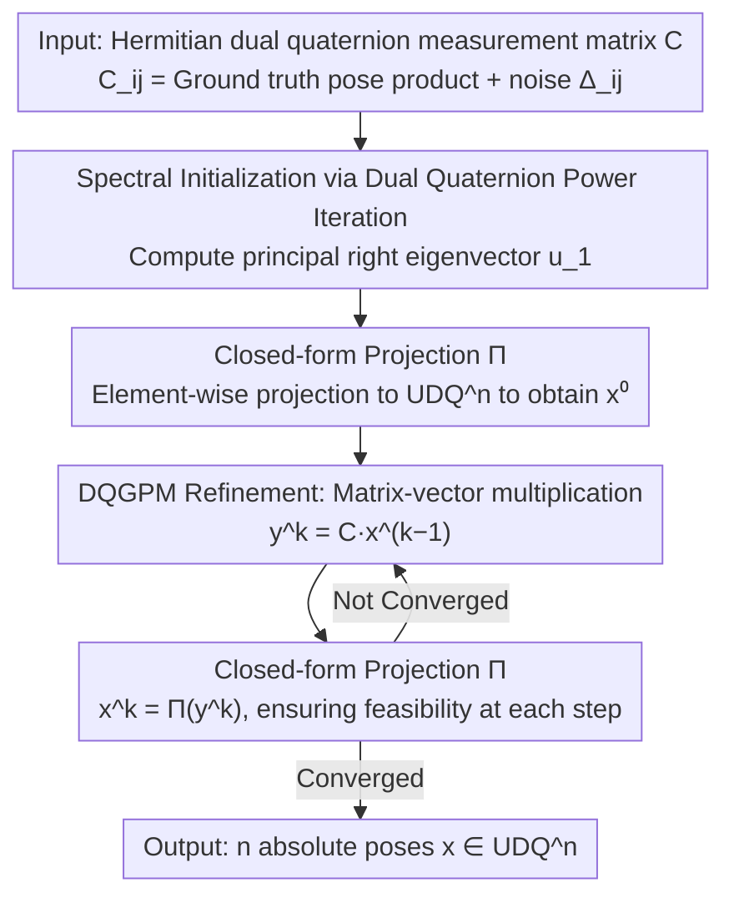

# Dual Quaternion SE(3) Synchronization with Recovery Guarantees

**Conference**: ICML 2026  
**arXiv**: [2602.00324](https://arxiv.org/abs/2602.00324)  
**Code**: https://github.com/jnzhao333/dq_sync  
**Area**: 3D Vision / Optimization / Pose Synchronization  
**Keywords**: SE(3) synchronization, dual quaternions, spectral methods, generalized power method, multi-scan point cloud registration  

## TL;DR
This paper parameterizes the SE(3) synchronization problem using Unit Dual Quaternions (UDQ) instead of $4\times4$ matrices. It calculates spectral initialization via power iteration on Hermitian dual quaternion matrices, followed by iterative refinement using the Dual Quaternion Generalized Power Method (DQGPM) with element-wise projection to $\mathrm{UDQ}^n$. It provides the first finite-step linear convergence and explicit error bounds for SE(3) synchronization, reducing both rotation/translation errors and computational time below those of matrix-based methods in multi-scan point cloud registration.

## Background & Motivation

**Background**: SE(3) synchronization—recovering absolute poses from a set of noisy relative poses $T_{ij}$—is a fundamental primitive for SLAM, multi-point cloud registration, and SfM. Mainstream approaches represent poses as $4\times4$ matrices, employing spectral relaxation (EIG), semidefinite relaxation (SDR), or Lie algebraic averaging/Riemannian optimization, followed by a final "rounding" step back to SE(3).

**Limitations of Prior Work**: Matrix representations suffer from a structural **representation gap**. When using complex numbers for $\mathrm{SO}(2)$, the isometry group of the eigenspace is exactly $\mathrm{SO}(2)$, and rounding simplifies to normalization. For $\mathrm{SO}(d)$ matrix representations, the isometry group is $\mathrm{O}(d)$, introducing a mild reflection ambiguity solvable via SVD. However, for SE(3), since $\mathrm{SE}(3)=\mathrm{SO}(3)\ltimes\mathbb{R}^3$ is **non-compact** while the relaxed eigenspace geometry is compact and orthogonal, the relaxed solution deviates significantly from the manifold. Rounding becomes an "imposition of structure" rather than "error correction," necessitating multi-step heuristics (splitting rotation/translation and projecting separately) that are unstable and difficult to analyze.

**Key Challenge**: The goal is to select a parameterization such that the **ambiguity group of the spectral relaxation aligns exactly with the global gauge symmetry of SE(3)**, ensuring that rounding acts as a benign projection. Dual quaternions provide this alignment—Unit Dual Quaternions ($\mathrm{UDQ}$) form a compact 7D manifold encoding both rotation and translation, and the eigenstructure of Hermitian dual quaternion matrices matches the gauge symmetry of SE(3) synchronization.

**Goal**: (1) Formalize SE(3) synchronization as a QPQC over $\mathrm{UDQ}^n$; (2) Design a two-stage algorithm with theoretical guarantees—spectral initialization followed by iterative refinement; (3) Provide finite-step convergence and explicit noise-dependent error bounds.

**Key Insight**: The authors observe that while dual quaternions $\mathbb{DH}$ form a ring with zero divisors (not a field), where magnitudes are dual-valued pseudo-norms and principal eigenpairs must be defined lexicographically, classic synchronization theory can be adapted if: (a) the normalization map $\mathcal{N}(\cdot)$ on $\mathrm{UDQ}$ is expressed in closed form and proven to be Lipschitz; (b) errors are controlled using the "primal part + dual part" of dual numbers, allowing the porting of the spectral + GPM analysis framework from the matrix case.

**Core Idea**: Represent each pose as a unit dual quaternion $x_i \in \mathrm{UDQ}$ and solve $\min_{\bm{x}\in\mathrm{UDQ}^n}\|\bm{C}-\bm{x}\bm{x}^*\|_F^2$. Spectral initialization is obtained via dual quaternion power iteration on the Hermitian DQ matrix $\bm{C}$, followed by refinement using the Dual Quaternion Generalized Power Method (DQGPM) with step-wise projection to $\mathrm{UDQ}^n$. This ensures every iterate is feasible and facilitates proof of linear convergence to an error floor of $O(\|\bm{\Delta}\hat{\bm{x}}\|_2/n)$.

## Method

### Overall Architecture
The input is a Hermitian dual quaternion measurement matrix $\bm{C}\in\mathbb{DH}^{n\times n}$, where $C_{ij}=\hat{x}_i\hat{x}_j^*+\Delta_{ij}$ and $\Delta_{ij}$ represents observation noise. The output consists of $n$ absolute pose estimates $\bm{x}\in\mathrm{UDQ}^n$. The pipeline consists of two stages:

1. **Spectral Initialization** (Algorithm 1): Power iteration on $\bm{C}$ yields the principal eigenvector $\bm{u}_1\in\mathbb{DH}^n$ (subject to $\|\bm{u}_1\|_2^2=n$), followed by element-wise projection $\bm{x}^0=\Pi(\bm{u}_1)\in\mathrm{UDQ}^n$;
2. **DQGPM Refinement** (Algorithm 2): Each step involves matrix-vector multiplication $\bm{y}^k=\bm{C}\bm{x}^{k-1}$, followed by projection $\bm{x}^k=\Pi(\bm{y}^k)$, iterating until convergence.

The problem is formulated as a QPQC: $\arg\max_{\bm{x}\in\mathrm{UDQ}^n} \bm{x}^*\bm{C}\bm{x}$ (Proposition 2.1 proves equivalence to the original least squares with a constant factor of 2). Relaxing $\mathrm{UDQ}^n$ to a dual quaternion sphere $\|\bm{x}\|_2^2=n$ yields the principal right eigenvector $\bm{u}_1$ of $\bm{C}$ as the optimal solution, forming the basis for spectral estimation. The unified operator throughout both stages is the closed-form projection $\Pi$, which transforms "heuristic rounding" into an analytically tractable single step.

### Key Designs

**1. Closed-form Projection $\Pi:\mathbb{DH}^n\to\mathrm{UDQ}^n$ and Lipschitz Property of $\mathcal{N}(\cdot)$**

Matrix rounding involves a sequence of heuristics—SVD for rotation, centroid calculation, then translation adjustment—lacking an analytical form. This paper replaces it with a controllable operator. Single-point normalization $\mathcal{N}(x)$ is defined: for a non-zero primal part $x_{\mathrm{st}}$, $u_{\mathrm{st}}=x_{\mathrm{st}}/|x_{\mathrm{st}}|$, and the dual part is $u_{\mathcal{I}}=x_{\mathcal{I}}/|x_{\mathrm{st}}| - (x_{\mathrm{st}}/|x_{\mathrm{st}}|)\cdot\mathrm{sc}(x_{\mathrm{st}}^*/|x_{\mathrm{st}}|\cdot x_{\mathcal{I}}/|x_{\mathrm{st}}|)$. This step explicitly removes the component of the dual part "parallel" to the primal part, corresponding to the projection of translation onto the rotation direction in SE(3). Lemma 2.5 establishes $|\mathcal{N}(y)-z|\le 2|y-z|$, meaning the distance to any feasible point is magnified by at most 2. This Lipschitz property translates the spectral solution error bound $4\|\bm{\Delta}\|_{\mathrm{op}}/\sqrt{n}$ (Proposition 2.4) into $8\|\bm{\Delta}\|_{\mathrm{op}}/\sqrt{n}$ after projection (Theorem 2.8).

**2. Dual Quaternion Power Iteration for Spectral Initialization**

Relaxing the QPQC to the sphere $\|\bm{x}\|_2^2=n$ allows the optimal solution to be found via the principal right eigenvector. The iteration $\bm{y}^k=\bm{C}\bm{w}^{k-1},\ \bm{w}^k=\bm{y}^k\cdot(\|\bm{y}^k\|_2)^{-1}$ is well-defined provided $\lambda_{1,\mathrm{st}}\neq 0$ and the initial primal part is not orthogonal to the principal eigenvector. The convergence rate is controlled by $r=|\lambda_{1,\mathrm{st}}/\lambda_{2,\mathrm{st}}|>1$. Challenges involving zero divisors in the dual quaternion ring are circumvented by a layered analysis—the primal part drives convergence, while the dual part follows the primal part. Proposition 2.4 provides a nonasymptotic bound $\mathrm{d}(\bm{x},\hat{\bm{x}})\le 4\|\bm{\Delta}\|_{\mathrm{op}}/\sqrt{n}$ under operator norm noise.

**3. DQGPM: Feasible Generalized Power Method with Finite-step Convergence**

Starting from the spectral initialization, DQGPM alternates between $\bm{y}^k=\bm{C}\bm{x}^{k-1}$ and $\bm{x}^k=\Pi(\bm{y}^k)$. Every $\bm{x}^k$ is automatically "stop-anytime feasible" on $\mathrm{UDQ}^n$. This extends GPM (Journée et al. 2010) to dual quaternions. Theorem 3.2 proves that when noise $\|\bm{\Delta}\|_{\mathrm{op},\mathrm{st}}\le n/350$, the primal part error contracts linearly as $\mathrm{d}_{\mathrm{st}}(\bm{x}^k,\hat{\bm{x}})\le (1/10)^k\cdot\sqrt{n}/25 + (700/53n)\|(\bm{\Delta}\hat{\bm{x}})_{\mathrm{st}}\|_2$. The non-compactness of SE(3) and pseudo-norm issues are bypassed by using Euclidean metrics for the primal part and a coupling inequality for the dual part. The final $O(\|\bm{\Delta}\hat{\bm{x}}\|_2/n)$ floor of DQGPM is tighter than the spectral $O(\|\bm{\Delta}\|_{\mathrm{op}}/\sqrt{n})$ by a factor of $\sqrt{n}$, explaining its superior precision in sparse observation scenarios.

### Loss & Training
The method is an iterative algorithm rather than a learning-based approach. The stopping criterion is based on the threshold $\|\bm{x}^k-\bm{x}^{k-1}\|_2$. The number of power iteration steps $K_{\mathrm{init}}$ is estimated via the explicit lower bound given in Corollary 3.4.

## Key Experimental Results

### Main Results
Synthetic Data: $n$ nodes, relative poses observed on an ER graph (edge probability $p$) with i.i.d. Hermitian dual quaternion noise (translation $\sigma_t$, rotation $\sigma_r$). Baselines: EIG (Arrigoni 2016b), SPEC (Doherty 2022), SDR (Rosen 2019).

| Setting (Noise / Sparsity) | Error_r (DQGPM) | Error_r (SPEC) | Error_r (EIG) | Error_t (DQGPM) | Error_t (SPEC) | Error_t (EIG) |
|---|---|---|---|---|---|---|
| (0.05, 5°), p=0.05 | **0.132 ± 0.042** | 1.639 ± 1.971 | 0.174 ± 0.156 | **0.102 ± 0.032** | 0.480 ± 0.530 | 0.551 ± 1.109 |
| (0.20, 20°), p=0.05 | **0.424 ± 0.060** | 2.035 ± 1.823 | 0.585 ± 0.572 | **0.369 ± 0.078** | 0.660 ± 0.455 | 1.043 ± 1.359 |
| (0.05, 5°), p=0.30 | **0.027 ± 0.001** | 0.032 ± 0.013 | 0.098 ± 0.618 | **0.021 ± 0.001** | 0.023 ± 0.001 | 0.137 ± 0.441 |
| (0.20, 20°), p=0.30 | **0.111 ± 0.005** | 0.141 ± 0.126 | 0.219 ± 0.613 | **0.085 ± 0.005** | 0.090 ± 0.005 | 0.194 ± 0.257 |

Under sparse observations ($p=0.05$), DQGPM's rotation error is roughly 1/10th of SPEC and 1/3rd of EIG, with similar order-of-magnitude advantages in translation. SDR was excluded due to poor scalability.

### Multi-scan Point Cloud Registration (Real Data)

| Dataset (sparse) | Missing | DQGPM Time (s) | DQGPM Err | Best Baseline |
|---|---|---|---|---|
| Bunny | 48.00% | 0.0010 | Best | EIG/SDR are 1-2 orders slower |
| Buddha | 66.67% | 0.0021 | Best | ... |
| Dragon | 60.44% | 0.0014 | Best | ... |
| Armadillo | 58.33% | — | Best | ... |

On four Stanford datasets, DQGPM achieved the lowest errors in both sparse and dense settings, with single iterations in the ms range—significantly faster than SDR-based SE-Sync.

### Key Findings
- **Sparse observations highlight the difference**: At $p=0.05$, SPEC degrades toward random, while DQGPM remains robust, confirming that the "rounding gap" in dual quaternion representation is minimal when data is scarce.
- **Error floor matches theory**: DQGPM's $O(\|\bm{\Delta}\hat{\bm{x}}\|_2/n)$ floor is $\sqrt{n}$ tighter than spectral estimation, becoming most evident in dense, large $n$ settings.
- **Efficiency through "No SDP"**: DQGPM only requires dual quaternion matrix-vector products and element-wise projections ($O(n^2)$), whereas SDR scales poorly ($O(n^3)$ or worse) due to PSD cone programming.

## Highlights & Insights
- **Representation Alignment**: The "feature space-sync problem" gap analysis explains why matrix methods inherently require "patches" for SE(3), while dual quaternions are a natural fit.
- **Closed-form Projection as a Pivot**: Lemma 2.5 elevates projection from a heuristic to an analytically tractable operator, showing that projected error is strictly bounded.
- **"Primal Leads, Dual Follows"**: This technique allows handling of iteratively updated dual numbers by decoupling the non-compact translational part, bypassing the pseudo-norm issue.
- **First SE(3) Finite-step Guarantee**: Unlike previous GPM-like methods providing only asymptotic results, this paper gives explicit bounds on error after $k$ steps.

## Limitations & Future Work
- **Strict Noise Constants**: The requirement $\|\bm{\Delta}\|_{\mathrm{op},\mathrm{st}}\le n/350$ is tighter than typical $\mathrm{SO}(d)$ bounds ($n/100$), though experiments suggest the method works under larger noise.
- **Heteroscedastic Noise**: The analysis assumes i.i.d. noise, whereas SLAM noise is often trajectory-dependent.
- **GPU Implementation**: Despite being $O(n^2)$, operations are currently on CPU due to lack of standard dual quaternion CUDA kernels.
- **Outliers**: The current framework handles Gaussian noise but lacks dedicated handling for gross outliers (e.g., truncated least squares).

## Related Work & Insights
- **vs SE-Sync (Rosen 2019)**: DQGPM avoids the $O(n^3)$ complexity of SDP verification and offers better accuracy in sparse settings.
- **vs SPEC (Doherty 2022)**: Confirms that matrix-based representation gaps are fatal under sparse observations.
- **vs Cheng et al. (2016)**: Previous dual quaternion sync works were heuristic; this is the first rigorous theoretical analysis.
- **vs Zhao et al. (2026)**: While contemporary works use anchoring to handle matrix ambiguities, this work eliminates the ambiguity fundamentally via dual quaternions.

## Rating
- Novelty: ⭐⭐⭐⭐⭐ 
- Experimental Thoroughness: ⭐⭐⭐⭐ 
- Writing Quality: ⭐⭐⭐⭐ 
- Value: ⭐⭐⭐⭐⭐ 

<!-- RELATED:START -->

## Related Papers

- [\[ICLR 2026\] Statistical Guarantees for Offline Domain Randomization](../../ICLR2026/robotics/statistical_guarantees_for_offline_domain_randomization.md)
- [\[ICML 2026\] Dual Advantage Fields](dual_advantage_fields.md)
- [\[CVPR 2026\] REACH: Explicit Recovery Behavior for Diffusion Policies](../../CVPR2026/robotics/reach_explicit_recovery_behavior_for_diffusion_policies.md)
- [\[ICML 2026\] Dual-Stream Diffusion for World-Model Augmented Vision-Language-Action Model](dual-stream_diffusion_for_world-model_augmented_vision-language-action_model.md)
- [\[ICLR 2026\] EquAct: An SE(3)-Equivariant Multi-Task Transformer for 3D Robotic Manipulation](../../ICLR2026/robotics/equact_an_se3-equivariant_multi-task_transformer_for_3d_robotic_manipulation.md)

<!-- RELATED:END -->
