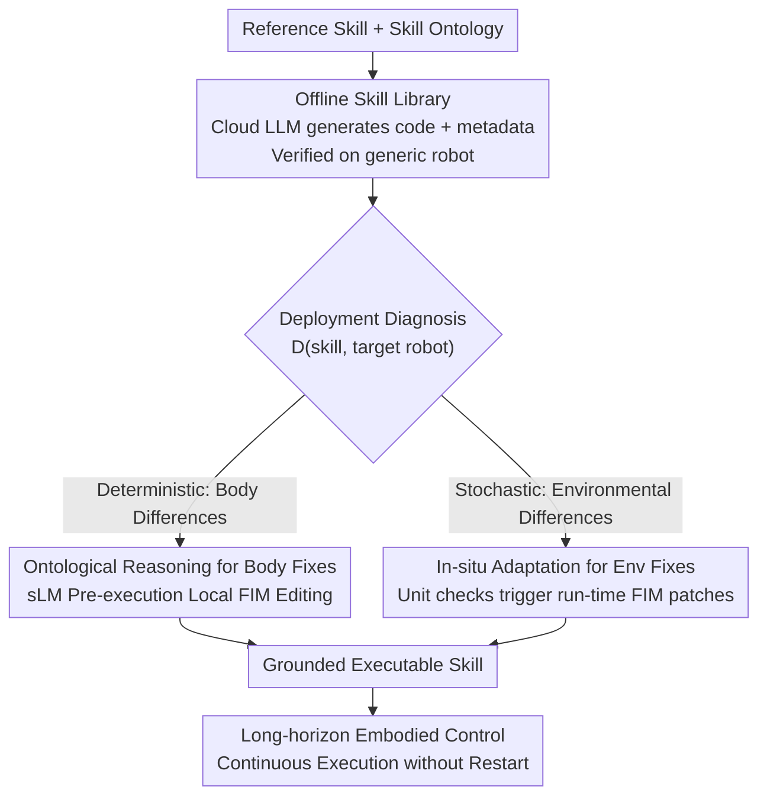

# Efficient Skill Grounding via Code Refactoring with Small Language Models

**Conference**: ICML2026  
**arXiv**: [2606.07999](https://arxiv.org/abs/2606.07999)  
**Code**: To be confirmed  
**Area**: Robotics / Embodied AI / Code-as-Policies  
**Keywords**: Skill Grounding, Code Refactoring, Small Language Models, Embodied Control, Ontological Reasoning

## TL;DR
RECENT enables robots to adapt to different morphologies (different arms or grippers) or dynamic environments without using Large Language Models (LLMs) to rewrite skill code from scratch. Instead, it decouples "semantic intent" from "execution binding" in executable code. A 7B Small Language Model (sLM) performs local refactoring via Fill-in-the-Middle (FIM) only on the execution binding lines—addressing morphological differences through ontological reasoning before deployment and environmental differences via in-situ patches during runtime. This achieves success rates close to GPT-5.2-Codex using only edge-side small models.

## Background & Motivation

**Background**: Recently, Code-as-Policies (CaP) has become popular in embodied control, where LLMs represent tasks as Python programs that invoke perception and motion APIs to compose skills. This approach is more flexible and compositional than fixed skill sets.

**Limitations of Prior Work**: A skill naturally couples "functional semantics (what to achieve)" with "executable components (how a specific robot implements it in a specific environment)." However, robots vary in morphology, actuation, and sensing, while environmental object properties and physical constraints also change. Consequently, skill executability is highly dependent on deployment conditions, making **direct cross-scenario reuse impossible**. Existing code-based methods, despite supporting test-time grounding, tend to **regenerate the entire skill implementation** rather than modifying only the deployment-specific components.

**Key Challenge**: Full regeneration is prohibitively expensive for compute-constrained edge devices where large model access isn't guaranteed and on-chip computation is required for grounding. Conversely, while Small Language Models (sLMs) offer fast inference, their limited reasoning capability makes generating full skills from scratch in dynamic environments unreliable. This creates a dilemma: "Efficiency requires sLMs, but sLMs cannot handle full regeneration."

**Goal**: Enable sLMs to perform efficient skill grounding while ensuring high success rates for long-horizon tasks, minimizing grounding overhead, and maintaining execution continuity (avoiding frequent interruptions).

**Key Insight**: The authors observe that skill grounding is expensive because "invariant semantic intent" and "deployment-related execution binding" are mixed and recomputed every time. By **explicitly decoupling** these two, grounding simplifies into light-weight editing of only the execution bindings.

**Core Idea**: Replace "full regeneration" with "local code refactoring." Skills are written as well-structured executable code where semantic intent is fixed within functional logic for reuse across bodies/environments, while execution bindings are isolated into local components for sLM-based FIM editing.

## Method

### Overall Architecture
The RECENT (refactoring-centric agent framework) consists of three phases. Before deployment, a cloud-based LLM guided by a **skill ontology** builds an **offline skill library**: each skill includes executable code and ontological metadata, verified for correctness on a generic robot (e.g., Franka Panda). This ensures that subsequent grounding only needs to resolve execution bindings rather than complex task semantics. During deployment, two pathways are used: morphological differences are **deterministic** and handled by **ontological reasoning** for pre-execution local code editing; environmental differences are **stochastic** and handled by **in-situ adaptation** using predictive patches on "unexecuted code segments." Both pathways utilize **Fill-in-the-Middle (FIM) local refactoring** instead of full rewriting.

Formally, the task is modeled as a POMDP $\tau=(\mathcal{S},\mathcal{A},\mathcal{G},T)$. The objective is to optimize the sLM policy $\pi_{\mathrm{sLM}}$ to maximize the success rate while minimizing grounding and execution costs:

$$\max_{\pi_{\mathrm{sLM}}}\mathbb{E}_{\tau\sim\mathcal{T}}\big[\mathrm{SR}(\pi_{\mathrm{sLM}},\tau)-\lambda\mathrm{C}_{\mathrm{gro}}(\pi_{\mathrm{sLM}},\tau;\mathcal{X})-\mu\mathrm{C}_{\mathrm{exe}}(\pi_{\mathrm{sLM}},\tau)\big]$$

where $\mathrm{C}_{\mathrm{gro}}$ is the grounding cost and $\mathrm{C}_{\mathrm{exe}}$ penalizes execution interruptions that break task continuity.

### Key Designs

**1. Skill Ontology + Offline Skill Library: Decoupling "Intent" and "Binding" at the Source**

This is the foundation of the method. RECENT uses a skill ontology as a logic knowledge base to explicitly encode: skill functional requirements (definition, preconditions, effects), robot body profiles (available primitive APIs, execution constraints), and their semantic relations (requires / provides / substitutable-by). A query operator $\mathcal{Q}(\chi,r)=\langle\mathcal{C}(\chi),\mathcal{P}(\chi),\mathcal{E}(\chi),\mathcal{I}(\chi,r)\rangle$ is defined to extract "robot-conditioned skill specifications": $\mathcal{C}$ denotes required capabilities/constraints, $\mathcal{P}$ denotes preconditions, $\mathcal{E}$ denotes effects, and $\mathcal{I}(\chi,r)$ is the primitive API interface inferred from the ontology to satisfy $\mathcal{C}$ given robot $r$. This serves as the "grounding contract" between abstract intent and embodied execution. Offline, $\mathcal{Q}(\chi,r^{\mathrm{src}})$ is queried for a reference robot $r^{\mathrm{src}}$, and a cloud LLM generates verifiable implementation $\tilde{\chi}$ with metadata. Only validated skills enter the library.

**2. Ontological Reasoning for Body Differences: Converting "Conflicts" into FIM Tasks**

When switching robots (e.g., Panda to UR5 or changing to a vacuum gripper), body capabilities are known pre-deployment. RECENT performs compatibility analysis: if the target $r^{\mathrm{tgt}}$ satisfies $\mathcal{C}(\chi)$, the skill is used directly. Otherwise, a diagnostic operator splits unsatisfied requirements into deterministic and stochastic conflicts $\mathcal{D}(\tilde{\chi},r^{\mathrm{tgt}})=\langle\Delta_{\mathrm{det}},\Delta_{\mathrm{und}}\rangle$. Deterministic conflicts $\Delta_{\mathrm{det}}$ are resolved via ontological derivations before execution. Each conflict is represented as a set of FIM tasks $\Delta_{\mathrm{det}}=\{(m_i,\kappa_i)\}_{i=1}^N$, where $m_i$ is the code segment to refactor and $\kappa_i$ is the substitution prompt. The sLM generates replacement $m_i'\leftarrow\pi_{\mathrm{sLM}}(\psi^{\mathrm{pre}}(m_i;\tilde{\chi}),\psi^{\mathrm{suf}}(m_i;\tilde{\chi}),\kappa_i)$ to be stitched back. The ontology-level comparison precisely targets what to change, allowing the sLM to focus on API calls or parameter tuning without touching the overall functional structure.

**3. In-situ Adaptation for Environmental Differences: Predictive Patching without Interruption**

Environmental factors (object properties, contact dynamics) are stochastic ($\Delta_{\mathrm{und}}$) and can only be resolved during runtime. RECENT attaches lightweight **autonomous unit tests** to each stochastic warning to monitor preconditions/effects of subsequent code using real-time observations. Crucially, these checks act on **unexecuted** code segments, allowing the system to anticipate potential violations before they occur. Once a check is violated, the factor is "determined" as an immediate patch target $u\xrightarrow{\,o_t\,}(m,o_t)$. The sLM generates a local patch $m'$ using FIM, modifying only the failing segment while preserving the execution context. This "predictive local patching" allows long-horizon skills to run continuously, bringing Execution Interruption (EI) close to zero.

## Key Experimental Results

Tasks were constructed in CoppeliaSim (kinematic differences: Panda→UR5/Sawyer) and Genesis (end-effector differences: Parallel→Robotiq/Vacuum), with tasks requiring up to 54 continuous API calls. Qwen2.5-Coder-7B was used as the sLM. Metrics: Success Rate (SR), Goal Completion (GC), Grounding Overhead (GO), Execution Interruption (EI), and Idle Time (IT).

### Main Results (Average of 5 Seeds)

| Method | Kin. SR | Kin. GO | Kin. EI | End. SR | End. GO | End. EI |
|------|----------|----------|----------|---------|---------|---------|
| CaP (sLM) | 17.00 | 102.01 | 4.72 | 21.97 | 79.31 | 3.18 |
| CaP-CodeV-R1 (Distilled sLM) | 20.00 | 109.38 | 4.13 | 17.88 | 99.16 | 2.77 |
| ProgPrompt | 31.50 | 86.47 | 3.28 | 33.33 | 65.34 | 4.72 |
| RepairAgent | 42.00 | 54.17 | 1.73 | 52.17 | 55.92 | 1.12 |
| **RECENT (Ours, sLM)** | **73.00** | **7.85** | **0.72** | **82.50** | **2.51** | **0.69** |
| CaP-Codex (GPT-5.2-Codex, LLM) | 67.50 | 84.29 | 1.23 | 74.85 | 41.69 | 0.60 |

### Table Comparison

| Opponent | SR | GO | EI | IT |
|------|----|----|----|----|
| vs. CaP-CodeV-R1 (Same-size sLM) | +58.81 pp | −99.09 pp | ≈0.71 times/task | −93.29% (rel.) |
| vs. CaP-Codex (GPT-5.2-Codex LLM) | −6.58 pp | −57.81 pp | −22.95% (mean) | −77.52% (mean) |

### Key Findings
- **Competitive with GPT-5.2-Codex using a 7B sLM**: The success rate is only 6.58 pp lower, but the grounding overhead (GO) is significantly reduced (by 57.81 pp), and execution continuity is superior. This indicates that "local refactoring" is more cost-effective than "full regeneration" under edge constraints.
- **Near-zero EI due to In-situ Adaptation**: RECENT averages only 0.69–0.72 interruptions per task, compared to 3–5 in CaP-based baselines. Predictive patching allows long-horizon tasks to complete without restarts.
- **Order-of-magnitude Compression of GO**: Compared to distilled sLM baselines, grounding overhead dropped by 99.09 pp, confirming that editing specific lines is vastly more efficient than regenerating entire scripts.

## Highlights & Insights
- **"Semantic Intent vs. Execution Binding" Decoupling + Ontological Contract**: Using an ontology to pinpoint "which lines to change" converts complex reasoning into a simple FIM completion task. This bypasses the weak reasoning of sLMs by substituting knowledge structure for raw compute—a strategy applicable to various edge-side code adaptation scenarios.
- **Deterministic/Stochastic Dichotomy**: Splitting deployment uncertainty into $\Delta_{\mathrm{det}}$ (ontological reasoning) and $\Delta_{\mathrm{und}}$ (in-situ) maps cleanly to "body vs. environment" differences, allowing for targeted pre-execution and run-time fixes.
- **Predictive Patching of Unexecuted Code**: Monitoring unit tests only for upcoming segments to fix violations before they happen is the key trick for achieving near-interruption-free execution.

## Limitations & Future Work
- **Reliance on Ontology Quality**: The requires/provides/substitutable-by relations and capability profiles require manual or LLM-based construction. If the ontology is incomplete, deterministic conflicts may become unsolvable.
- **Initial Construction Cost**: The offline library requires per-skill validation on a reference robot. Furthermore, local refactoring may struggle with entirely new body capabilities that lack mapping in the ontology.
- **Simulation Gap**: While tested in CoppeliaSim/Genesis, real-world noise and contact dynamics are far more challenging. Whether in-situ unit tests can reliably trigger and patches take effect in real-time remains to be validated on hardware.

## Related Work & Insights
- **vs. Code-as-Policies (CaP & variants)**: CaP maps instructions to API-calling programs but regenerates everything upon deployment changes. RECENT treats skills as structured code where grounding is reduced to local refactoring.
- **vs. Automated Program Repair (RepairAgent / Agentless)**: These methods are reactive and error-driven (repair after failure). RECENT is proactive—ontology locates body conflicts beforehand, and unit tests patch environmental issues before they cause failure.
- **vs. Parameterized Skill Grounding**: Parametric methods entangle task semantics and execution details in weights, requiring retraining for new conditions. RECENT uses code to explicitly decouple these, requiring only test-time editing.

## Rating
- Novelty: ⭐⭐⭐⭐⭐ The refactoring-centric perspective and the deterministic/stochastic dichotomy for skill grounding are highly original and clean.
- Experimental Thoroughness: ⭐⭐⭐⭐ Extensive comparison across body types and baselines with five metrics; however, limited to simulation benchmarks without real-world validation.
- Writing Quality: ⭐⭐⭐⭐⭐ Logical flow from the decoupling motivation to the dual-path grounding architecture is very clear.
- Value: ⭐⭐⭐⭐⭐ Enables sLMs to bridge the gap with LLMs for long-horizon embodied control, offering direct utility for edge robot deployment.

<!-- RELATED:START -->

## Related Papers

- [\[ICML 2026\] BEAR: Dissecting Embodied Abilities in Multimodal Language Models through Skill-level Evaluation and Diagnosis](dissecting_embodied_abilities_in_multimodal_language_models_through_skill-level_.md)
- [\[ICLR 2026\] VLM4VLA: Revisiting Vision-Language-Models in Vision-Language-Action Models](../../ICLR2026/robotics/vlm4vla_revisiting_vision-language-models_in_vision-language-action_models.md)
- [\[ICML 2025\] FOUNDER: Grounding Foundation Models in World Models for Open-Ended Embodied Decision Making](../../ICML2025/robotics/founder_grounding_foundation_models_in_world_models_for_open-ended_embodied_deci.md)
- [\[ICML 2026\] Functional Cache Grafting: Robust and Rapid Code-Policy Synthesis for Embodied Agents](functional_cache_grafting_robust_and_rapid_code-policy_synthesis_for_embodied_ag.md)
- [\[ICLR 2026\] TwinVLA: Data-Efficient Bimanual Manipulation with Twin Single-Arm Vision-Language-Action Models](../../ICLR2026/robotics/twinvla_data-efficient_bimanual_manipulation_with_twin_single-arm_vision-languag.md)

<!-- RELATED:END -->
## Related Papers

- [\[ICML 2026\] BEAR: Dissecting Embodied Abilities in Multimodal Language Models through Skill-level Evaluation and Diagnosis](dissecting_embodied_abilities_in_multimodal_language_models_through_skill-level_.md)
- [\[ICLR 2026\] TwinVLA: Data-Efficient Bimanual Manipulation with Twin Single-Arm Vision-Language-Action Models](../../ICLR2026/robotics/twinvla_data-efficient_bimanual_manipulation_with_twin_single-arm_vision-languag.md)
- [\[ICML 2025\] FOUNDER: Grounding Foundation Models in World Models for Open-Ended Embodied Decision Making](../../ICML2025/robotics/founder_grounding_foundation_models_in_world_models_for_open-ended_embodied_deci.md)
- [\[ICML 2026\] Functional Cache Grafting: Robust and Rapid Code-Policy Synthesis for Embodied Agents](functional_cache_grafting_robust_and_rapid_code-policy_synthesis_for_embodied_ag.md)
- [\[ICLR 2026\] From Spatial to Actions: Grounding Vision-Language-Action Model in Spatial Foundation Priors](../../ICLR2026/robotics/from_spatial_to_actions_grounding_vision-language-action_model_in_spatial_founda.md)

<!-- RELATED:END -->
