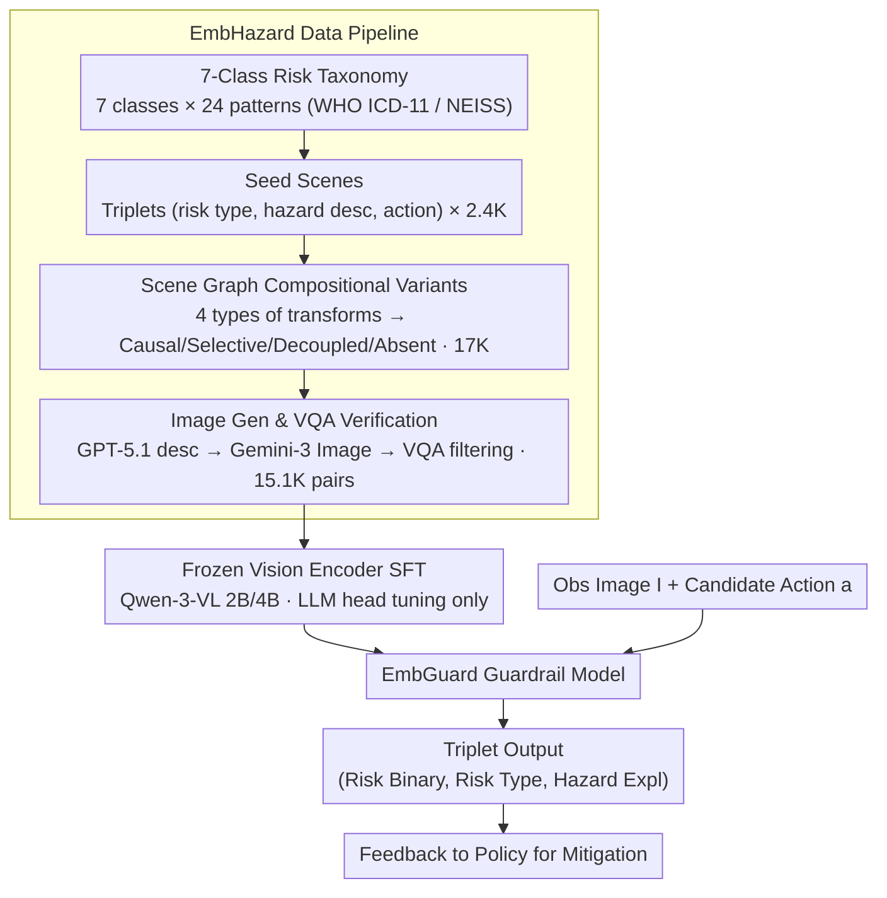

# EMBGuard: Constructing Hazard-Aware Guardrails for Safe Planning in Embodied Agents

**Conference**: ICML 2026  
**arXiv**: [2605.30924](https://arxiv.org/abs/2605.30924)  
**Code**: Data, models, and code are promised to be public  
**Area**: Embodied AI / AI Safety / Multimodal VLM  
**Keywords**: Embodied agent, Safety guardrail, Action-conditioned risk, Synthetic data, MLLM

## TL;DR
EmbGuard decouples "physical safety judgment for embodied agents" from the policy into an independent, lightweight guardrail model. It takes (observation image, candidate action) as input and outputs (risk binary, risk category, hazard explanation). With only 2B/4B parameters, it matches the performance of GPT-5.1/Gemini-2.5-Pro while significantly suppressing the "over-conservative false positive" issues prevalent in baseline models.

## Background & Motivation

**Background**: MLLMs (PaLM-E, RT, CogAct, GR00T, etc.) are increasingly capable of performing long-horizon physical tasks, but they typically delegate safety reasoning to the same policy model responsible for task execution.

**Limitations of Prior Work**: Consolidating safety and task execution into a single large policy model leads to a "lose-lose" situation: the model either focuses on the task and ignores risks (false negatives) or becomes overly conservative and refuses tasks at the slightest hint of danger (false positives). Data from IS-Bench shows that strong models like Gemini-2.5-Pro misclassify 83.3% of benign scenarios as hazardous.

**Key Challenge**: (i) Physical risk arises neither from the "environment alone" nor the "action alone," but from their **interaction**—a plant pot placed above a power strip is not inherently dangerous; only "watering the plant" creates a hazard. (ii) MLLM visual priors favor perceptually salient hazards (fire, electricity, sharp objects) while systematically failing to detect risks like crushing, contamination, or chemical exposure that require causal or temporal reasoning. (iii) Offloading safety reasoning to increasingly large policy models is expensive and introduces latency unsuitable for real-time control.

**Goal**: (1) Decouple safety reasoning from the policy into an independent guardrail module; (2) Enable fine-grained judgment of "action-conditioned physical risks" (binary + category + natural language explanation); (3) Maintain high accuracy while suppressing false positives in a model small enough for real-time deployment.

**Key Insight**: The authors model the task as a function $\mathcal{R}:(I,a)\to(r_{\text{bin}},r_{\text{type}},h)$ that maps (image $I$, action $a$) to (risk binary $r_{\text{bin}}$, risk type $r_{\text{type}}$, hazard description $h$). They employ a three-stage synthetic pipeline (Manual + GPT-5.1 + Gemini 3 Image) to generate large-scale (image, action) paired data, enabling small models to learn causal intuitions of "action-triggered risks" through data diversity rather than parameter scaling.

**Core Idea**: Use scene graphs as a controllable structural representation of hazards. By applying four types of compositional variants (causal risky / selective risky / decoupled benign / absent benign), they generate 15.1K training samples to fine-tune 2B/4B Qwen-3-VL models into specialized guardrails.

## Method

### Overall Architecture
EmbGuard consists of (i) a data generation pipeline, (ii) an SFT phase, and (iii) an inference-time guardrail module:

1.  **Data Pipeline**: Risk-driven scene generation → Compositional variant diversification → Image generation and VQA verification. This produces the EmbHazard training set (15.1K (image, action) pairs / 8.7K images) and EmbGuardTest (329 real-world scenes with manual annotations).
2.  **Training**: SFT on Qwen-3-VL-2B/4B using EmbHazard for 4 epochs (lr=1e-5, 8×A6000), with the vision encoder frozen.
3.  **Inference**: The guardrail is integrated into the embodied agent's planning loop. At each step, it queries EmbGuard with (observation, candidate action) and feeds the output (safe/unsafe, risk_type, hazard_description) back to the policy.

### Key Designs

**1. Risk-Decoupled Task Formulation + 7-Class Taxonomy: Explicitly separating "Safety vs. Task" and constraining multi-granularity output.**

Consolidating safety into the policy often fails because it conflates "whether to block," "what to block," and "why to block." EmbGuard defines a function $\mathcal{R}:(I,a)\to(r_{\text{bin}}\in\{0,1\},\ r_{\text{type}},\ h)$. The risk category $r_{\text{type}}$ is constrained to 7 classes (Fire / Electrical / Slip-Trip-Fall / Cut-Sharp / Crush-Pinch / Contamination / Chemical-Toxic Exposure) derived from WHO ICD-11 and CPSC NEISS databases, with 24 risk-inducing patterns per class. The hazard explanation $h$ is free-form text, facilitating migration to unseen object combinations. Evaluation is hierarchical: Potential Risk Acc → Risk Type Acc → Hazard Acc, where the latter two are conditioned on correct $r_{\text{bin}}$ results to prevent "correct guess with wrong reasoning."

This hierarchy allows the policy to fallback even with partial information. Experiments confirm the necessity of all three: when both risk_type and hazard are correct, the mitigation alignment rate is 90.4%, but it drops to 28.4% when both are incorrect.

**2. Scene Graph-Based Compositional Variant Generation: Counterfactual pairing at the structural layer to distinguish "action-triggered risk" from simple "visual hazard detection."**

Physical risk stems from the interaction between environment and action. To teach this, counterfactual pairs are essential. EmbGuard represents each hazard as a subgraph in a scene graph (e.g., (power_strip, beneath, plant_pot)). Four transformations are then applied: scene augmentation (adding irrelevant objects), hazard addition (introducing new hazards for Selective Risky samples), action modification (changing the action to break the interaction for Decoupled Benign samples), and hazard removal (deleting the hazard for Absent Benign samples). Processing 2.4K seed scenes through these transforms yields ~17K augmented scenes.

Operating at the graph layer instead of the text layer is critical—direct prompt modification often inadvertently destroys key spatial relationships. The counterfactuals "hazard exists but action is safe" (Decoupled Benign) and "hazard absent so action is safe" (Absent Benign) serve as the core supervisory signals to eliminate over-conservative bias.

**3. Image Generation + VQA Verification Loop: Mapping scene graphs to high-fidelity images and filtering out samples with lost spatial relationships.**

Since the guardrail input is real images, every scene graph variant must be rendered as a photo-realistic image. The pipeline uses GPT-5.1 to convert scene graph variants into text descriptions, which are then fed to Gemini-3-pro-image-preview. However, generative models do not guarantee that spatial relations (e.g., "power strip beneath the pot") are correctly visualised. To ensure the counterfactual supervisory signal remains valid, a VQA filter is introduced. Validation questions are automatically generated from the edges of the hazard subgraph $\mathcal{H}$, and GPT-5.1 checks if the generated image preserves these critical relationships.

This loop ensures that compositional variants are functionally counterfactual rather than just nominal. The final dataset includes 15.1K (image, action) pairs and 8.7K images (7.8K risky / 7.3K benign).

**4. SFT with Frozen Vision Encoder: Dedicating small model capacity to causal reasoning rather than re-learning vision.**

During SFT of Qwen-3-VL-2B/4B, a key trick is **freezing the vision encoder**. Ablations revealed a counter-intuitive finding: unfreezing the ViT improved risk binary detection but caused hazard explanation quality to collapse. Small models lack the capacity to simultaneously adapt visual features and complex reasoning. Treating visual capabilities as a "borrowed sensor" while tasking the LLM head only with risk causality is a reusable strategy for small-model multi-tasking.

### Loss & Training
Standard multi-task SFT is used with a single generative loss (outputting a JSON triplet). No auxiliary losses are required. At evaluation, GPT-4o-as-judge is used to score the free-text hazard descriptions (achieving agreement with humans at $\kappa=0.90$).

## Key Experimental Results

### Main Results
Evaluation on EmbGuardTest (329 real samples) and a Held-out set (563 synthetic samples) comparing 11 open-source MLLMs, 4 closed-source MLLMs, and EmbGuard-2B/4B. Metrics: (Potential Risk Acc / Risk Type Acc / Hazard Acc).

| Model | Scale | EmbGuardTest | Held-out | Remarks |
| :--- | :--- | :--- | :--- | :--- |
| Qwen-3-VL-2B (Base) | 2B | 47.2 / 37.5 / 5.9 | 59.4 / 32.5 / 27.4 | Same-size baseline |
| EmbGuard-2B | 2B | 51.6 / 44.6 / 7.4 | 68.3 / 59.5 / 36.6 | Outperforms base everywhere |
| Qwen-3-VL-4B (Base) | 4B | 47.3 / 51.0 / 10.5 | 58.3 / 53.5 / 48.6 | Same-size baseline |
| EmbGuard-4B | 4B | 54.3 / 50.3 / 14.6 | 71.2 / 67.6 / 50.1 | Approaches GPT-5.1 |
| GPT-5.1 | Closed | 55.8 / 58.1 / 33.4 | 69.1 / 62.0 / 57.0 | Strongest commercial model |
| Gemini-2.5-Pro | Closed | 58.4 / 56.8 / 29.3 | 61.4 / 68.3 / 63.8 | High recall, high false positives |
| Qwen-3-VL-235B | 235B | 49.5 / 56.4 / 26.7 | 71.3 / 60.0 / 51.2 | 100× more parameters |

Inference latency: EmbGuard-2B 0.535s/sample, EmbGuard-4B 0.719s/sample (on a single RTX 6000 Ada), suitable for real-time loops.

### Ablation Study

| Experiment | Key Metric | Insight |
| :--- | :--- | :--- |
| Human vs MLLM (Subset) | Human 85.6 / 90.9 / 63.6 vs GPT-5.1 55.5 / 42.0 / 31.9 | Humans lead significantly; large headroom for models. |
| IS-Bench Step Acc / Prec / Rec / F1 | EmbGuard-4B 63.1 / 25.7 / 71.7 / 38.3, Gemini-2.5-Pro 49.9 / 22.2 / 88.2 / 40.7 | Gemini has high recall but low precision; EmbGuard has highest step acc. |
| Mitigation Alignment | Both correct: 90.4% → risk type wrong: 78.5% → hazard wrong: 58.6% → both wrong: 28.4% | Explains why fine-grained output is necessary for correct mitigation. |
| Over-conservative bias | Gemini-2.5-Pro misclassifies 83.3% benign as risky | Explains the low precision of baselines on IS-Bench. |

### Key Findings
- **Data diversity beats scale**: EmbGuard 2B/4B outperforms same-sized Qwen/InternVL/Gemma and rivals GPT-5.1/Gemini-2.5-Pro on EmbGuardTest (Potential Risk difference within 1–4 points).
- **Correcting perceptual bias**: Baseline models are hyper-sensitive to "perceptually salient" risks (fire/electricity) but blind to "causal" risks (crush/chem). EmbGuard balances this via the 7-class taxonomy and counterfactual variants.
- **Recall isn't everything**: On IS-Bench, Gemini-2.5-Pro achieves 88.2% recall but only 49.9% step accuracy because it frequently interrupts the policy with meaningless "safe-step" detections. EmbGuard is more selective.
- **Explanation remains a bottleneck**: Even the best closed-source MLLM achieved only 33.4% Hazard Acc (vs. 63.6% for Humans), indicating that explaining "why" a situation is dangerous remains an open challenge.

## Highlights & Insights
- The architectural choice to "decouple safety from policy into a guardrail" is the core thesis, successfully migrating the LlamaGuard/ShieldAgent paradigm from pure LLMs to embodied physical safety.
- Generating counterfactual variants at the scene graph level prevents the random destruction of spatial relationships common in text-only prompt engineering.
- The "counter-intuitive" discovery regarding frozen vision encoders (unfreezing hurts explanation quality) is a valuable takeaway for any researcher performing multi-task SFT on small VLMs.
- The mitigation alignment experiment closes the loop on the guardrail's value: reporting "danger" is insufficient; only correct risk types and hazards lead to successful mitigation actions.

## Limitations & Future Work
- **Visual sensor coverage assumption**: The guardrail assumes the input image contains all necessary information. It cannot detect hazards outside the FOV (e.g., an open flame behind the robot) or caused by occlusions and noise.
- **Continuous control policy**: Currently, the guardrail accepts text-level action descriptions. Accessing VLA-style models that output continuous joint torques is listed as future work.
- **Lack of hardware validation**: All evaluations were performed in OmniGibson/IS-Bench simulations or on static images; no real-world robot deployment was conducted.
- **Taxonomy limits**: While derived from ICD-11/NEISS, the 7-class system may miss niche risks such as specific chemical reactions in industrial settings.

## Related Work & Insights
- **vs. IS-Bench (2025)**: IS-Bench provides environments to test if agents plan safely but does not provide the guardrail models themselves. EmbGuard serves as the implementation side of the "active hazard avoidance mechanism" envisioned by IS-Bench.
- **vs. LlamaGuard / ShieldAgent**: These target text/video/digital agents. EmbGuard is the first to bring this architecture to physical embodiment, adding "action-conditioning" and "visual hazard" dimensions.
- **vs. Safety-Aware Planning (Khan 2025, etc.)**: Those works modify the planner to be risk-aware; EmbGuard advocates for a modular approach where the planner remains unchanged and is monitored by an external guardrail.

## Rating
- **Novelty**: ⭐⭐⭐⭐ First dedicated physical safety guardrail for embodied AI; novel data pipeline and task formulation.
- **Experimental Thoroughness**: ⭐⭐⭐⭐ Comprehensive baselines (11+4), dual test sets, IS-Bench validation, and human baselines. Minor deduction for lack of real-world hardware tests.
- **Writing Quality**: ⭐⭐⭐⭐ Very clear logical progression, specifically in the counterfactual definitions and hierarchical metric analysis.
- **Value**: ⭐⭐⭐⭐⭐ Public dataset (15.1K training + 329 test) and efficient 2B/4B models provide immediate infrastructure for the embodied safety community.

<!-- RELATED:START -->

## Related Papers

- [\[ICLR 2026\] REI-Bench: Can Embodied Agents Understand Vague Human Instructions in Task Planning?](../../ICLR2026/robotics/rei-bench_can_embodied_agents_understand_vague_human_instructions_in_task_planni.md)
- [\[ICML 2026\] Drift is a Sampling Error: SNR-Aware Power Distributions for Long-Horizon Robotic Planning](drift_is_a_sampling_error_snr-aware_power_distributions_for_long-horizon_robotic.md)
- [\[ICML 2026\] Embodied Task Planning via Graph-Informed Action Generation with Large Language Models](embodied_task_planning_via_graph-informed_action_generation_with_large_language_.md)
- [\[CVPR 2026\] AGENTSAFE: Benchmarking the Safety of Embodied Agents on Hazardous Instructions](../../CVPR2026/robotics/agentsafe_benchmarking_the_safety_of_embodied_agents_on_hazardous_instructions.md)
- [\[ICLR 2026\] OmniEVA: Embodied Versatile Planner via Task-Adaptive 3D-Grounded and Embodiment-aware Reasoning](../../ICLR2026/robotics/omnieva_embodied_versatile_planner_via_task-adaptive_3d-grounded_and_embodiment-.md)

<!-- RELATED:END -->
