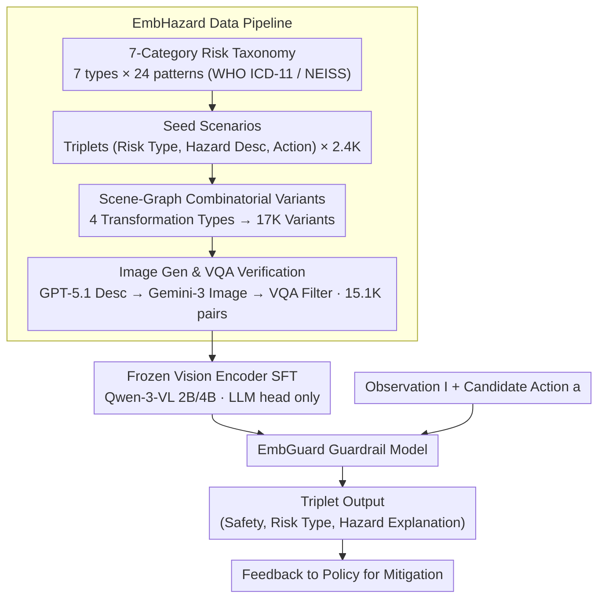

# EMBGuard: Constructing Hazard-Aware Guardrails for Safe Planning in Embodied Agents

**Conference**: ICML 2026  
**arXiv**: [2605.30924](https://arxiv.org/abs/2605.30924)  
**Code**: Code/data/models promised to be public  
**Area**: Embodied AI / AI Safety / Multi-modal VLM  
**Keywords**: Embodied agent, Safety guardrail, Action-conditioned risk, Synthetic data, MLLM

## TL;DR
EmbGuard decouples "physical safety judgment of embodied agents" from the policy into an independent small guardrail model. It takes (observation image, candidate action) as input and outputs (safety status, risk category, hazard explanation). With 2B/4B parameters, it matches the performance of GPT-5.1/Gemini-2.5-Pro while significantly suppressing the "over-conservative false positive" issues prevalent in baselines.

## Background & Motivation

**Background**: MLLM-driven embodied agents (such as PaLM-E, RT, CogAct, and GR00T) have demonstrated the capability to perform long-horizon physical tasks, but they typically delegate safety reasoning to the same policy model.

**Limitations of Prior Work**: Cramming both safety and task execution into the same large policy results in sub-optimal performance for both: either it focuses on the task and ignores risks (false negatives), or it becomes overly conservative and fails when encountering any minor potential hazard (false positives). Data from IS-Bench shows that strong models like Gemini-2.5-Pro misjudge 83.3% of benign scenarios as dangerous.

**Key Challenge**: (i) Physical risk does not stem solely from the "environment" or the "action," but from their **interaction**—placing a potted plant above a power socket is not inherently dangerous; "watering the plant" is. (ii) MLLM visual priors favor perceptually salient hazards like fire, electricity, or sharp objects, while systematically missing risks like crushing, contamination, or chemical exposure that require causal or temporal reasoning. (iii) Offloading safety reasoning to increasingly larger policy models is both expensive and introduces excessive latency for real-time control.

**Goal**: (1) Decouple safety reasoning from the policy into an independent guardrail module; (2) Enable fine-grained judgment of "action-conditioned physical risk" (binary indicator + category + natural language explanation); (3) Maintain high precision while reducing false positives in a model small enough for real-time deployment.

**Key Insight**: The authors model the task as a function $\mathcal{R}:(I,a)\to(r_{\text{bin}},r_{\text{type}},h)$ that outputs a risk binary $r_{\text{bin}}$, risk type $r_{\text{type}}$, and hazard description $h$ based on image $I$ and action $a$. By utilizing a three-stage synthesis (manual + GPT-5.1 + Gemini 3 Image), they generate large-scale paired (image, action) data, allowing a small model to learn causal intuitions regarding "action-triggered risks" through data diversity rather than parameter scale.

**Core Idea**: Use scene graphs as controllable structural representations for hazards and expand them into combinatorial variants across four categories (Causal Risky / Selective Risky / Dec耦led Benign / Absent Benign). This generates 15.1K training samples to fine-tune 2B/4B Qwen-3-VL models into specialized guardrails.

## Method

### Overall Architecture
EmbGuard consists of (i) a data generation pipeline, (ii) an SFT phase, and (iii) an inference-time guardrail module:

1.  **Data Pipeline**: Risk-driven scenario generation → Combinatorial variant diversification → Image generation and VQA verification. This produces the EmbHazard training set (15.1K image-action pairs / 8.7K images) and the EmbGuardTest (329 manually annotated real-world scenarios).
2.  **Training**: SFT on Qwen-3-VL-2B/4B using EmbHazard for 4 epochs with $lr=1e-5$ on 8×A6000 GPUs; the vision encoder is frozen.
3.  **Mechanism**: The guardrail is integrated into the embodied agent's planning loop. For each step, it queries EmbGuard with (observation, candidate action) and feeds the (safe/unsafe, risk_type, hazard_description) feedback back to the policy.

### Key Designs

**1. Decoupled Task Formulation + 7-Category Risk Taxonomy: Explicitly separating safety from task execution.**
Safety delegation fails because policy models do not distinguish between whether to intervene, what to block, and why. EmbGuard defines $\mathcal{R}:(I,a)\to(r_{\text{bin}}\in\{0,1\},\ r_{\text{type}},\ h)$ where $r_{\text{type}}$ is constrained to 7 categories (Fire, Electrical, Slip-Trip-Fall, Cut-Sharp, Crush-Pinch, Contamination, Chemical-Toxic Exposure) based on WHO ICD-11 and CPSC NEISS databases. The hazard description $h$ uses free-form text to allow generalization to unseen object combinations. Evaluation is also hierarchical: Potential Risk Acc → Risk Type Acc → Hazard Acc.

**2. Scene Graph-Based Combinatorial Variant Generation: Counterfactual pairing to distinguish action-triggered risks.**
To teach the model that risks arise from interaction, the authors represent hazards as subgraphs (e.g., `(power_strip, beneath, plant_pot)`). They apply four transformations: "Scene Augmentation" (adding irrelevant objects), "Hazard Addition" (Selective Risky), "Action Modification" (Decoupled Benign), and "Hazard Removal" (Absent Benign). These counterfactuals—particularly where a hazard exists but the action is safe—are crucial for reducing over-conservative bias.

**3. Image Generation + VQA Verification Loop: Grounding scene graphs into high-fidelity images.**
Since guardrails process images, scene graph variants must be rendered. GPT-5.1 converts graphs to textual descriptions, which Gemini-3 uses to generate images. To ensure key spatial relations (e.g., "socket beneath the pot") are preserved, a VQA filter automatically generates questions from the hazard subgraph $\mathcal{H}$ and discards images that fail verification.

**4. Frozen Vision Encoder SFT Recipe: Leveraging model capacity for causal reasoning.**
Fine-tuning Qwen-3-VL while **freezing the vision encoder** proved essential. Experiments showed that unfreezing the ViT improved binary risk detection but crippled the quality of hazard explanations, as small models lacked the capacity to simultaneously adapt vision and reasoning.

## Key Experimental Results

### Main Results
Performance on EmbGuardTest (329 real samples) and Held-out (563 synthetic samples) comparing 11 open-source and 4 closed-source MLLMs. Metrics = (Potential Risk Acc / Risk Type Acc / Hazard Acc).

| Model | Size | EmbGuardTest | Held-out | Remarks |
| :--- | :--- | :--- | :--- | :--- |
| Qwen-3-VL-2B (Base) | 2B | 47.2 / 37.5 / 5.9 | 59.4 / 32.5 / 27.4 | Baseline |
| EmbGuard-2B | 2B | 51.6 / 44.6 / 7.4 | 68.3 / 59.5 / 36.6 | Significant improvement |
| Qwen-3-VL-4B (Base) | 4B | 47.3 / 51.0 / 10.5 | 58.3 / 53.5 / 48.6 | Baseline |
| EmbGuard-4B | 4B | 54.3 / 50.3 / 14.6 | 71.2 / 67.6 / 50.1 | Near GPT-5.1 |
| GPT-5.1 | Closed | 55.8 / 58.1 / 33.4 | 69.1 / 62.0 / 57.0 | SOTA Commercial |
| Gemini-2.5-Pro | Closed | 58.4 / 56.8 / 29.3 | 61.4 / 68.3 / 63.8 | High recall, high false positives |
| Qwen-3-VL-235B | 235B | 49.5 / 56.4 / 26.7 | 71.3 / 60.0 / 51.2 | 100× parameters |

**Inference Latency**: EmbGuard-2B (0.535s) and EmbGuard-4B (0.719s) per sample on an RTX 6000 Ada, suitable for real-time insertion into embodied loops.

### Ablation Study

| Experiment | Key Metric | Description |
| :--- | :--- | :--- |
| Human vs MLLM | Human 85.6 / 90.9 / 63.6 vs GPT-5.1 55.5 / 42.0 / 31.9 | Large headroom for model improvement |
| IS-Bench Performance | EmbGuard-4B Step Acc: 63.1 vs Gemini-2.5-Pro: 49.9 | Gemini has higher recall but lower precision |
| Mitigation Alignment | Alignment: 90.4% (both correct) → 28.4% (both wrong) | Proves specialized hazard explanation is necessary |
| Over-conservative bias | Gemini-2.5-Pro: 83.3% benign misjudged as risky | EmbGuard is significantly more balanced |

### Key Findings
- **Data over Scale**: EmbGuard-2B/4B outperforms same-sized baselines and rivals GPT-5.1 on EmbGuardTest through data diversity and counterfactual training.
- **Bias Suppression**: Baselines are sensitive to "visually salient" risks (fire/electricity) but miss others; EmbGuard balances this across 7 categories.
- **Precision Matters**: High recall (Gemini) leads to low step accuracy in IS-Bench because the agent is interrupted unnecessarily. EmbGuard’s precision leads to better planning.

## Highlights & Insights
- Decoupling safety into a "Guardrail" component follows the successful pattern of LlamaGuard but adapts it for the physical, action-conditioned constraints of embodied AI.
- Scene graph-based structural counterfactuals are more robust than text-based prompting for generating high-quality safety training data.
- The hierarchy of outputs (Binary → Type → Explanation) is not just for interpretability; it is shown to be functionally necessary for the policy to select the correct mitigation action.

## Limitations & Future Work
- **Sensor Coverage**: Assumes the hazard is visible in the current frame; cannot detect hazards outside the FOV (e.g., an active stove behind the robot).
- **Continuous Control**: Currently accepts textual action descriptions; adapting to low-level VLA models (joint torques) remains a challenge.
- **Physical Validation**: Evaluations were conducted in simulators (OmniGibson, IS-Bench) and on static images; real-world robot deployment is pending.

## Related Work & Insights
- **vs IS-Bench (2025)**: While IS-Bench evaluates safe planning, EmbGuard provides the actual guardrail model implementation.
- **vs LlamaGuard**: EmbGuard extends the guardrail concept to the physical domain, adding action-conditioning and spatial reasoning.
- **vs Safety-aware Planning**: Unlike methods that modify the planner, EmbGuard offers a modular, plug-and-play solution compatible with various policies.

## Rating
- **Novelty**: ⭐⭐⭐⭐ First dedicated physical safety guardrail for embodied agents with a structural data pipeline.
- **Experimental Thoroughness**: ⭐⭐⭐⭐ Large-scale comparisons and causal alignment experiments, though lacks real-world robot testing.
- **Writing Quality**: ⭐⭐⭐⭐ Highly clear definitions of counterfactual scenarios and hierarchical metrics.
- **Value**: ⭐⭐⭐⭐⭐ The dataset and small-scale guardrail models provide immediate utility for the embodied AI community.

<!-- RELATED:START -->

## Related Papers

- [\[ICLR 2026\] REI-Bench: Can Embodied Agents Understand Vague Human Instructions in Task Planning?](../../ICLR2026/robotics/rei-bench_can_embodied_agents_understand_vague_human_instructions_in_task_planni.md)
- [\[ICML 2026\] Drift is a Sampling Error: SNR-Aware Power Distributions for Long-Horizon Robotic Planning](drift_is_a_sampling_error_snr-aware_power_distributions_for_long-horizon_robotic.md)
- [\[ICML 2026\] Embodied Task Planning via Graph-Informed Action Generation with Large Language Models](embodied_task_planning_via_graph-informed_action_generation_with_large_language_.md)
- [\[CVPR 2026\] AGENTSAFE: Benchmarking the Safety of Embodied Agents on Hazardous Instructions](../../CVPR2026/robotics/agentsafe_benchmarking_the_safety_of_embodied_agents_on_hazardous_instructions.md)
- [\[CVPR 2026\] Instance-level Visual Active Tracking with Occlusion-Aware Planning](../../CVPR2026/robotics/instance-level_visual_active_tracking_with_occlusion-aware_planning.md)

<!-- RELATED:END -->
