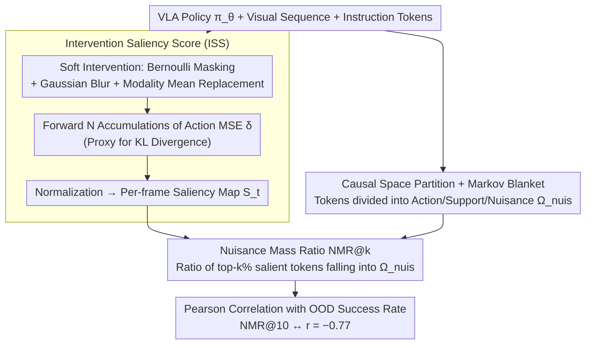

# Embodied Interpretability: Linking Causal Understanding to Generalization in Vision-Language-Action Models

**Conference**: ICML 2026  
**arXiv**: [2605.00321](https://arxiv.org/abs/2605.00321)  
**Code**: None  
**Area**: Embodied AI / VLA Interpretability / Causal Inference  
**Keywords**: VLA Models, Intervention Saliency, Nuisance Mass Ratio, OOD Generalization, Markov Blanket

## TL;DR
This paper reformulates "vision-action attribution" as an intervention estimation problem. It proposes two metrics, ISS (Intervention Saliency Score) and NMR (Nuisance Mass Ratio), using Bernoulli masking + Gaussian blur perturbation + Action MSE as a proxy for KL divergence to quantify which visual regions VLA policies rely on. It demonstrates that NMR has a strong negative correlation of $r = -0.77$ with OOD task success rates, serving as a cost-effective diagnostic tool for predicting VLA generalization capabilities.

## Background & Motivation

**Background**: Vision-Language-Action (VLA) foundation models are becoming increasingly powerful in embodied tasks such as grasping and assembly (e.g., OpenVLA, $\pi_{0.5}$, CoT-VLA). however, the community's understanding of "where the model looks and what it bases decisions on" remains largely a black box. Existing interpretability tools generally fall into three categories: attention analysis, linear probes for latent states, and feature decoupling (FFN projection into token space).

**Limitations of Prior Work**: The authors empirically identified two anomalies: (1) high attention weights often fall on the background; (2) masking the entire visual input can still result in the model outputting similar action trajectories. This suggests that VLAs may memorize statistical mappings from tasks to actions rather than learning underlying causal mechanisms. Both attention and probes only indicate "where features appear" rather than "where they are actually used," leading to an "observation-control disconnect."

**Key Challenge**: The essence of interpretability methods is correlation measurement (passive observation of attention weights or activation norms), whereas generalization diagnosis requires causal measurement ("If I replace this segment with a baseline, does the action change?"). The former cannot answer the root causes of OOD failures.

**Goal**: (1) Propose an attribution method capable of distinguishing "causally necessary" from "spurious correlation" visual evidence; (2) transform this attribution into a scalar metric that predicts OOD success rates; (3) provide theoretical guarantees for unbiased estimation of this metric.

**Key Insight**: Drawing from Pearl's do-calculus and the concept of the Markov Blanket—given an expert policy $\pi^*$ and a task space partition $\Omega = \Omega_{act} \cup \Omega_{sup} \cup \Omega_{nuis}$, an ideal policy should satisfy conditional independence regarding $\Omega_{nuis}$. Any dependence on $\Omega_{nuis}$ constitutes "causal hallucination."

**Core Idea**: Implement soft interventions through "mean token replacement + Bernoulli masking + Gaussian blur padding," and use Action MSE as a proxy for KL divergence (which are closed-form equivalent under the assumption of isotropic Gaussian policies). This yields computable ISS saliency maps, followed by defining NMR via the mass ratio of the top-k intersection with $\Omega_{nuis}$.

## Method

### Overall Architecture
The input consists of a VLA policy $\pi_\theta$, a visual sequence $V_{1:T}$, and instruction tokens. First, token-level causal interventions are performed to produce per-frame ISS saliency maps $S_t \in \mathbb{R}^{H \times W}$. Second, NMR@k is calculated based on predefined partitions: "action-critical regions / environmental support regions / visual nuisance regions," serving as a scalar representing the degree of "causal misalignment." Finally, the Pearson correlation between NMR@k and actual OOD success rates is computed to verify its predictive power for generalization. The entire process follows an **offline intervention protocol** that does not depend on simulator execution, thus avoiding the accumulation of dynamic errors.

### Key Designs

**1. Intervention Saliency Score (ISS): Quantifying the impact of each token on action through causal intervention rather than passive observation**

The fundamental issue with attention and probes is that they are merely correlation measures—telling you "where it appears" rather than "where it is actually used." ISS directly applies intervention: token $i$ is replaced by its modality-conditioned mean embedding $\boldsymbol{\mu}_i$ (calculated over $\mathcal{D}_{vis}$ and $\mathcal{D}_{text}$ respectively) to construct a counterfactual input $\tilde{X}^{(i)}_t$. The change in action distribution is then quantified: $\text{ISS}_i=\sum_t D_{KL}(\pi_\theta(\cdot | X_t) \| \pi_\theta(\cdot | \tilde X^{(i)}_t))$. Under the isotropic Gaussian policies commonly used in VLAs, the Fisher Information Matrix degenerates into a scalar identity, making KL divergence closed-form equivalent to the squared difference of action means. Thus, Action MSE is used as a proxy in the implementation (derivation provided in the appendix).

The computation utilizes Monte Carlo sampling: $N$ Bernoulli masks $m_k \sim \text{Bernoulli}(p)$ are drawn. Masked regions are replaced with a blurred version $V_t^{blur}$. Action differences $\delta_k = \|\hat a_{t,k} - a^*_t\|^2$ following each perturbation are accumulated into the saliency map according to $(1 - m_k)$ and normalized by $N(1-p)$. Two implementation details are critical: using modality mean replacement instead of zero-ablation avoids pushing tokens into OOD regions that introduce artifacts by ensuring the sequence remains within a valid semantic subspace; using blur instead of total blacking-out preserves low-frequency structures while highlighting the loss of high-frequency information.

**2. Causal Space Partition + Markov Blanket: Turning "causal misalignment" from a vague concept into a quantifiable geometric object**

To determine if a policy is secretly relying on spurious correlations, a clear standard for "what counts as spurious" is required. The authors utilize Pearl’s Markov Blanket to explicitly partition the token space $\Omega$ into three parts: action-critical region $\Omega_{act}$ (robot arm, end-effector), environmental support region $\Omega_{sup}$ (target objects, supporting table), and visual nuisance region $\Omega_{nuis}$ (walls, shadows, textures). They prove that $\mathcal{M}(a) = \Omega_{act} \cup \Omega_{sup}$ constitutes the causal Markov Blanket for the action variable; an ideal policy should be conditionally independent of $\Omega_{nuis}$.

This partition is deliberately performed in the token space rather than the pixel space: at the pixel level, lighting changes affect all pixels and are entangled, whereas tokens possess semantic abstraction, allowing for clean categorization. Once this partition is established, "causal misalignment" gains a geometric definition—whenever ISS saliency mass leaks into $\Omega_{nuis}$, it indicates the policy is relying on spurious evidence.

**3. Nuisance Mass Ratio (NMR@k): Compressing saliency maps into a scalar that predicts generalization**

With the ISS saliency map and the three-way partition mask, a scalar is needed for correlation analysis with success rates. NMR@k identifies the set of tokens $\mathcal{H}_{ISS}^{(k)}(X)$ constituting the top $k\%$ of cumulative mass on the saliency map and calculates the "proportion of important tokens falling into the nuisance region":

$$\rho_{ISS}^{(k)}(\Omega_{nuis}) = \mathbb{E}_X \big[|\mathcal{H}^{(k)} \cap \Omega_{nuis}| / |\mathcal{H}^{(k)}|\big].$$

An ideal policy should have $\text{NMR@k} \approx 0$. By compressing the "saliency map + partition mask" into a single scalar, an interpretability metric gains the ability to "predict generalization" for the first time. Empirical results show NMR@10 has a strong negative correlation of $r=-0.77$ with OOD success rates, meaning VLA failure in OOD scenarios can be predicted in advance without running simulators or requiring labels.

### Loss & Training
This work does not train new models but performs offline intervention analysis on a fine-tuned $\pi_{0.5}$. 3,600 seen task episodes are used for SFT, and 575 unseen episodes are used for evaluation. Theoretically, the authors prove that Monte Carlo estimation based on Bernoulli masks is a consistent estimator of the coalitional causal effect. Appendix A provides the closed-form derivation for the KL $\leftrightarrow$ Action MSE equivalence, which is the key support for the metric's interpretability.

## Key Experimental Results

### Main Results

| Evaluation Dimension | Metric | ISS / NMR | Baseline (Attention / Token Norm) |
|----------|------|-----------|------------------------------|
| NMR@10 vs. Success Rate | Pearson $r$ | $-0.77$ | N/A |
| Noise Robustness Pareto | (Cosine Sim ↑, Action MSE ↓) | (0.995, 0.002), Optimal Top-right | Attention (0.959, 0.002), Norm (0.999, 0.011) |
| Fidelity (3 Perturbations Pearson) | Geometric / Patch / Texture | 0.78 / 0.64 / 0.72 | Attention 0.64 / 0.49 / 0.56; Norm 0.47 / 0.33 / 0.40 |

### Ablation Study

| Configuration | Seen MSE ($\times 10^{-3}$) | Unseen MSE ($\times 10^{-3}$) | Description |
|------|------------------|----------------|------|
| $N=100, p=0.3$ | **1.0 ± 0.1** | **6.4 ± 0.2** | Optimal Hyperparameter Combination |
| $N=50, p=0.3$ | 1.5 ± 0.2 | 9.5 ± 0.5 | Insufficient Interventions |
| $N=100, p=0.5$ | 1.2 ± 0.1 | 7.5 ± 0.3 | Semantic collapse due to over-masking |
| $N=150, p=0.3$ | 1.2 ± 0.1 | 7.0 ± 0.2 | Diminishing Marginal Returns |

### Key Findings
- **NMR@10 predicts success rate almost linearly**: Sweeping 5 values of $k$ across 41 RLBench tasks $\times$ 5 random seeds, $k=10$ yielded a peak negative correlation of $r=-0.77$. This implies an offline metric, independent of simulators and labels, can pre-diagnose whether a VLA model will fail in OOD scenarios.
- **ISS simultaneously optimizes similarity and action deviation**: On the Pareto front, ISS consistently occupies the top-right corner ("most stable saliency map + minimal action perturbation"), outperforming both Attention and Norm, verifying the thesis that "causal intervention > passive correlation."
- **Significant differences in failure/success trajectories**: In failed episodes, ISS mass is concentrated on background, textures, and shadows; in successful episodes, it is concentrated on the end-effector and target objects. This provides qualitative evidence confirming the hypothesis that "VLA OOD failure = reliance on spurious correlations."

## Highlights & Insights
- **Upgrading interpretability from correlation to causality**: While attention/norm shows "where the policy looked," ISS shows "what the policy actually used." This distinction is methodologically significant for diagnosing VLA-style foundation models.
- **Elegant offline protocol design**: Performing single-step interventions under teacher forcing avoids compound errors from trajectory divergence. Supported by the theoretical "KL = squared action difference" equivalence and low engineering costs, this represents a "theoretically-grounded practical" application.
- **NMR as a pre-deployment filter**: A potential use case involves running NMR@10 on multiple VLA candidate models before deployment, ranking them by the metric, and allocating budget to candidates most likely to succeed, thereby avoiding extensive real-world regression testing.

## Limitations & Future Work
- The three-way partition $\Omega_{act} / \Omega_{sup} / \Omega_{nuis}$ relies on manual or semi-automatic annotation; in complex task spaces (e.g., wild manipulation), partition standards may become blurred, requiring re-verification of metric stability.
- Comprehensive evaluation was only performed on a single model ($\pi_{0.5}$) and a single benchmark (AGNOSTOS); cross-model and cross-benchmark universality requires subsequent validation.
- The KL $\leftrightarrow$ Action MSE equivalence is built on the "isotropic Gaussian policy + fixed variance" assumption, which is not directly applicable to non-Gaussian policies like Diffusion Policies or Flow Matching.
- ISS calculation requires $N=100$ forward passes, which may be taxing for real-time deployment (ms-level per step); the paper does not provide token-level approximations or caching schemes.

## Related Work & Insights
- **vs. CoT-VLA / PhysiAgent**: While those works focus on system-level transparency (generating readable rationale chains), this work focuses on token-level causal attribution; the approaches are complementary.
- **vs. Robotic Steering (Mitra et al.)**: That work uses attention heads for behavior correction but does not quantify which heads are causally necessary; ISS can directly rank "causally important heads/tokens."
- **vs. RISE / Grad-CAM visual saliency**: The concepts are similar (Bernoulli mask + prediction delta), but this work applies them to action distributions rather than classification logits and incorporates Markov Blanket partitioning to form a scalar metric for predicting OOD.
- **vs. Linear Probe**: Probes only prove that "information exists," not that "information is used"—this work represents a causal upgrade to probe-based methods.

## Rating
- Novelty: ⭐⭐⭐⭐ Strictly bringing do-calculus interventions into VLA interpretability and defining clear ISS/NMR scalars is a first.
- Experimental Thoroughness: ⭐⭐⭐ Solid foundation on a single model/benchmark, but cross-model/cross-task coverage is limited.
- Writing Quality: ⭐⭐⭐⭐ Theoretical and empirical results are clearly interwoven; the Markov Blanket narrative is clean and accessible.
- Value: ⭐⭐⭐⭐ Provides a genuinely computable diagnostic tool for Predicting generalization in embodied foundation model deployment.

<!-- RELATED:START -->

## Related Papers

- [\[ICML 2026\] Contrastive Representation Regularization for Vision-Language-Action Models](contrastive_representation_regularization_for_vision-language-action_models.md)
- [\[ICML 2026\] LangForce: Bayesian Decomposition of Vision-Language-Action Models via Latent Action Queries](langforce_bayesian_decomposition_of_vision_language_action_models_via_latent_act.md)
- [\[ICML 2026\] Embodied Task Planning via Graph-Informed Action Generation with Large Language Models](embodied_task_planning_via_graph-informed_action_generation_with_large_language_.md)
- [\[ICML 2026\] StableVLA: Towards Robust Vision-Language-Action Models without Extra Data](stablevla_towards_robust_vision-language-action_models_without_extra_data.md)
- [\[ICML 2026\] SpecPrune-VLA: Accelerating Vision-Language-Action Models via Action-Aware Self-Speculative Pruning](specprune-vla_accelerating_vision-language-action_models_via_action-aware_self-s.md)

<!-- RELATED:END -->
