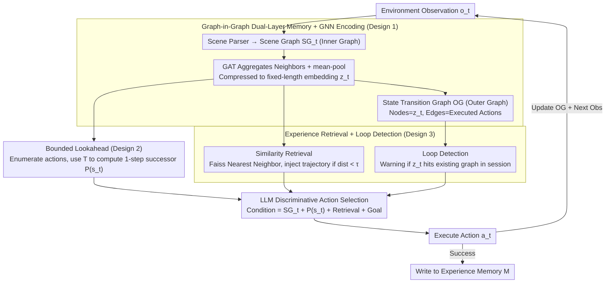

# Embodied Task Planning via Graph-Informed Action Generation with Large Language Models

**Conference**: ICML 2026  
**arXiv**: [2601.21841](https://arxiv.org/abs/2601.21841)  
**Code**: TBD  
**Area**: Embodied AI / LLM Agent / Task Planning  
**Keywords**: Embodied Planning, Graph Memory, GNN Encoding, Bounded Lookahead, Experience Retrieval

## TL;DR
GiG equips the LLM planner with "graph-in-graph" dual-layer memory (Scene Graph + State Transition Graph) + GNN encoding + 1-step lookahead, improving Pass@1 by 6–37 percentage points over ReCAP on Robotouille (Sync/Async) and ALFWorld.

## Background & Motivation

**Background**: When LLMs are utilized as the "brains" of embodied agents, mainstream approaches involve interleaved action-observation generation like ReAct/Reflexion, or hierarchical decomposition with backtracking using context trees like ReCAP.

**Limitations of Prior Work**: Pure text interleaving stuffs all history into the prompt, leading to *context drift* in long horizons—high-level goals are lost once the window is flushed, and agents start stalling or generating contradictory actions. Meanwhile, ReCAP's context tree forces parallelizable subtasks into rigid sequences; for instance, while "cooking soup" is waiting for water to boil, the sibling task "setting the table" is blocked by the tree structure, causing the agent to wait idly.

**Key Challenge**: Long-horizon planning must simultaneously satisfy three conflicting requirements: (i) persistent visibility of high-level intent, (ii) free interleaving of sibling/parallel subtasks, and (iii) compact, retrievable state representations. Linear history fails (i)+(iii), while trees fail (ii).

**Goal**: Transform the agent's working memory into a structured container that can compress observations, represent parallel dependencies, and retrieve past successful experiences by structural similarity.

**Key Insight**: Embodied scenes are naturally graphs (object-relation), and action sequences are naturally another layer of graphs (state-transition). Nesting the scene graph within the state transition graph captures both spatial structure and temporal dynamics.

**Core Idea**: GNNs are used to compress each step's scene graph into embedding nodes, while executed actions serve as edges to form an episodic memory graph. During new decisions, successful past trajectories are retrieved from the memory bank as in-context demonstrations based on embedding similarity, supplemented by 1-step transition simulation for "look-before-you-leap" selection.

## Method

### Overall Architecture
GiG operates in a five-step loop: (Observation → Parsing → Encoding → Retrieval → Action Selection). For each step t, the input is the environment observation $o_t$, and the output is the action $a_t$. Two layers of graphs are maintained:

- **Inner Scene Graph** $SG_t=(V_t,E_t)$: Nodes are entities (objects/robots) and edges are spatial relations (e.g., "cheese1 on-top-of table1"), constructed via a deterministic or LLM-based parser.
- **Outer Observation Graph** $OG$: Nodes are fixed-length embeddings $z_t$ compressed from $SG_t$ by a GNN, and edges are actually executed actions $a_t$, forming a chain $z_1 \xrightarrow{a_1} z_2 \xrightarrow{a_2} \cdots$.

The memory bank $M=\{E_j\}$ stores successful historical trajectories (each an OG + goal $G_j$). At each new step, the current $z_t$ is used to query $M$; hits for similar past states inject subsequent actions as soft prompts. Simultaneously, the BL module enumerates the 1-step successors of valid actions and checks for cycles against previously visited states within the session. These three contexts are concatenated into the prompt for the LLM to perform discriminative selection.

### Key Designs

**1. Graph-in-Graph Dual-Layer Memory + GNN Encoding: Compressing observations into structure-aware embeddings and organizing trajectories into retrievable graphs.**

Linear history fails to provide "persistent intent visibility + compact retrieval," and trees cannot handle "parallel subtask interleaving." GiG resolves this by nesting two layers: inner scene graph nodes are initialized with lightweight sentence encoders and updated via multi-layer GAT neighbor aggregation $h_u^{(l)}=\sigma\big(\sum_{v\in N(u)}\alpha_{u,v}W^{(l)}h_v^{(l-1)}\big)$, finally compressed via mean-pool + BatchNorm into a fixed-length embedding $z_t$. The outer graph uses $z_t$ as nodes and executed actions as edges: $z_1 \xrightarrow{a_1} z_2 \xrightarrow{a_2} \cdots$.

Training utilizes triplet loss + uniformity regularization $L=L_{triplet}+\lambda L_{uniformity}$. Anchors/positives are from adjacent steps in the same trajectory, while negatives are sampled across trajectories. The hypothesis is "smooth physical state changes → temporally adjacent embeddings should be closer." The learned embeddings show intra-trace distances <0.1 vs. inter-trace distances ~0.8, justifying the retrieval threshold $\tau=0.1$. Compared to flattening scenes into text, structured embeddings preserve topology and resolve context drift.

**2. Bounded Lookahead (BL) Module: Shifting LLMs from "imagining the future" to "selecting from real successors."**

LLMs often hallucinate actions that violate physics when "daydreaming" consequences. When dynamics $T$ are known (as in Robotouille via PDDL), BL enumerates the valid action set $A(s_t)$, invokes $T$ for each to compute successors, and yields a projection set $P(s_t)=\{(a,s')\mid a\in A(s_t),\ s'=T(s_t,a)\}$. This is then fed into the prompt, allowing the LLM to perform discriminative selection $a_{t+1}\sim \text{LLM}(\text{Prompt}\mid SG_t,P(s_t),R_{z_t},G)$. In environments like ALFWorld where $T$ is unavailable, the framework falls back to pure graph + experience.

This transfer of risk from LLM "imagination" to actual dynamics, while only exposing 1-step successors, avoids full search trees. Since $A(s)$ is typically a small finite set in task planning, the overhead and latency remain stable. Essentially, the world model is used as a discriminator rather than a searcher.

**3. Structurally Similar Experience Retrieval + Loop Detection: Using past success trajectories as demos and actively stopping cycles.**

All $(z,a)$ pairs from 50 successful Qwen3-235B trajectories are indexed in Faiss. At each step, $z_t$ is used to find the nearest neighbor $(z_k,d)$. If $d<\tau=0.1$, the subsequent sub-trajectory (effectively the next action) is injected as a one-shot demonstration. Simultaneously, the current session's state transition graph is monitored; if $z_t$ matches an existing node, Loop Detection triggers a prompt warning: "You just looped through stack→unstack→stack."

Critically, retrieval is based on local scene structure similarity rather than task text, allowing cross-task transfer—an action chain like "cut→pick→place" learned for a "sandwich" can be reused for a "burger," with the LLM acting as a semantic filter for adoption. This makes the experience memory a model-agnostic plugin: trajectories collected by large models can directly boost the performance of smaller models.

### Loss & Training
Only the GNN requires training; the LLM remains frozen. GNN loss is $L=L_{triplet}+\lambda L_{uniformity}$ with triplet margin $\gamma=1.0$. Uniformity is the mean of squared cosine similarities between all pairs to prevent embedding collapse. Evaluation uses temperature 0, a 4096 token limit, and the Pass@1 protocol.

## Key Experimental Results

### Main Results
Tested across three embodied planning benchmarks. Every LLM backend compares GiG / GiG+Exp against ReCAP / ReAct / CoT.

| Dataset | Backend | GiG | GiG+Exp | Prev. SOTA | Gain |
|--------|------|-----|---------|----------|------|
| Robotouille Sync | Qwen3-235B | 93 | 97 | 74 (ReAct) | +19 / +23 |
| Robotouille Sync | DeepSeek-R1 | 91 | 88 | 72 (ReCAP) | +19 |
| Robotouille Async | Qwen3-235B | 72 | 82 | 35 (ReCAP) | +37 / +47 |
| Robotouille Async | DeepSeek-R1 | 59 | 86 | 27 (ReCAP) | +32 / +59 |
| ALFWorld | Qwen3-235B | 97 | – | 91 (ExpeL) | +6 |
| ALFWorld | DeepSeek-R1 | 97 | – | 82 (ReCAP) | +15 |

Asynchronous tasks showed the largest gains due to concurrency management needs. ALFWorld, despite object randomization, achieved 97% even without experience memory, relying solely on dual-layer graph aggregation.

### Ablation Study

| Configuration | Robotouille Sync (Qwen3-30B) | Description |
|------|------------------------------|------|
| ReCAP baseline | 19 | Tree context + backtracking |
| ReAct baseline | 28 | action-observation interleaving |
| GiG (No Exp) | 27 | Only dual-layer graph + BL; outperforms ReCAP |
| GiG + Exp | 42 | +15 absolute points with experience memory |
| GiG + Exp (Gemini-Flash-Lite) | 26 | Small model +7 gain under same config |

### Key Findings
- Experience memory is highly effective as a model-agnostic plug-in: trajectories collected by Qwen3-235B directly fed into Qwen3-30B/Gemini-Flash-Lite yielded +7~+15 absolute gains without fine-tuning.
- On difficult tasks, GiG takes more steps than baselines, which seems contradictory but is because baselines fail entirely. Including failed trials, GiG's average step count is lower, representing a robust trade-off: "take a few more steps to ensure completion."
- The separation between intra-trace distance (<0.1) and inter-trace (~0.8) proves that GAT+triplet learns embeddings that distinguish trajectories while identifying adjacent states, justifying $\tau=0.1$.

## Highlights & Insights
- Using "graphs as memory containers" with two layers is the true differentiator: the inner layer handles observation "compression," while the outer layer handles action "concurrency." This adds a temporal dimension compared to pure Graph RAG (PoG/HiRAG) and superior parallel expression compared to ReCAP's trees.
- The BL module philosophy: "Don't ask the LLM to imagine consequences; let it choose from real ones." By exposing only 1-step successors rather than a full tree, the world model functions as a discriminator, keeping latency low and hallucination rates minimal.
- The model-agnostic nature of experience memory is highly valuable for industrial deployment: the paradigm of "large model collection + small model inference" can be applied to any embodied LLM agent without retraining.

## Limitations & Future Work
- The scene parser currently relies on a deterministic parser (dependent on PDDL or environment metadata); robust VLM parsers are needed for real visual environments, which were not validated.
- The BL module requires an explicit transition function $T$; without it, the module degrades. The use of learned world models as a substitute remains unverified.
- Experience memory was disabled for ALFWorld due to object randomization, suggesting structural similarity is sensitive to "geometric rearrangement," and cross-layout transfer remains questionable.
- The initial memory bank of 50 trajectories is small; the impact of memory bloat (thousands of trajectories) on retrieval quality and latency was not discussed.

## Related Work & Insights
- **vs ReCAP (2025b)**: Both use structured memory, but ReCAP uses trees for recursive decomposition + backtracking, while GiG uses graphs for parallel scheduling + experience reuse. While ReCAP is close on sync tasks, GiG leads by 30+ points on async tasks, confirming "trees block concurrency."
- **vs ReAct / Reflexion**: Pure action-observation interleaving leaves all context in the prompt, leading to drift in long horizons; GiG compresses context into graph nodes, keeping the prompt short.
- **vs ExpeL**: ExpeL distills textual insights for retrieval, which struggles with ALFWorld's random layouts; GiG's structural similarity works better across layouts (though even the authors found it more stable without Exp on ALFWorld).
- **vs GraphRAG / PoG / HiRAG**: These focus on QA over static KGs; GiG brings Graph RAG to embodied dynamic scenarios where the KG grows dynamically.

## Rating
- Novelty: ⭐⭐⭐⭐ Graph-in-Graph is a clean abstraction, unifying scene structure and dynamics in a retrievable container.
- Experimental Thoroughness: ⭐⭐⭐⭐ Three benchmarks × 5 LLMs × 4 baselines, including small model plug-in tests, though missing real-world visual validation.
- Writing Quality: ⭐⭐⭐⭐ Algorithm 1 and Figure 2 explain the pipeline clearly with consistent notation.
- Value: ⭐⭐⭐⭐ Significant Pass@1 improvements and the model-agnostic memory plugin are deployment-friendly. The structured memory path is worth following.

<!-- RELATED:START -->

## Related Papers

- [\[ICML 2026\] Embodied Interpretability: Linking Causal Understanding to Generalization in Vision-Language-Action Models](embodied_interpretability_linking_causal_understanding_to_generalization_in_visi.md)
- [\[CVPR 2026\] RoboAgent: Chaining Basic Capabilities for Embodied Task Planning](../../CVPR2026/robotics/roboagent_chaining_basic_capabilities_for_embodied_task_planning.md)
- [\[NeurIPS 2025\] ESCA: Contextualizing Embodied Agents via Scene-Graph Generation](../../NeurIPS2025/robotics/esca_contextualizing_embodied_agents_via_scene-graph_generation.md)
- [\[ICML 2026\] Contrastive Representation Regularization for Vision-Language-Action Models](contrastive_representation_regularization_for_vision-language-action_models.md)
- [\[ICML 2026\] LangForce: Bayesian Decomposition of Vision-Language-Action Models via Latent Action Queries](langforce_bayesian_decomposition_of_vision_language_action_models_via_latent_act.md)

<!-- RELATED:END -->
