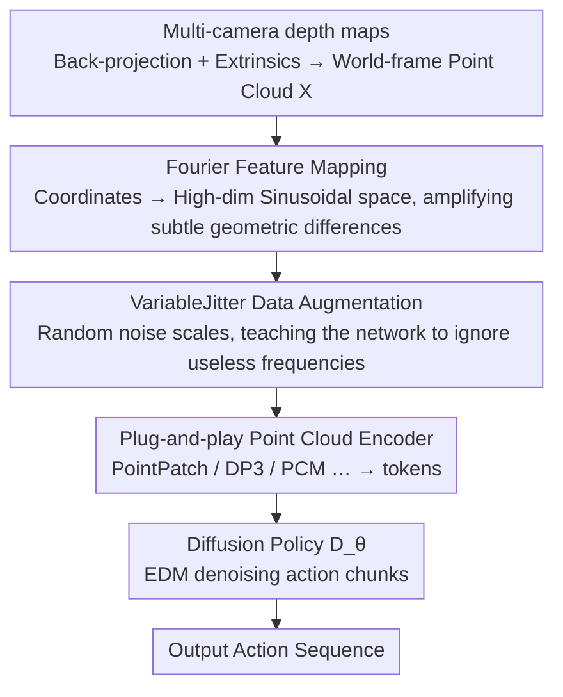

# Fourier Features Let Agents Learn High Precision Policies with Imitation Learning

**Conference**: ICML 2026  
**arXiv**: [2606.12334](https://arxiv.org/abs/2606.12334)  
**Code**: https://fourier-il.github.io/fourier-il (Project page, including code and videos)  
**Area**: Robotics / Imitation Learning  
**Keywords**: Imitation Learning, Point Cloud Policy, Fourier Features, Spectral Bias, High-Precision Manipulation

## TL;DR
By applying a NeRF-style Fourier feature mapping to point cloud Cartesian coordinates before feeding them into a point cloud encoder, this work eliminates the "spectral bias" where point cloud policies focus on low frequencies and fail to capture high frequencies. This approach significantly improves the success rates of diffusion imitation learning policies in high-precision manipulation tasks across RoboCasa, ManiSkill3, and real-world setups (increasing the real-world normalized score from 14.8% to 40.2%), while remaining robust across various encoders and hyperparameters.

## Background & Motivation
**Background**: Diffusion-based Imitation Learning (IL) has become the mainstream framework for robot visuomotor control—treating action generation as a denoising process to naturally characterize multi-modal action distributions in human demonstrations. Observation encoders "translate" the scene geometry into tokens, from which the policy determines the next action. Compared to RGB images, which are semantically rich but lack explicit 3D geometry, 3D modalities like point clouds directly express shape, distance, and spatial relationships, providing stronger geometric priors for the policy.

**Limitations of Prior Work**: Curiously, the performance of pure point cloud policies is highly task-dependent—the same encoder may perform very well on some tasks and poorly on others. To compensate for this, many hybrid 2D/3D architectures have emerged (using pretrained image backbones to extract RGB features and concatenating them with 3D data), making methods increasingly complex without questioning the fundamental weaknesses of pure point clouds.

**Key Challenge**: The authors attribute the root cause to **spectral bias**. High-precision tasks (e.g., inserting a pin into a hole) require a very "steep" decision boundary—where a tiny difference in observation leads to choosing between "inserting" and "repositioning." This essentially requires the policy to be a **high-frequency function**. However, MLPs/fully connected layers tend to learn low frequencies first and struggle with (or fail to learn) high frequencies. Since almost all point cloud encoders use MLPs to encode Cartesian coordinates into latent features, they fall into this trap. In contrast, the convolutions at the bottom of image architectures naturally favor high frequencies, making them more sensitive to details.

**Goal**: To eliminate the spectral bias of point cloud encoders at the input representation level without changing the architecture or stacking modules, enabling any point cloud policy to learn steep decision boundaries.

**Key Insight**: While NeRF/Novel View Synthesis has long used Fourier feature mapping to fix the spectral bias of MLPs, recent point cloud robot backbones have rarely utilized this technique, appearing only sporadically in specific architectures. The authors systematically introduce Fourier feature mapping into point cloud diffusion IL.

**Core Idea**: Project Cartesian coordinates into a high-dimensional sinusoidal space. Points that are almost identical in coordinate space are amplified into distinguishable features in Fourier space, bypassing the spectral bias of MLPs.

## Method

### Overall Architecture
The method is extremely lightweight: in a standard "depth map → point cloud → point cloud encoder → diffusion policy" pipeline, **a non-parametric Fourier feature mapping is inserted only before the point cloud coordinates enter the encoder**, while everything else remains unchanged. Specifically, multi-camera depth maps are back-projected, transformed via extrinsics, and concatenated to obtain the world-frame point cloud $X$. The $XYZ$ coordinates serve as graph node features fed into a message-passing point cloud encoder (experiments are unified on the PointPatch series), which outputs a sequence of tokens. These tokens, along with language goal tokens and noise-level tokens, are sent into a decoder-only Transformer-based diffusion policy $D_\theta$ to iteratively denoise the next action chunk. The role of the Fourier mapping is to replace "slowly varying" Cartesian features with "rapidly changing" high-frequency features before they enter the encoder.

### Key Designs

**1. Fourier Feature Mapping: Amplifying subtle differences between adjacent points with high-frequency sinusoidal embeddings**

This is the core of the paper, directly addressing the pain point that MLPs cannot learn high-frequency decision boundaries. The authors adopt a NeRF-style, axis-aligned Fourier mapping: for each coordinate component of a Cartesian point $\mathbf{p}=(x,y,z)$, specify $L$ sets of sinusoidal functions with different wavelengths for encoding:

$$\gamma_k(x)=\Big[\sin\big(\tfrac{2\pi x}{\lambda_k}\big),\ \cos\big(\tfrac{2\pi x}{\lambda_k}\big)\Big]^{\mathsf T},\qquad \lambda_k=\lambda_{\max}\Big(\tfrac{\lambda_{\min}}{\lambda_{\max}}\Big)^{\frac{k-1}{L-1}},\ k=1,\dots,L$$

The wavelengths are log-equidistantly distributed between $[\lambda_{\min},\lambda_{\max}]$, ranging from "global encoding" at $\lambda_{\max}$ to "voxel-level encoding" at $\lambda_{\min}$. Each point receives $3\times 2L$ dimensional features (in experiments $L{=}16$, $\lambda_{\max}{=}4.0\,\text{m}$, and $\lambda_{\min}{=}2.0\,\text{cm}$, totaling 96 dimensions). Why it works: In Cartesian space, adjacent point coordinates are nearly identical, making it hard for MLPs to distinguish them. High-frequency sinusoids "stretch" these tiny differences in high-dimensional space, allowing the encoder to read fine-grained geometry directly without fighting spectral bias, thus representing a steep policy. Note: Since the sinusoidal mapping is periodic, point clouds must be bounded within $[-\lambda_{\max}/2,\lambda_{\max}/2]$ to ensure feature uniqueness; if this is not possible, raw coordinates can be concatenated with Fourier features to guarantee uniqueness.

**2. Plug-and-play and Encoder-agnostic: A single solution for the entire PointPatch family**

Unlike previous work that added Fourier features only to specific new architectures, the authors argue this mapping is **effective for almost any point cloud policy**. They systematically apply it to a whole family of encoders: PointPatch (no patch token aggregation), PointPatch-attn (attention pooling into 3 tokens for efficiency), PCM (max pooling aggregation), DP3 (global max pooling into a single token), PointTransformer (iterative attention aggregation), and PointPatch+RGB multi-modal variants. All experiments share the same diffusion backbone, changing only the observation encoder and applying the minimum necessary changes to add Fourier mapping to absolute/relative coordinates as needed. This "controlled variable" design substantiates the conclusion that the improvement comes from the Fourier features themselves, not a specific architecture—experiments indeed show benefits across almost all architectures.

**3. VariableJitter Data Augmentation: Replacing per-task wavelength tuning with noise**

Wavelength selection is typically a sensitive aspect of Fourier features: if too short, the network may overfit; if too long, it fails to suppress spectral bias. Previous studies even observed training instability under certain hyperparameters. Instead of fine-tuning wavelengths for each task, the authors fix a set of log-equidistant wavelengths and use **VariableJitter** data augmentation to let the network "learn to ignore uninformative frequencies." For each point cloud, a noise scale $\sigma\sim\mathcal U(0,\sigma_{\max})$ is sampled from a uniform distribution to apply jitter. Compared to fixed-magnitude uniform jitter, this avoids the hassle of tuning noise levels and balances "augmentation to prevent overfitting" with "avoiding training-testing distribution shifts" (in experiments, $\sigma_{\max}$ is 5 mm for ManiSkill, 2 mm for RoboCasa, and 1 mm for real-world).

### Loss & Training
The policy uses the Elucidated Diffusion Models (EDM) framework for score-based action diffusion: the network $D_\theta(\mathbf a+\boldsymbol\epsilon,o,\mathbf g,\sigma_t)$ is trained via score matching with the objective:
$$\mathcal L_{\text{SM}}=\mathbb E_{\sigma,\mathbf a,\boldsymbol\epsilon}\big[\alpha(\sigma_t)\,\|D_\theta(\mathbf a+\boldsymbol\epsilon,o,\mathbf g,\sigma_t)-\mathbf a\|_2^2\big]$$
During sampling, few-step denoising is performed using a probability flow ODE in the form of DDIM. It is worth emphasizing: the Fourier mapping acts on the **scene geometry**, not the actions, allowing the score function to be a high-frequency function of scene geometry while remaining smooth regarding actions.

## Key Experimental Results

### Main Results
Evaluation was conducted on RoboCasa (16 atomic tasks emphasizing fine geometric alignment and contact, 50 human demonstrations per task), ManiSkill3 (4 grasping/tool tasks, 500 expert demonstrations per task), and 4 real-world tasks; each method used 5 random seeds, reporting the bootstrap interquartile mean and 95% confidence intervals. In simulation, color features were intentionally withheld to highlight the effect of Fourier features on pure 3D representations.

| Benchmark / Task | Metric | Without FF | With FF | Gain |
|------------------|--------|------------|---------|------|
| RoboCasa (Avg 16 tasks, PointPatch) | Success Rate | 13% | 34% | +21pt |
| RoboCasa · CloseDrawer | Success Rate | 34% | 72% | +38pt |
| RoboCasa · TurnOffSinkFaucet | Success Rate | 28% | 63% | +35pt |
| RoboCasa · OpenDrawer | Success Rate | ≈0% | 12% | From nearly unlearnable to doable |
| Real-world (4 tasks, PointPatch+RGB) | Normalized Score | 14.8% | 40.2% | +25pt |

The improvement on ManiSkill3 was smaller (slight improvement for PointPatch / PointPatch-attn, not significant for others), which the authors attribute to performance saturation on these relatively simple tasks. On the real-world Cup-Stacking task, results grouped by cup diameter showed: **the smaller the cup, the greater the gain from Fourier features**, directly supporting the claim that Fourier features help encoders extract geometric details at smaller scales.

### Ablation Study

| Configuration | Avg Success Rate (%) | Description |
|---------------|----------------------|-------------|
| Ours (Log-FF + VariableJitter) | 41.4 ± 2.4 | Full Method |
| No FF, No jitter | 17.5 ± 1.7 | Removing FF cuts performance by half |
| No FF, VariableJitter | 18.5 ± 2.1 | Adding augmentation without FF helps very little |
| FF, No jitter | 39.9 ± 2.3 | Adding FF without augmentation is still near full performance |
| FF, random jitter | 38.9 ± 2.2 | Insensitive to augmentation type |

### Key Findings
- **Fourier features are the main driver of improvement**: Removing FF dropped the success rate from 41.4% to 17.5%, while adding VariableJitter alone only increased it from 17.5% to 18.5%—data augmentation is not essential, mapping is the key.
- **Denser point clouds yield larger gains**: When reducing the number of points via larger voxel downsampling, the advantage of FF diminishes, almost disappearing at 2k points; however, the baseline remains nearly unchanged under heavy downsampling, suggesting it wasn't using the removed geometric details anyway.
- **FF remains effective even with erased fine geometry**: After adding $\sigma{=}5\,\text{cm}$ Gaussian jitter to the point cloud (effectively removing fine details), the FF policy still achieved 24% vs 13% without FF, suggesting FF also improves learning dynamics beyond just exposing high-frequency details.
- **Hyperparameter Robustness**: Not sensitive to the number of wavelengths $L$ or the minimum wavelength $\lambda_{\min}$; log-equidistant axis-aligned frequencies outperformed random Gaussian sampling (RFF). Graph Fourier spectrum analysis showed that FF increases the network's sensitivity to high-frequency (and mid-low frequency) signals by several orders of magnitude and accelerates learning.

## Highlights & Insights
- **Reinterpreting a long-standing phenomenon through "spectral bias"**: The authors provide a unified answer to why pure point cloud policies are hit-or-miss and why the community stacks complex hybrid 2D/3D architectures—MLP encoder spectral bias. Using a non-parametric mapping to match or exceed complex designs is a compelling "Aha!" moment.
- **Zero-cost and highly transferable**: Fourier mapping is non-parametric, requires no additional regularization, and is robust to hyperparameters. It can be directly plugged into any point cloud model that encodes coordinates with MLPs, including multi-modal backbones trained at internet scale—even with convolutions already representing high frequencies, RGB+Point Cloud encoders still benefit from FF, hinting at benefits for large models.
- **Transferable logic**: This approach of "Fourier before encoding" for coordinates/slow-moving variables can be applied to any task where MLPs consume low-dimensional continuous coordinates (pose regression, implicit fields, contact point prediction) to combat spectral bias.

## Limitations & Future Work
- **Author Acknowledgements**: Periodic mapping requires point clouds to be bounded within $[-\lambda_{\max}/2, \lambda_{\max}/2]$ for uniqueness, needing raw coordinate concatenation otherwise; neither strategy solved the smallest cups reliably, showing FF is not a panacea for extreme precision.
- **Self-identified Limitations**: Gains rely heavily on the presence of extractable geometric details in the point cloud—benefits are limited in simple/saturated tasks like ManiSkill or scenes where fine geometry is erased; the mechanism for "improving learning dynamics" is a hypothesis and lacks a rigorous explanation. Experiments focused on the PointPatch family; generalizability to other paradigms (e.g., voxel, implicit) requires further validation.
- **Future Directions**: Coupling wavelength design with task-scale adaptation or default inclusion of Fourier coordinate encoding in large-scale multi-modal robot backbone pre-training could further amplify gains.

## Related Work & Insights
- **vs Adapt3R (Wilcox et al., 2025)**: Also uses Fourier features, but Adapt3R limits it to a specific new architecture for unseen viewpoint generalization; this paper systematically validates it across point cloud architectures and explains it via frequency domain perspectives, advocating it as a general tool.
- **vs Hybrid 2D/3D Architectures (Ke et al., 2025; Wilcox et al., 2025; Gervet et al., 2023)**: These rely on pretrained image backbones + complex geometric fusion to compensate for point cloud weaknesses. This paper argues these complex designs became popular precisely because of point cloud encoder spectral bias—simple architectures + non-parametric Fourier mapping can make pure point cloud policies strong again.
- **vs Fourier Features in NeRF (Mildenhall et al., 2021; Tancik et al., 2020)**: Shares the same lineage of thought (using high-frequency sinusoids to fix MLP spectral bias) but represents the first systematic transfer to point cloud policies in diffusion IL, paired with VariableJitter to eliminate per-task tuning.

## Rating
- Novelty: ⭐⭐⭐⭐ Not a brand-new technology, but the perspective of using spectral bias to unify point cloud policy performance with a non-parametric mapping is insightful.
- Experimental Thoroughness: ⭐⭐⭐⭐⭐ Spans 3 benchmarks, 5 classes of encoders, and real-world results, including spectral analysis and extensive parameter studies.
- Writing Quality: ⭐⭐⭐⭐ Clear motivation and sufficient figures, though some formulas and expressions are quite compact.
- Value: ⭐⭐⭐⭐⭐ Near zero cost and highly transferable; provides direct practical value to the point cloud robotics learning community.

<!-- RELATED:START -->

## Related Papers

- [\[ECCV 2024\] Learning Cross-Hand Policies of High-DOF Reaching and Grasping](../../ECCV2024/robotics/learning_cross-hand_policies_of_high-dof_reaching_and_grasping.md)
- [\[CVPR 2026\] RealAppliance: Let High-fidelity Appliance Assets Controllable and Workable as Aligned Real Manuals](../../CVPR2026/robotics/realappiance_let_high-fidelity_appliance_assets_controllable_and_workable_as_ali.md)
- [\[CVPR 2026\] NIL: No-data Imitation Learning](../../CVPR2026/robotics/nil_no-data_imitation_learning.md)
- [\[ICML 2026\] Lagrangian Perturbation Diffusion Steering: Latent Reinforcement Learning for Generative Policies](lagrangian_perturbation_diffusion_steering_latent_reinforcement_learning_for_gen.md)
- [\[NeurIPS 2025\] LabUtopia: High-Fidelity Simulation and Hierarchical Benchmark for Scientific Embodied Agents](../../NeurIPS2025/robotics/labutopia_high-fidelity_simulation_and_hierarchical_benchmark_for_scientific_emb.md)

<!-- RELATED:END -->
