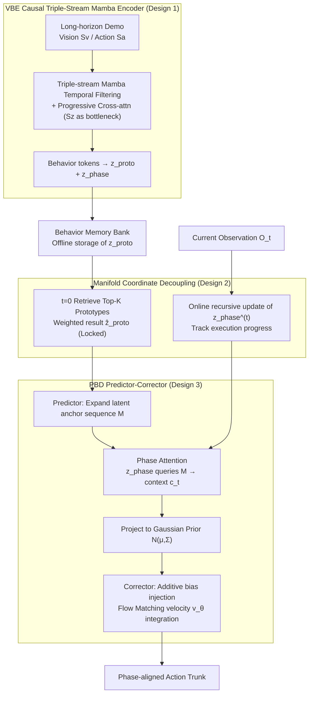

# From Abstraction to Instantiation: Learning Behavioral Representation for Vision-Language-Action Model

**Conference**: ICML 2026 Oral  
**arXiv**: [2605.22671](https://arxiv.org/abs/2605.22671)  
**Code**: [BehaviorVLA.github.io](https://BehaviorVLA.github.io)  
**Area**: Robotics / Embodied AI / VLA  
**Keywords**: VLA, Behavioral Representation, Mamba, Flow Matching, Sim-to-Real

## TL;DR
BehaviorVLA utilizes a causal triple-stream Mamba encoder (VBE) to compress long-horizon demonstrations into a time-invariant "behavioral prototype $z_{\text{proto}}$" and a time-variant "phase state $z_{\text{phase}}$". A phase-conditioned behavior decoder (PBD) then expands the behavioral skeleton into phase-aligned Gaussian priors via a Predictor-Corrector mechanism to guide the flow matching strategy. It sets new SOTA benchmarks on LIBERO, RoboTwin 2.0, and CALVIN, matching OpenVLA-OFT performance using only 50% of real-world data.

## Background & Motivation

**Background**: VLA models (OpenVLA, $\pi_0$, $\pi_{0.5}$, UniVLA, etc.) directly map vision-language backbones to action sequences, relying on large-scale simulation data to build general manipulation capabilities.

**Limitations of Prior Work**: Performance collapses under distribution shifts—lighting, object materials, or camera views cause failures. Sim-to-Real usually requires extensive real-world fine-tuning, which is costly and difficult to scale. Existing "latent action space" approaches (BeT, VQ-BeT, ACT) only mitigate local smoothness but face two fundamental issues: (i) **Short-horizon temporal fragmentation**—segmenting trajectories into independent chunks or discrete codebooks loses long-range dependencies; (ii) **Static execution alignment**—decoding actions from a fixed latent variable lacks awareness of current execution progress, leading to misalignment between actions and the physical scene.

**Key Challenge**: High-dimensional visuo-motor trajectories should concentrate near low-dimensional manifolds under the manifold hypothesis. However, standard VLAs learn mappings directly in environment space without explicit manifold constraints. Introducing such constraints often sacrifices real-time feedback and precision.

**Goal**: Simultaneously achieve (1) specific-to-general **abstraction**—distilling diverse demonstrations into unified behavioral representations; and (2) general-to-specific **instantiation**—projecting abstract behaviors back to precise actions aligned with the current state.

**Key Insight**: Explicitly decouple the latent space into a "time-invariant global task topology $z_{\text{proto}}$" and a "time-variant execution progress $z_{\text{phase}}$". The former is retrieved once at the start of an episode to provide a stable skeleton; the latter is updated online with each observation to keep action generation synchronized with physical execution.

**Core Idea**: Use a triple-stream Mamba architecture for "abstraction." Use a Predictor-Corrector + Phase Attention to expand the "skeleton" into "action priors," which are injected into the flow matching velocity field as additive biases to achieve both global topological stability and local reactive control precision.

## Method

### Overall Architecture
The model adds two modules to the $\pi_{0.5}$ backbone: (1) **VBE (Visuomotor Behavior Encoder)**: A causal triple-stream (vision $S_v$ / action $S_a$ / behavior $S_z$) architecture. Each stream uses Mamba for long-horizon temporal filtering, followed by cross-stream attention fusion to compress the entire trajectory into $\{z_{\text{proto}}, z_{\text{phase}}\}$. The $z_{\text{proto}}$ of each demonstration is stored offline in a Behavior Memory Bank. (2) **PBD (Phase-conditioned Behavior Decoder)**: Retrieves Top-K global prototypes to obtain a weighted $\hat z_{\text{proto}}$, expanded into a position-encoded sequence of latent anchors $\mathbf M$. $z_{\text{phase}}^{(t)}$ queries $\mathbf M$ via phase attention to derive local context $c_t$, projected into a Gaussian prior $\mathcal N(\mu_\psi(c_t), \Sigma)$. Finally, the prior is injected into the flow matching noise embedding via additive bias, where the velocity field $v_\theta$ integrates the final action trunk. During inference, the prototype is retrieved once per episode, and the phase is updated at each step.

### Key Designs

**1. VBE Causal Triple-stream Mamba + Progressive Cross-stream Attention: Compressing long-horizon sequences into "Behavior Tokens"**

Standard frame-level encoders lose long-range causality, while simple multimodal concatenation loses spatial structure. VBE uses three independent Mamba streams ($S_v, S_a, S_z$) for long-horizon temporal filtering. Each stream uses ZOH discretization to obtain time-varying parameters $\bar{\mathbf A}_t = \exp(\bm \Delta_t \mathbf A)$ and $\bar{\mathbf B}_t = (\bm \Delta_t \mathbf A)^{-1}(\bar{\mathbf A}_t - \mathbf I)\bm \Delta_t \mathbf B$. The step size $\bm \Delta_t = \text{Softplus}(\text{Linear}(x_t^{(m)}))$ makes the filter input-dependent, suppressing background noise and preserving key events. State recursion $h_t^{(m)} = \bar{\mathbf A}_t h_{t-1}^{(m)} + \bar{\mathbf B}_t \text{LN}(x_t^{(m)})$ includes gated connections. Spatial dimensions are handled by progressive cross-stream attention: the vision and action streams align low-level semantics, then the behavior stream treats $[\tilde h^{(v)}_t; \tilde h^{(a)}_t]$ as key/value to extract global task structure. This makes the behavior stream an information bottleneck that filters residual noise to retain behavioral topology.

**2. Manifold Coordinate Decoupling: Global Prototype Retrieval + Online Phase State**

A single latent variable cannot simultaneously be stable ("what is the task") and sensitive ("where am I now"). BehaviorVLA decouples them into two variables of different time scales. The global prototype $z_{\text{proto}}$ is obtained during training via mean pooling $z_{\text{proto}} = \tfrac{1}{T} \sum_t \tilde h_t^{(z)}$ and stored in a Memory Bank. At $t=0$ during inference, it is retrieved using $q = \text{MLP}(\Phi(O_0, L))$:

$$\hat z_{\text{proto}} = \sum_{i \in \mathcal N_K} \text{softmax}(\langle q, k_i\rangle/\kappa) \cdot z_{\text{proto}}^{(i)}$$

This remains locked throughout the episode to provide a stable skeleton. The local phase $z_{\text{phase}}^{(t)} = \text{VBE}_{\text{causal}}(z_{\text{phase}}^{(t-1)}, O_t, a_{t-1})$ is updated recursively online. This orthogonal decomposition ensures that action generation is both stable and responsive.

**3. PBD Predictor-Corrector: Phase-aligned Prior + Flow Matching Geometric Bias**

Standard latent decoding often fails to keep up with real-time scene changes. PBD assigns global structure and local precision to separate roles. The Predictor expands $\hat z_{\text{proto}}$ through a generator into $H$-step latent anchors $\mathbf M = \mathcal G_\phi(\hat z_{\text{proto}}) \oplus \mathbf P_{\text{pos}}$. Phase attention interpolates over these anchors $c_t = \text{Progress-Attn}(Q=z_{\text{phase}}^{(t)}, K=\mathbf M, V=\mathbf M)$ to project a Gaussian prior $\mathcal N(\mu_\psi(c_t), \Sigma)$. The Corrector performs conditional flow matching, injecting the prior as an additive bias into the noise embedding:

$$\tilde e(a_\sigma) = e(a_\sigma) + \lambda \cdot \text{Proj}_\phi(\mu_{\text{prior}})$$

The velocity field $v_\theta$ predicts the Optimal Transport (OT) velocity $u_\sigma = a_1 - a_0$ on this biased embedding. This effectively shifts the flow matching attention manifold toward high-probability regions, enforcing global topological consistency while maintaining multimodal distribution handling.

### Loss & Training
**Two-stage training**. Stage 1 (Behavior Manifold Learning): $\mathcal L_{\text{Stage1}} = \mathcal L_{\text{rec}} + \alpha \mathcal L_{\text{global}} + \beta \mathcal L_{\text{local}}$. Reconstruction uses JEPA to regress the next action and next EMA visual encoding. Global loss uses supervised contrastive learning on $z_{\text{proto}}$, while local loss uses InfoNCE to prevent topological collapse. Stage 2 (Prior-guided Policy Tuning): $\mathcal L_{\text{Stage2}} = \mathcal L_{\text{flow}} + \lambda_{\text{prior}} \mathcal L_{\text{prior}}$, where flow loss is the MSE of OT velocity and prior loss is the NLL of expert actions under the predicted Gaussian.

## Key Experimental Results

### Main Results
Average success rate on RoboTwin 2.0 Hard (domain randomization + noise, 20 tasks / 100 rollouts):

| Method | Bottle | Box Pour | Rolling Pin | Bread | Burger | Container | Avg. |
|------|------|---------|---------|--------|--------|--------|------|
| DP3 | 3% | 2% | 3% | 1% | 18% | 1% | Low |
| RDT | 75% | 43% | 11% | 2% | 27% | 17% | 20.3% |
| $\pi_0$ | 56% | 80% | 22% | 4% | 4% | 45% | ~25% |
| $\pi_{0.5}$ | 75% | 82% | 32% | 28% | 46% | 55% | ~50% |
| **Ours** | **83%** | **90%** | **41%** | **36%** | **61%** | **62%** | **58%** |

Average success rate on LIBERO:

| Method | Spatial | Object | Goal | Long | Avg. |
|------|---------|--------|------|------|------|
| Diffusion Policy | 78.5 | 87.5 | 73.5 | 64.8 | 76.1 |
| OpenVLA-OFT | 97.6 | 98.4 | 97.9 | 94.5 | 97.1 |
| $\pi_{0.5}$ | 98.8 | 98.2 | 98.0 | 92.4 | 96.9 |
| **Ours** | **99.2** | **99.4** | **98.8** | **94.6** | **98.0** |

The significant gain in LIBERO-Long (+2.2 over $\pi_{0.5}$) validates the value of VBE long-horizon modeling and PBD phase alignment.

### Ablation Study

| Configuration (VBE / PBD) | LIBERO Long | Real-World Gen. | Real-World Long |
|------------------|-------------|------------------|------------------|
| — / — (Baseline) | 92.4 | 57.0 | 41.0 |
| ✓ / — | 93.8 | 65.0 | 48.0 |
| — / ✓ | 93.4 | 60.0 | 45.0 |
| ✓ / ✓ (Full) | 94.6 | 70.0 | 55.0 |

Ours achieves a 63% higher success rate on 8 real-world tasks compared to strong baselines and matches full fine-tuned OpenVLA-OFT using only 50% of the demonstration data.

### Key Findings
- Removing VBE drops real-world performance by 16%; without abstraction, the model overfits to environmental noise. Removing PBD drops it by 9.6%; without phase alignment, actions desynchronize from the scene.
- Guidance strength $\lambda$ has a "sweet spot": too small provides no constraint; too large suppresses local correction.
- Optimal retrieval size $k=5$: too few leads to bias from single prototypes; too many introduces irrelevant task structures.
- Triple-stream necessity: Removing the vision stream causes tasks like "roll pin" and "wipe table" to collapse due to similar motions but different visual semantics.

## Highlights & Insights
- **Decoupling "Task Topology" and "Execution Progress"**: One-size-fits-all latent variables cannot be both stable and sensitive. Decoupling them into variables of different time scales is the foundation of this architecture.
- **Additive Bias in Flow Matching**: This is a simple yet effective technique for prior injection. It avoids altering the training objective while shifting the manifold toward high-probability regions, combining generative flexibility with topological enforcement.
- **Data Efficiency**: Matching OpenVLA-OFT with 50% data demonstrates that sophisticated representation (VBE + Prototype Retrieval) can significantly reduce the data requirement compared to scaling model size alone.

## Limitations & Future Work
- **Prototype Memory Dependency**: Retrieval depends on the coverage of the offline bank. Novel tasks might retrieve a "geometrically consistent but functionally wrong" skeleton.
- **Inference Latency**: Flow matching requires iterative ODE integration, which increases latency compared to regression baselines. Future work may use consistency distillation.
- **Complexity**: Evaluation is limited to tabletop manipulation. Mobile manipulation and cross-room planning remain unexplored.
- **Human Labels**: The $\mathcal L_{\text{global}}$ loss depends on paired behavior labels. Unsupervised versions of behavior discovery are a natural next step.

## Related Work & Insights
- **vs $\pi_{0.5}$ / OpenVLA-OFT**: While both use VLA and flow/diffusion, BehaviorVLA introduces an explicit "behavioral manifold" layer, improving generalization and efficiency.
- **vs BeT / ACT**: These methods use discrete codebooks or chunks, which suffer from fragmentation. BehaviorVLA uses Mamba for global continuity and phase state for real-time tracking.
- **vs MemoryVLA / ICRT**: These use history as direct context. BehaviorVLA explicitly decomposes history into "task memory" (prototype) and "execution progress" (phase), leading to clearer usage of historical information.

## Rating
- Novelty: ⭐⭐⭐⭐
- Experimental Thoroughness: ⭐⭐⭐⭐⭐
- Writing Quality: ⭐⭐⭐⭐
- Value: ⭐⭐⭐⭐⭐

<!-- RELATED:START -->

## Related Papers

- [\[ICML 2026\] Dual-Stream Diffusion for World-Model Augmented Vision-Language-Action Model](dual-stream_diffusion_for_world-model_augmented_vision-language-action_model.md)
- [\[ICLR 2026\] Spatial Forcing: Implicit Spatial Representation Alignment for Vision-language-action Model](../../ICLR2026/robotics/spatial_forcing_implicit_spatial_representation_alignment_for_vision-language-ac.md)
- [\[ICML 2026\] Contrastive Representation Regularization for Vision-Language-Action Models](contrastive_representation_regularization_for_vision-language-action_models.md)
- [\[AAAI 2026\] Continuous Vision-Language-Action Co-Learning with Semantic-Physical Alignment for Behavioral Cloning](../../AAAI2026/robotics/continuous_vision-language-action_co-learning_with_semantic-.md)
- [\[ICLR 2026\] On Robustness of Vision-Language-Action Model against Multi-Modal Perturbations](../../ICLR2026/robotics/on_robustness_of_vision-language-action_model_against_multi-modal_perturbations.md)

<!-- RELATED:END -->
