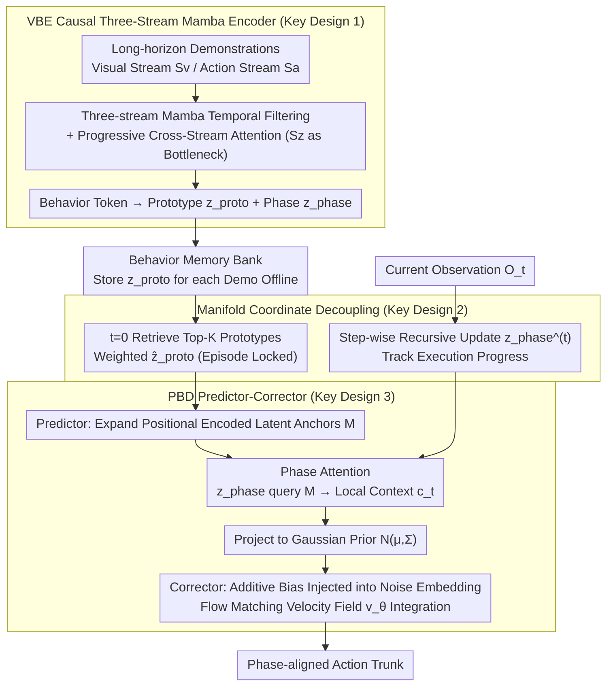

# From Abstraction to Instantiation: Learning Behavioral Representation for Vision-Language-Action Model

**Conference**: ICML 2026 Oral  
**arXiv**: [2605.22671](https://arxiv.org/abs/2605.22671)  
**Code**: [BehaviorVLA.github.io](https://BehaviorVLA.github.io)  
**Area**: Robotics / Embodied AI / VLA  
**Keywords**: VLA, Behavioral Representation, Mamba, Flow Matching, Sim-to-Real

## TL;DR
BehaviorVLA utilizes a causal three-stream Mamba encoder (VBE) to compress long-horizon demonstrations into time-invariant "behavioral prototypes $z_{\text{proto}}$" and time-variant "phase states $z_{\text{phase}}$". A phase-conditioned behavior decoder (PBD) then expands the behavioral skeleton into phase-aligned Gaussian priors using a Predictor-Corrector approach to guide a flow matching policy. This method achieves SOTA performance on LIBERO, RoboTwin 2.0, and CALVIN, and matches OpenVLA-OFT with only 50% of real-world data.

## Background & Motivation

**Background**: Vision-Language-Action (VLA) models (such as OpenVLA, $\pi_0$, $\pi_{0.5}$, and UniVLA) map vision-language backbones directly to action sequences, relying on large-scale simulation data to build general manipulation capabilities.

**Limitations of Prior Work**: Performance collapse under distribution shifts—changes in lighting, object materials, or camera perspectives lead to failure. Sim-to-Real typically requires expensive and difficult-to-scale real-world fine-tuning. Existing "latent action space" approaches (BeT, VQ-BeT, ACT) only mitigate local smoothness but suffer from two fundamental issues: (i) **Temporal fragmentation in short horizons**: cutting trajectories into independent chunks or discrete codebooks loses long-range dependencies; (ii) **Static execution alignment**: decoding actions from a fixed latent variable without sensing current progress leads to misalignment between actions and the physical scene.

**Key Challenge**: High-dimensional vision-action trajectories should concentrate near low-dimensional manifolds under the manifold hypothesis. However, standard VLA models learn mappings directly in environment space without explicit manifold constraints. Introducing such constraints often sacrifices real-time feedback and precision.

**Goal**: Simultaneously achieve (1) specific-to-general **abstraction**—distilling diverse demonstrations into unified behavioral representations; and (2) general-to-specific **instantiation**—projecting abstract behaviors back into precise, state-aligned actions.

**Key Insight**: Explicitly decouple the latent space into a "time-invariant global task topology $z_{\text{proto}}$" and a "time-variant execution phase $z_{\text{phase}}$". The former is retrieved and locked once at the beginning of an episode to provide a stable skeleton, while the latter updates online at each step to synchronize action generation with physical progress.

**Core Idea**: Use a three-stream Mamba architecture for "abstraction," and a Predictor-Corrector + phase attention for "instantiation" to expand the "skeleton" into "action priors." These are injected into the flow matching velocity field as an additive bias, achieving both global topological stability and local reactive control precision.

## Method

### Overall Architecture
The model augments the $\pi_{0.5}$ backbone with two modules: (1) **VBE (Visuomotor Behavior Encoder)**: A causal three-stream (Visual $S_v$ / Action $S_a$ / Behavior $S_z$) architecture where each stream uses Mamba for long-horizon temporal filtering, followed by cross-stream attention fusion to compress the trajectory into $\{z_{\text{proto}}, z_{\text{phase}}\}$. The $z_{\text{proto}}$ of each demonstration is stored offline in a Behavior Memory Bank. (2) **PBD (Phase-conditioned Behavior Decoder)**: Retrieves Top-K global prototypes to compute a weighted $\hat z_{\text{proto}}$, which is expanded into a sequence of positionally encoded latent anchors $\mathbf M$. $z_{\text{phase}}^{(t)}$ acts as a query for phase attention to obtain local context $c_t$, which is projected into a Gaussian prior $\mathcal N(\mu_\psi(c_t), \Sigma)$. Finally, the prior is injected via additive bias into the noise embedding of the flow matching policy, and final action trunks are integrated by the velocity field $v_\theta$. Each episode involves one prototype retrieval, while the phase is updated per step.

### Key Designs

**1. VBE Causal Three-Stream Mamba + Progressive Cross-Stream Attention: Compressing long-horizon vision/action sequences into "behavioral tokens"**

Standard frame-level encoders lose long-range causality, while simple multimodal concatenation loses spatial structure. VBE uses three independent Mamba streams ($S_v$, $S_a$, $S_z$) for temporal filtering. Each stream uses Zero-Order Hold (ZOH) discretization to obtain time-varying parameters $\bar{\mathbf A}_t = \exp(\bm \Delta_t \mathbf A)$ and $\bar{\mathbf B}_t = (\bm \Delta_t \mathbf A)^{-1}(\bar{\mathbf A}_t - \mathbf I)\bm \Delta_t \mathbf B$, where $\bm \Delta_t = \text{Softplus}(\text{Linear}(x_t^{(m)}))$ makes the step size input-dependent. This acts as a selective filter that suppresses background noise while preserving key events. The state recursion $h_t^{(m)} = \bar{\mathbf A}_t h_{t-1}^{(m)} + \bar{\mathbf B}_t \text{LN}(x_t^{(m)})$ includes gated connections. Spatial dimensions are handled via progressive cross-stream attention: visual and action streams first align low-level semantics, then the behavioral stream extracts global task structure using $[\tilde h^{(v)}_t; \tilde h^{(a)}_t]$ as key/value. Consequently, the behavioral stream becomes an information bottleneck, filtering residual noise and leaving the behavioral topology. The linear complexity $\mathcal O(L)$ of Mamba avoids the simultaneous struggle with long sequences and multimodality inherent in Transformers.

**2. Manifold Coordinate Decoupling: Global Prototype Retrieval + Online Phase States**

Attempting to handle both "what the task is" (stability) and "where we are now" (sensitivity) with a single latent variable is contradictory. BehaviorVLA splits them into two variables at different time scales. Global prototypes $z_{\text{proto}}$ are obtained during training by time-averaging behavioral tokens $z_{\text{proto}} = \tfrac{1}{T} \sum_t \tilde h_t^{(z)}$ and stored in a Memory Bank. During inference, at $t=0$, $q = \text{MLP}(\Phi(O_0, L))$ is used to retrieve a Top-K weighted sum:

$$\hat z_{\text{proto}} = \sum_{i \in \mathcal N_K} \text{softmax}(\langle q, k_i\rangle/\kappa) \cdot z_{\text{proto}}^{(i)}$$

This remains locked throughout the episode to provide a stable skeleton. The local phase $z_{\text{phase}}^{(t)} = \text{VBE}_{\text{causal}}(z_{\text{phase}}^{(t-1)}, O_t, a_{t-1})$ updates online each step. This orthogonal decomposition allows long-range task structures to be stabilized in a fixed vector while the online state provides real-time alignment with physical execution.

**3. PBD Predictor-Corrector: Phase-Aligned Prior + Flow Matching Geometric Bias**

Standard latent decoding often fails to keep up with dynamic scenes. PBD allows global structure and local precision to serve different roles. The Predictor expands $\hat z_{\text{proto}}$ into an $H$-step latent anchor sequence $\mathbf M = \mathcal G_\phi(\hat z_{\text{proto}}) \oplus \mathbf P_{\text{pos}}$ (where positional encoding provides canonical temporal geometry). The phase state then queries the anchors via $c_t = \text{Progress-Attn}(Q=z_{\text{phase}}^{(t)}, K=\mathbf M, V=\mathbf M)$ to interpolate and project into a Gaussian prior $\mathcal N(\mu_\psi(c_t), \Sigma)$. The Corrector utilizes conditional flow matching, where the critical step is injecting the prior into the noise embedding via additive bias:

$$\tilde e(a_\sigma) = e(a_\sigma) + \lambda \cdot \text{Proj}_\phi(\mu_{\text{prior}})$$

The velocity field $v_\theta$ predicts the Optimal Transport (OT) path velocity $u_\sigma = a_1 - a_0$ on this biased embedding (training uses Bernoulli dropout masking instead of a fixed $\lambda$ to prevent posterior collapse). Injecting the prior into the embedding rather than the action is mathematically equivalent to shifting the attention manifold of the flow matching toward high-probability regions—a "soft constraint" that retains generative flexibility while enforcing global topological consistency.

### Loss & Training
**Two-stage training**. Phase 1 (Behavioral Manifold Learning): $\mathcal L_{\text{Stage1}} = \mathcal L_{\text{rec}} + \alpha \mathcal L_{\text{global}} + \beta \mathcal L_{\text{local}}$. Reconstruction uses the JEPA principle, regressing both the next action and the next EMA visual encoding $\Phi_{\text{ema}}(O_{t+1})$ (using stop-gradient). Global loss uses supervised contrastive learning to pull $z_{\text{proto}}$ of identical behaviors together; local loss uses InfoNCE to differentiate $z_t$ across different time steps to prevent topological collapse. Phase 2 (Prior-guided Policy Tuning): $\mathcal L_{\text{Stage2}} = \mathcal L_{\text{flow}} + \lambda_{\text{prior}} \mathcal L_{\text{prior}}$, where flow matching loss is the MSE of OT path velocity and prior loss is the NLL of expert actions under the predicted Gaussian.

## Key Experimental Results

### Main Results
Average success rates in RoboTwin 2.0 Hard settings (domain randomization + noise, 20 tasks / 100 rollouts):

| Method | Bottle Flip | Box Tilt | Roll. Pin | Bread | Burger | Container | Average |
|--------|-------------|----------|-----------|-------|--------|-----------|---------|
| DP3 | 3% | 2% | 3% | 1% | 18% | 1% | Low |
| RDT | 75% | 43% | 11% | 2% | 27% | 17% | 20.3% |
| $\pi_0$ | 56% | 80% | 22% | 4% | 4% | 45% | ~25% |
| $\pi_{0.5}$ | 75% | 82% | 32% | 28% | 46% | 55% | ~50% |
| **BehaviorVLA** | **83%** | **90%** | **41%** | **36%** | **61%** | **62%** | **58%** |

Average success rates on LIBERO:

| Method | Spatial | Object | Goal | Long | Average |
|--------|---------|--------|------|------|---------|
| Diffusion Policy | 78.5 | 87.5 | 73.5 | 64.8 | 76.1 |
| OpenVLA-OFT | 97.6 | 98.4 | 97.9 | 94.5 | 97.1 |
| $\pi_{0.5}$ | 98.8 | 98.2 | 98.0 | 92.4 | 96.9 |
| **BehaviorVLA** | **99.2** | **99.4** | **98.8** | **94.6** | **98.0** |

The improvements in LIBERO-Long (+2.2 over $\pi_{0.5}$) validate the value of VBE’s long-horizon modeling and PBD’s phase alignment for "long-horizon manipulation."

### Ablation Study
| Config (VBE / PBD) | LIBERO Long | Real-World Gen. | Real-World Long |
|--------------------|-------------|-----------------|-----------------|
| — / — (Baseline) | 92.4 | 57.0 | 41.0 |
| ✓ / — | 93.8 | 65.0 | 48.0 |
| — / ✓ | 93.4 | 60.0 | 45.0 |
| ✓ / ✓ (Full) | 94.6 | 70.0 | 55.0 |

Real-World: BehaviorVLA achieves an average success rate 63% higher than strong baselines across 8 real-world tasks and matches full-data OpenVLA-OFT using only 50% of the demonstration data.

### Key Findings
- Removing VBE leads to a 16% drop in real-world performance—without abstraction, the model overfits to environment noise and loses task-invariant structures. Removing PBD leads to a 9.6% drop—without phase alignment, actions misalign with the scene during execution.
- Guidance intensity $\lambda$ has a clear "sweet spot": if too small, the prior provides no structural constraint; if too large, it suppresses the flow matching's local correction capability.
- The number of retrieved prototypes $k=5$ is optimal: too few make the prior sensitive to individual prototype bias, while too many introduce irrelevant prototypes that disturb the structure.
- t-SNE shows all three streams are essential—removing the visual stream causes tasks with similar motions but different visual semantics (e.g., "rolling a pin" vs. "wiping a table") to collapse together.

## Highlights & Insights
- **Explicit decoupling of latent space into "task topology + execution progress"**—A one-size-fits-all latent variable cannot be both stable and sensitive. BehaviorVLA’s division of these needs into variables at different time scales is the foundation of the architecture. This "dimension-based latent decomposition" can be applied to any long-horizon sequential decision task.
- **Additive bias injection into the flow matching velocity field** is an elegantly simple engineering trick for "prior injection." It avoids changing the flow matching objective, instead modifying the noise embedding to shift the manifold toward task topology, preserving generative capacity while enforcing global consistency.
- **Matching OpenVLA-OFT with only 50% data** is the most impactful practical conclusion of this paper—linking data efficiency directly to representation learning (VBE abstraction + prototype retrieval) rather than larger models or more demos, providing evidence for a "less data, smarter representation" path.

## Limitations & Future Work
- Global prototype retrieval depends on the **topological coverage of the offline prototype memory bank**. On novel tasks far from the training distribution, retrieved skeletons may be "geometrically consistent but functionally incorrect," misleading the PBD. Online manifold expansion mechanisms are needed.
- Flow matching Predictor-Corrector requires iterative ODE integration, leading to higher inference latency compared to pure regression baselines—a burden for high-frequency control on compute-constrained hardware. Consistency distillation is a potential future direction.
- Evaluations are mainly on tabletop bimanual manipulation; more complex scenarios like mobile manipulation and long-range planning (e.g., room-to-room) are not yet covered.
- Behavior labels rely on manual pre-definition. The supervised contrastive loss $\mathcal L_{\text{global}}$ requires paired "same behavior" annotations. Weakly supervised or unsupervised versions are a natural next step.

## Related Work & Insights
- **vs $\pi_{0.5}$ / OpenVLA-OFT**: While all are VLA + generative policies, previous methods rely on implicit mappings. BehaviorVLA adds a layer of manifold coordinate decoupling, improving generalization and data efficiency.
- **vs BeT / VQ-BeT / ACT**: These "latent action space" methods cut trajectories into chunks, losing long-range dependencies and utilizing static decoding. BehaviorVLA maintains global continuity through Mamba and avoids misalignment via real-time phase tracking.
- **vs MemoryVLA / RPT / ICRT / MTIL**: These works use history as raw context; BehaviorVLA explicitly decomposes history into retrieved global prototypes and online phase states, distinguishing "task memory" from "execution progress."

## Rating
- Novelty: ⭐⭐⭐⭐ The combination of three-stream Mamba, phase-conditioned flow matching, and prototype retrieval is rare in VLA, with original ideas in latent space decoupling.
- Experimental Thoroughness: ⭐⭐⭐⭐⭐ Comprehensive coverage across simulation benchmarks, real-world tasks, data efficiency ablations, and t-SNE visualizations.
- Writing Quality: ⭐⭐⭐⭐ Methodical progression from motivation to architecture and parametrization; clean formulas and rich diagrams.
- Value: ⭐⭐⭐⭐⭐ Matching OpenVLA-OFT with 50% data holds significant engineering importance for the community.

<!-- RELATED:START -->

## Related Papers

- [\[ICML 2026\] Dual-Stream Diffusion for World-Model Augmented Vision-Language-Action Model](dual-stream_diffusion_for_world-model_augmented_vision-language-action_model.md)
- [\[ICLR 2026\] AutoFly: Vision-Language-Action Model for UAV Autonomous Navigation in the Wild](../../ICLR2026/robotics/autofly_vision-language-action_model_for_uav_autonomous_navigation_in_the_wild.md)
- [\[ICML 2026\] Contrastive Representation Regularization for Vision-Language-Action Models](contrastive_representation_regularization_for_vision-language-action_models.md)
- [\[AAAI 2026\] Continuous Vision-Language-Action Co-Learning with Semantic-Physical Alignment for Behavioral Cloning](../../AAAI2026/robotics/continuous_vision-language-action_co-learning_with_semantic-.md)
- [\[ICML 2026\] Seeing Realism from Simulation: Efficient Video Transfer for Vision-Language-Action Data Augmentation](seeing_realism_from_simulation_efficient_video_transfer_for_vision-language-acti.md)

<!-- RELATED:END -->
