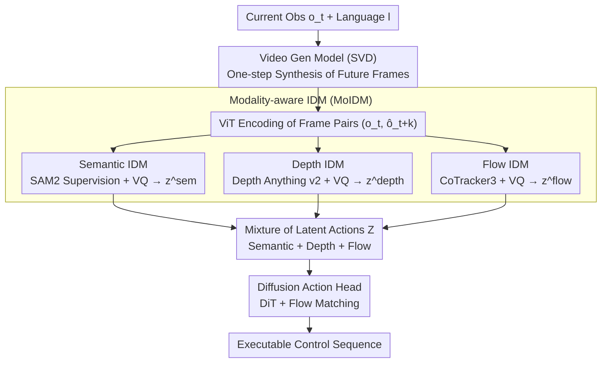

# From Imagined Futures to Executable Actions: Mixture of Latent Actions for Robot Manipulation

**Conference**: ICML 2026  
**arXiv**: [2605.12167](https://arxiv.org/abs/2605.12167)  
**Code**: https://logosroboticsgroup.github.io/MoLA (Available)  
**Area**: Robotics  
**Keywords**: Latent Actions, Inverse Dynamics, Video Generation, Robot Manipulation, Modality-aware

## TL;DR
MoLA employs a set of pre-trained "Modality-aware Inverse Dynamics Models (IDMs)" on large-scale robot data to translate future frames predicted by a video generation model into semantic, depth, and optical flow discrete latent actions. A policy head then performs control based on these action-centric representations, achieving robust and precise "imagine-and-execute" interfaces across CALVIN, LIBERO, LIBERO-Plus, and real-world UR5e platforms.

## Background & Motivation

**Background**: Current robot manipulation follows two main paradigms. One is the VLA approach (e.g., RT-1, $\pi_0$, OpenVLA), which learns an end-to-end action head directly from vision and language. The other is imagination-based policies (e.g., UniPi, VPP, DreamGen), which first use video generation models to predict future frames and then feed these "imagined futures" into a policy. The video imagination route is naturally capable of anticipating long-horizon outcomes, making it an attractive direction.

**Limitations of Prior Work**: There are two naive ways to drive a policy with imagined frames, both suboptimal. The first treats predicted frames as additional visual conditions for the action head, essentially forcing the head to learn the extraction of control signals from visual changes. The second directly decodes video into actions, making control entirely dependent on video prediction accuracy; any drift in long-range video prediction leads to action failure.

**Key Challenge**: The optimization goal of video generation models is "perceptual realism"—such as pixel MSE or perceptual loss—rather than being "control-relevant." Consequently, even if predicted frames appear realistic, they do not explicitly expose what physical actions drive the transitions between states. The path from image space to action space is inherently indirect and unstable.

**Goal**: To insert an "action-centric interface" between video imagination and policy execution, allowing the policy to reason in action space rather than pixel space. This interface must reliably derive actions from generated (and potentially noisy) future frames while remaining compatible with multimodal information.

**Key Insight**: Inverse Dynamics Models (IDMs) are naturally suited for this—by definition, they "infer the intermediate action given the visual change from $o_t$ to $o_{t+k}$." Applying an IDM to generated future frames effectively "back-decodes" video outputs into actions. Furthermore, manipulation relies on three complementary cues: semantics (task intent), depth (3D structure), and optical flow (interaction dynamics).

**Core Idea**: Utilizing "multimodal inverse dynamics models pre-trained on large-scale robot data" to translate generated future videos into a set of discrete latent actions (Mixture of Latent Actions) as the interface between video imagination and the policy head.

## Method

### Overall Architecture
Given a current RGB observation $o_t$ and a language instruction $l$, MoLA follows four steps: (1) A video generation model (using Stable Video Diffusion as the backbone with one-step denoising during inference) synthesizes future frames $\hat{o}_{t:t+H}$ as the "imagination space"; (2) Triple-stream IDMs (Semantic/Depth/Flow) infer discrete latent actions $z_{t \to t+k}^{(m)}$ from frame pairs $(o_t, \hat{o}_{t+k})$; (3) The triple-stream latent actions are aggregated into a mixture $\mathcal{Z}$; (4) A Diffusion Transformer + flow matching-based action head consumes the latent actions and generated visual features to output continuous executable control sequences. Training occurs in three stages: fine-tuning the video generation model, pre-training the MoIDM, and finally end-to-end fine-tuning of the MoIDM and action head (while keeping the video model frozen).

### Key Designs

**1. Modality-aware Inverse Dynamics Models (MoIDM): Translating Changes into Latent Actions via Semantic/Depth/Flow Specialization**

Video generation models optimize for "visual realism" and do not explicitly expose the physical actions driving state changes. IDMs, defined by the task of inferring actions from two frames, fill this gap. However, a single-stream IDM might conflate task semantics, geometry, and interaction motion into one codebook, causing interference. MoLA decouples this into three streams, each with an independent spatio-temporal Transformer $T^{(m)}$ and VQ codebook. Frame pairs are encoded via ViT, and learnable latent action queries interact with these features to obtain $\tilde{h} = T^{(m)}(q^{(m)}, h_t, h_{t+k})$, followed by VQ to get $z^{(m)} = \text{VQ}^{(m)}(\tilde{h})$. While sharing the RGB inference pipeline, different reconstruction objectives enforce modality biases: SAM2 for semantics, Depth Anything v2 for depth, and CoTracker3 for flow. This ensures each codebook captures task intent, 3D structure, or interaction dynamics respectively, maximizing complementarity.

**2. Large-scale Pre-training + Joint Fine-tuning: Stabilizing Inference on Noisy Generated Frames**

IDMs must work not only on real frames but also on generated future frames that may exhibit slight drift. MoLA achieves this in two steps: first, independently pre-training the triple-stream IDMs on large-scale robot data (e.g., Open X-Embodiment + AgiBot) using real future frames to learn general action semantics. Second, on downstream tasks, freezing the video generation model and fine-tuning the MoIDM and action head end-to-end to allow the IDM to co-adapt to the distribution of "generated frames." Ablations show both steps are essential—starting from scratch results in significant performance drops due to insufficient exposure to visual variations, while freezing the MoIDM prevents it from evolving alongside the policy.

**3. Flow Matching-based Diffusion Action Head: Decoding Latent Actions into Continuous Control**

Latent actions are intermediate cues distilled from imagination, while final control remains a continuous, time-correlated, and multimodal distribution. MoLA's action head employs a Diffusion Transformer (DiT) trained from scratch using a flow matching objective instead of standard diffusion loss. It learns a continuous mapping from noisy action samples to target actions, conditioned on the triple-stream latent actions and predicted visual features. Experiments indicate that while a lighter autoregressive token head can function (proving the information density of latent actions), the DiT + flow matching setup provides superior long-horizon dependency handling and robustness to imperfect latent actions.

### Loss & Training
During the IDM pre-training stage, each stream uses two reconstruction targets: a shared RGB decoder to reconstruct future RGB frames, and a modality-specific decoder to reconstruct features/labels from foundation models. In the downstream stage, the video generation model is frozen, and the MoIDM + action head are trained end-to-end using a flow matching loss. The pipeline follows a three-stage strategy: video fine-tuning $\to$ MoIDM pre-training $\to$ end-to-end fine-tuning.

## Key Experimental Results

### Main Results
Evaluation covers CALVIN ABC-D long-horizon tasks, LIBERO's four lifelong suites, LIBERO-Plus (10,030 tasks with perturbations), and real-world UR5e.

| Benchmark | Metric | MoLA | Prev. SOTA | Gain |
|-----------|------|------|----------|------|
| CALVIN ABC-D | Avg. Len. | 4.55 | DreamVLA 4.44 | +0.11 |
| LIBERO (Avg. of 4) | Success % | 97.0 | VPP 90.9 | +6.1 |
| LIBERO-Plus | Avg. % | 92.7 | OpenVLA-OFT+ 79.5 | +13.2 |
| Real Robot (in+OOD avg) | Success % | 73.0 | VPP 62.0 | +11.0 |

On CALVIN, MoLA increases the success rate of completing 5 consecutive sub-tasks from the previous SOTA of 76.9% (VPP) to 82.6%. The 13.2% gain on LIBERO-Plus highlights its stability in robustness dimensions such as perturbations, lighting changes, and initial state variations. On real hardware, while not surpassing the commercial-grade $\pi_{0.5}$, it maintains a steady 11% lead over similar "imagination + policy" routes like VPP.

### Ablation Study

| Modality Combination | CALVIN Avg. Len. ↑ | Description |
|---------|--------------------|------|
| Baseline (No MoIDM, direct frames) | 4.24 | Weakest |
| Sem only | 4.31 | Task semantics useful |
| Depth only | 4.35 | 3D structure more informative |
| Flow only | 4.39 | Strongest single modality |
| Flow + Depth | 4.46 | Bimodal complementarity |
| All (Sem + Depth + Flow) | **4.55** | Full integration optimal |

### Key Findings
- Adding the three IDM streams leads to a monotonic increase in Avg. Len. (4.24 $\to$ 4.55), proving they are truly complementary rather than redundant. Optical flow contributes the most among single modalities, validating that "manipulation is essentially interaction dynamics."
- Even the "baseline (no IDM)" is weaker than versions where visual features are fed without IDM structures, suggesting that the VQ discrete latent action bottleneck serves as an effective inductive bias, making the "image $\to$ action" mapping easier to learn.
- MoLA significantly outperforms VPP with only 10% of CALVIN data, indicating that the "pre-trained IDM + latent action interface" provides a strong prior beneficial in low-data scenarios.
- Replacing "imagined futures" with duplicated current frames or noisy current frames at inference time leads to a significant performance drop, showing that the latent action mechanism and real future cues are both necessary.

## Highlights & Insights
- **Modality Specialization**: The observation that a single IDM is insufficient led to the decoupled modality scheme, avoiding the "codebook collapse" where different signals compete. This pattern of training modality experts with foundation model supervision is transferable to other vision-action-language bridging tasks.
- **VQ Bottleneck Importance**: The fact that the baseline (no IDM) performs worse than the weakest single-stream IDM version suggests that compressing high-dimensional visual changes into discrete tokens helps the policy filter out control-irrelevant details, a finding applicable to other "high-dim condition to low-dim decision" problems like GUI agents.
- **Modular Pipeline**: By assigning roles to the video model (generator), IDM (interpreter), and action head (executor), MoLA can easily swap underlying video models (e.g., replacing SVD with Wan2.2 improves results), providing a clean way to integrate video generation progress into robotics.

## Limitations & Future Work
- Keeping the video generation model frozen limits the upper bound of joint optimization; future work using lighter models that can be fine-tuned might bridge the distribution gap between generated and real frames.
- While outperforming VPP, MoLA still trails ultra-large-scale commercial VLAs like $\pi_{0.5}$ in absolute scores, suggesting the "imagination + interface" route currently serves as a strong trade-off for medium-scale data rather than a total replacement for billion-parameter VLAs.
- The modality choice is fixed (Semantic/Depth/Flow); incorporating tactile, proprioceptive, or force feedback remains unexplored.
- Despite using one-step denoising, running the video model + triple IDMs + DiT head introduces latency that may be tight for high-frequency control scenarios.

## Related Work & Insights
- **vs. VLA (OpenVLA / $\pi_0$ / GR00T)**: These map perception directly to action without explicit "imagination" steps. MoLA adds an imagination layer for better long-horizon stability at the cost of higher inference overhead.
- **vs. VPP (Video Prediction Policy)**: Both use video prediction, but VPP treats generated frames simply as visual conditions. MoLA's MoIDM "pre-digests" visual changes into actions, raising CALVIN Avg. Len. from 4.33 to 4.55.
- **vs. DreamGen / UniPi**: These treat video generation as the policy backbone. MoLA argues that a latent action interface is more robust than pure video-to-action decoding.
- **vs. LAPA / UniVLA**: These share the IDM/latent action idea but use single-stream encoding. MoLA's modular decomposition and VQ codebook represent a more refined evolution of this lineage.

## Rating
- **Novelty**: ⭐⭐⭐⭐ "Triple-stream modality-aware IDM + discrete latent action interface" is a clean design, though IDM prototypes exist in prior literature like LAPA.
- **Experimental Thoroughness**: ⭐⭐⭐⭐⭐ Comprehensive coverage across three simulation suites, real robot tests, data efficiency studies, and seven ablation questions.
- **Writing Quality**: ⭐⭐⭐⭐ Clear narrative flow from the "visual vs. control" conflict to the MoIDM solution with a strong logical chain.
- **Value**: ⭐⭐⭐⭐ Provides a highly convincing interface design for "video-driven robotics" and will likely serve as a strong baseline for future video-based VLA research.

<!-- RELATED:START -->

## Related Papers

- [\[CVPR 2026\] Learning to Act Robustly with View-Invariant Latent Actions](../../CVPR2026/robotics/learning_to_act_robustly_with_view-invariant_latent_actions.md)
- [\[ICLR 2026\] From Spatial to Actions: Grounding Vision-Language-Action Model in Spatial Foundation Priors](../../ICLR2026/robotics/from_spatial_to_actions_grounding_vision-language-action_model_in_spatial_founda.md)
- [\[ICML 2026\] Mixture of Horizons in Action Chunking](mixture_of_horizons_in_action_chunking.md)
- [\[CVPR 2026\] From Manuals to Actions: A Unified VLA Model for Chain-of-Thought Manual Generation and Robotic Manipulation](../../CVPR2026/robotics/from_manuals_to_actions_a_unified_vla_model_for_chain-of-thought_manual_generati.md)
- [\[CVPR 2026\] Training One Model to Master Cross-Level Agentic Actions via Reinforcement Learning](../../CVPR2026/robotics/training_one_model_to_master_cross-level_agentic_actions_via_reinforcement_learn.md)

<!-- RELATED:END -->
