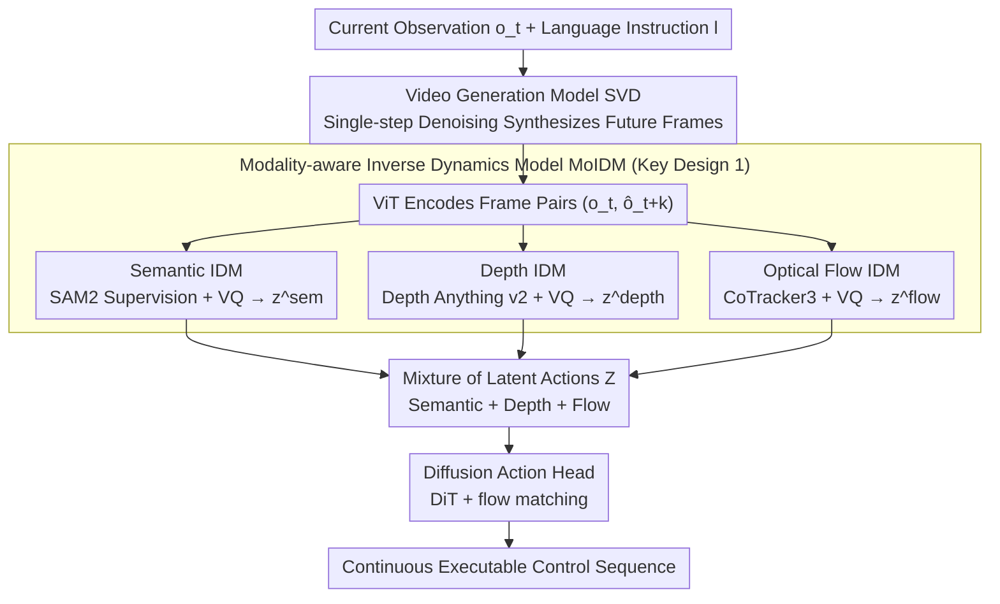

# From Imagined Futures to Executable Actions: Mixture of Latent Actions for Robot Manipulation

**Conference**: ICML 2026  
**arXiv**: [2605.12167](https://arxiv.org/abs/2605.12167)  
**Code**: https://logosroboticsgroup.github.io/MoLA (Available)  
**Area**: Robotics  
**Keywords**: Latent Actions, Inverse Dynamics, Video Generation, Robot Manipulation, Modality-aware

## TL;DR
MoLA utilizes a set of "Modality-aware Inverse Dynamics Models (IDM)" pre-trained on large-scale robotic data to translate future frames predicted by a video generation model into three-way discrete latent actions (semantic, depth, and optical flow). A policy head then performs control based on these action-centric representations, making the "imagine-execute" interface both stable and precise across CALVIN, LIBERO, LIBERO-Plus, and real UR5e platforms.

## Background & Motivation

**Background**: Current robot manipulation follows two mainstream paths. One is VLA (e.g., RT-1, $\pi_0$, OpenVLA), which learns an end-to-end action head directly from vision and language. The other is imagination-based policy (e.g., UniPi, VPP, DreamGen), which first predicts future frames using a video generation model and then feeds these "imagined futures" into the policy. The video imagination route is attractive as it naturally anticipates long-term outcomes.

**Limitations of Prior Work**: There are two naive ways to drive policies using imagined frames, both suboptimal. The first treats predicted frames as additional visual conditions for the action head, essentially forcing the action head to learn the extraction of control signals from visual changes. The second directly decodes video into actions, making control entirely dependent on video prediction accuracy; once long-range video prediction drifts, the actions drift accordingly.

**Key Challenge**: The optimization objective of video generation models is "perceptual realism"—such as pixel MSE or perceptual loss—rather than "control relevance." Therefore, even if predicted frames look realistic, they do not explicitly expose what physical actions drive the transitions between states. The path from image space to action space is inherently indirect and unstable.

**Goal**: To insert an "action-centric interface" between video imagination and policy execution, allowing the policy to reason in action space rather than pixel space. Simultaneously, this interface must reliably infer actions from (potentially noisy) generated future frames and remain compatible with multi-modal information.

**Key Insight**: The authors observe that Inverse Dynamics Models (IDM) are naturally suited for this task—defined as "inferring the intermediate action given the visual change from $o_t$ to $o_{t+k}$." Applying an IDM to generated future frames effectively "back-decodes" the video generation output into actions. Since a single IDM tends to compress all signals into one codebook, the authors further observe that manipulation relies on three complementary cues: semantics (task intent), depth (3D structure), and optical flow (interaction dynamics).

**Core Idea**: Use "modality-aware multi-path inverse dynamics models pre-trained on large-scale robotic data" to translate generated future videos into a set of discrete Mixture of Latent Actions (MoLA) as an interface between video imagination and the policy head.

## Method

### Overall Architecture
Given the current RGB observation $o_t$ and language instruction $l$, MoLA follows four steps: (1) A video generation model (using Stable Video Diffusion as the backbone with single-step denoising during inference) synthesizes future frames $\hat{o}_{t:t+H}$ as the "imagination space"; (2) Three-way IDMs (Semantic/Depth/Flow) perform inference on frame pairs $(o_t, \hat{o}_{t+k})$ to output discrete latent actions $z_{t \to t+k}^{(m)}$; (3) The three-way latent actions are concatenated into a mixture $\mathcal{Z}$; (4) A Diffusion Transformer + flow matching based action head takes the latent actions and generated visual features to output continuous executable control sequences. Training occurs in three stages: fine-tuning the video generation model, pre-training MoIDM, and finally end-to-end fine-tuning of MoIDM and the action head (while keeping the video generation model frozen).

### Key Designs

**1. Modality-aware Inverse Dynamics Model (MoIDM): Translating Changes into Latent Actions via Semantic/Depth/Flow Specialization**

While video models optimize for "visual realism," they do not explicitly expose the physical actions driving state changes. IDMs fill this gap by "inferring actions from two-frame changes." To avoid interference between task semantics, geometry, and interaction motion in a single codebook, MoLA splits the IDM into three branches, each with an independent spatio-temporal Transformer $T^{(m)}$ and VQ codebook. After ViT encoding of $o_t$ and $o_{t+k}$, learnable latent action queries interact with the features to obtain $\tilde{h} = T^{(m)}(q^{(m)}, h_t, h_{t+k})$, followed by VQ to get $z^{(m)} = \text{VQ}^{(m)}(\tilde{h})$. Branches share the RGB inference pipeline but use different reconstruction supervisions—SAM2 for semantics, Depth Anything v2 for depth, and CoTracker3 for optical flow. This ensures each codebook captures specific task intents, 3D structures, or interaction dynamics. Ablations show that merging these or sharing codebooks significantly degrades performance.

**2. Large-scale Pre-training + Joint Fine-tuning: Enabling Stable Inference on Noisy Generated Frames**

The IDM must work not only on real frames but also on generated, slightly drifted future frames. MoLA achieves this in two steps: first, pre-training the three-way IDMs independently on large-scale robotic data (e.g., Open X-Embodiment + AgiBot) using real future frames to learn general action semantics; second, freezing the video model while fine-tuning MoIDM and the action head together on downstream tasks. This allows the IDM to co-adapt to the distribution of "generated frames." Ablations show both steps are essential—training from scratch results in failure due to insufficient exposure to visual changes, while freezing MoIDM prevents it from evolving with the policy.

**3. Flow Matching-based Diffusion Action Head: Decoding Latent Actions into Continuous Control**

Latent actions are intermediate cues distilled from imagination; final control remains a continuous, time-correlated distribution. The MoLA action head uses a Diffusion Transformer (DiT) trained from scratch with a flow matching objective rather than standard diffusion loss. It learns a continuous transformation from noise to target actions conditioned on the triple latent actions and visual features from predicted frames. While lighter autoregressive token heads can work (indicating latent actions are informative), DiT + flow matching offers superior robustness to long-term dependencies and imperfect latent actions.

### Loss & Training
During the IDM pre-training stage, each branch uses two reconstruction targets: a shared RGB decoder to reconstruct future frames and modality-specific decoders to reconstruct features/labels from foundation models. In the downstream stage, the video generation model is frozen, and MoIDM + the action head are trained end-to-end using flow matching loss. The pipeline follows a three-stage strategy: video fine-tuning $\to$ MoIDM pre-training $\to$ end-to-end fine-tuning.

## Key Experimental Results

### Main Results
Evaluation covers CALVIN ABC-D long-horizon tasks, LIBERO's four lifelong suites, LIBERO-Plus (10,030 robust tasks with perturbations), and real UR5e experiments.

| Benchmark | Metric | MoLA | Prev. SOTA | Gain |
|-----------|------|------|----------|------|
| CALVIN ABC-D | Avg. Len. | 4.55 | DreamVLA 4.44 | +0.11 |
| LIBERO (Avg. 4 sets) | Success % | 97.0 | VPP 90.9 | +6.1 |
| LIBERO-Plus | Avg. % | 92.7 | OpenVLA-OFT+ 79.5 | +13.2 |
| Real Robot (Avg. In+OOD) | Success % | 73.0 | VPP 62.0 | +11.0 |

On CALVIN, MoLA improves the success rate for completing 5 consecutive sub-tasks from 76.9% (VPP) to 82.6%. The 13.2% gain on LIBERO-Plus demonstrates significantly higher robustness against perturbations, lighting changes, and initial state variations. On the real robot, although it does not surpass commercial-grade $\pi_{0.5}$, it maintains an 11% lead over similar "video imagination + policy" approaches like VPP.

### Ablation Study

| Modality Combination | CALVIN Avg. Len. ↑ | Description |
|---------|--------------------|------|
| Baseline (No MoIDM, direct future frames) | 4.24 | Weakest |
| Sem only | 4.31 | Task semantics are useful alone |
| Depth only | 4.35 | 3D structure provides stronger cues |
| Flow only | 4.39 | Strongest single modality (interaction dynamics matter most) |
| Flow + Depth | 4.46 | Complementary modalities |
| All (Sem + Depth + Flow) | **4.55** | Full triple-modality is optimal |

### Key Findings
- The addition of the three IDM branches results in a monotonic increase in Avg. Len. (4.24 $\to$ 4.31 $\to$ 4.35 $\to$ 4.39 $\to$ 4.46 $\to$ 4.55), confirming they are complementary rather than redundant. Optical flow contributes the most, reinforcing that the essence of manipulation is interaction dynamics.
- The "baseline (no IDM)" is weaker than even the weakest single-modality IDM setup, suggesting the discrete VQ latent action bottleneck itself serves as an effective inductive bias, making "vision $\to$ action" mapping easier to learn.
- MoLA outperforms VPP significantly with only 10% of CALVIN data, indicating that the pre-trained IDM and latent action interface provide strong priors particularly beneficial in low-data scenarios.
- Replacing "imagined futures" with copies of the same frame or noisy current frames during inference leads to significant drops, proving that both the latent action mechanism and genuine future cues are indispensable.

## Highlights & Insights
- **The observation that a single IDM is insufficient led directly to the modality-specialized solution**, avoiding the common pitfall of competing signals within a single codebook. This paradigm of "training one expert per modality using foundation models as supervision" is highly transferable to other tasks bridging vision and action/language.
- **The discrete VQ bottleneck is more critical than expected**: The fact that the baseline (without IDM) underperforms compared to vision-only features plus the bottleneck suggests that compressing high-dimensional visual changes into discrete tokens helps the policy filter out control-irrelevant details—a finding applicable to other "high-dim condition to low-dim decision" problems like GUI agents.
- **The modular three-part division (Video model as Generator, IDM as Interpreter, Action head as Executor)** allows MoLA to seamlessly swap underlying models (e.g., replacing SVD with Wan2.2 improves performance). This provides a clean way to integrate video generation progress into robotics.

## Limitations & Future Work
- Keeping the video generation model frozen limits the ceiling for joint optimization; using lighter video models for fine-tuning might further reduce the distribution gap between generated and real frames.
- In real-world experiments, "corporate-scale" VLAs like $\pi_{0.5}$ still outperform MoLA on average, suggesting the "video imagination + interface" route is currently a compromise better suited for medium-scale data rather than a complete replacement for ultra-large-scale end-to-end VLAs.
- The modality choice is fixed (semantic/depth/flow). Integrating tactile, kinematic, or force feedback as sensing modalities was not discussed; multi-modal expansion and learned modality weightings are natural next steps.
- Although single-step denoising is used, the inference pipeline (Video gen + 3-way IDMs + DiT) may still present latency challenges for high-frequency control.

## Related Work & Insights
- **vs. VLA (OpenVLA / $\pi_0$ / GR00T)**: These map perception to action directly without an explicit "imagination" step. MoLA adds an imagination layer for stability in long-horizon and OOD scenarios at the cost of higher inference overhead.
- **vs. VPP (Video Prediction Policy)**: Both use "predict future then drive policy," but VPP uses generated frames directly as conditions, requiring the action head to learn "visual change $\to$ control" from scratch. MoLA "pre-digests" this via MoIDM, improving CALVIN Avg. Len. from 4.33 to 4.55.
- **vs. DreamGen / UniPi**: These treat video generation as the policy backbone. MoLA argues that an action-centric latent interface is key for robustness compared to pure video-to-action decoding.
- **vs. LAPA / UniVLA**: These also use latent actions but with a single encoding rather than explicit modality decomposition. MoLA's specialized modalities and VQ codebooks represent a significant refinement of this research line.

## Rating
- **Novelty**: ⭐⭐⭐⭐ The "three-way modality-aware IDM + discrete latent action interface" is a clean design, though IDM and single-path LAPA have precursors in literature.
- **Experimental Thoroughness**: ⭐⭐⭐⭐⭐ Comprehensive coverage across three simulation suites, real robot tests, data efficiency analysis, and seven ablation questions.
- **Writing Quality**: ⭐⭐⭐⭐ The narrative effectively bridges the gap between "perceptual realism vs. control relevance" to justify MoIDM.
- **Value**: ⭐⭐⭐⭐ Provides one of the most convincing interface designs for video-imagination-driven robotics and will likely serve as a strong baseline for future video-based VLA research.

<!-- RELATED:START -->

## Related Papers

- [\[CVPR 2026\] Learning to Act Robustly with View-Invariant Latent Actions](../../CVPR2026/robotics/learning_to_act_robustly_with_view-invariant_latent_actions.md)
- [\[ICLR 2026\] From Spatial to Actions: Grounding Vision-Language-Action Model in Spatial Foundation Priors](../../ICLR2026/robotics/from_spatial_to_actions_grounding_vision-language-action_model_in_spatial_founda.md)
- [\[ICML 2026\] Mixture of Horizons in Action Chunking](mixture_of_horizons_in_action_chunking.md)
- [\[CVPR 2026\] From Manuals to Actions: A Unified VLA Model for Chain-of-Thought Manual Generation and Robotic Manipulation](../../CVPR2026/robotics/from_manuals_to_actions_a_unified_vla_model_for_chain-of-thought_manual_generati.md)
- [\[CVPR 2026\] Training One Model to Master Cross-Level Agentic Actions via Reinforcement Learning](../../CVPR2026/robotics/training_one_model_to_master_cross-level_agentic_actions_via_reinforcement_learn.md)

<!-- RELATED:END -->
