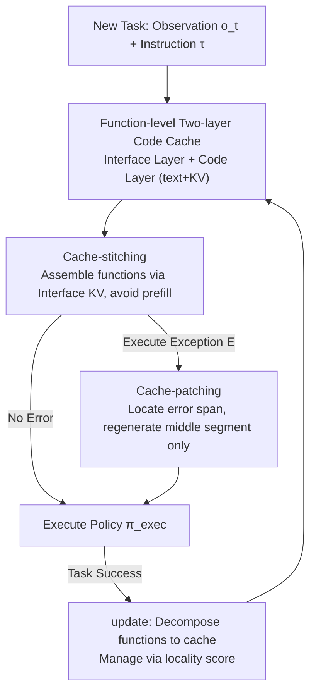

# Functional Cache Grafting: Robust and Rapid Code-Policy Synthesis for Embodied Agents

**Conference**: ICML 2026  
**arXiv**: [2606.13097](https://arxiv.org/abs/2606.13097)  
**Code**: To be confirmed  
**Area**: Robotics / Embodied AI / Code-as-Policies / KV Caching  
**Keywords**: Embodied agent, Code-as-Policies, function-level KV cache, cache-stitching, cache-patching

## TL;DR
Addressing the dual issues of Code-as-Policies (CaP)—specifically, their slow response (repeated prefilling of long prompts) and fragility (API mismatches, lack of safety checks) due to generating code from scratch—FCGraft maintains a library of "function-level verified code skeletons + corresponding KV caches." It utilizes cache-stitching to assemble the KV pairs of cached functions into new policies and cache-patching to locally regenerate only the erroneous segments. On open-domain tasks like ALFRED and RLBench, FCGraft achieves an 18.31% higher success rate and a 2.3× reduction in synthesis latency compared to RAGCache.

## Background & Motivation
**Background**: Large Language Models capable of coding (CodeLLMs) have given rise to the Code-as-Policies (CaP) paradigm, which translates natural language goals and environmental constraints into executable control programs that drive robots via predefined APIs. This leverages the generalization capabilities of CodeLLMs to supplement specialized policy learning, offering more flexibility than direct policy learning.

**Limitations of Prior Work**: CaP faces two fundamental shortcomings in real-world deployment. ① **Decoding Latency**: CaP prompts often contain lengthy specifications and examples;每 arrival of a new instruction requires repeating the prefill for thousands of tokens, which is too slow for time-sensitive scenarios (e.g., immediate response to a gas leak). ② **Poor Robustness**: Fully generative decoding frequently produces code with API mismatches, lacking safety guardrails, or unstable control logic, directly leading to task failure.

**Key Challenge**: Achieving both "robustness" (reusing verified control structures) and "speed" (avoiding redundant computation) is critical. However, existing methods fail on both counts: memory-based embodied agents mostly focus on **text-level** reuse, saving little computation; existing KV caching methods only support **document-level** prefix reuse and **lack function-level adaptation**, failing to support the constant local rewrites required in open-domain tasks.

**Goal**: This work decomposes the problem into two sub-problems—how to reuse KV caches at a **functional granularity** to eliminate redundant prefilling, and how to **locally rewrite** only the erroneous parts during reuse to maintain the robustness of verified structures while minimizing the amount of decoding.

**Key Insight**: The authors draw inspiration from the robotic "skill reuse" concept (predefined skills = action sequences, combined + adapted for environment constraints), but change the unit of reuse from "textual skills" to "function-level KV states," thereby gaining both efficiency and reliability.

**Core Idea**: Transform the native KV caching mechanism into a function-level two-layer cache. When a new task arrives, the system **retrieves relevant functions and grafts their KV caches**. It first uses cache-stitching to combine cached functions into a composite policy (eliminating structural errors and avoiding prefilling), then uses cache-patching to perform minimal decoding adaptation only on necessary segments.

## Method

### Overall Architecture
FCGraft replaces "generating code from scratch" with "grafting verified function caches." It is built on two core mechanisms: ① **Function-level KV Cache**—splitting past successful code policies into callable functions stored in a two-layer code cache $\mathcal{H}=(\mathcal{I},\mathcal{C})$, where each layer retains both text and KV representations; ② **Grafted Code-Policy Synthesis**—cache-stitching uses the Interface-layer KV to assemble functions into policies, and cache-patching uses the Code-layer KV to repair errors locally. These are not independent tricks but two complementary stages of a unified pipeline: stitching separates "invariant regions" from "adaptation points" and eliminates internal errors, while patching addresses the remaining local surface errors. In the task execution loop, stitching synthesizes and executes first; if a runtime exception is thrown, patching triggers to correct and resume. Upon success, the `update` process decomposes the new functions back into the cache—forming a positive feedback loop of "more reuse → better stitching → cheaper patching."

### Key Designs

**1. Function-level Two-layer Code Cache + Locality Score Management: Reducing the "Reuse Unit" from Text to Function KV**

To address the issue that existing caches only reuse at the document/text level—saving little computation and failing to support function-level editing—FCGraft restructures the native KV cache into two layers, indexed by function identifier $f_k$: $\mathcal{H}=(\mathcal{I},\mathcal{C})$. The interface layer $\mathcal{I}=\{(f_k,i_k^{\text{text}},i_k^{\text{KV}})\}$ stores only function signatures (parameters + names) and their KVs for lightweight grafted generation. The code layer $\mathcal{C}=\{(f_k,c_k^{\text{text}},c_k^{\text{KV}})\}$ stores full verified implementations and their KVs. Crucially, **interface KVs can be re-injected into the CodeLLM without recalculating cross-attention**, treating each function interface as an independent module not bound to a fixed prefix position. To manage the cache within limited GPU memory, each function is assigned a locality score:

$$\ell(f_k)=(1-\ell_{\text{curr}}(f_k))\cdot\big(\alpha\,\ell_{\text{freq}}(f_k)+\beta\sum\nolimits_j \ell_{\text{asso}}(f_j\mid f_k)+\gamma\,\ell_{\text{sema}}(f_k)\big)+\ell_{\text{curr}}(f_k)$$

Where $\ell_{\text{curr}}\in\{0,1\}$ forces retention of recently used functions, and other terms integrate frequency, conditional association with co-called functions, and perplexity-based semantic relevance ($\alpha+\beta+\gamma=1$). High scores remain in GPU VRAM, while low scores (especially $c_k^{\text{KV}}$) are offloaded to DRAM.

**2. Cache-stitching: Directly Combining Functions with Interface KV to Eliminate "Internal Errors" and Avoid Prefill**

Addressing the weakness that generating from scratch causes irreparable structural errors and wastes power on repeated prefilling, stitching directly links cached function segments into a new policy. The authors categorize code errors into two types: **Internal Errors** (API sequence errors, control logic errors hidden inside function bodies) and **Surface Errors** (parameter mismatches, variable value errors fixable without changing the function body). The core insight is: **reusing verified KV caches for assembly ensures the synthesized policy only contains surface-level errors**, creating a repairable state for downstream patching. Given observation $o_t$, instruction $\tau$, and interface KV set $\mathcal{I}_{\text{KV}}$, the CodeLLM generates $\pi_{\text{code}}\sim\pi_\theta(\cdot\mid o_t,\tau,\mathcal{I}_{\text{KV}})$. Then, the implementations of functions called in $\pi_{\text{code}}$ are retrieved from the code layer $\mathcal{C}$ and linked to create the executable program $\pi_{\text{exec}}$.

**3. Cache-patching: Locating and Regenerating Only Erroneous Segments via Prefix KV Reuse**

To avoid the slowness and potential for new errors in full regeneration, patching targets only local segments. Triggered by a runtime exception $E$, it splits $\pi_{\text{exec}}$ into three parts $[x_{\text{pre}}^{\text{text}}\|x_{\text{err}}^{\text{text}}\|x_{\text{suf}}^{\text{text}}]$. It **reuses the prefix KV state $x_{\text{pre}}^{\text{KV}}$ and only generates the middle segment** $x_{\text{mid}}^{\text{text}}=\pi_\theta(x_{\text{pre}}^{\text{KV}},\mathrm{CoT}(\cdot,c_k^{\text{KV}},E))$, using a one-time Chain-of-Thought (CoT) inference to locate the root cause of $E$. Because it skips prefilling for the prefix and focuses decoding only on the error span, patching is significantly faster than full regeneration.

### Loss & Training
This work does not train a new model; instead, the objective is formulated as an idealized formal optimization: $\pi_\theta^*=\arg\max_{\pi_\theta}\mathbb{E}_{d\sim\mathcal{D}}\mathbb{E}_{\pi_{\text{code}}\sim\pi_\theta}\big[\mathrm{SR}(\mathrm{Exec}(\pi_{\text{code}}),g_d)-\eta\,\mathrm{PSL}(\pi_\theta)+\mu\,\mathrm{CSIM}(\pi_\theta)\big]$. This aims to maximize the Success Rate (SR) while minimizing Policy Synthesis Latency (PSL), using code similarity (CSIM) as a regularizer to encourage consistent behavior across tasks. Qwen2.5-Coder-14B is used as the default CodeLLM on an RTX 4090 without fine-tuning.

## Key Experimental Results

### Main Results
Evaluated on ALFRED and RLBench across three dynamic open-domain scenarios (Open-Composition / Open-Perturbation / Open-Evolution) against 9 baselines.

| Benchmark / Scenario | Method | SR↑ | PSL↓(s) | Rank↓ |
|------------------|------|-----|---------|-------|
| ALFRED · Open-Composition | FCGraft | **61.58** | **5.82** | 1 |
| ALFRED · Open-Composition | LRLL (Sub-optimal) | 56.28 | 16.02 | 2 |
| ALFRED · Open-Composition | RAGCache | 39.29 | 13.48 | 7 |
| ALFRED · Open-Evolution | FCGraft | **55.89** | **6.29** | 1 |
| RLBench · Open-Composition | FCGraft | **45.91** | **3.24** | 1 |
| RLBench · Open-Composition | CAG (Sub-optimal) | 26.37 | 8.53 | 2 |

Average relative to RAGCache: SR increased by **18.31%**, PSL reduced by **2.3×**. The SR improvement is not just a byproduct of lower latency but stems from the reuse of verified interfaces/implementations biasing generation toward reliable structures.

### Physical Robot + Behavioral Consistency Analysis
Conducted a real-world desk organization and cooking station preparation (the latter involving immediate error correction for a detached gas hose).

| Setting | Metric | FCGraft | Control | Note |
|------|------|---------|------|------|
| Robot · Desk Organization | SR↑ | **77.78** | CaP 33.33 | 37.04 pts higher than CaP |
| Robot · Cooking Station | SR↑ / PSL↓ | **81.48 / 2.85** | RAGCache 37.04 / 9.63 | PSL reduced by ~2.88× |
| RLBench Continual (Final) | SR↑ | **46.00** | CaP 37.33 | SR increases as tasks accumulate |

### Key Findings
- **Positive feedback loop drives sustained performance**: Cache-stitching produces more reliable code, and cache-patching fixes errors efficiently, both increasing the retention rate of functions in the cache. More retention → better stitching → easier future patching.
- **Complementary Mechanisms**: Stitching targets structural errors and saves prefilling; patching targets local errors and saves decoding. Under Open-Perturbation, patching handles API-level exceptions from object state changes.
- **Consistency and Transfer**: FCGraft demonstrates positive forward transfer (FWT), where SR improves over time as meaningful function compositions are discovered and reused.

## Highlights & Insights
- **"Reducing reuse units to function-level KV" is the core insight**: While existing KV caches stop at the document/prefix level, this work proves that grafting at the function granularity allows for both prefill savings and local rewrites.
- **Clean error dichotomy (Internal vs Surface)**: The two-stage division ensures internal errors are avoided via stitching, and surface errors are efficiently handled via patching, avoiding the "slow full-regeneration" cycle.
- **Adaptive Cache**: The use of a two-layer cache (Interface for generation, Code for execution/patching) prevents "attention sink" effects and saves computation during inference.

## Limitations & Future Work
- **Cold Start Dependency**: Advantages are limited when the cache is initially empty; the system needs to accumulate functions in simpler tasks before migrating.
- **Memory Management**: While locality scores help, maintaining extremely large-scale, long-term caches requires more sophisticated eviction strategies to manage DRAM/VRAM expansion.
- **Silent Failures**: Cache-patching is currently triggered by runtime exceptions. It has limited coverage for "silent failures" where the code runs but the semantics are wrong.

## Related Work & Insights
- **vs CaP (Code-as-Policies)**: CaP generates everything from scratch; FCGraft reuses verified functions and patches locally, achieving 2.67× lower PSL on ALFRED.
- **vs Memory-based (HELPER / LRLL / PromptBook)**: These reuse products at the **text level**, offering limited computational savings. FCGraft reuses at the **function-level KV** level.
- **vs KV Caching (RAGCache / CAG / EPIC)**: These mostly support document-level prefix reuse. FCGraft introduces modular KV grafting and fill-in-the-middle style patching to embodied control.

## Rating
- Novelty: ⭐⭐⭐⭐⭐ 
- Experimental Thoroughness: ⭐⭐⭐⭐⭐ 
- Writing Quality: ⭐⭐⭐⭐ 
- Value: ⭐⭐⭐⭐⭐ 

<!-- RELATED:START -->

## Related Papers

- [\[ICML 2026\] EMBGuard: Constructing Hazard-Aware Guardrails for Safe Planning in Embodied Agents](embguard_constructing_hazard-aware_guardrails_for_safe_planning_in_embodied_agen.md)
- [\[NeurIPS 2025\] Towards Reliable Code-as-Policies: A Neuro-Symbolic Framework for Embodied Task Planning](../../NeurIPS2025/robotics/towards_reliable_code-as-policies_a_neuro-symbolic_framework_for_embodied_task_p.md)
- [\[CVPR 2026\] Cross-Domain Demo-to-Code via Neurosymbolic Counterfactual Reasoning](../../CVPR2026/robotics/cross-domain_demo-to-code_via_neurosymbolic_counterfactual_reasoning.md)
- [\[CVPR 2026\] AGENTSAFE: Benchmarking the Safety of Embodied Agents on Hazardous Instructions](../../CVPR2026/robotics/agentsafe_benchmarking_the_safety_of_embodied_agents_on_hazardous_instructions.md)
- [\[ICML 2026\] Efficient Skill Grounding via Code Refactoring with Small Language Models](efficient_skill_grounding_via_code_refactoring_with_small_language_models.md)

<!-- RELATED:END -->
