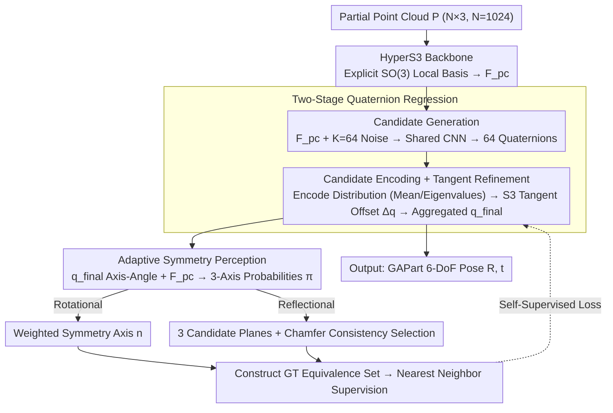

# SAFAG: Generalizable Actionable Part Pose Estimation without Symmetry Annotation

**Conference**: ICML 2026  
**arXiv**: [2605.17033](https://arxiv.org/abs/2605.17033)  
**Code**: TBD  
**Area**: Robotics / Embodied AI / 6D Pose Estimation  
**Keywords**: GAParts, 6D Pose, Symmetry Self-Supervision, Quaternion Refinement, Robotic Manipulation

## TL;DR
SAFAG decomposes GAPart 6D pose estimation into a two-stage framework of "candidate quaternion generation + tangent space refinement." By utilizing adaptive probability distributions to implicitly learn symmetry axes/planes across $x, y, z$ axes, it reduces cross-category rotation error for actionable parts from 5.51° to 3.23° in the complete absence of symmetry annotations.

## Background & Motivation

**Background**: Cross-category object manipulation in embodied AI relies on high-quality part-level 6D pose perception. Geng et al. introduced GAParts (Generalizable and Actionable Parts, e.g., sliding drawers, hinged doors, buttons), shifting the focus of pose estimation from whole objects to 9 categories of interactive parts, enabling robots to execute manipulation policies "by part." Subsequent works like GAPartNet, GASEM, DFGAP, GenPose++, and RFMPose followed this direction.

**Limitations of Prior Work**: GAParts exhibit richer symmetries than whole objects (e.g., 360° rotational equivalence for circular knobs, 180° for drawer covers). Existing methods face two main issues: (1) **Multi-solution problem**: GAPartNet uses NPCS to force a single solution, compressing the equivalence set into a single label and damaging accuracy; (2) **Heavy annotation dependency**: GASEM, DFGAP, and others design symmetry-aware losses but require pre-labeled symmetry axes/planes, which are expensive and often unavailable in real-world scenarios.

**Key Challenge**: To correctly handle "one-to-many" mappings caused by symmetry, the location of the symmetry axis must be known. Knowing the axis typically requires dense annotation; removing such annotations often leads back to the ill-posed "one-to-many" mapping problem under unsupervised settings.

**Goal**: Perform 6-DoF pose estimation for GAParts under zero symmetry annotation, simultaneously covering both rotational and reflectional symmetries.

**Key Insight**: The symmetry axes/planes are viewed as discrete probability distributions across the $x, y, z$ axes (mixture weights $\pi_x, \pi_y, \pi_z$). The network learns this distribution self-supervisedly via point cloud reconstruction consistency. The pose itself is handled using quaternions (compact, singularity-free, non-decoupled) through a "candidate → tangent space refinement → aggregation" process.

**Core Idea**: Transform "finding the symmetry axis" into "estimating probability distributions across three axes," using Chamfer mirror consistency as a self-supervision signal to entirely remove "symmetry annotation" from the training pipeline.

## Method

### Overall Architecture
The input is a partial point cloud $P \in \mathbb{R}^{N \times 3}$ ($N=1024$), and the output is the 6-DoF pose (rotation $R \in SO(3)$ + translation $t \in \mathbb{R}^3$) for each GAPart. The pipeline consists of four components: (1) **HyperS3 backbone**: A 3D-GCN modified into a feature extractor friendly to the $S^3$ manifold, outputting point cloud features $\mathcal{F}^{pc}$; (2) **Candidate Generation**: $\mathcal{F}^{pc}$ is concatenated with $K=64$ random noise vectors, and a shared CNN generates 64 quaternion candidates in parallel; (3) **Tangent Space Refinement**: A candidates encoder first encodes the statistics of the 64 candidates (mean, second-order moment features, eigenvalues/vectors) into $\mathcal{F}^{embedding}$, then a CNN predicts offsets $\Delta q_i$ in the $S^3$ tangent space for each candidate, followed by a linear layer to aggregate the $q^{final}$; (4) **Adaptive Symmetry Network**: Using the axis-angle representation of $q^{final}$ and $\mathcal{F}^{pc}$, it predicts triple-axis probabilities $\pi_{x,y,z}$. Rotational symmetry is weighted directly to obtain the symmetry axis, while reflectional symmetry uses Chamfer consistency to filter three candidate planes. Finally, the predicted symmetry structure constructs a ground truth equivalence set to supervise $q^{final}$.

### Key Designs

**1. HyperS3 Convolutional Layer: Explicitly embedding "rotation awareness" into the backbone's local coordinate system**

Previous backbones lacked rotation sensitivity when regressing quaternions on $S^3$, forcing downstream candidate generation to learn this invariance from scratch. HyperS3 adds a convolutional layer that explicitly constructs an $SO(3)$ local basis for 3D-GCN: for each point $p_i$, it finds KNN ($M=8$), computes the local covariance $S_i = \frac{1}{M}\sum_{j} R_{ij} R_{ij}^\top$, uses power iteration to extract the principal direction $e_{1,i}=\frac{S_i v_0}{\|S_i v_0\|}$, and applies a cross product with a reference vector to complete the local orthogonal basis $E_i$. Neighbor vectors are projected into two branches: a rotation-sensitive $\mathcal{F}^{align}$ within the local coordinate system and a geometric structure branch $\mathcal{F}^{euclid}$ in Euclidean coordinates.

The branches are merged using adaptive weights based on local geometric reliability: confidence weights $\alpha_i$ are calculated using the covariance trace $\mathrm{tr}(S_i)$ and anisotropy $a_i=\|S_i - S_i^{iso}\|_F^2$, fused as $\mathcal{F}_i = \alpha_i \mathcal{F}^{align} + (1-\alpha_i)\mathcal{F}^{euclid}$. Adding STE/ORL modules from HS-Pose yields the final point cloud features $\mathcal{F}^{pc}$. Consequently, rotation invariance is established at the backbone level, allowing the candidate generation stage to focus on modeling multiple solutions.

**2. Two-Stage Quaternion Regression: Matching multi-solution structures using "scattering + tangent space refinement"**

Symmetric parts naturally exhibit one-to-many mappings. Regressing a single solution collapses the equivalence set, hurting accuracy; regressing full rotation matrices faces $SO(3)$ discontinuities. SAFAG utilizes quaternions in two stages: the candidate generation stage treats $K=64$ random noise vectors $z_i$ concatenated with $\mathcal{F}^{pc}$ through a shared CNN to produce 64 candidates $\{q_i\}$, effectively scattering points to cover the equivalence set.

Before refinement, candidates "look at each other" to avoid unstable isolated updates. Specifically, it computes a sign-aligned mean $q_{mean}$, calculates residuals $r_i = q_{mean}^{-1}\otimes q_i$ mapped to the tangent space for axis-angle offsets $\delta_i$, and computes the average cosine similarity $\bar{\mu} = \frac{1}{K}\sum_i |q_i^\top q_{mean}|^2$ and the top three eigenvalues/vectors $\{\lambda_j, v_j\}_{j=1}^3$ of the second-order moment matrix. This "shape of the candidate distribution" is encoded by the candidates encoder into $\mathcal{F}^{embedding}$. Fused with $\mathcal{F}^{pc}$, the CNN predicts offsets $\Delta q_i$ in the $S^3$ tangent space, and a linear layer aggregates the corrected $\Delta q_i \otimes q_i$ into $q^{final}$. Updating in the tangent space corresponds to a first-order change on the manifold, which is geometrically clearer and more accurate than generative (GenPose++) or flow-matching (RFMPose) methods.

**3. Adaptive Symmetry Perception: Replacing "finding symmetry axes" with "estimating 3-axis probability distributions" to remove annotations**

This is the key to removing annotation dependency. Handling multi-solutions requires knowing the symmetry axis, which usually necessitates dense labeling. SAFAG models symmetry inference as a discrete mixture distribution $\pi_x, \pi_y, \pi_z$ across the $x, y, z$ axes. For rotational symmetry, the axis-angle representation $\mathcal{F}^{rot}$ of $q^{final}$ and $\mathcal{F}^{pc}$ are processed by a CNN to predict probabilities, yielding the symmetry axis $n = \pi_x n_x + \pi_y n_y + \pi_z n_z$.

Reflectional symmetry is more complex because the number and position of planes are unknown. The method treats $n$ as the primary normal, predicts an additional orthogonal secondary normal $n'$, and computes $n''$ via a cross product to form three candidate planes. The supervision signal comes from geometric consistency: for each candidate normal $u_j$, the mirrored point cloud $p_i^{(j)\prime} = p_i - 2((p_i-p_c)\cdot u_j) u_j$ is calculated, and the bi-directional Chamfer distance

$$\mathcal{L}_{geom}(P, u_j)=\tfrac{1}{2}\big(d(P,P^{(j)\prime})+d(P^{(j)\prime},P)\big)$$

measures consistency. This is normalized into a geometric score $s_j = \frac{1/(\mathcal{L}_{geom}+\varepsilon)}{\sum_j 1/(\mathcal{L}_{geom}+\varepsilon)+\varepsilon}$ to suppress inconsistent candidates. Since mirror consistency is a natural self-supervision signal, the symmetry inference requires no ground truth axes/planes.

### Loss & Training
Final quaternion supervision comes from the "GT equivalence set constructed via predicted symmetry structures" — the closest element in the equivalence set to the prediction is selected as the regression target. The symmetry network relies on the Chamfer mirror consistency $\mathcal{L}_{geom}$ for self-supervision. Symmetry types (rotational/reflectional) are provided as prior categories, but specific axes/planes are fully learned.

## Key Experimental Results

### Main Results (GAPartNet, Average across 9 categories)

| Setting | Method | Rot. (°) ↓ | Trans. (cm) ↓ |
|------|------|-----------:|--------------:|
| Seen | GAPartNet | 7.71 | 0.037 |
| Seen | GASEM | 9.11 | 0.036 |
| Seen | GenPose++ | 15.46 | 0.035 |
| Seen | RFMPose | 17.03 | 0.060 |
| Seen | DFGAP | 5.51 | 0.020 |
| Seen | **SAFAG (Ours)** | **3.23** | **0.016** |
| Unseen | GAPartNet | 27.59 | — |
| Unseen | GASEM | 29.45 | — |
| Unseen | GenPose++ | 31.66 | — |
| Unseen | RFMPose | 33.39 | — |

SAFAG reduces rotation error by 41% compared to the strongest baseline DFGAP (5.51° → 3.23°) in the Seen category, with translation error dropping to 0.016 cm. Improvements are most significant for highly symmetric parts like Sd.Ld (Sliding Lid), Hg.Ld (Hinged Lid), and Rd.F.Hl (Round Fixed Handle), indicating the benefits of symmetry modeling.

### Ablation Study (Impact of modules on Rot. error)

| Configuration | Rot. (°) | Description |
|------|---------:|------|
| Full SAFAG | 3.23 | Full |
| w/o HyperS3 conv | Increase | Degrades to original 3D-GCN; lower rotation sensitivity |
| w/o Two-Stage | Increase | Direct single-solution regression hits $SO(3)$ discontinuity |
| w/o Adaptive Symmetry | Large Increase | Reverts to single GT supervision; symmetry issues return |

### Key Findings
- The adaptive symmetry module provides the largest contribution; removing it causes the most severe degradation in highly symmetric parts, validating "probability modeling + Chamfer self-supervision" as the key to removing annotations.
- The rotation-aware local basis of HyperS3 enables the backbone to output more stable features, relieving the candidate generation stage of this burden.
- $K=64$ candidates with tangent refinement balances accuracy and efficiency; while smaller $K$ suffices for asymmetric parts, symmetric parts require enough candidates to cover the equivalence set.
- Real-world demos show that SAFAG's high-quality perception allows direct integration with GAPartNet's interaction policies for successful grasping.

## Highlights & Insights
- **Reformulating "Symmetry Annotation" as "3-axis distribution + geometric self-supervision"**: This approach acknowledges that symmetry is inherently a distribution and uses Chamfer mirror distance as a natural signal. This "releasing priors from annotations" paradigm can be transferred to other tasks requiring equivalence info (e.g., NOCS, symmetric objects in SLAM).
- **Three-stage quaternion regression (Candidate → Tangent Refinement → Aggregation)**: Explicit candidate scattering followed by manifold refinement is lighter and more accurate than pure generative or flow-matching methods in $S^3$.
- **Candidates encoder for distribution second-order moments**: Using the mean, eigenvalues, and eigenvectors of the candidate distribution as inputs allows the refinement stage to understand the "shape" of the ensemble, avoiding unstable isolated corrections.

## Limitations & Future Work
- Symmetry types (rotational vs. reflectional) must be provided as a prior; a version that automatically identifies the symmetry type was not explored.
- The main experiments are restricted to GAPartNet; robustness in real-world scenarios with heavy occlusion/noise relies on limited demo evidence.
- The number of candidates $K=64$ is fixed; whether adaptive $K$ is needed for extreme symmetries (e.g., perfect axial symmetry in knobs) remains undiscussed.
- Future work could combine articulated motion information for temporal joint estimation to further eliminate single-frame ambiguity.

## Related Work & Insights
- **vs. GAPartNet (Geng et al., 2023)**: GAPartNet forces convergence to a single solution via NPCS, losing equivalence info. SAFAG explicitly models the set and outperforms it significantly (7.71° → 3.23°).
- **vs. GASEM / DFGAP**: Both require symmetry axes/planes labels. SAFAG removes these while maintaining a 41% accuracy lead over DFGAP.
- **vs. GenPose++ / RFMPose**: These model distributions via sampling, which is theoretically elegant but requires annotation and high training costs. SAFAG achieves lower error without annotations using tangent refinement.

## Rating
- Novelty: ⭐⭐⭐⭐ "Symmetry as probability + Chamfer self-supervision" cleanly eliminates annotation dependency.
- Experimental Thoroughness: ⭐⭐⭐⭐ Full coverage of GAPartNet categories; however, lacks systematic quantitative evaluation in complex real-world scenes.
- Writing Quality: ⭐⭐⭐⭐ Clear decomposition of the four modules; well-defined geometric motivations for HyperS3 and the candidates encoder.
- Value: ⭐⭐⭐⭐ Directly applicable to embodied cross-category manipulation; the annotation-free setting has strong real-world deployment value.

<!-- RELATED:START -->

## Related Papers

- [\[ICML 2026\] From Imagined Futures to Executable Actions: Mixture of Latent Actions for Robot Manipulation](from_imagined_futures_to_executable_actions_mixture_of_latent_actions_for_robot_.md)
- [\[ICML 2026\] Towards Efficient and Expressive Offline RL via Flow-Anchored Noise-conditioned Q-Learning](towards_efficient_and_expressive_offline_rl_via_flow-anchored_noise-conditioned_.md)
- [\[ICML 2026\] ManiSoft: Towards Vision-Language Manipulation for Soft Continuum Robotics](manisoft_towards_vision-language_manipulation_for_soft_continuum_robotics.md)
- [\[ICML 2026\] Turning Adaptation into Assets: Cross-Domain Bridging for Online Vision-Language Navigation](turning_adaptation_into_assets_cross-domain_bridging_for_online_vision-language_.md)
- [\[ICML 2026\] Neural Low-Discrepancy Sequences](neural_low-discrepancy_sequences.md)

<!-- RELATED:END -->
