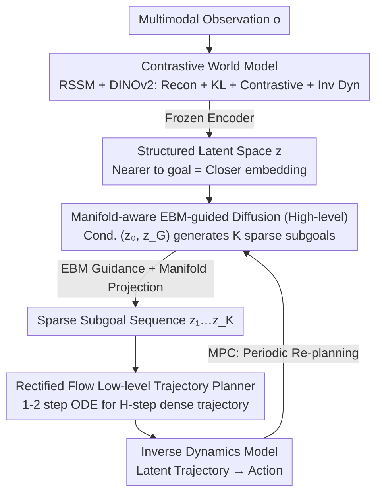

# HDFlow: Hierarchical Diffusion-Flow Planning for Long-horizon Tasks

**Conference**: ICML 2026 Spotlight  
**arXiv**: [2605.04525](https://arxiv.org/abs/2605.04525)  
**Code**: https://hdflow-page.github.io/ (Project Page)  
**Area**: Robotics / Long-horizon Planning / Generative Planning  
**Keywords**: Hierarchical Planning, Diffusion Models, Rectified Flow, Energy-based Models, Manifold Projection

## TL;DR
HDFlow utilizes diffusion models to generate sparse strategic subgoals and rectified flow to generate dense trajectories. By integrating energy guidance and manifold projection, it constructs a dual-layer planner with a slow-fast division of labor, improving the success rate of long-horizon sparse reward tasks such as furniture assembly by 20–30 percentage points.

## Background & Motivation

**Background**: Current mainstream approaches for long-horizon robotic manipulation (e.g., furniture assembly, maze navigation) follow two paths: imitation learning to clone expert trajectories directly, or using diffusion models to treat planning as a "conditional generation" problem, sampling entire trajectories from noise. Representative works include Diffuser, Decision Diffuser, and hierarchical diffusion stacks like SHD and HDMI.

**Limitations of Prior Work**: Pure diffusion planners require multi-step denoising at every step, resulting in slow inference speeds that hinder real-time control. Simultaneously, long-horizon tasks are prone to generating plans that "look reasonable but lead to dead ends," as standard conditional diffusion lacks explicit mechanisms to evaluate the long-term feasibility of subgoal sequences. Applying diffusion at every level of a hierarchy further exacerbates the speed bottleneck.

**Key Challenge**: High-level planning requires **exploratory** capabilities to generate diverse strategic subgoal candidates, while low-level execution requires **speed and determinism** to convert subgoals into smooth, dense trajectories. A single generative paradigm (using either only diffusion or only flow) cannot optimize both simultaneously.

**Goal**: (1) Enable high-level and low-level modules to use the most suitable generative models; (2) Provide the high-level module with guidance signals to "identify dead ends"; (3) Prevent guidance signals from pushing samples off the feasible manifold.

**Key Insight**: Treat diffusion and rectified flow as complementary tools—diffusion is suitable for high-diversity exploration, while rectified flow can generate trajectories in one or two steps via ODE solvers, offering high speed. Additionally, train an energy-based model (EBM) as a "long-term feasibility evaluator," assigning low energy to successful trajectories and high energy to failed ones.

**Core Idea**: The high-level uses a diffusion planner with "EBM guidance + manifold projection" to produce sparse subgoals in latent space, while the low-level uses rectified flow to quickly chain dense trajectories. This is predicated on a world model trained via contrastive learning that organizes the latent space such that "state embeddings closer to the goal are similar."

## Method

### Overall Architecture
Two-stage training: **Phase 1** trains the world model (RSSM + DINOv2 encoder) using a combination of observation reconstruction, KL divergence, contrastive learning, and inverse dynamics losses to ensure the latent space is both predictive and reflective of "distance to goal." The encoder is subsequently frozen. **Phase 2** trains the hierarchical planner in the frozen latent space. The high-level diffusion model $\epsilon_\theta$ learns to generate $K$ sparse latent subgoals $z = (z_1, ..., z_K)$ conditioned on $(z_0, z_G)$. The low-level rectified flow $v_\theta$ learns to generate an $H$-step dense latent trajectory between two adjacent subgoals. During MPC inference, the high-level re-plans at intervals, while the low-level unfolds the first subgoal into a dense trajectory, which is then mapped to actions via the inverse dynamics model.

### Key Designs

**1. Contrastive World Model: Organizing latent space by "proximity to goal"**

Standard world models ensure predictive accuracy but do not guarantee planning-friendliness—the "distance to goal" in latent space is often disorganized, making downstream guidance difficult. Beyond the standard reconstruction and KL objectives $\mathcal{L}_{WM}$, HDFlow adds an InfoNCE contrastive loss $\mathcal{L}_{contrastive}$: intermediate latent states of successful trajectories are paired with their final goals $z_G$ as positive pairs, while being pushed away from states in failed trajectories. An additional inverse dynamics MSE loss forces the model to encode "adjacent state pairs" in an action-predictable format. This constructs a "direction towards the goal" in latent space, providing the foundation for effective guidance by the high-level diffusion and energy models.

**2. Manifold-aware EBM-guided Diffusion (High-level): Identifying dead ends and projecting back to feasible manifolds**

Standard conditional diffusion lacks explicit mechanisms to evaluate the long-term feasibility of subgoal sequences, easily leading to "visually plausible but doomed" plans. HDFlow first trains an EBM with a contrastive loss to serve as a "long-term feasibility evaluator," assigning low energy to successful sequences:

$$\mathcal{L}_{EBM} = \log(1 + \exp(E_\phi(z_{pos}) - E_\phi(z_{neg})))$$

Sampling involves two steps: first, EBM-guided sampling $z_{\ell-1}^{temp} \sim \mathcal{N}(\mu_\theta(z_\ell) + w_{ebm}\Sigma^\ell g, \Sigma^\ell)$ where $g = \nabla_{z_\ell} E_\phi$. Second, projecting back to the local manifold—using the Tweedie formula for denoising estimate $\hat z^{0|\ell-1}$, retrieving $k$ nearest neighbors to perform rank-$r$ PCA for the projection basis $U$, and finally $\mathcal{P}(z) = \mu + UU^T(z - \mu)$. This projection step is crucial as energy guidance in high-dimensional latent space inevitably pushes samples off the feasible manifold; projection acts as a hard constraint between "high quality" and "feasibility."

**3. Rectified Flow Low-level Trajectory Planner: Chaining dense trajectories via ODE**

The low-level does not require high diversity; it needs to quickly and deterministically connect subgoals into smooth trajectories. While pure diffusion requires multi-step denoising (the real-time bottleneck), HDFlow treats the transition from $z_{k-1}$ to $z_k$ in latent space as optimal transport. The optimal solution is a trajectory as straight as possible, perfectly fitting rectified flow. Training uses flow-matching:

$$\mathcal{L}_{LL} = \mathbb{E}\big[\| v_\theta((1-u)\tau_0 + u\tau_1, u, c_k) - (\tau_1 - \tau_0)\|^2\big]$$

Inference directly solves the ODE, generating an $H$-step dense trajectory in 1–2 steps, an order of magnitude faster than diffusion. This division—diffusion for high-level exploration and rectified flow for low-level speed—is key to balancing success rate and real-time performance.

### Loss & Training
Two stages: Phase 1 jointly optimizes $\mathcal{L}_{WM\text{-}total} = \lambda_{WM}\mathcal{L}_{WM} + \lambda_{IDM}\mathcal{L}_{IDM} + \lambda_{contrastive}\mathcal{L}_{contrastive}$. Phase 2 freezes the world model and jointly trains the planners $\mathcal{L}_{planner} = \lambda_{HL}\mathcal{L}_{HL} + \lambda_{LL}\mathcal{L}_{LL} + \lambda_{EBM}\mathcal{L}_{EBM} + \lambda_{proj}\mathcal{L}_{projection}$, where $\mathcal{L}_{projection}$ keeps high-level subgoals close to the learned latent manifold. High-level uses 100 denoising steps and CFG scale 2.0; low-level uses a DiT with 4 layers, 8 heads, and latent dimension 512.

## Key Experimental Results

### Main Results

| Benchmark / Task | Difficulty | SHD (Prev. SOTA) | HDFlow | Gain |
|-------------|------|---------------|--------|------|
| FurnitureBench one_leg | Low/Med/High | 71/31/15 | **92/71/39** | +21~+24 |
| FurnitureBench lamp | Low/Med/High | 43/22/16 | **68/49/34** | +18~+27 |
| FurnitureBench round_table | Low/Med/High | 41/21/12 | **61/43/27** | +20~+22 |
| OGBench antmaze-giant-v0 | — | 19 | **48** | +13 (vs 35 DV) |
| OGBench humanoidmaze-giant-v0 | — | 7 | **25** | +9 |
| RLBench Insert Peg | — | 65.6 (3D Actor) | **93.3** | +27.7 |

On 18 RLBench tasks, HDFlow achieves the best performance in 7 and significantly outperforms specialized visual manipulation models like RVT-2 and 3D Diffuser Actor on average.

### Ablation Study

| Configuration | lamp Success Rate (%) | Inference Time (ms/step) |
|------|----------------|------------------|
| Full HDFlow | **68** | **88** |
| w/o Manifold Projection | 57 (one_leg 84) | — |
| w/o Manifold-aware EBM | 33 (one_leg 61) | — |
| w/o Contrastive WM | 27 (one_leg 58) | — |
| FD (Flat Diffusion) | 24 | 197 |
| HF (Hierarchical Flow) | 24 | 53 |
| HD (Hierarchical Diffusion) | 43 | 142 |

### Key Findings
- **Contrastive World Model is critical**: Removing it caused the largest drop, showing that EBM and diffusion require "distance structure" in the latent space to function.
- **Hierarchical + Mixed Paradigm superiority**: HD (All Diffusion) 43% vs HDFlow 68%, HF (All Flow) 24% vs HDFlow 68%, proving that high/low level task properties differ.
- **Inference time Gain**: Time reduced from 142 ms (HD) to 88 ms, and is twice as fast as single-layer diffusion (FD 197 ms), proving rectified flow's efficiency at the low level.
- **Real-robot transfer**: Success maintained on a Franka robot after fine-tuning with 50 demonstrations.

## Highlights & Insights
- **"Right Tool for the Job" Philosophy**: Placing diffusion's exploration at the high level and rectified flow's speed at the low level is a highly transferable insight for tasks requiring "strategic thought followed by fast execution" (VLA, document analysis, etc.).
- **Manifold-aware EBM Guidance**: Theoretically proving that high-dimensional guidance inevitably deviates from the manifold and correcting it with local PCA projection is a trick applicable to any guided diffusion task beyond robotics.
- **EBM as "Long-horizon Evaluator"**: Scoring the "entire plan" rather than fitting a reward function avoids sparse reward issues. Contrastive training with success vs. failure demos keeps annotation costs low.

## Limitations & Future Work
- Requires both successful and failed demonstrations for EBM and contrastive world model training; systematic failure data collection on real robots is challenging.
- High-level re-planning still requires 100 denoising steps; despite the fast low-level, overall latency remains higher than pure imitation learning. Distillation into few-step sampling could be explored.
- Subgoal interval $H$ is a task-specific hyperparameter; an adaptive mechanism is missing.
- Multimodal conditions (language instructions) are not yet integrated; the model currently uses "image goal conditioning."

## Related Work & Insights
- **vs SHD / HDMI**: Also hierarchical diffusion, but using diffusion for all levels leads to low-level slowness. HDFlow's replacement with rectified flow and extra EBM guidance yields significant leads in speed and success.
- **vs Diffuser / DD**: Single-layer diffusion lacks explicit hierarchy; subgoal errors accumulate in long-horizon tasks. HDFlow's division and re-planning offer natural error tolerance.
- **vs Manifold Preserving Guided Diffusion (He et al., 2024)**: This work ports the manifold projection idea from image generation to robotic planning, combined with EBM guidance.

## Rating
- Novelty: ⭐⭐⭐⭐ The "Diffusion + Rectified Flow + EBM + Manifold Projection" combination is new, though individual components have precedents.
- Experimental Thoroughness: ⭐⭐⭐⭐⭐ Three benchmarks + real robot + detailed ablations + inference time comparisons; very comprehensive.
- Writing Quality: ⭐⭐⭐⭐ Motivation is clear; theoretical derivations (Appendix A) are rigorous, though some formulas in the main text are condensed.
- Value: ⭐⭐⭐⭐ A solid SOTA advancement for long-horizon robotic planning with transferable cross-domain tricks.

<!-- RELATED:START -->

## Related Papers

- [\[ICML 2026\] Drift is a Sampling Error: SNR-Aware Power Distributions for Long-Horizon Robotic Planning](drift_is_a_sampling_error_snr-aware_power_distributions_for_long-horizon_robotic.md)
- [\[NeurIPS 2025\] RDD: Retrieval-Based Demonstration Decomposer for Planner Alignment in Long-Horizon Tasks](../../NeurIPS2025/robotics/rdd_retrieval-based_demonstration_decomposer_for_planner_alignment_in_long-horiz.md)
- [\[CVPR 2026\] AGiLe: Learning Robust Long-Horizon Manipulation via Affordance-Grounded Bidirectional Latent Planning](../../CVPR2026/robotics/agile_learning_robust_long-horizon_manipulation_via_affordance-grounded_bidirect.md)
- [\[ICML 2025\] Closed-loop Long-horizon Robotic Planning via Equilibrium Sequence Modeling](../../ICML2025/robotics/closed-loop_long-horizon_robotic_planning_via_equilibrium_sequence_modeling.md)
- [\[ICLR 2026\] RoboPARA: Dual-Arm Robot Planning with Parallel Allocation and Recomposition Across Tasks](../../ICLR2026/robotics/robopara_dual-arm_robot_planning_with_parallel_allocation_and_recomposition_acro.md)

<!-- RELATED:END -->
