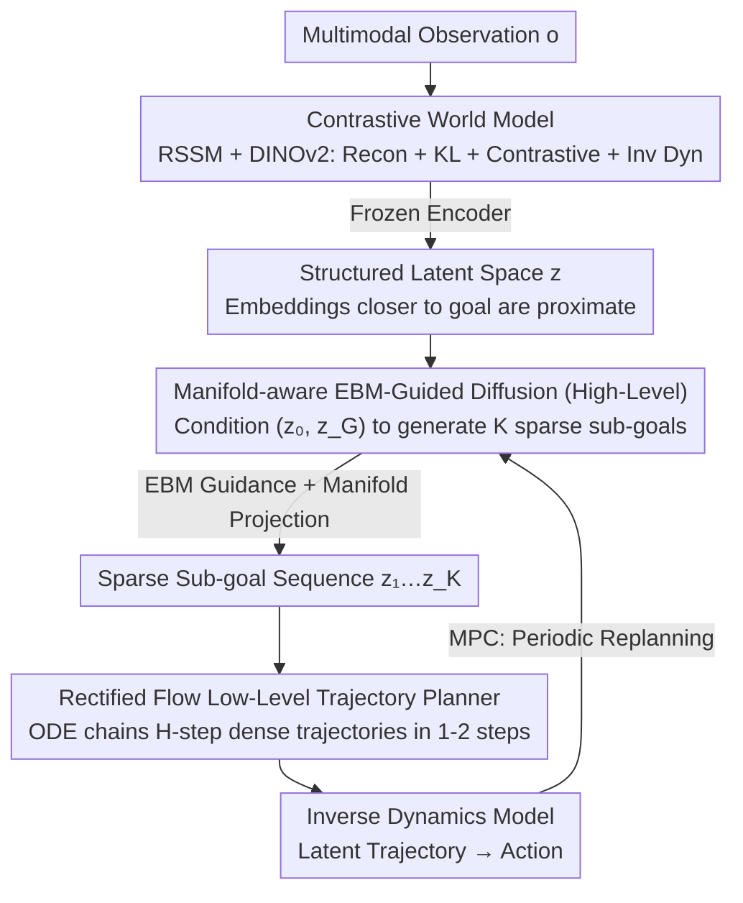

# HDFlow: Hierarchical Diffusion-Flow Planning for Long-horizon Tasks

**Conference**: ICML 2026 Spotlight  
**arXiv**: [2605.04525](https://arxiv.org/abs/2605.04525)  
**Code**: https://hdflow-page.github.io/ (Project Page)  
**Area**: Robotics / Long-horizon Planning / Generative Planning  
**Keywords**: Hierarchical Planning, Diffusion Models, Rectified Flow, Energy-based Models, Manifold Projection

## TL;DR
HDFlow employs diffusion models to generate sparse strategic sub-goals and rectified flows to generate dense trajectories, integrated with energy guidance and manifold projection. This forms a dual-layer "slow-fast" planner that improves success rates by 20–30% in long-horizon sparse-reward tasks such as furniture assembly.

## Background & Motivation

**Background**: Current long-horizon robotic manipulation (e.g., furniture assembly, maze navigation) mainly follows two paths: imitation learning for expert trajectory cloning, or using diffusion models to treat planning as a "conditional generation" problem to sample trajectories from noise. Examples include Diffuser, Decision Diffuser, and hierarchical variants like SHD and HDMI.

**Limitations of Prior Work**: Pure diffusion planners require multiple denoising steps at each iteration, resulting in slow inference and difficulty in real-time control. Additionally, long-horizon tasks frequently suffer from plans that "appear reasonable but lead to dead ends," as standard conditional diffusion lacks explicit mechanisms to evaluate the long-term feasibility of sub-goal sequences. Applying diffusion to all hierarchical layers (high + low) further exacerbates the speed bottleneck.

**Key Challenge**: High-level planning requires **explorability**—the ability to generate diverse strategic sub-goal candidates. Low-level execution requires **speed and determinism**—mapping sub-goals to smooth, dense trajectories. A single generative paradigm (using either only diffusion or only flow) cannot optimize both simultaneously.

**Goal**: (1) Utilize the most suitable generative model for the high and low levels respectively; (2) Provide the high-level planner with guidance signals to identify "dead ends"; (3) Prevent guidance signals from pushing samples off the feasible manifold.

**Key Insight**: Treat diffusion and rectified flow as complementary tools—diffusion for high-diversity exploration and rectified flow for fast trajectory generation via ODE solvers in one or two steps. Additionally, train an Energy-Based Model (EBM) as a "long-term feasibility evaluator" to assign low energy to successful trajectories and high energy to failures.

**Core Idea**: The high level uses a manifold-aware, EBM-guided diffusion planner to produce sparse sub-goals in the latent space, while the low level uses rectified flow to quickly chain dense trajectories. This is predicated on a world model trained via contrastive learning that organizes the latent space such that "embeddings of states closer to the goal are similar."

## Method

### Overall Architecture
Two-stage training: **Stage 1** trains the world model (RSSM + DINOv2 encoder) using a joint loss of observation reconstruction + KL + contrastive learning + inverse dynamics, ensuring the latent space is both predictive and reflective of the "distance to goal"; the encoder is then frozen. **Stage 2** trains the hierarchical planner in the frozen latent space: a high-level diffusion model $\epsilon_\theta$ learns to generate $K$ sparse latent sub-goals $z = (z_1, ..., z_K)$ conditioned on $(z_0, z_G)$; a low-level rectified flow $v_\theta$ learns to generate $H$-step dense latent trajectories between adjacent sub-goals. During MPC inference, the high-level replans periodically, and the low-level unfolds the first sub-goal into a dense trajectory, which is mapped to actions via an inverse dynamics model.

### Key Designs

**1. Contrastive World Model: Organizing latent space by "proximity to goal"**

Standard world models ensure predictive accuracy but do not guarantee planning friendliness—the "distance to goal" in latent space is often disorganized, making downstream guidance difficult. HDFlow adds an InfoNCE contrastive loss $\mathcal{L}_{contrastive}$ to the standard RSSM reconstruction + KL objective $\mathcal{L}_{WM}$: intermediate latent states of successful trajectories are treated as positive pairs with their final goal $z_G$, while intermediate states of failed trajectories are pushed away. An inverse dynamics MSE is also added to force the model to encode "adjacent state pairs" into action-predictable forms. This constructs a "directional gradient toward the goal" in the latent space, serving as the foundation for high-level diffusion and energy model guidance.

**2. Manifold-Aware EBM-Guided Diffusion (High-Level): Identifying dead ends and projecting back to the manifold**

Standard conditional diffusion lacks explicit mechanisms to evaluate the long-term feasibility of sub-goal sequences, often generating plans that lead to dead ends in long-horizon tasks. HDFlow first trains an EBM as a "long-term feasibility evaluator" using contrastive loss to assign low energy to successful sub-goal sequences:

$$\mathcal{L}_{EBM} = \log(1 + \exp(E_\phi(z_{pos}) - E_\phi(z_{neg})))$$

Sampling involves two steps: first, EBM-guided sampling $z_{\ell-1}^{temp} \sim \mathcal{N}(\mu_\theta(z_\ell) + w_{ebm}\Sigma^\ell g, \Sigma^\ell)$ (where $g = \nabla_{z_\ell} E_\phi$), followed by projection back to the local manifold. Denoised estimates $\hat z^{0|\ell-1}$ are obtained via the Tweedie formula, and $k$ nearest neighbors are retrieved to perform rank-$r$ PCA for the projection basis $U$, resulting in $\mathcal{P}(z) = \mu + UU^T(z - \mu)$. The authors prove that the error lower bound of energy guidance is proportional to $\sqrt{d}/\sqrt{1-\bar\alpha_\ell}$; in high-dimensional latent space, approximating EBM inevitably pushes samples off the feasible manifold. Projection counteracts this deviation, acting as a hard constraint between "high quality" and "feasibility."

**3. Rectified Flow Low-Level Trajectory Planner: Chaining dense trajectories via ODE**

The low level does not require high diversity; it needs to connect sub-goals into smooth trajectories quickly and deterministically—pure diffusion is the latency bottleneck for real-time control. HDFlow treats the transition from $z_{k-1}$ to $z_k$ in latent space as optimal transport, where the optimal solution is a straight-line trajectory, fitting rectified flow. Training uses flow-matching:

$$\mathcal{L}_{LL} = \mathbb{E}\big[\| v_\theta((1-u)\tau_0 + u\tau_1, u, c_k) - (\tau_1 - \tau_0)\|^2\big]$$

During inference, solving the ODE generates the entire $H$-step dense trajectory in one or two steps, an order of magnitude faster than diffusion. This division of labor—diffusion for exploration and rectified flow for speed—is the key to balancing success rates and real-time performance.

### Loss & Training
The process is divided into two stages: Stage 1 jointly optimizes $\mathcal{L}_{WM\text{-}total} = \lambda_{WM}\mathcal{L}_{WM} + \lambda_{IDM}\mathcal{L}_{IDM} + \lambda_{contrastive}\mathcal{L}_{contrastive}$. Stage 2 freezes the world model and trains the planners: $\mathcal{L}_{planner} = \lambda_{HL}\mathcal{L}_{HL} + \lambda_{LL}\mathcal{L}_{LL} + \lambda_{EBM}\mathcal{L}_{EBM} + \lambda_{proj}\mathcal{L}_{projection}$. The $\mathcal{L}_{projection}$ term ensures high-level sub-goals align with the learned latent manifold. The high level uses 100 denoising steps with a CFG scale of 2.0; the low level uses a 4-layer 8-head DiT with a latent dimension of 512.

## Key Experimental Results

### Main Results

| Benchmark / Task | Difficulty | SHD (Prev. SOTA) | HDFlow | Gain |
|-------------|------|---------------|--------|------|
| FurnitureBench one_leg | Low/Med/High | 71/31/15 | **92/71/39** | +21~+24 |
| FurnitureBench lamp | Low/Med/High | 43/22/16 | **68/49/34** | +18~+27 |
| FurnitureBench round_table | Low/Med/High | 41/21/12 | **61/43/27** | +20~+22 |
| OGBench antmaze-giant-v0 | — | 19 | **48** | +13 (vs 35 DV) |
| OGBench humanoidmaze-giant-v0 | — | 7 | **25** | +9 |
| RLBench Insert Peg | — | 65.6 (3D Actor) | **93.3** | +27.7 |

On the 18 RLBench tasks, HDFlow achieves the best performance in 7 tasks and significantly outperforms specialized vision-manipulation models such as RVT-2 and 3D Diffuser Actor on average.

### Ablation Study

| Configuration | lamp Success Rate (%) | Inference Time (ms/step) |
|------|----------------|------------------|
| Full HDFlow | **68** | **88** |
| w/o Manifold Projection | 57 (one_leg 84) | — |
| w/o Manifold-aware EBM | 33 (one_leg 61) | — |
| w/o Contrastive World Model | 27 (one_leg 58) | — |
| FD (Flat Diffusion) | 24 | 197 |
| HF (Hierarchical Flow) | 24 | 53 |
| HD (Hierarchical Diffusion) | 43 | 142 |

### Key Findings
- The contrastive world model is the most critical component: removing it leads to the steepest performance drop, indicating that EBM and diffusion rely on the "distance structure" of the latent space.
- The "hierarchical hybrid paradigm" is superior to single-paradigm approaches: HD (full diffusion) 43% vs HDFlow 68%, HF (full flow) 24% vs HDFlow 68%, proving that high and low-level tasks have distinct natures.
- Inference time is reduced from 142 ms (HD) to 88 ms, twice as fast as single-layer diffusion (197 ms), confirming that rectified flow significantly accelerates the low level.
- Successful deployment on a real Franka robot with 50-demonstration fine-tuning validates a degree of sim-to-real transferability.

## Highlights & Insights
- **"Right tool for the job" hierarchical philosophy**: Using diffusion's explorability for the high level and rectified flow's speed for the low level is a valuable design pattern applicable to any task requiring "strategic planning followed by fast execution" (e.g., VLA, document analysis).
- **Manifold-aware EBM guidance**: Theoretically demonstrating that high-dimensional guidance deviates from the manifold and using PCA for local projection is a plug-and-play trick applicable to any guided diffusion task (image editing, molecular design) beyond robotics.
- **EBM as a "long-horizon evaluator"**: Rather than fitting a reward function, HDFlow scores the "entire plan" directly to avoid sparse reward issues. By using contrastive training with success vs. failure demos, the annotation cost remains extremely low.

## Limitations & Future Work
- Requires both successful and failed demonstrations to train the EBM and contrastive world model; systemic collection of failed demonstrations on real robots can be challenging.
- Each high-level replan still requires 100 denoising steps. Although the low level is fast, the overall latency is higher compared to pure imitation learning; distillation for few-step sampling could be considered.
- The sub-goal interval $H$ is a task-dependent hyperparameter lacking an adaptive mechanism; multi-stage refinement may be needed for extremely long tasks.
- Multimodal conditioning (e.g., language instructions) has not yet been integrated; currently, it is limited to "image-goal conditioning."

## Related Work & Insights
- **vs SHD / HDMI**: Both are hierarchical diffusion models, but using diffusion for all layers results in slow low-level execution. HDFlow replaces the low level with rectified flow and adds EBM guidance, leading to superior speed and success rates.
- **vs Diffuser / DD**: Single-layer diffusion lacks an explicit hierarchy, causing sub-goal errors to accumulate in long-horizon tasks. HDFlow's high-low division and replanning mechanism provide inherent error tolerance.
- **vs Manifold Preserving Guided Diffusion (He et al., 2024)**: This paper ports the manifold projection idea from image generation to robotic planning and combines it with EBM guidance, representing an interesting cross-domain transfer.

## Rating
- Novelty: ⭐⭐⭐⭐ The combination of "diffusion + rectified flow + EBM + manifold projection" is novel, though individual components have precedents.
- Experimental Thoroughness: ⭐⭐⭐⭐⭐ Comprehensive coverage across three benchmarks, real-robot tests, detailed ablations, and inference time comparisons.
- Writing Quality: ⭐⭐⭐⭐ Clear motivational reasoning; the theoretical portion (Appendix A) is rigorous, though some formulas in the main text are somewhat jumpy.
- Value: ⭐⭐⭐⭐ Represents a concrete SOTA advancement in long-horizon robotic planning; the cross-domain tricks are highly reusable.

<!-- RELATED:START -->

## Related Papers

- [\[ICML 2026\] Drift is a Sampling Error: SNR-Aware Power Distributions for Long-Horizon Robotic Planning](drift_is_a_sampling_error_snr-aware_power_distributions_for_long-horizon_robotic.md)
- [\[NeurIPS 2025\] RDD: Retrieval-Based Demonstration Decomposer for Planner Alignment in Long-Horizon Tasks](../../NeurIPS2025/robotics/rdd_retrieval-based_demonstration_decomposer_for_planner_alignment_in_long-horiz.md)
- [\[CVPR 2026\] AGiLe: Learning Robust Long-Horizon Manipulation via Affordance-Grounded Bidirectional Latent Planning](../../CVPR2026/robotics/agile_learning_robust_long-horizon_manipulation_via_affordance-grounded_bidirect.md)
- [\[CVPR 2026\] NavForesee: A Unified Vision-Language World Model for Hierarchical Planning and Dual-Horizon Navigation Prediction](../../CVPR2026/robotics/navforesee_a_unified_vision-language_world_model_for_hierarchical_planning_and_d.md)
- [\[ICML 2025\] Closed-loop Long-horizon Robotic Planning via Equilibrium Sequence Modeling](../../ICML2025/robotics/closed-loop_long-horizon_robotic_planning_via_equilibrium_sequence_modeling.md)

<!-- RELATED:END -->
