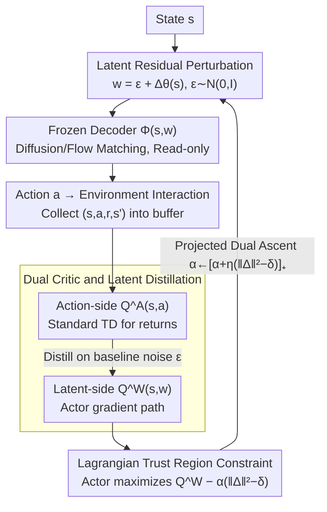

# Lagrangian Perturbation Diffusion Steering: Latent Reinforcement Learning for Generative Policies

**Conference**: ICML 2026  
**arXiv**: [2606.01151](https://arxiv.org/abs/2606.01151)  
**Code**: https://sites.google.com/view/lp-ds/home (project page)  
**Area**: Reinforcement Learning / Generative Policies / Trust Region Methods  
**Keywords**: Diffusion Policy, Latent Space RL, Trust Region, Lagrangian, Mode Collapse

## TL;DR
LP-DS treats frozen diffusion or flow matching policies as black-box decoders $\Phi(s,w)$. It learns a state-conditional residual only on the initial noise $w=\epsilon+\Delta_\theta(s)$ and constrains the perturbation magnitude via a Lagrangian trust region $\mathbb{E}_s[\|\Delta_\theta(s)\|_2^2]\le\delta$. This enables sample-efficient online RL fine-tuning while preserving multimodal priors. It outperforms DSRL and DPPO in stability across RoboMimic, Gym, Adroit, and LIBERO, achieving up to +25% return gains.

## Background & Motivation

**Background**: High-capacity generative policies (Diffusion Policy, flow matching $\pi_0$ series) have become the dominant BC paradigm for continuous control and manipulation due to their multimodal action distributions.

**Limitations of Prior Work**: Pure BC is restricted by the ceiling of demonstration coverage and distribution shift, requiring RL fine-tuning. However, directly updating massive diffusion/flow matching decoders suffers from poor sample efficiency due to unstable gradients through long-chain denoising or ODE integration. Recent DSRL moves RL to the latent noise space (black-box decoding), but it directly learns a new latent policy to **replace** the pre-trained prior, leading to two failure modes: (i) noise drifting out of the $\mathcal{N}(0,I)$ decoder training support, triggering off-manifold behavior; (ii) collapsing the multimodal prior into a single mode.

**Key Challenge**: The decoder is trained on $\mathcal{N}(0,I)$, but RL value gradients push latent variables toward increasingly extreme high-value regions—creating a direct conflict between "increasing returns" and "staying within the decoder's training support." Figure 2 provides evidence: in DSRL on HalfCheetah, the latent variable magnitude $\|w\|$ grows monotonically until the decoder fails, causing success rates to drop back to zero.

**Goal**: To improve policies via online RL without modifying a single weight of the decoder; to use an explicit mechanism to "clip back to the prior" for controlling latent space perturbation magnitude; and to provide an interpretable knob for users to balance "task gains" and "multimodal preservation."

**Key Insight**: Reframe latent space RL as **constrained optimization**—learning a residual $\Delta_\theta(s)$ instead of a new latent policy, and incorporating "perturbation magnitude $\approx$ KL divergence from prior" as a hard constraint via a Lagrangian formulation.

**Core Idea**: $w=\epsilon+\Delta_\theta(s)$ combined with a trust region constraint $\mathbb{E}_s[\|\Delta_\theta(s)\|_2^2]\le\delta$ and dual variable $\alpha$ updated via projected gradient ascent. This makes "tightening when exceeding the trust region and relaxing when within it" an intrinsic mechanism.

## Method

### Overall Architecture
LP-DS formulations the frozen generative policy as a black-box decoder $\Phi:\mathcal{S}\times\mathcal{W}\to\mathcal{A}$. For each state $s$, baseline noise $\epsilon\sim\mathcal{N}(0,I)$ is sampled, and a small MLP $\Delta_\theta(s)$ produces a state-conditional latent query $w$. Interaction occurs via $a=\Phi(s,w)$. Value learning adopts a "dual Q" structure: the action-side $Q_\psi^\mathcal{A}(s,a)$ follows standard TD, while the latent-side $Q_\phi^\mathcal{W}(s,w)$ is obtained by distilling "$Q^\mathcal{A}\circ\Phi$" over baseline noise. Actor updates use the latent-side Q to avoid backpropagation through the decoder. Only $\Delta_\theta, Q_\psi^\mathcal{A}, Q_\phi^\mathcal{W}, \text{and } \alpha$ are updated; the decoder remains frozen.

### Key Designs

**1. Latent Space Residual Perturbation: Refining policies without replacing the prior by adding learnable state-conditional offsets to $\mathcal{N}(0,I)$**

The root cause of DSRL failure is learning a new latent policy $w\sim\pi_\theta^\mathcal{W}(\cdot\mid s)$ that replaces the pre-trained prior; value gradients push latent variables to extremes. LP-DS adopts a residual form $w=\epsilon+\Delta_\theta(s)$, where $\epsilon\sim\mathcal{N}(0,I)$, adding only a small state-conditional offset. This offset acts on the starting point of ODE integration ($x_T$ for diffusion or $x_n$ for flow). Combining this with deterministic decoding (DDIM/flow) effectively shifts the generative distribution lightly while anchored to the prior. This preserves multimodal structures and recovers BC behavior when $\Delta_\theta(\cdot)\approx 0$ at initialization.

**2. Lagrangian Trust Region Constraint: Using an interpretable knob $\delta$ to keep perturbations within the prior support**

Residuals alone cannot prevent value gradients from pushing $\Delta_\theta(s)$ off-manifold. LP-DS treats "perturbation magnitude $\approx$ KL divergence from prior" as a hard constraint. For Gaussians with shifted means, the leading KL term is the squared mean shift: $D_{\mathrm{KL}}(q_\theta(\cdot\mid s)\|p_0)\approx\frac{1}{2}\|\Delta_\theta(s)\|_2^2$. This yields the constrained objective:

$$\max_\theta\mathbb{E}\big[Q^\mathcal{W}(s,\epsilon+\Delta_\theta(s))\big]\quad\text{s.t.}\quad \mathbb{E}_s\|\Delta_\theta(s)\|_2^2\le\delta.$$

Dualizing gives $\mathcal{L}(\theta,\alpha)=\mathbb{E}[Q^\mathcal{W}(s,w)-\alpha(\|\Delta_\theta(s)\|_2^2-\delta)]$. $\theta$ follows gradient ascent, and $\alpha$ follows projected dual ascent $\alpha\leftarrow[\alpha+\eta_\alpha\mathbb{E}_s(\|\Delta_\theta(s)\|_2^2-\delta)]_+$. This loop is naturally adaptive: if perturbations exceed $\delta$, $\alpha$ rises and the actor becomes conservative; if they stay within, $\alpha$ falls and the actor explores.

**3. Dual Critic and Latent Distillation: Decoupling value learning and gradient paths at the decoder boundary**

The action-side $Q_\psi^\mathcal{A}(s,a)$ handles standard TD with $y=r+\gamma\bar Q^\mathcal{A}(s',a')$, where $a'=\Phi(w';s')$, which incorporates real returns. The latent-side $Q_\phi^\mathcal{W}(s,w)$ distills the action-side Q over the baseline noise distribution:

$$\mathcal{L}_\phi=\mathbb{E}_{s,\epsilon}\big[(Q^\mathcal{W}_\phi(s,\epsilon)-Q^\mathcal{A}_\psi(s,\Phi(\epsilon;s)))^2\big].$$

Actor updates take gradients only from $Q^\mathcal{W}$, removing the need for a differentiable decoder. This satisfies both "using reward signals" and "avoiding gradients through the decoder," keeping the large generative decoder strictly read-only.

### Loss & Training
Loop: Collect 1 environment step → 1 action-side TD update → 1 latent-side distillation update → 1 actor update + 1 projected dual update for $\alpha$. $\delta$ is set to 0.35 for most experiments (e.g., 0.5 for Hopper, 0.10 for Lift, 0.66 for Pen). Uses ODE/DDIM decoding with action chunking $T_a=8$.

## Key Experimental Results

### Main Results

Cross-domain comparison (from Figure 3, average of 6 seeds, Success Rate/Return):

| Domain | Task | LP-DS | DSRL | DPPO | IDQL/DQL | Notes |
|------|------|-------|------|------|----------|------|
| RoboMimic | Square | Highest, quickest convergence | Slow convergence | Mid | Low | High advantage in precision-sensitive tasks |
| Gym Motion Control | Walker2D-v2 | ≈5000 | ≈4000 (strongest baseline) | — | — | **+25%** Gain |
| Adroit | Pen/Hammer/Door/Relocate | Best overall | Second | Slightly worse | Poor | Optimal success and returns in dexterous manipulation |
| LIBERO-90 | cream cheese | Sig. higher than frozen $\pi_0$ | — | — | — | Boosts large VLAs via lightweight perturbation |
| Franka Robot | Pick-and-Place | 33/40 | — | — | 18/40 (frozen base) | Sim-to-real deployment of perturbation module |
| Franka Robot | Mug hanging | 17/20 | — | — | 11/20 (frozen base) | Same as above |

### Ablation Study

| Configuration | Pen Success EMA | k-NN Action Entropy | Description |
|------|--------------|------------|------|
| Full LP-DS | Highest | High | Trust region + Lagrangian synergy |
| w/o Lagrangian | Mid → Unstable | Monotonic decrease | Collapses without auto-tightening |
| w/o Lag. & noise bound | Lowest, oscillating | Very low | Latent flies out of $\mathcal{N}(0,I)$ support |
| DSRL | Low | Lowest | Direct latent policy learning collapses earliest |
| LP-DS-A (Action-space) | Early plateau | — | Modifying $a$ post-decoding is inferior to noise modification |

### Key Findings
- $\delta$ acts as a "Multimodality vs. Specialization" knob: On a 4-mode toy environment, $\delta=0.01$ maintains coverage, $\delta=0.05$ targets modes more directly while remaining multimodal, and $\delta=0.1$ collapses to a single mode. DSRL collapses immediately.
- Final returns are robust to $\delta$ within the 0.1–0.66 range, proving it to be an interpretable "coarse-tuning" knob rather than a fragile hyperparameter.
- Latent space residuals consistently outperform action-space residuals, suggesting that for high-capacity decoders, "modifying starting point $w$" provides more information than "locally correcting endpoint $a$."

## Highlights & Insights
- Approximating KL trust regions as $\frac{1}{2}\|\Delta\|^2$ is a practical simplification: for "baseline + shift" Gaussians, the mean shift squared is the dominant term.
- Decoupling gradient paths via dual Q-distillation is a clean way to bypass unstable diffusion backpropagation, which is critical for VLAs like $\pi_0$ where the computation graph is too large to store.
- The projected dual update for $\alpha$ automatically achieves "constraint adaptation," allowing the same hyperparameters to be used across RoboMimic, Gym, and Adroit without major changes.

## Limitations & Future Work
- The KL approximation assumes "small residuals on $\mathcal{N}(0,I)$"; it may be biased if the decoder prior is non-isotropic (e.g., conditional flow).
- The paper lacks systematic coverage of partially observable, long-horizon scenarios; future work could involve adaptive $\delta$ based on state/time.
- Physical experiments were conducted on medium-complexity tasks (pick-and-place, mug hanging); results on high-contact/dexterous tasks are needed.

## Related Work & Insights
- **vs DSRL**: DSRL learns $\pi_\theta^\mathcal{W}(w\mid s)$ to replace the prior, whereas LP-DS learns a residual $\Delta_\theta(s)$ with explicit magnitude constraints—preventing the collapse shown in Figures 1 and 2.
- **vs DPPO**: DPPO fine-tunes all decoder parameters via policy gradients; LP-DS updates only a lightweight MLP, offering significantly better sample efficiency, though the upper bound is influenced by the prior quality.
- **vs Vision/Text-to-Image Noise Optimization**: LP-DS adapts these ideas to sequential decision-making by optimizing for long-horizon returns with explicit trust regions.

## Rating
- Novelty: ⭐⭐⭐⭐ Elegant application of KL trust regions via residuals in latent RL, though components (latent RL, dual Q) are established.
- Experimental Thoroughness: ⭐⭐⭐⭐⭐ Comprehensive coverage across 4 simulation domains, large VLA backbones, and physical Franka tasks.
- Writing Quality: ⭐⭐⭐⭐ Algorithm 1 and mathematical derivations are compact and clear.
- Value: ⭐⭐⭐⭐ Provides a reusable pipeline for RL fine-tuning of large, frozen generative decoders, particularly useful for VLA models.

<!-- RELATED:START -->

## Related Papers

- [\[ICML 2026\] Discrete Diffusion VLA: Bringing Discrete Diffusion to Action Decoding in Vision-Language-Action Policies](discrete_diffusion_vla_bringing_discrete_diffusion_to_action_decoding_in_vision-.md)
- [\[CVPR 2026\] GraspLDP: Towards Generalizable Grasping Policy via Latent Diffusion](../../CVPR2026/robotics/graspldp_towards_generalizable_grasping_policy_via_latent_diffusion.md)
- [\[ICML 2026\] Latent Reasoning VLA: Latent Thinking and Prediction for Vision-Language-Action Models](latent_reasoning_vla_latent_thinking_and_prediction_for_vision-language-action_m.md)
- [\[ICML 2026\] RoboMME: Benchmarking and Understanding Memory for Robotic Generalist Policies](robomme_benchmarking_and_understanding_memory_for_robotic_generalist_policies.md)
- [\[ICML 2026\] STEP: Warm-Started Visuomotor Policies with Spatiotemporal Consistency Prediction](step_warm-started_visuomotor_policies_with_spatiotemporal_consistency_prediction.md)

<!-- RELATED:END -->
