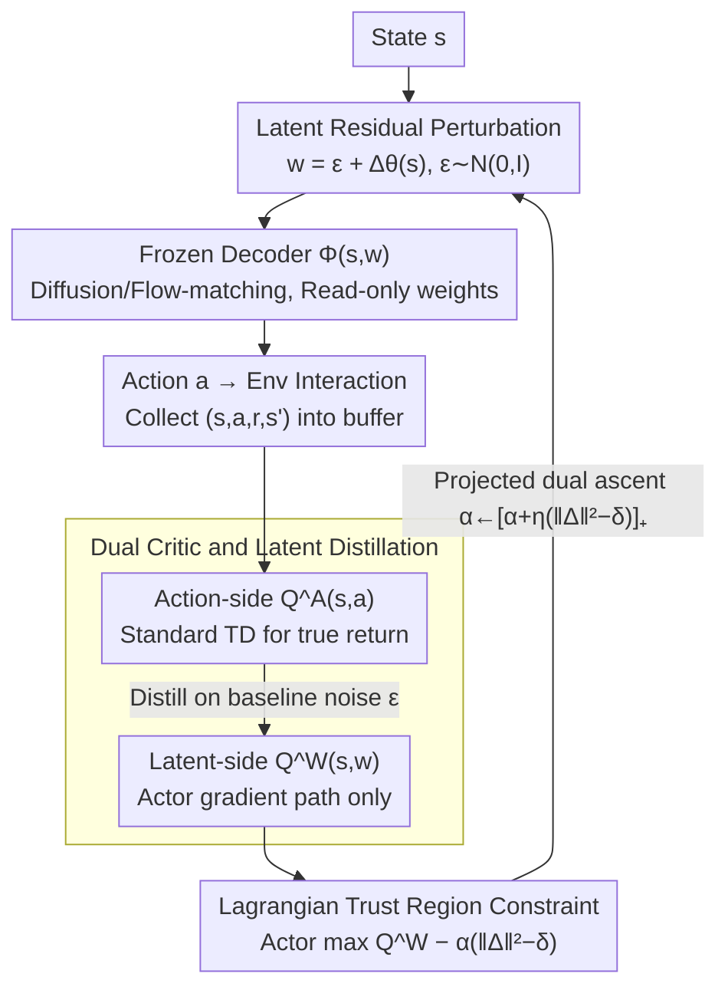

# Lagrangian Perturbation Diffusion Steering: Latent Reinforcement Learning for Generative Policies

**Conference**: ICML 2026  
**arXiv**: [2606.01151](https://arxiv.org/abs/2606.01151)  
**Code**: https://sites.google.com/view/lp-ds/home (project page)  
**Area**: Reinforcement Learning / Generative Policies / Trust Region Methods  
**Keywords**: Diffusion Policy, Latent RL, Trust Region, Lagrangian, Mode Collapse

## TL;DR
LP-DS treats a frozen diffusion/flow-matching policy as a black-box decoder $\Phi(s,w)$ and learns a state-conditional residual only on its initial noise $w=\epsilon+\Delta_\theta(s)$. By using a Lagrangian trust region $\mathbb{E}_s[\|\Delta_\theta(s)\|_2^2]\le\delta$ to constrain the perturbation magnitude, it achieves sample-efficient online RL fine-tuning while preserving multimodal priors. It is more stable than DSRL and DPPO on RoboMimic / Gym / Adroit / LIBERO, with reward gains up to +25%.

## Background & Motivation

**Background**: High-capacity generative policies (Diffusion Policy, Flow-matching π0 series) have become the mainstream BC paradigm for continuous control and manipulation due to their multimodal action distributions.

**Limitations of Prior Work**: Pure BC is limited by demonstration coverage and distribution shift, requiring RL fine-tuning. However, directly updating large diffusion/flow-matching decoders leads to unstable gradients and poor sample efficiency due to long-chain denoising or ODE integration. Recent work like DSRL moves RL to the latent noise space (black-box decoding), but it directly learns a new latent policy to **replace** the pre-trained prior, leading to two failure modes: (i) noise drifting outside the $\mathcal{N}(0,I)$ training support of the decoder, triggering off-manifold behavior; (ii) collapsing the multimodal prior into a single mode.

**Key Challenge**: The decoder is trained on $\mathcal{N}(0,I)$, but RL value gradients push latent variables toward increasingly extreme high-value regions—creating a direct conflict between "improving rewards" and "staying within the decoder's training support." Evidence from Figure 2: DSRL's latent variable magnitude $\|w\|$ grows monotonically on HalfCheetah until decoding fails and success rates drop to 0.

**Goal**: Improve online RL without modifying a single weight of the decoder; use an explicit mechanism to "clamp back to the prior" by controlling the magnitude of latent perturbations; and provide an interpretable knob for users to balance "task return" and "multimodality preservation."

**Key Insight**: Reformulate latent RL as **constrained optimization**—instead of learning a new latent policy, learn a residual $\Delta_\theta(s)$ and incorporate the "perturbation magnitude $\approx$ KL divergence from the prior" as a hard constraint via a Lagrangian.

**Core Idea**: $w=\epsilon+\Delta_\theta(s)$ + Trust region constraint $\mathbb{E}_s[\|\Delta_\theta(s)\|_2^2]\le\delta$ + Dual variable $\alpha$ updated via projected gradient. This creates an intrinsic mechanism where "exceeding the trust region → automatic tightening, returning to the trust region → relaxation."

## Method

### Overall Architecture
LP-DS formulates the frozen generative policy as a black-box decoder $\Phi:\mathcal{S}\times\mathcal{W}\to\mathcal{A}$. For each state $s$, baseline noise $\epsilon\sim\mathcal{N}(0,I)$ is sampled, and a small MLP $\Delta_\theta(s)$ generates the latent query $w$; action $a=\Phi(s,w)$ is used for environment interaction. Value learning adopts a "Dual Q" structure: the action-side $Q_\psi^\mathcal{A}(s,a)$ follows standard TD, while the latent-side $Q_\phi^\mathcal{W}(s,w)$ is obtained by distilling "$Q^\mathcal{A}\circ\Phi$" over the baseline noise—actor updates utilize the latent-side Q to avoid backpropagation through the decoder. The entire training process only updates $\Delta_\theta, Q_\psi^\mathcal{A}, Q_\phi^\mathcal{W}, \alpha$, while the decoder remains frozen.

### Key Designs

**1. Latent Residual Perturbation: Fixing policies without replacing priors by adding a learnable state-conditional offset on $\mathcal{N}(0,I)$**

The root cause of DSRL's failure is that it replaces the pre-trained prior with a new latent policy $w\sim\pi_\theta^\mathcal{W}(\cdot\mid s)$, causing latent variables to drift off-manifold under value gradients. LP-DS uses a residual form $w=\epsilon+\Delta_\theta(s)$, where $\epsilon\sim\mathcal{N}(0,I)$, adding a state-conditional offset from a small MLP. The perturbation acts on the starting point of ODE integration ($x_T$ for diffusion or $x_n$ for flow). Combined with deterministic decoding, this shifts the generative distribution while anchoring it to the prior. This restores BC behavior at initialization ($\Delta_\theta(\cdot)\approx 0$) and explicitly preserves multimodal coverage by using the prior as an anchor.

**2. Lagrangian Trust Region Constraint: Using an interpretable knob $\delta$ to keep perturbations within the prior's support**

Residuals alone cannot stop the value gradient from pushing $\Delta_\theta(s)$ off-manifold. LP-DS treats "perturbation magnitude $\approx$ KL divergence from the prior" as a hard constraint. For a Gaussian with "baseline + offset," the dominant KL term is the square of the mean shift: $D_{\mathrm{KL}}(q_\theta(\cdot\mid s)\|p_0)\approx\frac{1}{2}\|\Delta_\theta(s)\|_2^2$. This yields the constrained objective:

$$\max_\theta\mathbb{E}\big[Q^\mathcal{W}(s,\epsilon+\Delta_\theta(s))\big]\quad\text{s.t.}\quad \mathbb{E}_s\|\Delta_\theta(s)\|_2^2\le\delta.$$

Formulated as a Lagrangian $\mathcal{L}(\theta,\alpha)=\mathbb{E}[Q^\mathcal{W}(s,w)-\alpha(\|\Delta_\theta(s)\|_2^2-\delta)]$, $\theta$ is updated via gradient ascent, and the dual variable $\alpha$ via projected dual ascent $\alpha\leftarrow[\alpha+\eta_\alpha\mathbb{E}_s(\|\Delta_\theta(s)\|_2^2-\delta)]_+$. This loop is naturally adaptive: if perturbations exceed $\delta$, $\alpha$ increases and the actor becomes conservative; if they stay within $\delta$, $\alpha$ decreases and the actor explores more. This allows the same hyperparameters to work across RoboMimic, Gym, and Adroit.

**3. Dual Critic and Latent Distillation: Decoupling value learning and gradient paths at the decoder boundary**

To drive learning with true environment rewards without backpropagating through the complex and unstable gradients of diffusion/flow-matching (especially for large VLAs), LP-DS uses two Q-functions. The action-side $Q_\psi^\mathcal{A}(s,a)$ follows standard TD: $y=r+\gamma\bar Q^\mathcal{A}(s',a')$, where $a'=\Phi(w';s')$. The latent-side $Q_\phi^\mathcal{W}(s,w)$ then distills the action-side Q over the baseline noise distribution:

$$\mathcal{L}_\phi=\mathbb{E}_{s,\epsilon}\big[(Q^\mathcal{W}_\phi(s,\epsilon)-Q^\mathcal{A}_\psi(s,\Phi(\epsilon;s)))^2\big].$$

The actor is updated by taking gradients solely through $Q^\mathcal{W}$, requiring no differentiability from the decoder. This satisfies both the need for real reward signals and the requirement to avoid backpropagation through the decoder.

### Loss & Training
Inner loop: 1 environment step → 1 $Q^\mathcal{A}$ TD update → 1 $Q^\mathcal{W}$ distillation update → 1 actor primal update + 1 $\alpha$ projected dual update. $\delta$ is typically set to 0.35 (Hopper 0.5, Lift 0.10, Pen 0.66). Uses ODE/DDIM decoding with action chunk size $T_a=8$.

## Key Experimental Results

### Main Results

Cross-domain comparison (summarized from Figure 3, average of 6 seeds, units: success rate/return):

| Domain | Task | LP-DS | DSRL | DPPO | IDQL/DQL | Remarks |
|------|------|-------|------|------|----------|------|
| RoboMimic | Square | ≈Highest, fastest to reach high success | Slow convergence | Med | Low | LP-DS excels in precision-sensitive tasks |
| Gym Control | Walker2D-v2 | ≈5000 | ≈4000 (Strongest baseline) | — | — | Return **+25%** |
| Adroit | Pen/Hammer/Door/Relocate | Best overall | Second | Slightly worse | Poor | Optimal success and return in dexterous tasks |
| LIBERO-90 | cream cheese | Sig. higher than frozen π0 | — | — | — | Boots large VLA performance with light module |
| Franka Real | Pick-and-Place | 33/40 | — | — | 18/40 (Frozen baseline) | Sim-to-real transfer of perturbation |
| Franka Real | Mug hanging | 17/20 | — | — | 11/20 (Frozen baseline) | Same as above |

### Ablation Study

| Configuration | Pen Success Rate EMA | k-NN Action Entropy | Description |
|------|--------------|------------|------|
| Full LP-DS | Highest | High | Trust region + Lagrangian both active |
| w/o Lagrangian | Medium → Unstable | Monotonic decrease | Collapses to single behavior without auto-tightening |
| w/o Lag. & noise bound | Lowest, high oscillation | Extremely low | Latent variables fly out of $\mathcal{N}(0,I)$ support |
| DSRL | Low | Lowest | Direct latent policy learning collapses early |
| LP-DS-A (Action residual) | Early plateau | — | Correcting actions after decoding is much less effective |

### Key Findings
- $\delta$ acts as a "multimodality vs. specialization" knob: In a 4-mode symmetric toy environment, $\delta=0.01$ maintains 4 modes, $\delta=0.05$ is more targeted but still multimodal, and $\delta=0.1$ collapses to a single target; DSRL collapses to one mode immediately.
- Final returns are insensitive to $\delta$ within the [0.1, 0.66] range, making it a "coarse-tuning knob" rather than a fragile hyperparameter.
- Latent residuals significantly outperform action-space residuals, showing that for high-capacity decoders, "shifting the starting point $w$" is much more informative than "local action correction $a$."

## Highlights & Insights
- The approximation of KL trust region as $\frac{1}{2}\|\Delta\|^2$ is a highly practical simplification: For "baseline + offset" Gaussians, this term dominates, allowing the Lagrangian derivation to close in one step.
- The explicit architecture for decoupling gradients (Dual Q + Distillation) is a clean way to bypass unstable diffusion backpropagation, crucial for large VLAs where retaining the computation graph is infeasible.
- The projected dual update for $\alpha$ automatically achieves "constraint adaptation," explaining why the same hyperparameters generalize across different domains without heavy tuning.

## Limitations & Future Work
- The trust region KL approximation assumes an isotropic prior; it may be biased if the decoder prior is significantly non-isotropic (e.g., conditional flow).
- Does not systematically cover partially observable or extremely long-horizon scenarios; future work could explore adaptive $\delta$ based on state or time.
- Real-robot tasks remain at medium difficulty (pick-and-place); more high-contact or long-chain dexterous tasks are needed to further validate sim-to-real robustness.

## Related Work & Insights
- **vs DSRL**: DSRL learns $\pi_\theta^\mathcal{W}(w\mid s)$ to replace the prior; LP-DS learns a residual $\Delta_\theta(s)$ with explicit magnitude constraints. Figures 1 and 2 highlight DSRL's collapse versus LP-DS's stability.
- **vs DPPO**: DPPO fine-tunes all decoder parameters via policy gradients; LP-DS updates only a lightweight perturbation MLP, showing better sample efficiency and stability.
- **vs IDQL / DQL**: These offline-to-online methods update the main network; LP-DS's "read-only decoder + latent RL" is a more lightweight, deployment-friendly route.
- **vs Latent Optimization (e.g., ReNO)**: While visual/image generation utilizes noise optimization for quality, LP-DS adapts this for long-horizon returns and explicit trust regions in decision-making.

## Rating
- Novelty: ⭐⭐⭐⭐ Elegant application of latent trust regions via residual approximation, though individual components (Latent RL, Dual Q) are known.
- Experimental Thoroughness: ⭐⭐⭐⭐⭐ Comprehensive coverage across 4 simulation domains, large VLA backbones, and two real-robot Franka tasks.
- Writing Quality: ⭐⭐⭐⭐ Algorithm 1 and derivations are concise; toy visualizations effectively convey the multimodality-performance trade-off.
- Value: ⭐⭐⭐⭐ Provides a ready-to-use pipeline for applying RL to large frozen generative models, particularly valuable for the π0-class models.

<!-- RELATED:START -->

## Related Papers

- [\[ICML 2026\] Online Self-Training for Co-Adaptation in Hierarchical Diffusion Policies](online_self-training_for_co-adaptation_in_hierarchical_diffusion_policies.md)
- [\[ICLR 2026\] Contractive Diffusion Policies](../../ICLR2026/robotics/contractive_diffusion_policies.md)
- [\[ICML 2026\] Discrete Diffusion VLA: Bringing Discrete Diffusion to Action Decoding in Vision-Language-Action Policies](discrete_diffusion_vla_bringing_discrete_diffusion_to_action_decoding_in_vision-.md)
- [\[ICLR 2026\] RFS: Reinforcement Learning with Residual Flow Steering for Dexterous Manipulation](../../ICLR2026/robotics/rfs_reinforcement_learning_with_residual_flow_steering_for_dexterous_manipulatio.md)
- [\[CVPR 2026\] REACH: Explicit Recovery Behavior for Diffusion Policies](../../CVPR2026/robotics/reach_explicit_recovery_behavior_for_diffusion_policies.md)

<!-- RELATED:END -->
