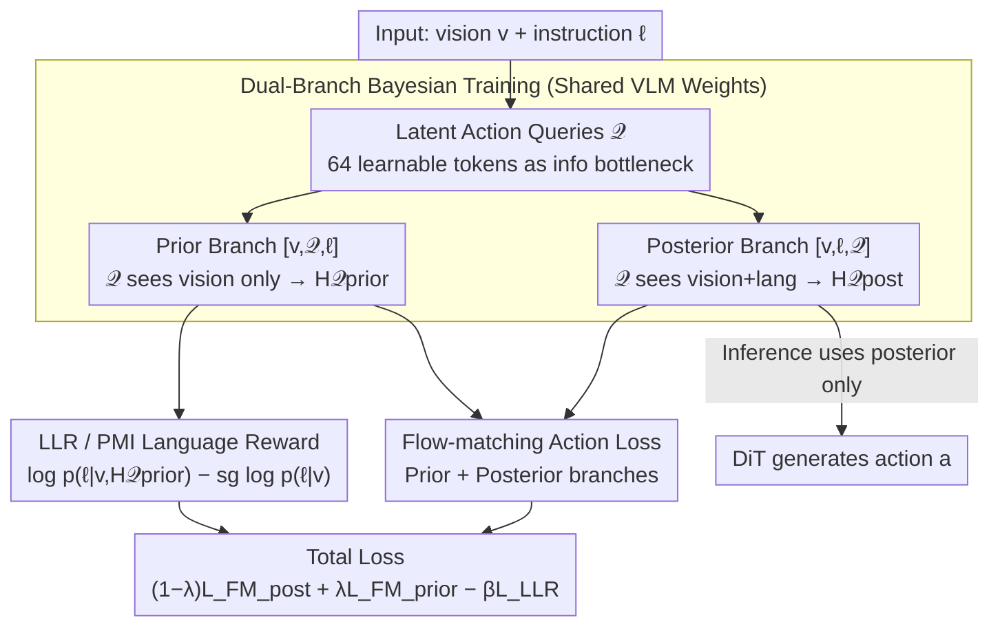

# LangForce: Bayesian Decomposition of Vision-Language-Action Models via Latent Action Queries

**Conference**: ICML 2026
**arXiv**: [2601.15197](https://arxiv.org/abs/2601.15197)  
**Code**: The paper notes "Code and videos are available," but the actual repository URL is not provided.  
**Area**: Robotics / Embodied AI / VLA
**Keywords**: VLA, visual shortcuts, Bayesian decomposition, latent action queries, pointwise mutual information

## TL;DR
LangForce formulates the VLA policy as a Bayesian decomposition $\pi(a\mid v,\ell)=p(\ell\mid a,v)\,p(a\mid v)/p(\ell\mid v)$. By introducing learnable Latent Action Queries, it executes both "vision-only" and "vision+language" branches using a single set of VLM weights. It explicitly penalizes "visual shortcuts" by maximizing the log-likelihood ratio between actions and instructions, achieving an 11.3 percentage point absolute improvement over the QwenGR00T baseline on SimplerEnv.

## Background & Motivation

**Background**: Current mainstream VLAs (such as OpenVLA, π0, GR00T, and StarVLA series) attach pre-trained VLMs to diffusion action heads and perform imitation learning on large-scale human demonstrations. These models aim to ground natural language instructions into continuous actions using the world knowledge inherent in VLMs.

**Limitations of Prior Work**: The authors observe that these models frequently fail in OOD (Out-of-Distribution) scenarios and multi-task ambiguous settings. In LIBERO Goal (where a single tabletop setup corresponds to multiple tasks), a "vision-only" model that ignores language instructions achieves success rates nearly identical to the full model (e.g., 44.6 vs 47.8 on RoboCasa; action loss of 0.13 vs 0.08 on BridgeData+Fractal). This suggests that instructions play a minimal role during training.

**Key Challenge**: Goal-driven data collection often results in a mapping where $v\to\ell$ is nearly injective—seeing a cabinet implies "open the cabinet," and seeing a bottle implies "pick up the bottle." This leads to a conditional entropy of $H(\ell\mid v)\approx 0$, which in turn drives the conditional mutual information $I(\ell;a\mid v)\le H(\ell\mid v)$ toward zero. Consequently, the model only learns $\pi(a\mid v,\ell)\approx p(a\mid v)$, a phenomenon the authors define as "information collapse."

**Goal**: To force the strategy's true dependence on language to emerge from the training objective without re-collecting data or increasing inference computation.

**Key Insight**: Utilize the Bayesian formula $\pi(a\mid v,\ell)=p(\ell\mid a,v)\,p(a\mid v)/p(\ell\mid v)$ to decompose the posterior into "visual prior $\times$ likelihood / language marginal." The log-likelihood ratio $\log p(\ell\mid a,v)-\log p(\ell\mid v)$ (i.e., conditional PMI) is then used as a regularizer to reward strategies where instructions can be accurately inferred from the actions.

**Core Idea**: Use a shared set of VLM weights combined with learnable latent action query tokens. By leveraging decoder-only causal masking, the model simultaneously simulates a "visual prior branch" and a "vision+language posterior branch," explicitly optimizing the difference between the language log-probabilities of these two branches as a PMI reward.

## Method

### Overall Architecture
LangForce augments a native VLA (specifically QwenGR00T based on StarVLA, using Qwen3-VL-4B and a DiT action head) with three components: (1) $K=64$ new tokens added to the vocabulary $\mathcal{Q}=\{\langle\text{action}_1\rangle,\dots,\langle\text{action}_K\rangle\}$ as latent action queries; (2) dual branches sharing weights within the same batch, constructed using two token sequences: $[v,\mathcal{Q},\ell]$ and $[v,\ell,\mathcal{Q}]$; (3) a total loss combining the flow-matching action loss from both branches with a language log-likelihood ratio (LLR) term. During inference, only the posterior branch is executed, maintaining the same computational cost as a standard VLA.

### Key Designs

**1. Latent Action Queries as Information Bottleneck: Compressing Action Semantics into 64 Conditional Tokens**
Models like π0/GR00T feed all vision-language hidden states into the action head, resulting in $O(N^2)$ DiT attention complexity and lacking a clean interface for condition switching. LangForce adds $K=64$ learnable tokens $\mathcal{Q}=\{\langle\text{action}_1\rangle,\dots,\langle\text{action}_K\rangle\}$ to the VLM vocabulary. These tokens condense action-related semantics into fixed-length hidden states $\mathbf{H}_{\mathcal{Q}}\in\mathbb{R}^{K\times D}$. The DiT only processes these $K$ queries, reducing attention complexity to $O(K^2)$. Crucially, by using decoder-only causal masking, placing $\mathcal{Q}$ before $\ell$ restricts it to vision only, while placing it after $\ell$ allows it to see both vision and language. This architectural choice allows the same weights to instantiate both "prior" and "posterior" conditions, providing the structural basis for Bayesian decomposition.

**2. Dual-Branch Bayesian Training: Explicit Contrast Between Visual Prior and Full Posterior**
Under goal-driven data, training $\pi(a\mid v,\ell)$ directly often collapses into $p(a\mid v)$. To fix this, both distributions must be estimated and compared. LangForce runs two branches with shared weights: the Prior Branch takes $[v,\mathcal{Q},\ell]$ as input, where $\mathcal{Q}$ only sees $v$ to produce $\mathbf{H}_{\mathcal{Q}}^{\text{prior}}$. A stop-gradient is applied to $\mathbf{H}_{\mathcal{Q}}^{\text{prior}}$ so that the prior loss only updates the DiT, preventing the VLM backbone from internalizing visual shortcuts. The Posterior Branch takes $[v,\ell,\mathcal{Q}]$ as input, where $\mathcal{Q}$ sees both vision and language to produce $\mathbf{H}_{\mathcal{Q}}^{\text{post}}$ for standard flow-matching. The Rectified Flow Matching loss is applied to both:

$$\mathcal{L}_{\text{FM}}(\psi;\mathbf{C})=\mathbb{E}\|v_\psi(\mathbf{a}_t,t,\mathbf{C})-(\mathbf{a}_1-\mathbf{a}_0)\|^2$$

This contrastive setup introduces minimal overhead due to weight sharing and prefix prefilling, while explicitly exposing the difference between prior and posterior for PMI optimization.

**3. LLR / PMI Language-side Reward: Penalizing Actions that Lack Instruction Information**
To force the policy to depend on language, the authors maximize the pointwise mutual information $\log[\pi(a\mid v,\ell)/p(a\mid v)]$. This is implemented as a log-likelihood ratio, approximated using the VLM's own LM loss:

$$\mathcal{L}_{\text{LLR}}=\log p(\ell\mid v,\mathbf{H}_{\mathcal{Q}}^{\text{prior}})-\mathrm{sg}\big(\log p(\ell\mid v)\big)$$

The numerator encourages $\ell$ to attend back to $\mathcal{Q}$ (which contains action tokens), while the denominator represents the vision-only marginal, which is frozen with a stop-gradient. This freezing is critical; otherwise, the model might "cheat" by degrading the denominator, which would destroy the VLM's general language capabilities. The final loss is:

$$\mathcal{L}_{\text{total}}=(1-\lambda)\mathcal{L}_{\text{FM}}^{\text{post}}+\lambda\mathcal{L}_{\text{FM}}^{\text{prior}}-\beta\mathcal{L}_{\text{LLR}}$$

The authors set $\lambda=0.3$ and $\beta=0.1$. By rewarding policies where instructions can be inferred from actions, the model is forced to utilize instructions, all while maintaining standard VLA inference costs.

### Loss & Training
The model was trained on 8 H100 GPUs using AdamW (lr=1e-5 + cosine), DeepSpeed ZeRO-2, and a gradient clip of 1.0. Fine-tuning on BridgeData V2 + Fractal was performed for 50k steps (batch size 16 per card) for SimplerEnv. Inference uses only the posterior branch, matching baseline costs.

## Key Experimental Results

### Main Results

SimplerEnv (WidowX, Avg@480 Success Rate, %):

| Method | Put Spoon | Put Carrot | Stack Block | Eggplant | Average |
|------|-----------|------------|-------------|----------|------|
| OpenVLA-OFT | 34.2 | 30.0 | 30.0 | 72.5 | 41.8 |
| CogACT | 71.7 | 50.8 | 15.0 | 67.5 | 51.3 |
| π0 | 29.2 | 62.5 | 29.2 | 91.6 | 53.1 |
| π0.5 | 49.3 | 64.7 | 44.7 | 69.7 | 57.1 |
| Isaac-GR00T-N1.6 | 64.5 | 65.5 | 5.5 | 93.0 | 57.1 |
| QwenGR00T (baseline) | 87.5 | 50.0 | 29.2 | 54.2 | 55.2 |
| **LangForce** | **89.6** | **63.8** | **33.3** | 79.2 | **66.5** |

RoboCasa GR1 Tabletop 24 task average success rate: LangForce 52.6 vs QwenGR00T 47.8 vs Isaac-GR00T-N1.5 48.2 vs VisionOnly 44.7.

Real-world Franka Pick-and-Place (OOD 1 red cube): LangForce 9/30 vs QwenGR00T 2/30 vs π0.5 7/30. Vegetable sorting total: LangForce 97/120 (80.8%) vs QwenGR00T 71/120 (59.2%).

### Ablation Study

| Configuration | Spoon | Carrot | Stack | Eggplant | Avg |
|------|-------|--------|-------|----------|------|
| QwenGR00T (Baseline) | 87.5 | 50.0 | 29.2 | 54.2 | 55.2 |
| + Latent Action Queries | 74.6 | 58.3 | 29.2 | 67.9 | 57.5 |
| Full LangForce | 89.6 | 63.8 | 33.3 | 79.2 | 66.5 |

### Key Findings
- The dual-branch + LLR setup is the primary driver of performance: Adding queries alone only improved the result by 2.3 points, whereas the PMI loss added another 9.0 points. This confirms that the "Bayesian decomposition + contrastive loss" is the core innovation, not just the head architecture.
- LangForce preserves the VLM's general dialogue and reasoning capabilities: While QwenGR00T fine-tuned for VLA outputted repetitive gibberish on text-based math problems, LangForce could still solve them, indicating the LLR term protects language representations.
- Improvements are concentrated in tasks requiring language-based target differentiation (Eggplant +15, Carrot +13.6). Limited gains were seen in fine manipulation tasks (Stack Block), consistent with the goal of improving grounding rather than low-level control.

## Highlights & Insights
- Formalizes the engineering phenomenon of "ignored instructions" into information theory: $H(\ell\mid v)\approx 0\Rightarrow I(\ell;a\mid v)=0$, making PMI a principled target for correction.
- Employs a clever engineering trick using decoder-only causal masking and token reordering to switch conditional distributions "at no cost."
- The use of stop-gradients to pin the language baseline $p(\ell\mid v)$ is a vital technique seen in other contrastive losses (DPO, PPO ratio); it prevents the model from gaming the reward by degrading the denominator.

## Limitations & Future Work
- Training requires running two branches. Although prefix prefilling mitigates redundant visual computation, there is still an increased memory and compute cost compared to single-branch baselines.
- Real-world experiments focused on pick-and-place and did not address high-contact or dexterous manipulation. The authors admit the advantage may be less pronounced in tasks dominated by low-level control rather than language grounding.
- The LLR loss relies on the VLM's own LM head as an approximation for $\log p(\ell\mid\cdot)$; quality is thus sensitive to the VLM tokenizer and instruction style, potentially requiring $\beta$ retuning for different templates.

## Related Work & Insights
- **vs BayesVLA**: Both use Bayesian decomposition, but BayesVLA requires a two-stage process (training the visual prior, then freezing it to train the posterior). LangForce enables single-stage end-to-end training via shared weights and token reordering.
- **vs π0 / GR00T**: These models feed all VLM hidden states to the action head ($O(N^2)$). LangForce compresses information into 64 queries and uses prior/posterior contrast as regulation, emphasizing "signal refinement" over "context volume."
- **vs ChatVLA**: While both care about preserving language ability post-VLA training, ChatVLA uses task routing/decoupling, whereas LangForce embeds the language dependency directly into the loss via the LLR term, providing inherent protection against forgetting.

## Rating
- Novelty: ⭐⭐⭐⭐ Maps information collapse to PMI via a dual-branch VLA implementation; clear logic, though individual tricks (stop-gradient, shared weights) are known.
- Experimental Thoroughness: ⭐⭐⭐⭐ Comprehensive coverage across SimplerEnv, RoboCasa, LIBERO, and real-world Franka tasks, including general capability visualization.
- Writing Quality: ⭐⭐⭐⭐ Motivation is well-supported by pilot experiments, and the Method section follows the Bayesian derivation strictly.
- Value: ⭐⭐⭐⭐ Provides a practical training-side fix for the common "VLA instruction neglect" issue with low replication costs for engineering teams.

<!-- RELATED:START -->

## Related Papers

- [\[ICML 2026\] Latent Reasoning VLA: Latent Thinking and Prediction for Vision-Language-Action Models](latent_reasoning_vla_latent_thinking_and_prediction_for_vision-language-action_m.md)
- [\[ICML 2026\] Neural Implicit Action Fields: From Discrete Waypoints to Continuous Functions for Vision-Language-Action Models](neural_implicit_action_fields_from_discrete_waypoints_to_continuous_functions_fo.md)
- [\[ICML 2026\] StableVLA: Towards Robust Vision-Language-Action Models without Extra Data](stablevla_towards_robust_vision-language-action_models_without_extra_data.md)
- [\[ICML 2026\] Spatial Memory for Out-of-Vision Manipulation in Vision-Language-Action](spatial_memory_for_out-of-vision_manipulation_in_vision-language-action.md)
- [\[ICML 2026\] Contrastive Representation Regularization for Vision-Language-Action Models](contrastive_representation_regularization_for_vision-language-action_models.md)

<!-- RELATED:END -->
