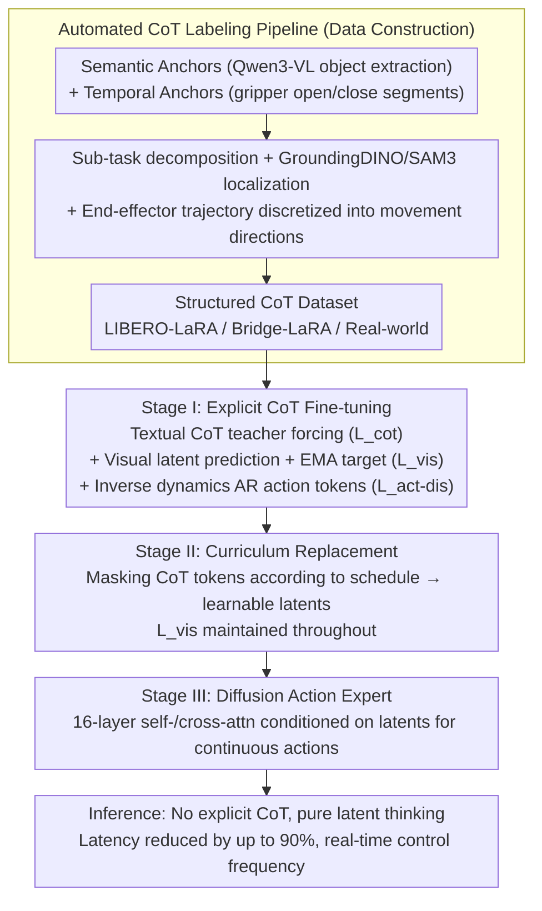

# Latent Reasoning VLA: Latent Thinking and Prediction for Vision-Language-Action Models

**Conference**: ICML 2026  
**arXiv**: [2602.01166](https://arxiv.org/abs/2602.01166)  
**Code**: Public (Project Page)  
**Area**: Multimodal VLA / Embodied AI / Robotics  
**Keywords**: VLA, Latent CoT, visual prediction, curriculum training, inference efficiency

## TL;DR
LaRA-VLA internalizes both textual and visual Chain-of-Thought (CoT) in VLA models into continuous latents. Through a three-stage curriculum training process (explicit CoT → latent replacement → action expert adaptation), reasoning is performed entirely within the latent space. This reduces inference latency by up to 90% compared to explicit CoT, returning control frequencies to the real-time range.

## Background & Motivation
**Background**: VLA models aim to map "images + instructions" to "continuous actions" end-to-end. Recent mainstream enhancement strategies involve introducing Chain-of-Thought: textual CoT (ECoT, $\pi_{0.5}$, ThinkAct) decomposes tasks into explicit linguistic reasoning chains; visual CoT (CoT-VLA, DreamVLA) uses discrete visual tokens (e.g., VQ-VAE) to predict future observations; and limited work (UP-VLA) combines both.

**Limitations of Prior Work**: (i) Textual CoT requires generating long token chains during inference, causing KV-cache explosion and dropping control frequencies to 5 Hz or even 1 Hz, which is insufficient for real-time robot control. (ii) Textual CoT uses discrete language tokens and visual CoT uses VQ discrete visual tokens, whereas perception and action exist in continuous spaces—discrete representations create a natural **representation mismatch**, effectively chopping continuous motions like "sliding smoothly along a table" into vocabulary indices.

**Key Challenge**: The effectiveness of CoT does not stem from the "necessity of natural language," but from "exposing structured intermediate reasoning." In embodied scenarios, forcing reasoning into language tokens is both slow and misaligned.

**Goal**: Construct a VLA framework that internalizes structured CoT into **continuous latents** to simultaneously achieve (i) inference efficiency (no explicit generation), (ii) continuous representations aligned with perception/action spaces, and (iii) a more thorough implementation than Fast-ThinkAct—the latter only latentizes textual CoT, while the visual part remains discrete traces.

**Key Insight**: View reasoning as the evolution of a latent state sequence. Use curriculum training to step-by-step replace explicit tokens with learnable latents, using future visual latent prediction as implicit supervision to ensure latent reasoning remains structured and interpretable.

**Core Idea**: Textual CoT is replaced by continuous latents, visual CoT is aligned with future image latents (stabilized by an EMA encoder), and actions are handled by a diffusion expert. All three components collaborate via curriculum training.

## Method

### Overall Architecture
LaRA-VLA uses Qwen3-VL as the VLM backbone, adding a special token `<img_next>` to represent future visual latents. For the action side, Stage I-II use autoregressive action tokens (following Pertsch et al.), while Stage III switches to a 16-layer Diffusion Transformer action expert. This expert outputs continuous action trajectories conditioned on latent representations via self-attention and cross-attention. Training data is generated by an automated CoT labeling pipeline driven by "semantic anchors (objects extracted by Qwen3-VL) + temporal anchors (gripper state segments)," constructing LIBERO-LaRA, Bridge-LaRA, and real-world datasets. The training is divided into three stages: explicit CoT fine-tuning → progressive latent replacement → action expert adaptation.

### Key Designs

**1. Automated CoT Labeling Pipeline: Anchor-first multimodal reasoning annotation**

CoT supervision for VLA must cover long-horizon sub-task structures, target object spatial localization, and action-level movement directions. However, existing pipelines handle these separately—ECoT piles up redundant bounding boxes, while Emma-x misses target localization. This paper uses an automated "anchor-first, generate-later" pipeline to unify the three: first, extract two types of anchors—semantic anchors use Qwen3-VL to identify manipulated objects from the first frame and instruction, while temporal anchors segment the trajectory into atomic operation segments based on gripper state. Then, generate annotations conditionally in batches—Qwen3-VL writes sub-task descriptions, GroundingDINO + SAM3 perform open-vocabulary grounding for temporally consistent object boxes, and end-effector trajectories are used to calculate goal-oriented/local movements discretized into directional descriptors. These three streams are merged into structured CoT for the datasets.

**2. Stage I: Explicit CoT Fine-tuning + Visual Latent Alignment + Inverse Dynamics Supervision**

Directly learning latent reasoning is difficult to converge, so the first stage injects the "task decomposition, spatial localization, movement direction" structure into the model via explicit CoT. Three supervision signals run in parallel: textual CoT uses teacher forcing to optimize $\mathcal{L}_{\text{cot}} = -\sum_t \log p_\theta(c_t \mid c_{<t}, \mathbf{v}, \mathbf{x})$; the visual side predicts the next frame latent $\hat{\mathbf{z}}_{t+1}$ with $\ell_1$ alignment $\mathcal{L}_{\text{vis}} = \|\hat{\mathbf{z}}_{t+1} - \mathbf{z}_{t+1}\|_1$; the action side uses inverse dynamics $f(\mathbf{v}_t, \mathbf{v}_{t+1} \mid \mathbf{x}, c) = \mathbf{a}_t$, using predicted vision as a bridge.

A key detail is that the target latent for visual alignment is provided by an EMA copy of the **same visual encoder** $\bar{\theta}_v^t = \tau_v \bar{\theta}_v^{t-1} + (1 - \tau_v) \theta_v^t$—a standard technique in BYOL/JEPA to prevent the prediction and target from collapsing into a trivial solution. This visual consistency constraint serves as insurance against latent degradation in later stages.

**3. Stage II: Curriculum for progressive replacement of discrete CoT tokens with latents**

Switching entirely to latents abruptly can cause a loss of structured reasoning, making latents deviate into "placeholders that learn nothing." The second stage maintains $\mathcal{L}_{\text{cot}} + \mathcal{L}_{\text{vis}}$, but randomly masks tokens in the CoT sequence according to a preset schedule, replacing them with learnable latents. The proportion of discrete tokens decreases monotonically to zero until the latents carry all reasoning.

This curriculum is more stable than methods like Coconut that switch to latents directly: at each step, some explicit tokens remain as anchors, allowing the model to adapt gradually. The persistently maintained $\mathcal{L}_{\text{vis}}$ is crucial—latents must be constrained by visual consistency to avoid collapsing into trivial representations; here, visual latents act as implicit grounding for textual latents.

**4. Stage III: Diffusion Action Expert and elimination of explicit token output**

Co-existence of the action expert and autoregressive tokens in previous stages was purely for stability. Final deployment requires the shortest path of "latent reasoning + continuous actions." Stage III removes autoregressive action tokens and introduces a 16-layer Diffusion Transformer with alternating self-/cross-attention as the action expert. It generates action chunks conditioned on latent representations. During VLM inference, CoT is no longer decoded, significantly reducing KV-cache usage and returning control frequency to real-time.

Selecting Diffusion over discrete action tokens aligns with findings from $\pi_0$ and OpenVLA-OFT regarding fine-grained control. The saved token budget translates directly into more actual execution steps in long-horizon tasks like LIBERO-Long.

### Loss & Training
Total Loss = $\mathcal{L}_{\text{cot}} + \mathcal{L}_{\text{vis}} + \mathcal{L}_{\text{act-dis}}$ (Stage I-II). Stage III switches to diffusion training objectives while maintaining $\mathcal{L}_{\text{vis}}$. The curriculum schedule is implemented by gradually increasing the masking probability. The EMA decay rate $\tau_v$ is a critical hyperparameter; if too small, collapse occurs; if too large, it cannot track online encoder updates.

## Key Experimental Results

### Main Results
Comparison with SOTA on LIBERO (Table 2, partial results):

| Type | Method | Spatial | Goal | Object | Long | Avg. |
|------|------|---------|------|--------|------|------|
| No CoT | OpenVLA | 84.7 | 88.4 | 79.2 | 53.7 | 76.5 |
| No CoT | OpenVLA-OFT | 97.6 | 98.4 | 97.9 | 94.5 | 97.1 |
| Textual CoT | ThinkAct | 88.3 | 91.4 | 87.1 | 70.9 | 84.4 |
| Textual CoT | $\pi_{0.5}$ | 98.8 | 98.2 | 98.0 | 92.4 | 96.8 |

Ours (LaRA-VLA) consistently leads all CoT-based methods in this table and reports inference latency reductions of **up to 90%** compared to explicit CoT baselines.

### Ablation Study

| Configuration | Avg. Success Rate | Inference Latency |
|------|-----------|---------|
| Stage I (Explicit CoT) | High | Slow (~1-5 Hz) |
| Mid-Stage II (Partial Latent) | Close | Medium |
| Stage III (Full Latent + Expert) | Stable/Slight Rise | **Fast** (Real-time) |
| w/o EMA target | Significant Decrease (Latent collapse) | — |
| w/o Visual Latent Pred. | Decrease in long-horizon tasks | — |

Both EMA and visual prediction supervisions are indispensable for maintaining latent structure; skipping curriculum steps leads to non-convergence of latents.

### Key Findings
- **No trade-off between efficiency and performance**: After latentization, inference latency drops by an order of magnitude while performance remains equal or improves, as discrete tokens introduce representation noise.
- **Multimodal latent mutual supervision**: Visual latents serve as "implicit grounding" for textual latents; training textual latents alone risks losing semantic meaning.
- **Long-horizon tasks benefit most**: Stage III shows the most significant Gain in long-horizon tasks like LIBERO-Long, as the saved token budget can be utilized for actual execution.

## Highlights & Insights
- Implements the proposition that "CoT effectiveness comes from structure, not textuality" into a complete algorithmic stack, avoiding the forcing of discrete LLM priors into continuous control scenarios.
- Curriculum replacement is an elegant "softening" of the explicit-to-implicit transition—stabler than direct replacement (Coconut) and more systematic than simple stabilization tricks (SIM-CoT).
- Visual latents + EMA targets essentially introduce BYOL/JEPA into VLA training as a physical constraint source for "latent reasoning," preventing latents from degenerating into irrelevant placeholders.

## Limitations & Future Work
- The number of reasoning latents is a manual hyperparameter; the optimal ratio relative to task complexity remains unexplored. Too few latents hurt capability, while too many are wasteful.
- Real-world data scale is limited; long-term embodied generalization (lighting, new objects, post-disaster scenarios) has not been verified.
- The VLM backbone is locked to Qwen3-VL; lack of scaling experiments across different VLM capacities makes it difficult to judge if latent reasoning continues to benefit with model size.

## Related Work & Insights
- **vs Fast-ThinkAct**: Fast-ThinkAct only latentizes text, while vision remains discrete traces; LaRA-VLA is fully latent for both modalities, and visual latents supervise textual latents.
- **vs CoT-VLA / DreamVLA**: These use VQ-VAE to turn vision into discrete CoT tokens; Ours uses continuous visual latents directly, avoiding discretization loss.
- **vs Coconut (LLM latent CoT)**: Transfers latent CoT technology from language to VLA, adding visual and action anchors to resolve the risk of latents losing semantics.

## Rating
- Novelty: ⭐⭐⭐⭐ Extending Latent CoT across modalities to VLA is a clear incremental + integration innovation.
- Experimental Thoroughness: ⭐⭐⭐⭐ Covers LIBERO multiple splits + real-world + multiple baselines well.
- Writing Quality: ⭐⭐⭐⭐ The three-stage framework is clearly explained, and the taxonomy helps position the work.
- Value: ⭐⭐⭐⭐⭐ Directly addresses the real-time bottleneck of VLA + CoT, offering high value for real robot deployment.

<!-- RELATED:START -->

## Related Papers

- [\[ICML 2026\] LangForce: Bayesian Decomposition of Vision-Language-Action Models via Latent Action Queries](langforce_bayesian_decomposition_of_vision_language_action_models_via_latent_act.md)
- [\[CVPR 2026\] Fast-ThinkAct: Efficient Vision-Language-Action Reasoning via Verbalizable Latent Planning](../../CVPR2026/robotics/fast-thinkact_efficient_vision-language-action_reasoning_via_verbalizable_latent.md)
- [\[CVPR 2026\] Cross-Hand Latent Representation for Vision-Language-Action Models](../../CVPR2026/robotics/cross-hand_latent_representation_for_vision-language-action_models.md)
- [\[ICML 2026\] Discrete Diffusion VLA: Bringing Discrete Diffusion to Action Decoding in Vision-Language-Action Policies](discrete_diffusion_vla_bringing_discrete_diffusion_to_action_decoding_in_vision-.md)
- [\[CVPR 2026\] Chain of World: World Model Thinking in Latent Motion (CoWVLA)](../../CVPR2026/robotics/chain_of_world_world_model_thinking_in_latent_motion.md)

<!-- RELATED:END -->
