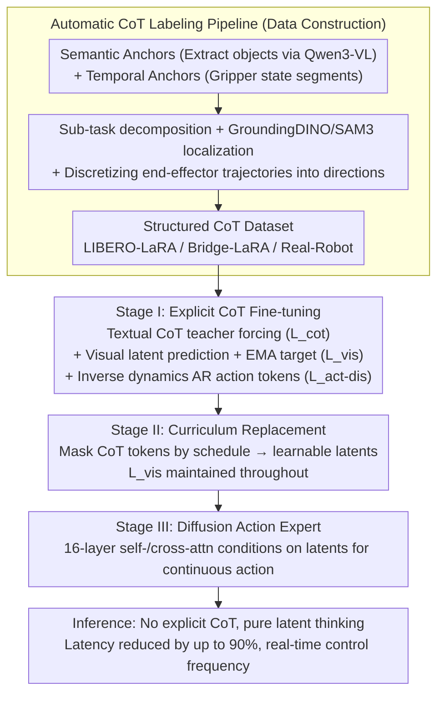

# Latent Reasoning VLA: Latent Thinking and Prediction for Vision-Language-Action Models

**Conference**: ICML 2026  
**arXiv**: [2602.01166](https://arxiv.org/abs/2602.01166)  
**Code**: Public (Project Page)  
**Area**: Multimodal VLA / Embodied AI / Robotics  
**Keywords**: VLA, Latent CoT, Visual Prediction, Curriculum Training, Inference Efficiency

## TL;DR
LaRA-VLA internalizes both textual and visual Chain-of-Thought (CoT) into continuous latents. Through a three-stage curriculum training process (explicit CoT → latent replacement → action expert adaptation), reasoning is performed within the latent space. This reduces inference latency by up to 90% compared to explicit CoT, restoring control frequencies to real-time ranges.

## Background & Motivation
**Background**: Vision-Language-Action (VLA) models aim to map "image + instruction" to "continuous actions" in an end-to-end manner. Recent enhancement strategies introduce Chain-of-Thought: Textual CoT (ECoT, $\pi_{0.5}$, ThinkAct) decomposes tasks into explicit linguistic reasoning chains; Visual CoT (CoT-VLA, DreamVLA) predicts future observations using discrete tokens like VQ-VAE; a few works (UP-VLA) combine both.

**Limitations of Prior Work**: (i) Textual CoT requires generating long token chains during inference, causing KV-cache to explode and dropping control frequency to 5 Hz or even 1 Hz, which is insufficient for real-time robotic control. (ii) Textual CoT uses discrete language tokens and visual CoT uses VQ discrete visual tokens, whereas perception and action reside in continuous spaces—discrete representations create a natural **representation mismatch**, forcing continuous movements like "sliding smoothly along a table" into vocabulary indices.

**Key Challenge**: The effectiveness of CoT does not stem from "using natural language" but from "exposing structured intermediate reasoning." In embodied scenarios, forcing reasoning into language tokens is both slow and misaligned.

**Goal**: Construct a VLA framework that internalizes structured CoT into **continuous latents** to achieve: (i) inference efficiency (no explicit generation), (ii) continuous representations aligned with perception/action spaces, and (iii) a more thorough internalization than Fast-ThinkAct—the latter only latentizes textual CoT while the visual part remains discrete traces.

**Key Insight**: Treat reasoning as the evolution of a latent state sequence. Use curriculum training to replace explicit tokens with learnable latents step-by-step, using future visual latent prediction as implicit supervision to ensure the latent reasoning remains structured and interpretable.

**Core Idea**: Replace textual CoT with continuous latents and align visual CoT with future image latents (using an EMA encoder for stability). Coordinated training of these with a diffusion action expert is achieved through curriculum stages.

## Method

### Overall Architecture
LaRA-VLA uses Qwen3-VL as the VLM backbone, adding a special token `<img_next>` to represent the future visual latent. For the action head, Stages I-II use autoregressive action tokens (following Pertsch et al.), while Stage III switches to a 16-layer Diffusion Transformer action expert, which outputs continuous action trajectories conditioned on latent representations via self- and cross-attention. Training data is generated by an automated CoT labeling pipeline driven by "semantic anchors (object extraction via Qwen3-VL) + temporal anchors (gripper state segmentation)," creating LIBERO-LaRA, Bridge-LaRA, and real-robot datasets. Training is divided into three stages: explicit CoT fine-tuning → progressive latent replacement → action expert adaptation.

### Key Designs

**1. Automatic CoT Labeling Pipeline: Anchor-first Multimodal Reasoning Annotation**

CoT supervision for VLA must cover long-term sub-task structures, spatial localization of target objects, and action-level movement directions. Existing pipelines are fragmented—ECoT uses redundant bounding boxes, while Emma-x misses target localization. This work proposes an automated "anchor-first, generation-later" pipeline to unify them: first, extract two types of anchors—semantic anchors identify manipulated objects from the first frame and instruction using Qwen3-VL, and temporal anchors segment trajectories into atomic operations based on gripper state. Then, generate annotations conditioned on these anchors: Qwen3-VL writes sub-task descriptions, GroundingDINO + SAM3 provide open-vocabulary grounding for temporally consistent object boxes, and end-effector trajectories are used to calculate goal-oriented/local movements discretized into directional descriptors. These three streams are combined into structured CoT for the LIBERO-LaRA, Bridge-LaRA, and real-robot datasets.

**2. Stage I: Explicit CoT Fine-tuning + Visual Latent Alignment + Inverse Dynamics Supervision**

Learning latent reasoning directly is difficult to converge. Thus, the first stage injects the "task decomposition, spatial localization, movement direction" structure into the model using explicit CoT. Three supervision signals are used in parallel: for CoT, teacher forcing optimizes $\mathcal{L}_{\text{cot}} = -\sum_t \log p_\theta(c_t \mid c_{<t}, \mathbf{v}, \mathbf{x})$; for the visual part, the next frame latent $\hat{\mathbf{z}}_{t+1}$ is predicted with $\ell_1$ alignment $\mathcal{L}_{\text{vis}} = \|\hat{\mathbf{z}}_{t+1} - \mathbf{z}_{t+1}\|_1$; for the action part, inverse dynamics $f(\mathbf{v}_t, \mathbf{v}_{t+1} \mid \mathbf{x}, c) = \mathbf{a}_t$ uses predicted vision as a bridge.

A critical detail is that the target latent for visual alignment is provided by an EMA copy of the **same visual encoder** $\bar{\theta}_v^t = \tau_v \bar{\theta}_v^{t-1} + (1 - \tau_v) \theta_v^t$—a standard BYOL/JEPA technique to prevent the predicted and target latents from collapsing into a trivial solution. This visual consistency constraint serves as a safeguard against latent degradation in later stages.

**3. Stage II: Curriculum Replacement of Discrete CoT Tokens with Latents**

Switching entirely to latents abruptly can cause a loss of structured reasoning, making latents degrade into "useless placeholders." The second stage maintains $\mathcal{L}_{\text{cot}} + \mathcal{L}_{\text{vis}}$ but randomly masks tokens in the CoT sequence according to a preset schedule, replacing them with learnable latents. The proportion of discrete tokens decreases monotonically to zero until the latents carry all reasoning.

This curriculum is more stable than methods like Coconut that replace latents immediately; it keeps some explicit tokens as anchors at each step, allowing the model to adapt gradually. The persistently maintained $\mathcal{L}_{\text{vis}}$ is crucial—latents must be constrained by visual consistency to avoid trivial representations. Visual latents here act as implicit grounding for textual latents.

**4. Stage III: Transition to Diffusion Action Expert**

In the first two stages, the action expert coexists with autoregressive tokens only for training stability. Final deployment requires the shortest path: "latent reasoning + continuous actions." In the third stage, autoregressive action tokens are removed and replaced by a Diffusion Transformer with 16 alternating self-/cross-attention layers as the action expert. This generates action chunks conditioned on latent representations. During VLM inference, CoT is no longer decoded, significantly reducing KV-cache usage and bringing control frequency back to real-time.

Choosing Diffusion over discrete tokens is also due to its better performance in fine-grained control, consistent with findings in $\pi_0$ and OpenVLA-OFT. The saved token budget can be converted into more actual execution steps in long-horizon tasks like LIBERO-Long.

### Loss & Training
Total Loss = $\mathcal{L}_{\text{cot}} + \mathcal{L}_{\text{vis}} + \mathcal{L}_{\text{act-dis}}$ (Stages I-II). Stage III switches to the diffusion training objective while maintaining $\mathcal{L}_{\text{vis}}$. The curriculum schedule is implemented by gradually increasing the mask probability. The EMA decay rate $\tau_v$ is a key hyperparameter; if too small, collapse occurs; if too large, it lags behind the online encoder updates.

## Key Experimental Results

### Main Results
Comparison with SOTA on LIBERO (Table 2, partial results):

| Type | Method | Spatial | Goal | Object | Long | Avg. |
|------|------|---------|------|--------|------|------|
| No CoT | OpenVLA | 84.7 | 88.4 | 79.2 | 53.7 | 76.5 |
| No CoT | OpenVLA-OFT | 97.6 | 98.4 | 97.9 | 94.5 | 97.1 |
| Textual CoT | ThinkAct | 88.3 | 91.4 | 87.1 | 70.9 | 84.4 |
| Textual CoT | $\pi_{0.5}$ | 98.8 | 98.2 | 98.0 | 92.4 | 96.8 |

LaRA-VLA consistently leads all CoT-based methods in this table and reports an inference latency reduction of **up to 90%** compared to explicit CoT baselines.

### Ablation Study

| Configuration | Avg. Success Rate | Inference Latency |
|------|-----------|---------|
| Stage I (Explicit CoT) | High | Slow (~1-5 Hz) |
| Mid-Stage II (Partial Latent) | Close | Medium |
| Stage III (All Latent + Expert) | Stable/Slight Increase | **Fast** (Real-time) |
| w/o EMA target | Significant decrease (Latent collapse) | — |
| w/o Visual Latent Prediction | Long-horizon decrease | — |

Both EMA and visual prediction supervision are indispensable for maintaining latent structure. Skipping curriculum steps causes the latents to fail to converge.

### Key Findings
- **Efficiency vs. Performance is not a trade-off**: After latentization, inference latency drops by an order of magnitude while performance remains stable or improves, as discrete tokens often introduce representation noise.
- **Multimodal Latent Mutual Supervision**: Visual latents act as "implicit grounding" for textual latents. Training textual latents alone leads to loss of semantics.
- **Long-horizon tasks benefit most**: Stage III shows the most significant gains in long-horizon tasks like LIBERO-Long because the saved token budget can be used for more execution steps.

## Highlights & Insights
- Validates the proposition that "the effectiveness of CoT comes from structure rather than textuality" with a complete algorithmic stack, avoiding the injection of discrete LLM priors into continuous control scenarios.
- Curriculum replacement is an elegant way to soften the "explicit-to-implicit" transition—more stable than Coconut's direct replacement and more systematic than SIM-CoT's stabilization techniques.
- Visual latents + EMA targets essentially introduce BYOL/JEPA into VLA training as a source of physical constraints for "latent reasoning," preventing latents from degrading into optional placeholders.

## Limitations & Future Work
- The number of reasoning latents is a manual hyperparameter; the optimal ratio relative to task complexity remains unexplored. Too few latents hurt capability, while too many are wasteful.
- Real-robot data scale is limited; long-term embodied generalization (lighting, new objects, post-disaster scenarios) has not been verified.
- The VLM backbone is locked to Qwen3-VL; lack of scaling experiments across different VLM capacities makes it difficult to judge if latent reasoning continues to benefit from model size.

## Related Work & Insights
- **vs. Fast-ThinkAct**: Fast-ThinkAct only latentizes text, whereas vision remains discrete traces; LaRA-VLA is fully latent for both modalities, and visual latents supervise textual ones.
- **vs. CoT-VLA / DreamVLA**: They use VQ-VAE to turn vision into discrete tokens for CoT; this work uses continuous visual latents to avoid quantization loss.
- **vs. Coconut (LLM Latent CoT)**: Transfers latent CoT technology from the language domain to VLA, adding visual and action anchors to mitigate the risk of "latents losing semantics."

## Rating
- Novelty: ⭐⭐⭐⭐ Extending Latent CoT cross-modally to VLA is a clear incremental and integrative innovation.
- Experimental Thoroughness: ⭐⭐⭐⭐ Covers LIBERO multiple splits, real-robot, and multiple baselines.
- Writing Quality: ⭐⭐⭐⭐ The three-stage framework is explained clearly, and the taxonomy in Table 1 aids positioning.
- Value: ⭐⭐⭐⭐⭐ Directly valuable for real-robot deployment by resolving the real-time bottleneck of VLA + CoT.

<!-- RELATED:START -->

## Related Papers

- [\[ICML 2026\] LangForce: Bayesian Decomposition of Vision-Language-Action Models via Latent Action Queries](langforce_bayesian_decomposition_of_vision_language_action_models_via_latent_act.md)
- [\[CVPR 2026\] Fast-ThinkAct: Efficient Vision-Language-Action Reasoning via Verbalizable Latent Planning](../../CVPR2026/robotics/fast-thinkact_efficient_vision-language-action_reasoning_via_verbalizable_latent.md)
- [\[ICML 2026\] Discrete Diffusion VLA: Bringing Discrete Diffusion to Action Decoding in Vision-Language-Action Policies](discrete_diffusion_vla_bringing_discrete_diffusion_to_action_decoding_in_vision-.md)
- [\[CVPR 2026\] Cross-Hand Latent Representation for Vision-Language-Action Models](../../CVPR2026/robotics/cross-hand_latent_representation_for_vision-language-action_models.md)
- [\[CVPR 2026\] Chain of World: World Model Thinking in Latent Motion (CoWVLA)](../../CVPR2026/robotics/chain_of_world_world_model_thinking_in_latent_motion.md)

<!-- RELATED:END -->
