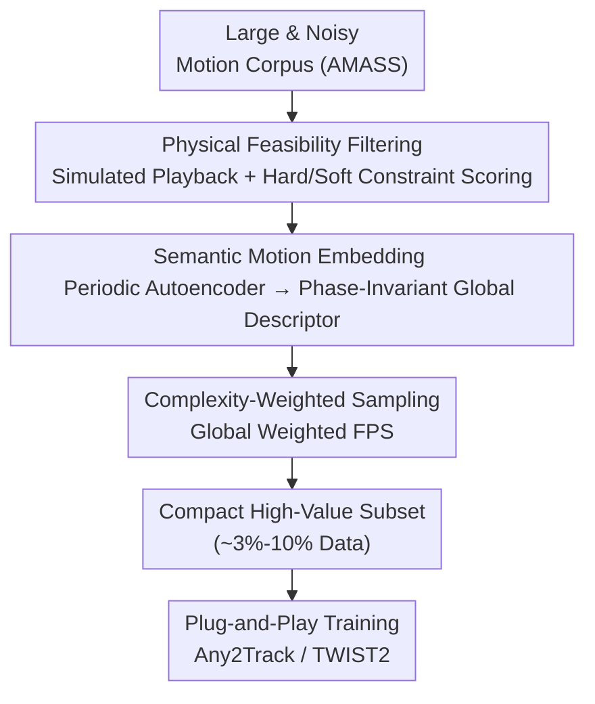

# LIMMT: Less is More for Motion Tracking

**Conference**: ICML2026  
**arXiv**: [2606.06953](https://arxiv.org/abs/2606.06953)  
**Code**: https://giraffeguan.github.io/limmt/  
**Area**: Robotics / Humanoid Robots / Data-centric  
**Keywords**: Humanoid Robots, Motion Tracking, Data Pruning, Physical Feasibility, Less-is-More

## TL;DR
This paper investigates physics-based humanoid motion tracking from a "data-centric" perspective and proposes a three-stage filtering framework, GQS (Physical Feasibility Filtering → Semantic Motion Embedding → Complexity-Weighted Subset Sampling). It demonstrates that **training with less than 3% of the AMASS dataset achieves tracking performance superior to using the full dataset**, and this filtering approach can be migrated to various trackers like Any2Track and TWIST2 in a plug-and-play manner.

## Background & Motivation

**Background**: Motion tracking is a core component of humanoid robot learning—it transforms a reference motion library into physically realizable behaviors (gaits, athletic skills, composite controllers). As motion capture corpora expand from studio-grade datasets (LaFAN1, AMASS) to internet-scale data reconstructed from videos, it is widely believed that humanoid tracking will replicate the "more data, better generalization" trajectory seen in CV/NLP.

**Limitations of Prior Work**: However, physics-based imitation-RL does not continuously benefit from indiscriminate data expansion. Current SOTA trackers still rely on small, high-quality datasets like LaFAN1/AMASS. Large-scale in-the-wild corpora often introduce systemic artifacts—temporal jitter, foot sliding, ground penetration, and unrealistic contacts that violate rigid-body physics—which contaminate imitation signals, leading to fragile solutions or reward hacking. Furthermore, training on massive motion libraries is **computationally expensive** (reference sampling, curriculum design, and long-term optimization costs scale with data volume).

**Key Challenge**: "More motion data" is both noisier and harder to utilize. The key to physical imitation-RL lies in the fact that **data quality shapes the optimization trajectory during early training**: high-quality motion targets provide consistent, physically meaningful gradients, leading the policy toward stable solutions early on; low-quality or redundant motions inject biased targets and unstable gradients, wasting computation and degrading final performance—once early convergence hits a wrong "attractor," it is difficult to recover.

**Goal**: To move beyond simple cleaning (e.g., "deleting bad clips") and systematically characterize "what motion data is valuable for tracking," thereby constructing a compact, high-value training library.

**Key Insight**: The authors argue that "quality" extends beyond the absence of bad clips and should be characterized along three complementary dimensions: ① Physical feasibility (whether a rigid-body humanoid can reproduce it without severe artifacts); ② Motion diversity (covering different behaviors rather than repeating high-frequency patterns); ③ Motion complexity (providing information-rich dynamic supervision rather than near-static segments). This explains why simple expansion fails: large corpora contain many segments, but not many **useful** segments.

**Core Idea**: Use GQS (General Quality Selection), a hierarchical pipeline, to implement feasibility, diversity, and complexity **in a specific sequence**—filtering first, then embedding for diversity measurement, and finally complexity-weighted sampling—to extract a small, high-value training subset from a large, noisy motion corpus.

## Method

### Overall Architecture
GQS takes a large, noisy motion capture corpus (e.g., AMASS) as input and outputs a compact, high-value training subset that can be directly used by existing trackers. It consists of three sequential stages, where the **order itself is a critical design choice** (incorrect ordering leads to failure): Stage I plays back motions in a rigid-body simulator, scoring and filtering them based on physical feasibility; Stage II learns a continuous semantic manifold (via a periodic autoencoder) on the remaining motions, making "distance" reflect behavioral differences rather than surface Euclidean pose differences; Stage III performs complexity-weighted farthest point sampling (Global Weighted FPS) on this embedding space to select a subset that is both broadly representative and biased toward dynamically rich motions.

The authors emphasize that the **order is non-interchangeable**: filtering must come first (otherwise physically broken motions will dominate the representation space and be selected as "outliers" for the wrong reasons); embedding learning must occur on feasible data to define a meaningful semantic manifold; complexity weighting must be last (otherwise high-energy artifacts would be over-selected).

### Key Designs

**1. Physical Feasibility Filtering: Blocking "Physically Impossible" Motions via Simulator**

Addressing the pain point that "in-the-wild corpora are full of jitter, penetration, and foot sliding," Stage I plays back trajectories in a rigid-body simulator for the target robot (Unitree G1). It first performs a **hard constraint** binary check: trajectories shorter than 0.5s (insufficient context) or with joint velocity violations exceeding a 0.05 rad/s safety margin (mechanically impossible) are discarded. Remaining trajectories are then given a **soft score**:

$$S_{phy}(\mathcal{T})=100-\sum_i w_i\,\mathcal{L}_i$$

Six penalty terms cover different violation modes: Floating (temporal convolution window on foot-to-ground distance), Ground Penetration (average penetration depth), Velocity Violation (average joint velocity exceeding hardware limits), Foot Sliding (horizontal velocity when foot height < 5cm), Self-Collision, and Jerk (rate of joint acceleration change). Weights $w_i$ are calibrated via data-driven sensitivity analysis, retaining trajectories with $S_{phy}\ge 90$. This step is essential: if unfeasible motions are not removed, they distort the embedding manifold and are likely to be selected as "outliers" during sampling.

**2. Semantic Motion Embedding (PAE): Making "Distance" Reflect Behavior Rather Than Pose**

Standard autoencoders fail to distinguish motions that are "dynamically similar but temporally misaligned," and Euclidean pose differences do not capture behavioral similarities (e.g., gaits or skills). This work uses a **Periodic Autoencoder (PAE)** to learn a continuous manifold. The encoder maps a time window $X\in\mathbb{R}^{T\times D}$ ($T=4.0s$) containing joint positions/velocities and root velocity to frequency domain parameters: amplitude $A$, frequency $F$, phase shift $\phi$, and offset $b$ (each $\in \mathbb{R}^k, k=8$). The latent trajectory is analytically reconstructed using a sine prior:

$$z_i(t)=A_i\sin\!\big(2\pi(F_i\cdot t+\phi_i)\big)+b_i$$

Unlike VAEs, PAE is a deterministic mapping optimized only with reconstruction loss, faithfully preserving the physical scale and temporal frequency of the motion without distortion from regularization. To obtain a **time-invariant global descriptor** for variable-length sequences, the authors observe that dynamic features are primarily determined by amplitude $A$ and rhythm $F$ ($\phi$ and $b$ only represent temporal alignment and pose bias). Thus, for each window, a local descriptor $h_w=[A_w,F_w]\in\mathbb{R}^{2k}$ is extracted and temporally averaged to produce the phase-invariant global embedding $\mathbf{z}_{global}=\frac{1}{N}\sum_w[A_w,F_w]$.

**3. Global Weighted FPS: Prioritizing Coverage, Then Complexity**

Pure geometric coverage (standard FPS) ignores the value difference where "complex motions are harder to track and provide richer supervision," while purely selecting by complexity leaves large gaps in behavior space. This work defines motion **complexity** as a weighted combination of kinetic energy and acceleration $C(x)=\frac{1}{T}\sum_t\big(\lVert\dot q_t\rVert_2^2+\lambda\lVert\ddot q_t\rVert_2^2\big)$, then rank-normalizes it to $\hat C(x)\in[0,1]$. Sampling starts with the most complex anchor (grounding the subset in challenging demonstrations), then iteratively selects candidates that maximize a hybrid score:

$$\text{Score}(u)=\alpha\cdot\hat D(u,S)+(1-\alpha)\cdot\hat C(u)$$

where $\hat D(u,S)$ is the normalized distance to the nearest neighbor in the selected set. This maintains the strong global exploration of standard FPS (diversity-driven) while introducing a physics-aware bias toward dynamically rich motions when candidates are geometrically equidistant. $\alpha$ is a domain-adaptive knob—biased toward diversity for noisy data and toward complexity for refined or cross-domain datasets.

### Loss & Training
PAE is trained solely with reconstruction loss (no probabilistic prior/regularization). Downstream policies are trained using PPO for $2\times10^9$ environment steps on 8×NVIDIA RTX 4090 GPUs. Metrics are averaged over 10 random seeds. Any2Track uses MJX, and TWIST2 uses Isaac Lab; the robot is Unitree G1.

## Key Experimental Results

### Main Results
On AMASS (~14K training segments, 140 test trajectories) for general motion tracking, metrics include Success Rate (SR) and MPJPE (rad/mm).

| Method | Physics Filter | Data Ratio | Success Rate ↑ | MPJPE (rad) ↓ |
|------|----------|----------|----------|----------------|
| Any2Track (Original) | × | 100% | 0.942 | 0.114 |
| Any2Track + Random | ✓ | Random 3% | 0.838 | 0.159 |
| Any2Track + GQS | ✓ | 10% | **0.959** | **0.107** |
| Any2Track + GQS | ✓ | 3% | 0.956 | 0.108 |
| TWIST2 (Original) | × | 100% | 0.825 | 0.099 |
| TWIST2 + Random | ✓ | Random 3% | 0.649 | 0.177 |
| TWIST2 + GQS | ✓ | 10% | **0.868** | **0.084** |
| TWIST2 + GQS | ✓ | 3% | 0.861 | 0.092 |

### Ablation Study (Analysis with 3% Data)

| Physics | Sparsity | Complexity | Success Rate | MPJPE (rad) |
|---------|----------|------------|--------|-------------|
| × | ✓ | ✓ | 0.911 | 0.1213 |
| ✓ | × | ✓ | 0.934 | 0.1197 |
| ✓ | ✓ | × | 0.946 | 0.1079 |
| ✓ | ✓ | ✓ (Full GQS) | **0.956** | **0.1079** |

### Key Findings
- **Random downsampling fails; intelligent selection works**: Random 3% drops Any2Track to 83.8% SR and TWIST2 crashes to 64.9% SR; GQS 3% outperforms 100% baselines (95.6% / 86.1%), proving that "less is more" refers to "using the right data," not just "using less data."
- **Removing physics filtering causes the largest drop**: In the 3% setting, removing Stage I drops SR from 95% to 91.1% and worsens MPJPE to 0.121. Without filtering, embedding sampling naturally prefers outliers, which are often physically broken artifacts that consume valuable slots in the low-budget core set. Selecting purely by complexity (no diversity) yields only 93.4%, indicating semantic manifold coverage is the primary requirement.
- **Physics score and value are non-monotonic**: Training separately on 10 deciles of motions ranked by physics score shows the highest decile only achieves 94.6% SR (perfect physics scores often correspond to conservative/static motions). Performance peaks in the 60-70% decile (96.3%) and falls to 92.2% in the lowest. This proves physics filtering only identifies "toxic data" and cannot rank the value of feasible motions, validating the three-stage design.
- **Optimization trajectory improves, not just the endpoint**: GQS 10% achieves higher rewards and lower error early in training (< 0.5B steps) and maintains this advantage, suggesting clean data provides cleaner gradients that guide the policy to better solutions sooner.
- **Cross-domain robustness**: On PHUMA, GQS with 30% data exceeds the 100% accuracy ceiling; zero-shot transfer to AMASS with 10% data (92.8% SR) outperforms 100% (91.0%). Complexity bias acts similarly to hard-negative mining.

## Highlights & Insights
- **First data-centric study for physical humanoid tracking**: Transforms the "quality vs. quantity" debate from vague intuition into an actionable three-dimensional framework (feasibility/diversity/complexity) + pipeline, with counter-intuitive and strong conclusions (3% outperforms 100%).
- **Design follows sequence**: The demonstration that the hierarchy (Filter → Embed → Weight) is non-interchangeable is robust—it explains why data selection cannot be simplified into a single composite score.
- **Clever PAE global descriptor**: Decoupling the "dynamic signature" (Amplitude $A$ and Frequency $F$) from temporal alignment and pose bias makes manifold distances truly comparable.
- **Plug-and-play transferability**: GQS improves both Any2Track and TWIST2, indicating it enhances the training signal itself rather than exploiting specific algorithm traits—these data-side gains are highly reusable.

## Limitations & Future Work
- **Reliance on robot-specific simulator filtering**: Hard thresholds for $S_{phy}$ (0.5s, 0.05 rad/s, 5cm) and weights are calibrated for Unitree G1; changing robot morphology requires recalibration.
- **Complexity proxy**: Using kinetic energy/acceleration may not perfectly equate to "tracking difficulty" (high energy $\neq$ high value). $\alpha$ and $\lambda$ require domain-specific tuning as automatic selection mechanisms are missing.
- **Simulation-centric evaluation**: Results are primarily within MJX/Isaac Lab; sim-to-real gains and failure modes on physical hardware are not fully explored.
- **Future work**: Tighter coupling of complexity metrics with learning signals (e.g., online re-evaluation of motion value via RL feedback) and extending GQS to more morphologies and real-world deployments.

## Related Work & Insights
- **vs. Naive Data Expansion ("more data better")**: The expansion paradigm in CV/NLP fails in physical imitation-RL; this paper identifies feasibility, diversity, and complexity as the decisive factors over scale.
- **vs. PHC / Pure Physics Filtering**: Baselines like PHC only ensure physical consistency; this work proves feasibility is only part of quality (Stage I is a binary gate), while diversity and complexity (Stages II/III) are needed to pick high-value segments from feasible data.
- **vs. Standard FPS / Random Sampling**: Random sampling collapses at low ratios; standard FPS (without complexity weighting) is decent (94.6%), but complexity weighting reaches 95.6%, showing that geometric coverage and dynamic richness are synergetic.

## Rating
- Novelty: ⭐⭐⭐⭐⭐ First data-centric study for physical humanoid tracking with a tri-dimensional framework.
- Experimental Thoroughness: ⭐⭐⭐⭐ Multi-tracker, cross-dataset, and detailed ablation, though lacks extensive real-world verification.
- Writing Quality: ⭐⭐⭐⭐ Clear motivation and solid justification for the sequential stages.
- Value: ⭐⭐⭐⭐⭐ "3% beats 100%" has direct implications for humanoid data collection and training efficiency.

<!-- RELATED:START -->

## Related Papers

- [\[CVPR 2026\] Humanoid Generative Pre-Training for Zero-Shot Motion Tracking](../../CVPR2026/robotics/humanoid_generative_pre-training_for_zero-shot_motion_tracking.md)
- [\[ICML 2026\] Think Less, Act Early: Reinforced Latent Reasoning with Early Exit in Vision-Language-Action Models](think_less_act_early_reinforced_latent_reasoning_with_early_exit_in_vision-langu.md)
- [\[ICLR 2026\] When a Robot is More Capable than a Human: Learning from Constrained Demonstrators](../../ICLR2026/robotics/when_a_robot_is_more_capable_than_a_human_learning_from_constrained_demonstrator.md)
- [\[CVPR 2026\] AdaDexTrack: Dynamic Modulation for Adaptive and Generalizable Dexterous Manipulation Tracking](../../CVPR2026/robotics/adadextrack_dynamic_modulation_for_adaptive_and_generalizable_dexterous_manipula.md)
- [\[CVPR 2026\] UAST: Unified Active Search and Tracking for Arbitrary Targets with UAVs](../../CVPR2026/robotics/uast_unified_active_search_and_tracking_for_arbitrary_targets_with_uavs.md)

<!-- RELATED:END -->
