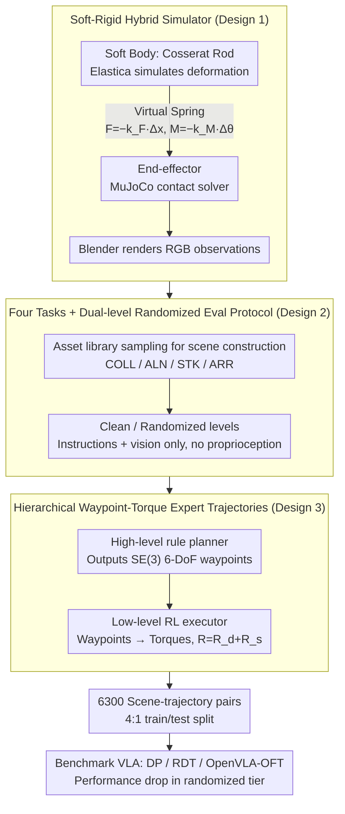

# ManiSoft: Towards Vision-Language Manipulation for Soft Continuum Robotics

**Conference**: ICML 2026  
**arXiv**: [2605.18617](https://arxiv.org/abs/2605.18617)  
**Code**: https://buaa-colalab.github.io/ManiSoft (Project Page)  
**Area**: Robotics / Soft Continuum Manipulators / VLA Benchmark  
**Keywords**: Soft robotics, vision-language manipulation, benchmark, hybrid simulation, hierarchical expert trajectories

## TL;DR
This paper addresses the gap where vision-language manipulation research almost exclusively covers rigid arms and ignores soft continuum arms by constructing the ManiSoft benchmark. Using a hybrid simulator that couples "Cosserat rod soft dynamics + MuJoCo rigid body contact + elastic force constraints," it defines four task categories reflecting soft arm control challenges. Through a "high-level rule planner + low-level RL torque executor," 6,300 scenarios and expert trajectories were automatically generated. The study reveals that DP/RDT/OpenVLA-OFT are moderately solvable in clean scenarios (~30%) but suffer a cliff-like performance drop in randomized scenarios (up to 29.4 points). The root causes of failure lie in the inability to estimate proprioceptive states from vision and the failure to utilize soft deformability for obstacle avoidance.

## Background & Motivation

**Background**: Vision-language manipulation has become a core component of embodied AI. Benchmarks like RLBench, ManiSkill, CALVIN, LIBERO, RoboVerse, and RoboTwin have matured the training and evaluation of "image-to-instruction" execution. However, the robotic arms in these benchmarks are **uniformly rigid**, featuring readable joint angles, low-dimensional kinematics, and straightforward perception-to-control links. VLA models such as OpenVLA, $\pi$ series, RDT-1B, CogACT, and DexVLA have evolved rapidly under this assumption.

**Limitations of Prior Work**: Rigid arms have structural shortcomings in cluttered or narrow spaces—rigid joint constraints mean grippers cannot reach targets blocked by obstacles without "going around the front." Soft continuum arms (Cosserat rods, pneumatic/tendon-driven, low-modulus materials) can bend and deform as a whole to bypass obstacles. However, this introduces three new challenges: (i) **No reliable proprioception**—soft arms lack rigid joint encoders and must infer poses from external vision; (ii) **Low-level execution is torque/tension/pressure** rather than joint target poses, making inverse kinematics extremely complex; (iii) **Distributed actuators** cause the action space to explode in dimension and become highly coupled. These issues prevent off-the-shelf VLA models from working directly on soft arms.

**Key Challenge**: The assumptions of rigid arm VLA (precise proprioception + low-dimensional joint space + analytical inverse kinematics) conflict with the physical reality of soft arms (visual proprioception + high-dimensional torque space + strongly coupled flexible dynamics) at almost every point. A benchmark that "honestly exposes these differences" is needed to drive research.

**Goal**: (i) Provide a soft arm simulator that accurately models elastic deformation while handling contact friction; (ii) Design tasks that distinguish between four difficulty levels: "basic trajectory control / precise posing / contact-intensive stacking / complex obstacle avoidance"; (iii) Deliver a scalable data generation pipeline with 6.3k expert trajectories; (iv) Benchmark mainstream VLA models to locate failure modes.

**Key Insight**: The authors found that existing soft body simulators (Elastica, SOFA) excel at elastic dynamics but are weak in contact modeling, while rigid body simulators (MuJoCo, SAPIEN, Habitat) excel at contact friction but cannot model deformation. The solution is to **couple the two types of simulators using a "virtual spring"**: the soft body deformation is simulated by Elastica, the end-effector contact is handled by MuJoCo, and both are linked via elastic constraints following Hooke's Law. Expert trajectories are also handled hierarchically—a high-level rule-based planner generates 6-DoF waypoints, and a low-level RL executor translates these waypoints into torques.

**Core Idea**: Establish soft arm VLA research as a scalable benchmark using "soft-rigid hybrid simulation + hierarchical waypoint-torque experts," and expose failure modes of existing VLAs through dual-level evaluation (clean vs. randomized).

## Method

### Overall Architecture
ManiSoft consists of three components: (1) **Hybrid Simulator**—models the soft arm as a three-part coupled system: "soft body (Cosserat rod via Elastica) + end-effector (via MuJoCo) + elastic force constraint (virtual spring)"; environment visuals are rendered via Blender. (2) **Four Task Categories**—Collecting (COLL, placing items in containers), Alignment (ALN, precise 6-DoF positioning), Stacking (STK, stacking utensils by size), and Arrangement (ARR, spatial constraint placement with obstacle avoidance). (3) **Automatic Data Pipeline**—procedurally samples 263 3D objects and candidate grasp poses to construct clean/randomized scenes, using GPT templates for diverse instructions; expert trajectories are generated via "high-level rule planner (SE(3) waypoints) + low-level RL torque executor (waypoint tracking)." The final release includes 6,300 scene-trajectory pairs, 109 manipulatable objects across 17 categories, 154 obstacles across 35 categories, an average trajectory of 1,272 steps, and a 4:1 train/test split.

### Key Designs

**1. Soft-Rigid Hybrid Simulator (Cosserat Rod + MuJoCo + Elastic Constraint): Coupling two simulators with a virtual spring**

Simulating soft arm manipulation is difficult because existing simulators lack certain capabilities—soft body simulators (Elastica, SOFA) are good at elastic deformation but weak in contact, while rigid body simulators (MuJoCo, SAPIEN) are good at contact friction but cannot deform. ManiSoft, rather than rewriting a new simulator, decouples the soft arm into two coupled subsystems to utilize the strengths of each. The **soft body** is discretized into $N$ segments of Cosserat rods using Elastica. External driving torques $\boldsymbol{\tau}_e\in\mathbb{R}^{N\times 3}$ generate axial/shear/bending/torsional strains along the rod, producing internal forces $\mathbf{f}_i$ and internal torques $\boldsymbol{\tau}_i$ that determine instantaneous deformation. The **end-effector** and its contact friction with the environment are handled by MuJoCo's specialized contact solver. The two are coupled via a zero-length virtual spring: when the relative displacement $\Delta\mathbf{x}\in\mathbb{R}^3$ and relative rotation $\Delta\boldsymbol{\theta}\in\mathbb{R}^3$ between the soft body tip and end-effector are non-zero, restorative forces and torques $\mathbf{F}=-k_F\Delta\mathbf{x}$ and $\mathbf{M}=-k_M\Delta\boldsymbol{\theta}$ are generated according to Hooke's Law to pull both sides into coordinated motion. Visual observations are rendered in RGB by Blender using a fixed camera. This "soft connector" ensures physical force closure and decouples the numerical integration of the two simulators, making long-horizon, contact-intensive tasks like STK feasible.

**2. Four Tasks + Dual-level Randomized Eval Protocol: Intentionally withholding proprioception to force visual deformation sensing**

Rigid arm benchmarks typically feed joint angles as proprioception to assist the model, but real soft arms lack rigid joint encoders. ManiSoft makes the unconventional but honest decision to provide only instructions $\mathbf{L}$ and visual observations $\mathbf{V}_t$ at each timestep $t$, without internal soft body states. The policy outputs $\mathbf{A}_t=(\boldsymbol{\tau}_e, S)$ (external torques + gripper state $S\in\{0,1\}$), and the environment advances autoregressively until success or exceeding $T$ steps. Tasks are categorized by difficulty: COLL (placing in container, easiest), ALN (6-DoF precise positioning), STK (stacking by size, hardest due to continuous contact), and ARR (spatial constraint placement and obstacle avoidance). Each task has a "clean" and "randomized" version: clean versions use fixed layouts and appearances; randomized versions add interference obstacles, random textures, and lighting, plus attribute-based descriptions for objects (e.g., "yellow bottle," "bottle with green cap") to enhance linguistic diversity. Withholding proprioception emphasizes the critical need to study "deformation estimation from vision," while the dual randomization levels distinguish between memorizing fixed scenes and true robust generalization.

**3. Hierarchical Waypoint-Torque Expert Trajectory Generation (High-level Rules + Low-level RL): Decoupling logical structure from dynamic tracking**

Learning torque sequences directly via RL is difficult due to high-dimensional coupling and sparse rewards over long horizons, while pure rule-based torque controllers cannot handle the uncertainty of soft dynamics. ManiSoft splits generation into two steps: The **high-level** rule planner outputs a sequence of 6-DoF waypoints $\hat P\in\mathrm{SE}(3)$, encoding semantic sub-goals like "approach," "grasp," and "lift." The **low-level** RL executor takes (target pose $\hat P$, proprioception history, current pose $P$) as input and outputs torques $\boldsymbol{\tau}_e$. The pose error is measured using the SE(3) logarithm $[\mathbf{d}_p,\mathbf{d}_r]=\log(P^{-1}\hat P)$, with scalar distance $d=\|\mathbf{d}_p\|_2+\alpha\|\mathbf{d}_r\|_2$. The reward function includes a pose error reward $R_d=-d+k_1\mathbbm{1}_{d<d_1}+k_2\mathbbm{1}_{d<d_2}$ for approaching the target and a stability reward $R_s=-\mathrm{sgn}(\partial d/\partial t)\cdot\beta$ (active only when $d\le D$) that rewards continued error reduction and penalizes oscillation once near the target. Optimal hyperparameters were determined through ablation as $\beta=1, D=0.3$. Leveraging rules for logic and RL for dynamics ensures high-quality trajectories; $R_s$ is a key technical detail that significantly reduces tip pose fluctuations, making the trajectories suitable for downstream imitation learning. The trained executor achieves a 54% single-step success rate.

### Loss & Training
- Low-level RL executor: Total reward $R=R_d+R_s$, including pose error and stability terms, with optimal $\beta=1, D=0.3$.
- Data Scale: 6,300 scene-trajectory pairs (2,100 clean + 4,200 randomized), average 40 language instructions per scene, 4:1 train/test split.
- Evaluation Strategy: DP and RDT trained from scratch, OpenVLA-OFT fine-tuned via LoRA. Metrics are success rate and #Steps.

## Key Experimental Results

### Main Results
Success rates (ACC%) and completion steps (#Steps) for the four tasks in clean and randomized settings:

| Model | COLL ACC | ALN ACC | STK ACC | ARR ACC | Avg ACC | Avg #Steps |
|------|----------|---------|---------|---------|----------|-------------|
| **Clean** | | | | | | |
| DP (~400M) | 63.0 | 18.3 | 15.0 | 30.0 | 31.6 | 520 |
| RDT (~1B) | 13.8 | 11.7 | 10.0 | 1.3 | 9.2 | 496 |
| OpenVLA-OFT (~400M) | 45.4 | 25.0 | 20.0 | 31.3 | **30.4** | 527 |
| **Randomized** | | | | | | |
| DP | 3.8 | 1.7 | 2.5 | 0.6 | 2.2 | 613 |
| RDT | 1.2 | 4.2 | 0.0 | 1.3 | 1.6 | 368 |
| OpenVLA-OFT | 32.7 | 26.7 | 35.0 | 13.7 | **27.0** | 554 |

In the clean setting, DP and OpenVLA-OFT are comparable (31.6% vs 30.4%), while RDT lags significantly (9.2%)—likely due to the 1B parameter model overfitting on 6.3k samples. COLL is consistently the easiest task, while STK is the most difficult. **The true diagnostic signal is in the randomized setting**: DP drops 29.4 points to 2.2%, and RDT drops 7.6 points to 1.6%, whereas OpenVLA-OFT drops only 3.4 points, maintaining 27.0%. This highlights the visual generalization advantage provided by pretrained VLM backbones.

### Ablation Study
ARR task breakdown by object category (Randomized setting):

| Model | Rubik's Cube ACC | Bottle ACC | Pen Cup ACC | Shoe ACC | ARR Avg |
|------|------------------|------------|-------------|----------|----------|
| DP | 0.0 | 0.0 | — | 2.5 | 0.6 |
| RDT | 0.0 | 2.5 | 2.5 | 0.0 | 1.3 |
| OpenVLA-OFT | 15.0 | 7.5 | 25.0 | 7.5 | 13.7 |

Hyperparameter ablation for low-level RL executor stability reward $R_s$ (Control stability = variance of end-pose error, lower is better):

| $D \backslash \beta$ | 0 | 0.5 | 1 | 1.5 |
|-----|-----|------|------|------|
| 0.05 | 0.176 | 0.157 | 0.074 | 0.121 |
| 0.10 | 0.176 | 0.149 | 0.153 | 0.071 |
| 0.20 | 0.176 | 0.070 | 0.135 | 0.064 |
| 0.30 | 0.176 | 0.145 | **0.053** | 0.091 |
| Avg | 0.176 | 0.130 | 0.104 | **0.087** |

### Key Findings
- **Object geometry dictates difficulty ordering**: Rubik's Cube (regular box) consistently has the highest success rate, while shoe (irregular non-convex) is the lowest, dropping below 10% after randomization. This suggests the coupling of geometric complexity and grasp stability is a bottleneck.
- **OpenVLA-OFT's "stop-moving" issue cause drops in simple tasks**: Visualizations show it often stops after a successful grasp. COLL ACC (45.4%) was lower than DP (63.0%), which the authors attribute to subtle visual changes from gripper closure inducing a "self-inhibition" loop.
- **Failure Mode 1: Proprioceptive Ambiguity**: When the target is near the base, large bending is required, and internal torques dominate. Policies fail to estimate the pose accurately, leading to insufficient control force and lateral drift.
- **Failure Mode 2: Inability to "Use Softness"**: Policies attempt to move the arm directly toward the target despite obstacles, causing collisions instead of utilizing deformation to bypass them. This indicates current VLAs have not learned the unique utility of soft body deformation.

## Highlights & Insights
- **Engineering Choice**: Using two simulators + a virtual spring is a clever decision. It avoids the stability and development overhead of a unified soft-rigid simulator while modularizing the strengths of existing tools.
- **Honest Benchmark Design**: Intentionally withholding proprioception reflects physical reality and forces the study of "visual pose estimation," which will likely steer the community toward developing specialized visual proprioception heads.
- **Stability Reward $R_s$**: The hierarchical approach is standard, but using the sign of the error change rate to encourage monotonic convergence near the target is a transferable insight for other high-DoF continuous control domains.
- **Diagnostic Gradient**: The progression from basic trajectories to complex obstacle avoidance across clean and randomized settings provides a clear diagnostic signal, revealing exactly where models fail.

## Limitations & Future Work
- **Low Absolute Success Rate**: A maximum success rate of 27.0% indicates the benchmark's difficulty and suggests that usable methods are still distant.
- **Computational Cost**: The Cosserat + MuJoCo + Blender stack is expensive. Average trajectories of 1,272 steps make data generation and rollouts slow, potentially hindering large-scale online RL.
- **Instruction Diversity**: While better than canonical descriptions, GPT-derived template instructions may still underestimate the challenges of truly diverse natural language.
- **Lack of Sim-to-Real**: The evaluation is limited to simulation. Soft robotics is known for significant sim-to-real gaps due to material parameter variation; whether these SOTA methods work on real silicone/pneumatic arms remains unverified.
- **Baseline Selection**: Only DP, RDT, and OpenVLA-OFT were tested; newer VLA models like the $\pi$ series should be included for a more comprehensive comparison.

## Related Work & Insights
- **vs. LIBERO / CALVIN / RLBench**: These are rigid arm benchmarks assuming precise proprioception. ManiSoft serves as a "soft vs. rigid" counterpart.
- **vs. ManiSkill / RoboTwin / RoboVerse**: While these have greater diversity in objects and arms, they are entirely rigid. ManiSoft repurposes RoboTwin-OD assets but defines tasks and a simulation stack specifically for soft bodies.
- **vs. Elastica-RL-Control**: The low-level RL executor expands on this work by replacing Euclidean distance with SE(3) log-distance to handle orientation.
- **vs. Soft DAgger / Centurelli LSTM controllers**: These focus on low-level soft arm control without vision-language inputs. ManiSoft integrates high-level reasoning with low-level soft control.
- **VLA Transferability**: Proves that transferring current VLAs to soft arms reveals new failure modes like "stop-moving" behaviors and an inability to exploit deformation, suggesting the need for soft-body data or deformation-estimation modules in VLA training.

<!-- RELATED:START -->

## Related Papers

- [\[CVPR 2026\] SaPaVe: Towards Active Perception and Manipulation in Vision-Language-Action Models for Robotics](../../CVPR2026/robotics/sapave_active_perception_manipulation_vla_roboti.md)
- [\[ICML 2026\] Spatial Memory for Out-of-Vision Manipulation in Vision-Language-Action](spatial_memory_for_out-of-vision_manipulation_in_vision-language-action.md)
- [\[NeurIPS 2025\] Bridging Embodiment Gaps: Deploying Vision-Language-Action Models on Soft Robots](../../NeurIPS2025/robotics/bridging_embodiment_gaps_deploying_vision-language-action_models_on_soft_robots.md)
- [\[ICML 2026\] Contrastive Representation Regularization for Vision-Language-Action Models](contrastive_representation_regularization_for_vision-language-action_models.md)
- [\[ICLR 2026\] MoMaGen: Generating Demonstrations under Soft and Hard Constraints for Multi-Step Bimanual Mobile Manipulation](../../ICLR2026/robotics/momagen_generating_demonstrations_under_soft_and_hard_constraints_for_multi-step.md)

<!-- RELATED:END -->
