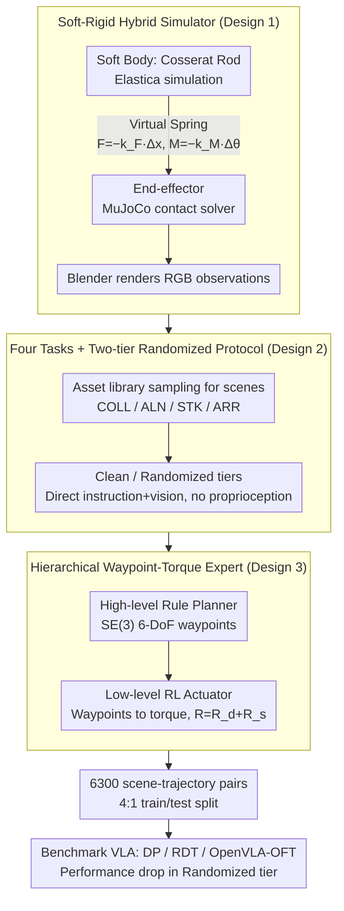

# ManiSoft: Towards Vision-Language Manipulation for Soft Continuum Robotics

**Conference**: ICML 2026  
**arXiv**: [2605.18617](https://arxiv.org/abs/2605.18617)  
**Code**: https://buaa-colalab.github.io/ManiSoft (Project Page)  
**Area**: Robotics / Soft Continuum Manipulator / VLA Benchmark  
**Keywords**: Soft robot, vision-language manipulation, benchmark, hybrid simulation, hierarchical expert trajectories

## TL;DR
This work addresses the gap where vision-language manipulation research primarily covers rigid arms and ignores soft continuum arms. ManiSoft benchmark is constructed using a hybrid simulator coupling "Cosserat rod soft dynamics + MuJoCo rigid body contact + elastic force constraints." It defines 4 categories of tasks reflecting soft arm control difficulties and automatically generates 6,300 scenes and expert trajectories via a "high-level rule planner + low-level RL torque actuator." Results systematically reveal that DP/RDT/OpenVLA-OFT are moderately successful in clean scenes (~30%) but suffer a cliff-like drop in randomized scenes (up to 29.4 points). The root causes of failure lie in the inability to estimate proprioceptive states from vision and the failure to utilize soft body deformability for obstacle avoidance.

## Background & Motivation

**Background**: Vision-language manipulation has become the core of embodied AI. Benchmarks like RLBench, ManiSkill, CALVIN, LIBERO, RoboVerse, and RoboTwin have matured the training and evaluation of "image-to-execution" pipelines. However, the manipulators in these benchmarks are **exclusively rigid arms**—with readable joint angles, low-dimensional kinematics, and simple perception-to-control chains. VLA models such as OpenVLA, $\pi$-series, RDT-1B, CogACT, and DexVLA have evolved rapidly under this assumption.

**Limitations of Prior Work**: Rigid arms have structural disadvantages in cluttered or narrow spaces—rigid joint constraints mean the gripper cannot reach targets blocked by obstacles without "moving to the front." Soft continuum arms (Cosserat rods, pneumatic/tendon-driven, low elastic modulus materials) can bend and deform as a whole to bypass obstacles. However, this introduces three new challenges: (i) **Lack of reliable proprioception**—soft arms lack rigid joint encoders and must infer poses from external vision; (ii) **Low-level execution involves torque/tension/pressure** instead of joint target poses, making inverse kinematics extremely complex; (iii) **Distributed actuators** cause the action space to be high-dimensional and highly coupled. These issues prevent off-the-shelf VLA models from working directly on soft arms.

**Key Challenge**: The mature assumptions of rigid-arm VLA (accurate proprioception + low-dimensional joint space + analytical inverse kinematics) conflict with the physical reality of soft arms (visual proprioception + high-dimensional torque space + strongly coupled flexible dynamics) in nearly every aspect. A benchmark is needed to "honestly expose these differences."

**Goal**: (i) Provide a soft arm simulator that accurately models elastic deformation and handles contact friction; (ii) Design tasks that distinguish four levels of difficulty: "basic trajectory control / precise positioning / contact-intensive stacking / complex obstacle avoidance"; (iii) Deliver a scalable data generation pipeline with 6.3k expert trajectories; (iv) Benchmark mainstream VLA models on this platform to locate failure modes.

**Key Insight**: The authors noted that existing soft simulators (Elastica, SOFA) excel at elastic dynamics but have weak contact modeling, while rigid simulators (MuJoCo, SAPIEN, Habitat) excel at contact friction but cannot model deformation. The proposed solution **couples the two types of simulators via a "virtual spring"**: the soft body deformation is simulated by Elastica, the end-effector contact is simulated by MuJoCo, and the two pull each other through elastic constraints based on Hooke's Law. Expert trajectories are generated hierarchically—a high-level rule planner produces 6-DoF waypoints, and a low-level RL actuator translates waypoints into torques.

**Core Idea**: Establish soft arm VLA research as a scalable benchmark using "soft-rigid hybrid simulation + hierarchical waypoint-torque experts," exposing the failure modes of current VLAs through two tiers of evaluation: clean and randomized.

## Method

### Overall Architecture
ManiSoft consists of three components: (1) **Hybrid Simulator**—models the soft arm as a three-part coupled system: "soft body (Cosserat rod via Elastica) + end-effector (via MuJoCo) + elastic force constraint (virtual spring)"; environment visuals are rendered via Blender. (2) **Four Task Categories**—Collecting (COLL, placing objects into containers), Alignment (ALN, precise 6-DoF positioning), Stacking (STK, stacking tableware by size), and Arrangement (ARR, spatial constraint placement with obstacle avoidance). (3) **Automatic Data Pipeline**—procedurally samples 263 3D objects and candidate grasp poses to construct clean/randomized scenes, using GPT templates for diverse instructions. Expert trajectories use a two-stage generation: "high-level rule planner (outputting SE(3) waypoints) + low-level RL torque actuator (tracking waypoints)." The final release includes 6,300 scene-trajectory pairs, 109 manipulatable objects across 17 categories, 154 obstacles across 35 categories, average trajectory length of 1,272 steps, and a 4:1 train/test split.

### Key Designs

**1. Soft-Rigid Hybrid Simulator (Cosserat Rod + MuJoCo + Elastic Constraint): Coupling two simulators with a virtual spring**

Simulating soft arm manipulation is difficult because existing simulators lack one side of the coin—soft-body simulators (Elastica, SOFA) handle elastic deformation well but have poor contact modeling, while rigid-body simulators (MuJoCo, SAPIEN) handle contact friction well but cannot deform. ManiSoft does not rewrite a new simulator but decouples the soft arm into two coupled subsystems. The **soft body** is discretized into $N$ segments of Cosserat rods using Elastica. External driving torques $\boldsymbol{\tau}_e\in\mathbb{R}^{N\times 3}$ produce four types of strain (axial, shear, bending, torsion) along the rod, generating internal forces $\mathbf{f}_i$ and internal moments $\boldsymbol{\tau}_i$ that determine instantaneous deformation. The **end-effector** and its contact friction with the environment are handled by MuJoCo's contact solver. The two are coupled with a zero-rest-length virtual spring: when there is relative displacement $\Delta\mathbf{x}\in\mathbb{R}^3$ or relative rotation $\Delta\boldsymbol{\theta}\in\mathbb{R}^3$ between the soft tip and the end-effector, Hooke's Law generates restoring forces and moments $\mathbf{F}=-k_F\Delta\mathbf{x}$ and $\mathbf{M}=-k_M\Delta\boldsymbol{\theta}$ ($k_F, k_M$ are tunable) to pull them back into coordinated motion. Visual observations are rendered in RGB by Blender with a fixed camera. This "soft connector" ensures physical force closure while decoupling the numerical integration of the two simulators, making long-term dense contact tasks like STK feasible.

**2. Four Tasks + Two-Tier Randomized Evaluation Protocol: Deliberately withholding proprioception to force visual deformation learning**

Rigid arm benchmarks usually feed joint angles as proprioception to "help the model," but real soft arms lack rigid encoders. ManiSoft makes an unconventional but honest decision—at each time step $t$, it only provides the instruction $\mathbf{L}$ and visual observation $\mathbf{V}_t$, withholding internal soft states. The policy outputs $\mathbf{A}_t=(\boldsymbol{\tau}_e, S)$ (external torques + gripper state $S\in\{0,1\}$), and the environment advances autoregressively until success or exceeding $T$ steps. Tasks are set in a four-tier difficulty gradient: COLL (collecting into containers, no precise orientation, easiest), ALN (precise 6-DoF positioning), STK (stacking by size, requires continuous contact, hardest), and ARR (spatial constraint placement and obstacle avoidance). Each task has clean and randomized tiers: clean contains only the target with fixed layout/appearance; randomized adds distractor obstacles, random textures/lighting, and generates multiple attributed descriptions for each object ("yellow bottle", "bottle with green cap", "tall plastic bottle") to enhance linguistic diversity. Withholding proprioception brings the "vision-to-deformation estimation" capability to the forefront, while the two-tier randomization distinguishes between "overfitting fixed scenes" and "true robust generalization."

**3. Hierarchical Waypoint-Torque Expert Trajectory Generation (High-level Rules + Low-level RL): Decoupling logic from dynamics tracking**

Learning a full torque sequence directly with RL is difficult due to high-dimensional coupling and long-horizon sparse rewards, while pure rule-based torque controllers cannot handle the uncertainty of soft dynamics. ManiSoft splits generation: the **high-level** use a manual rule planner to output a sequence of 6-DoF waypoints $\hat P\in\mathrm{SE}(3)$, encoding semantic sub-goals like "approach / grasp / lift." The **low-level** uses an RL actuator taking (target pose $\hat P$, proprioception history, current pose $P$) as input and outputting torques $\boldsymbol{\tau}_e$. The pose error is measured using the SE(3) logarithm $[\mathbf{d}_p,\mathbf{d}_r]=\log(P^{-1}\hat P)$, with scalar distance $d=\|\mathbf{d}_p\|_2+\alpha\|\mathbf{d}_r\|_2$. The reward includes two terms: a pose error reward $R_d=-d+k_1\mathbbm{1}_{d<d_1}+k_2\mathbbm{1}_{d<d_2}$ which increases as the target is approached, and a stability reward $R_s=-\mathrm{sgn}(\partial d/\partial t)\cdot\beta$ (active only when $d\le D$) which rewards "decreasing error" and penalizes oscillation once near the target. Optimal hyperparameters were determined by ablation as $\beta=1, D=0.3$. Rule-based logic and RL-based dynamics tracking each play to their strengths; $R_s$ is a critical detail—it significantly reduces end-pose fluctuations and smoothens trajectories, making them more suitable for downstream imitation learning. The trained actuator achieves a 54% single-step success rate, yielding complete expert trajectories through sequential roll-outs.

### Loss & Training
- Low-level RL actuator: Total reward $R=R_d+R_s$ with pose error and stability terms; best parameters $\beta=1, D=0.3$.
- Data scale: 6,300 scene-trajectory pairs (2,100 clean + 4,200 randomized), average 40 language instructions per scene, 4:1 train/test split.
- Evaluation strategy: DP and RDT trained from scratch, OpenVLA-OFT fine-tuned with LoRA; metrics are success rate (ACC) and #Steps.

## Key Experimental Results

### Main Results
Success rates (ACC%) and completion steps (#Steps) for four tasks in clean and randomized tiers:

| Model | COLL ACC | ALN ACC | STK ACC | ARR ACC | Avg ACC | Avg #Steps |
|------|----------|---------|---------|---------|----------|-------------|
| **Clean** | | | | | | |
| DP (~400M) | 63.0 | 18.3 | 15.0 | 30.0 | 31.6 | 520 |
| RDT (~1B) | 13.8 | 11.7 | 10.0 | 1.3 | 9.2 | 496 |
| OpenVLA-OFT (~400M) | 45.4 | 25.0 | 20.0 | 31.3 | **30.4** | 527 |
| **Randomized** | | | | | | |
| DP | 3.8 | 1.7 | 2.5 | 0.6 | 2.2 | 613 |
| RDT | 1.2 | 4.2 | 0.0 | 1.3 | 1.6 | 368 |
| OpenVLA-OFT | 32.7 | 26.7 | 35.0 | 13.7 | **27.0** | 554 |

In the clean setting, DP and OpenVLA-OFT are comparable (31.6% vs 30.4%), while RDT lags behind (9.2%)—the 1B parameters clearly overfit the 6.3k samples. By task, COLL is easiest (no precise orientation), while STK is hardest (stacking requires continuous contact control). **The diagnostic signal is in the randomized setting**: DP's performance collapses by 29.4 points to 2.2%, while OpenVLA-OFT only drops by 3.4 points to 27.0%—highlighting the visual generalization advantage of pretrained VLM backbones.

### Ablation Study
ARR task broken down by object category (Randomized setting):

| Model | Rubik's Cube ACC | Bottle ACC | Pen Cup ACC | Shoe ACC | ARR Avg |
|------|------------------|------------|-------------|----------|----------|
| DP | 0.0 | 0.0 | — | 2.5 | 0.6 |
| RDT | 0.0 | 2.5 | 2.5 | 0.0 | 1.3 |
| OpenVLA-OFT | 15.0 | 7.5 | 25.0 | 7.5 | 13.7 |

Ablation of low-level RL actuator stability reward $R_s$ (Control stability = variance of end-pose error, lower is better):

| $D \backslash \beta$ | 0 | 0.5 | 1 | 1.5 |
|-----|-----|------|------|------|
| 0.05 | 0.176 | 0.157 | 0.074 | 0.121 |
| 0.10 | 0.176 | 0.149 | 0.153 | 0.071 |
| 0.20 | 0.176 | 0.070 | 0.135 | 0.064 |
| 0.30 | 0.176 | 0.145 | **0.053** | 0.091 |
| Avg | 0.176 | 0.130 | 0.104 | **0.087** |

### Key Findings
- **Object geometry determines difficulty**: Rubik's Cube (regular box) consistently has the highest success rate, while shoe (irregular non-convex) is the lowest and drops below 10% after randomization, suggesting that coupling geometry complexity with grasp stability is a bottleneck for soft arms.
- **OpenVLA-OFT's "stop-moving" behavior causes regression in simple tasks**: Visualizations show it frequently halts after a successful grasp, causing COLL task ACC (45.4%) to be lower than DP (63.0%); this is attributed to microscopic visual changes from gripper closure inducing a "self-inhibition" feedback loop.
- **Failure Mode 1: Proprioception Ambiguity**—Targets near the base require significant bending where internal torques dominate. Policies fail to accurately estimate pose, leading to insufficient residual control and lateral drift.
- **Failure Mode 2: Inability to "utilize softness"**—When encountering obstacles, policies drive the arm straight into them rather than utilizing soft body deformation to bypass. Existing VLAs have not learned the unique deformability utility of soft arms, necessitating targeted expert data or physical priors.

## Highlights & Insights
- **"Two simulators + Virtual spring" is a clever engineering choice**: It avoids the massive effort of writing a new stable simulator from scratch that supports both deformation and contact, instead modularly combining current optimal components.
- **Deliberate withholding of proprioception**: An honest design choice at the benchmark level. While most benchmarks provide all available info to "help" models, ManiSoft reflects physical reality, forcing research into "pose estimation from vision," a distinctive soft robotic problem.
- **Hierarchical tracking with the $R_s$ detail**: The high-level rule + low-level RL combo is common, but using the sign of pose error rate to encourage monotonic convergence (active only when $d \le D$) is a "proximal stability shaping" strategy transferable to other high-DoF continuous control tasks.
- **Diagnostic gradient design**: The four tasks ranging from basic trajectories to complex obstacle avoidance, combined with clean/randomized tiers, make benchmark results naturally interpretable.

## Limitations & Future Work
- **Absolute success rate remains low (max 27%)**: While challenging, the benchmark is currently far from "usable methods."
- **Physical fidelity cost**: The Cosserat rod + MuJoCo + Blender stack is expensive. Average trajectories of 1,272 steps make data generation and rollouts slow, potentially hindering large-scale RL or online algorithms.
- **Limited instruction diversity**: Instructions are generated via GPT templates; though better than canonical descriptions, they may underestimate the difficulty of real natural language.
- **Sim-to-real gap**: Evaluation is purely in simulation. Soft robotic sim-to-real gaps are notorious due to material parameter discrepancies; SOTA methods on this benchmark have not yet been validated on real silicone/pneumatic arms.
- **Few baseline models**: Only three models (DP, RDT, OpenVLA-OFT) were tested, lacking a comprehensive longitudinal comparison with newer VLAs like the $\pi$-series.

## Related Work & Insights
- **vs. LIBERO / CALVIN / RLBench**: These are rigid-arm language-conditioned manipulation benchmarks that assume accurate proprioception, forming a "rigid vs. soft" contrast.
- **vs. ManiSkill / RoboTwin / RoboVerse**: While broader in scenes and multi-arm support, they are rigid-body focused. ManiSoft reuses RoboTwin-OD assets but restarts task definition and simulation stacks for soft bodies.
- **vs. Elastica-RL-Control**: This work adapts the low-level RL reward from it, upgrading "Euclidean distance" to SE(3) logarithmic distance to handle poses.
- **vs. Soft DAgger / Centurelli LSTM controller**: These concentrate on low-level soft arm control without vision-language inputs. This work links vision-language reasoning with low-level soft control.
- **vs. OpenVLA-OFT / DexVLA / RDT**: Proves that direct migration from rigid to soft arms exposes unique failure modes like "stop-moving" and inability to utilize deformation, suggesting the need for soft arm data or deformation estimation modules in VLA training.

<!-- RELATED:START -->

## Related Papers

- [\[ICML 2026\] Spatial Memory for Out-of-Vision Manipulation in Vision-Language-Action](spatial_memory_for_out-of-vision_manipulation_in_vision-language-action.md)
- [\[CVPR 2025\] SaPaVe: Towards Active Perception and Manipulation in Vision-Language-Action Models for Robotics](../../CVPR2025/robotics/sapave_towards_active_perception_and_manipulation_in_vision-language-action_mode.md)
- [\[ICLR 2026\] X-VLA: Soft-Prompted Transformer as Scalable Cross-Embodiment Vision-Language-Action Model](../../ICLR2026/robotics/x-vla_soft-prompted_transformer_as_scalable_cross-embodiment_vision-language-act.md)
- [\[ICML 2026\] Scaling by Diversified Experience for Vision-Language-Action Models](scaling_by_diversified_experience_for_vision-language-action_models.md)
- [\[ICML 2026\] Contrastive Representation Regularization for Vision-Language-Action Models](contrastive_representation_regularization_for_vision-language-action_models.md)

<!-- RELATED:END -->
