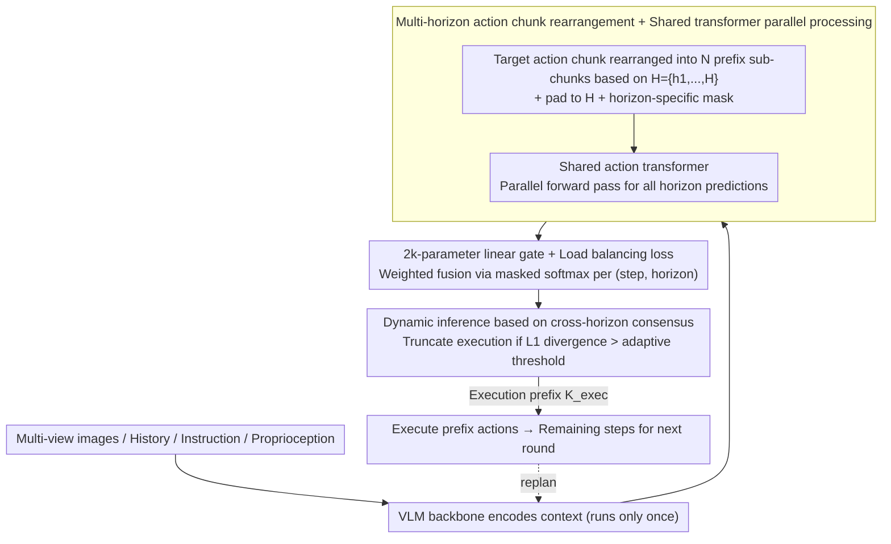

# Mixture of Horizons in Action Chunking

**Conference**: ICML 2026  
**arXiv**: [2511.19433](https://arxiv.org/abs/2511.19433)  
**Code**: To be confirmed  
**Area**: Robotics / VLA / Action Chunking  
**Keywords**: VLA, Action Chunking, Multi-scale horizon, Gated Fusion, Dynamic Inference

## TL;DR
Addressing the "long-horizon planning vs. short-horizon precision" trade-off caused by "action chunk length (horizon) selection" in VLA models, this paper proposes Mixture of Horizons (MoH). By decomposing a single action chunk into various sub-chunks of different lengths, predicting them in parallel using a shared action transformer, and fusing them with a 2k-parameter linear gate—complemented by a load-balancing loss and dynamic inference via "cross-horizon consensus"—the authors enable $\pi_{0.5}$ to reach a 99% average success rate on LIBERO for the first time while increasing throughput to 2.5× the baseline.

## Background & Motivation

**Background**: Modern Vision-Language-Action (VLA) models (such as $\pi_0$, $\pi_{0.5}$, OpenVLA-OFT, StarVLA) almost exclusively adopt the action chunking strategy proposed by Zhao et al. This involves predicting future actions $A_t=(a_t,\dots,a_{t+H-1})$ for $H$ steps at once and processing these action tokens with a lightweight full-attention action transformer. This approach is theoretically grounded in smooth execution, reduced policy calls, and the utilization of temporal structural information. The "VLM backbone + chunked action head" has become the de facto standard.

**Limitations of Prior Work**: The authors evaluated $\pi_0$ on LIBERO with horizons set to 10/20/30 across four task sets: Spatial, Object, Goal, and Long. They discovered a simple yet often overlooked fact—success rates are extremely sensitive to $H$, and the optimal $H$ varies across tasks. Long tasks prefer long horizons (for planning), while Spatial/Object tasks prefer short horizons (for precise control). Any fixed $H$ is destined to underperform on specific task categories.

**Key Challenge**: Long horizon $\rightarrow$ planning capability for distant steps but "diluted" precision for each individual step; Short horizon $\rightarrow$ precise control but lacks foresight. This is a structural trade-off inherent in chunk-based representations that cannot be resolved merely by hyperparameter tuning, nor can the horizon be easily switched online during deployment.

**Goal**: (i) Systematically characterize the impact of horizon on VLA; (ii) Harness the benefits of both long and short horizons within a single model; (iii) Enable adaptive chunk length scaling during inference based on confidence.

**Key Insight**: Instead of choosing a single horizon, include multiple horizons during training to let the model learn when to be "long" and when to be "short." The key is to make this nearly zero-cost: since the computational bottleneck of VLA lies in the VLM backbone and the action transformer itself has only ~300M parameters, the parallel forward pass of multiple horizons via tensor parallelism adds almost no wall-clock time.

**Core Idea**: Rearrange action chunks into multiple sub-segments based on candidate lengths $\mathcal{H}=\{h_1,\dots,h_N\}$. Predict these segments in parallel using a shared action transformer and weighted-fuse them with a 2k-parameter linear gate per step and horizon. A byproduct of this—the prediction consistency across horizons—naturally serves as an execution confidence signal to drive dynamic truncation.

## Method

### Overall Architecture
At time $t$, given multi-view images $V_t$, history $h_{<t}$, instructions $T$, and proprioception $s_t$, the VLM backbone encodes them into a context. MoH then decomposes the target action chunk $A_t\in\mathbb{R}^{H\times d_a}$ into $N$ truncated sub-chunks of increasing length $A_t^{(h)}=(a_{t,1},\dots,a_{t,h})$. Each sub-chunk is padded to $H$ and assigned a horizon-specific attention mask (masking positions $k>h$). **A shared action transformer processes all horizons in parallel in a single forward pass** to obtain horizon-wise predictions $\hat A_t^{(h)}$. Finally, a linear gating head outputs logits $g_{t,k,h}$, which are processed via a masked softmax to produce fusion weights $\alpha_{t,k,h}$ for the final prediction $\hat a_{t,k}=\sum_{h:k\le h}\alpha_{t,k,h}\hat a_{t,k}^{(h)}$. This design is compatible with both flow-matching ($\pi_0$/$\pi_{0.5}$/StarVLA) and one-step regression ($\pi_{\text{reg}}$) and is non-intrusive to the backbone. During inference, prediction variance across horizons is used as a confidence signal to drive dynamic truncation. The three modules form a pipeline:

### Key Designs

**1. Multi-horizon rearrangement + Shared transformer parallel processing: Transforming from "selecting one" to "training all"**

Fixed horizons struggle because a single action chunk length is either long enough for planning or short enough for precision. MoH avoids this choice: given a fixed maximum horizon $H$ and a candidate set $\mathcal{H}=\{h_1,\dots,h_N=H\}$, prefixes $A_t^{(h)}\in\mathbb{R}^{h\times d_a}$ are truncated from the same target chunk. These are padded to $H$ and matched with a horizon-specific attention mask to shield positions $k>h$. All horizons share weights in the action transformer and use the same VLM context. Through batching and parallel attention, everything is computed in one forward pass. During training, two losses are used: a fusion prediction loss $L_{\text{mix}}$ targets the quality of the final output, while independent losses $L_{\text{ind}}=\sum_h L^{(h)}$ ensure each branch is functional on its own.

This design is nearly zero-cost because the VLM backbone—the arithmetic bottleneck—runs only once. The ~300M parameter action transformer's parallel overhead is absorbed by tensor parallelism, leaving wall-clock time virtually unchanged. Shared weighting also forces the network to truly learn both "short and long" capabilities rather than simply ensembling independent models; padding and masking align sequence lengths to avoid dynamic shape overhead on the GPU.

**2. 2k-parameter linear gate + Load balancing loss: Weighting by trustworthiness at each step and preventing bias**

How are multiple horizon predictions merged into a final action? MoH adds a **linear layer** (approx. 2k parameters) atop the shared transformer to output logits $g_{t,k,h}$ for each (step, horizon). For each time step $k$, a masked softmax is applied over valid horizons (where $h \ge k$) to get weights $\alpha_{t,k,h}=\exp(g_{t,k,h})/\sum_{h':k\le h'}\exp(g_{t,k,h'})$. The gate is intentionally lightweight; since internal representations already contain the necessary information, a complex structure would lead to overfitting.

To prevent the gate from collapsing to a few preferred horizons and ignoring long horizons, a MoE-style load-balancing loss is introduced. The timeline is divided into intervals $S_i$ based on horizon boundaries. The squared coefficient of variation ($\mathrm{CV}^2$) of average utilization $\bar\alpha_h^{(i)}$ per interval is calculated:

$$L_{\text{bal}}=\frac{1}{|\mathcal{I}|}\sum_i \mathrm{CV}^2(\{\bar\alpha_h^{(i)}\}_h),$$

Minimizing this ensures the gate allocates importance fairly. Ablations show that while removing $L_{\text{bal}}$ still outperforms the baseline (98.5%), its inclusion boosts "Long" tasks by an additional ~1.6 points by ensuring long horizons are actually utilized. Total objective: $L=L_{\text{mix}}+\lambda_{\text{ind}}L_{\text{ind}}+\lambda_{\text{bal}}L_{\text{bal}}$, with defaults $\lambda_{\text{ind}}=1$, $\lambda_{\text{bal}}=10^{-3}$.

**3. Dynamic inference based on cross-horizon consensus: Using multi-branch "divergence" to adaptively determine execution length**

Traditional chunk-based VLA uses a hardcoded execution prefix (e.g., 5 in LIBERO, 20 in RoboTwin), which is both wasteful and fragile. Stable motions could be executed for more steps to save VLM calls, while segments near critical decision frames require frequent replanning. MoH achieves this without extra training: at each step $k$, each horizon-wise prediction $\hat a_k^{(h)}$ is treated as a "voter" for the fused result $\hat a$. Their consensus is measured via weighted $\ell_1$ divergence:

$$\bar d_k=\sum_{h\in\mathcal{H}_k}\alpha_{k,h}\cdot\|\hat a-\hat a_k^{(h)}\|,\qquad \mathcal{H}_k=\{h\ge k\}.$$

An adaptive threshold is set as $\textit{thres}=\mathrm{Mean}(\{\bar d_k\}_{k=1}^n)\cdot r$ using the divergence of the first $n$ steps. Starting from $k=n+1$, the process breaks if the number of valid horizons is less than $m$ or if $\bar d_k>\textit{thres}$, setting the execution prefix $K_{\text{exec}}$ there. Remaining actions are deferred to the next replanning cycle. This naturally results in long prefixes for stable motion and short prefixes for critical decisions. Crucially, this confidence signal is a "free lunch"—it is a byproduct of the multi-horizon design requiring zero extra parameters or training.

### Loss & Training
- Total objective: $L=L_{\text{mix}}+\lambda_{\text{ind}}L_{\text{ind}}+\lambda_{\text{bal}}L_{\text{bal}}$, with $\lambda_{\text{ind}}=1$, $\lambda_{\text{bal}}=10^{-3}$.
- For flow-matching policies, $L_{\text{mix}}$ and $L^{(h)}$ are velocity matching losses $\|v_\theta(A_t^{(\tau)},\tau,\cdot)-(A_t-\epsilon)\|_2^2$; for one-step regression, $\ell_1$ is used; for categorical types, cross-entropy is used.
- Default $\mathcal{H}=\{3,6,\dots,30\}$ (step $d=3$, 10 horizons), trained for 30k iterations on 4 A100s with a batch size of 32 (total time < 10 hours).

## Key Experimental Results

### Main Results

LIBERO (4 task sets, 500 trials/set, uniform execution of first 5 steps):

| Baseline | Spatial | Object | Goal | Long | Average |
| :--- | :--- | :--- | :--- | :--- | :--- |
| $\pi_{\text{reg}}$ (3B, 30k) | 97.8 | 98.2 | 94.6 | 90.2 | 95.2 |
| $\pi_{\text{reg}}$ + MoH | 99.0 (↑1.2) | 98.8 (↑0.6) | 96.4 (↑1.8) | 91.4 (↑1.2) | **96.4 (↑1.2)** |
| $\pi_0$ (3B, 30k) | 97.4 | 98.2 | 95.4 | 84.2 | 93.8 |
| $\pi_0$ + MoH | 97.6 (↑0.2) | 98.8 (↑0.6) | 96.4 (↑1.0) | 87.4 (↑3.2) | **95.1 (↑1.3)** |
| StarVLA (3B, 30k) | 98.0 | 98.2 | 95.8 | 91.4 | 95.9 |
| StarVLA + MoH | 98.4 | 99.6 | 97.6 | 92.4 | **97.0 (↑1.1)** |
| $\pi_{0.5}$ (3B, 30k) | 98.8 | 99.0 | 97.6 | 95.4 | 97.7 |
| $\pi_{0.5}$ + MoH | 98.8 | **100** | 98.8 | 98.4 (↑3.0) | **99.0 (↑1.3)** |

$\pi_{0.5}$+MoH set a new LIBERO SOTA with 99% average success rate in just 30k iterations (previous best was Spatial Forcing 7B at 98.5%), despite being only 3B. The +3.0 gain on Long tasks confirms that MoH effectively mitigates the limitations of planning horizons. On RoboCasa, GR00T+MoH saw an average gain of 3.4 points (28.0→31.4), proving effectiveness in un-saturated household scenes. $\pi_0$+MoH also performed optimally across both easy and hard modes in RoboTwin 2.0.

### Ablation Study

With fixed $H_{\max}=30$, all variants were run on $\pi_{0.5}$:

| Configuration | Spatial | Object | Goal | Long | Average | Note |
| :--- | :--- | :--- | :--- | :--- | :--- | :--- |
| $\pi_{0.5}$ baseline ($\mathcal{H}=\{30\}$) | 98.8 | 99.0 | 97.6 | 95.4 | 97.7 | Single horizon |
| + MoH, $d=10$ (3 horizons) | 98.8 | 99.8 | 97.6 | 96.8 | 98.3 | 0.6 gain with just 3 horizons |
| + MoH, $d=3$ (10 horizons) | 98.8 | 100 | 98.8 | 98.4 | **99.0** | Default configuration, best |
| + MoH, $d=1$ (30 horizons) | 99.0 | 99.4 | 98.4 | 96.2 | 98.3 | Performance drops if too dense |
| + MoH 10 identical horizons ($H=30$) | 98.6 | 99.4 | 98.6 | 94.8 | 97.9 | Rules out "ensemble effect" |
| + Temporal loss reweight only | 99.2 | 99.6 | 99.2 | 94.4 | 98.1 | Long tasks drop; trade-off unresolved |
| + MoH, mean fusion (no gate) | 98.8 | 99.2 | 98.6 | 96.8 | 98.4 | Simplest MoH is already effective |
| + MoH, without $L_{\text{bal}}$ | 98.2 | 100 | 99.0 | 96.8 | 98.5 | Balance loss mainly aids "Long" |

### Key Findings
- **Horizon diversity is key, not just "multi-branch ensemble"**: 10 identical $H=30$ branches only raised the mean from 97.7% to 97.9%, whereas 10 different horizons reached 99.0%, with the most significant gap in "Long" tasks.
- **3 horizons are sufficient, 10 are optimal**: The largest single-step gain occurs moving from 1 to 3 horizons, peaking at 10. 30 horizons saw a decline, suggesting an optimal "density" for the horizon set to avoid signal interference.
- **Loss reweighting cannot replace MoH**: Simple temporal weighting improves Spatial/Object/Goal but causes the "Long" tasks to degrade (95.4→94.4), confirming that MoH's improvements do not stem from implicit loss weighting.
- **Dynamic inference is a free lunch**: $\pi_{0.5}$+MoH with dynamic truncation ($r=1.1$) results in 2.5× throughput. Average execution steps lengthen during simple movements and shorten at decision points, with performance still exceeding the fixed-prefix baseline.

## Highlights & Insights
- **Turning "hyperparameter selection" into "internal model decision"**: Horizons have long been treated as fragile hyperparameters requiring grid searches. MoH elegantly integrates multiple horizons into training and lets the gate learn selection. This approach can be extended to other discrete scales like diffusion steps, history length, or temporal stride.
- **Translating MoE ideas from the expert dimension to the horizon dimension**: This work demonstrates that the MoE "gating + load balancing" template remains effective when applied to a different variable axis. The use of $\mathrm{CV}^2$ for load balancing—which is more stable across varying numbers of horizons than KL divergence or entropy—is a noteworthy detail.
- **Cross-prediction consistency as endogenous confidence**: While previous chunk-based models relied on fixed prefixes, MoH uses multi-horizon prediction variance as a confidence signal for self-truncation. This **zero-parameter, zero-training** byproduct uses multi-view internal discrepancy for uncertainty estimation, a concept found in classification (e.g., deep ensembles) but novel in sequential action prediction.
- **Near-zero overhead**: With only 2k extra parameters and a shared forward pass, this method is especially suitable for VLA architectures where the VLM backbone dominates computation. It should likely be a default component for standard chunk-based VLA.

## Limitations & Future Work
- **Effective only for full-attention action transformers**: Purely causal autoregressive models (like some token-level VLAs) cannot obtain parallel multi-horizon predictions in a single forward pass without architectural changes.
- **Horizon sets still require manual selection**: While $d=3$, $H_{\max}=30$ is empirically optimal here, the best values might vary across platforms or tasks. Ideally, $\mathcal{H}$ should be learnable.
- **Evaluation focus on tabletop manipulation**: LIBERO/RoboTwin/RoboCasa focus on short-to-medium horizons. The paper does not address true long-horizon tasks (e.g., multi-minute room tidying), where MoH's ability to scale is unverified.
- **Limited gate interpretability**: Utitilization statistics are provided in the appendix, but which specific scenes favor which horizons or whether horizons can be explicitly controlled via instructions remains for future study.

## Related Work & Insights
- **vs. ACT (Zhao 2023)**: ACT introduced chunk-based prediction with fixed $H$; MoH identifies fixed $H$ as a bottleneck and provides a multi-horizon solution.
- **vs. CogACT (Li 2024)**: CogACT uses similarity-weighted fusion for overlapping frames **within the same horizon**; MoH fuses predictions from **different horizons**, making them orthogonal and complementary.
- **vs. $\pi$ series / OpenVLA-OFT**: These focus on backbones (flow-matching, PaliGemma, OFT fine-tuning). MoH is backbone-agnostic and serves as a plug-and-play chunking module.
- **vs. Switch Transformer / MoE**: The lineage is clear (gating + load balancing); the difference is replacing experts with horizons, shifting the goal from "capacity expansion" to "eliminating hyperparameter trade-offs."
- **vs. Dynamic action chunking / replan literature**: Previous dynamic replanning relied on value functions or RL signals; MoH derives confidence for free from multi-horizon consistency without additional training.

<!-- RELATED:START -->

## Related Papers

- [\[ICLR 2026\] Real-Time Robot Execution with Masked Action Chunking](../../ICLR2026/robotics/real-time_robot_execution_with_masked_action_chunking.md)
- [\[NeurIPS 2025\] Reinforcement Learning with Action Chunking](../../NeurIPS2025/robotics/reinforcement_learning_with_action_chunking.md)
- [\[CVPR 2026\] Adaptive Action Chunking at Inference-time for Vision-Language-Action Models](../../CVPR2026/robotics/adaptive_action_chunking_at_inference-time_for_vision-language-action_models.md)
- [\[ICML 2026\] Neural Implicit Action Fields: From Discrete Waypoints to Continuous Functions for Vision-Language-Action Models](neural_implicit_action_fields_from_discrete_waypoints_to_continuous_functions_fo.md)
- [\[ICML 2026\] From Imagined Futures to Executable Actions: Mixture of Latent Actions for Robot Manipulation](from_imagined_futures_to_executable_actions_mixture_of_latent_actions_for_robot_.md)

<!-- RELATED:END -->
