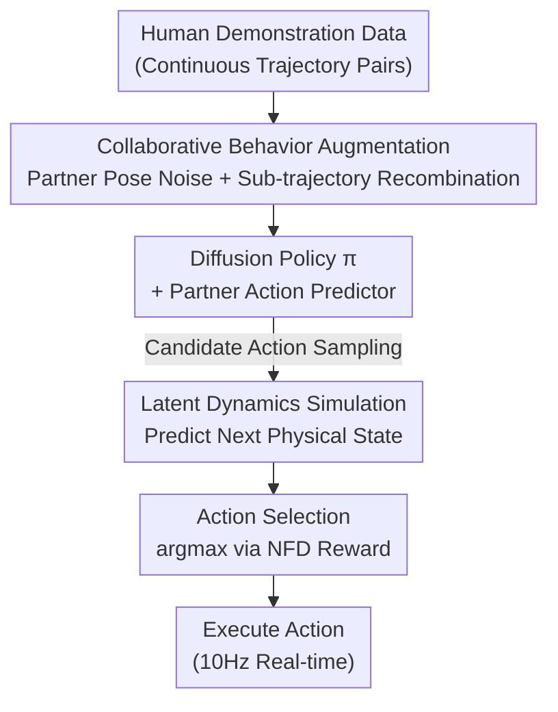

# Moving Out: Physically-grounded Human-AI Collaboration

**Conference**: ICML 2026  
**arXiv**: [2507.18623](https://arxiv.org/abs/2507.18623)  
**Code**: https://live-robotics-uva.github.io/movingout_ai/ (Project Page)  
**Area**: Robotics / Embodied AI / Human-AI Collaboration  
**Keywords**: Human-AI Collaboration, Embodied AI, Behavior Augmentation, World Models, Imitation Learning

## TL;DR
To address the lack of "physics-grounded constraints" in existing discrete/symbolic benchmarks, this paper introduces **Moving Out**, a collaborative environment based on a 2D rigid-body physics engine with continuous state-action spaces (e.g., two agents carrying heavy objects around corners). It proposes **BASS** (Behavior Augmentation, Simulation, and Selection), which enables the AI to collaborate stably when facing unseen human behaviors and object properties, nearly doubling the task completion rate in real human-AI trials.

## Background & Motivation
**Background**: The current mainstream testbeds for Human-AI Collaboration (HAC), such as Overcooked-AI, are primarily grid-worlds where agents move on discrete cells and transfer items instantaneously via symbolic, task-level actions. In such environments, training via self-play is often sufficient to obtain capable collaborative AI.

**Limitations of Prior Work**: Real-world physics do not follow these rules. When co-carrying a sofa, the mass, shape, and contact dynamics of the object significantly impact the outcome. Heavy objects require synchronized force; irregular shapes require coordinating which edge to grip; and navigating corners requires simultaneous rotation and translation. Grid-worlds eliminate these complexities: item transfer occurs at fixed positions in one step, whereas the physical world involves infinite continuous configurations for "how to grip and how much to rotate." Existing physical environments (e.g., It Takes Two is a single simplified task; HumanTHOR / Habitat 3.0 focus on navigation or high-level scheduling) fail to combine "continuous low-level control, diverse physical properties, and various collaboration modes."

**Key Challenge**: Continuous state-action spaces introduce two overlapping difficulties. First, human behavior is highly diverse—subtle differences in rotation angles or applied force change the interaction outcome, causing AI trained via self-play to fail when paired with unfamiliar humans. Second, physical constraints $\Gamma(s_t, a_t)$ compress feasible state transitions into "narrow passages." The transition function is constrained such that $\mathcal{P}(s_{t+1}\mid s_t,a_t)=1$ only if $\Gamma(s_t,a_t)$ is satisfied; otherwise, the state remains unchanged. The AI must truly understand physical properties to infer a partner's intent.

**Goal**: (1) Create a benchmark that demands continuous collaborative behaviors; (2) Specifically measure the ability to adapt to **unseen human behaviors** and generalize to **unseen physical constraints**; (3) Provide an AI method that is more robust in both types of generalization.

**Key Insight**: The authors observe that in continuous spaces, standard single-agent augmentation (randomly perturbing a single agent's trajectory) breaks collaboration—modifying one agent's action makes it incompatible with the other. Therefore, augmentation must **maintain mutual consistency**. Furthermore, the AI cannot rely solely on reactive imitation; it must "preview" the consequences of actions before selection.

**Core Idea**: Summarized in one sentence: **Augment diverse yet compatible collaborative behaviors (A), use a latent dynamics model to simulation the physical consequences of candidate actions (S), and finally filter the actions (S) based on proximity to the goal.** The combined three-step process is BASS.

## Method

### Overall Architecture
BASS (Behavior Augmentation, Simulation, and Selection) is built on a Diffusion Policy backbone and consists of training and inference phases. During training, **Behavior Augmentation** is performed: diverse yet compatible collaborative trajectories are generated from existing human demonstrations to train the policy; simultaneously, a **latent dynamics model** is trained to learn "what the next physical state looks like given the actions of both parties." During inference, **Simulation and Selection** occur: the policy first samples several candidate actions, the dynamics model previews their future states, and a reward (total distance from objects to the target) scores each candidate for execution. The pipeline does not require a physics simulator at test time, making it transferable to real-world scenarios.

### Key Designs

**1. Collaborative Behavior Augmentation: Creating Diversity Without Breaking Coordination**

Single-agent augmentation (random trajectory perturbation) fails in collaboration—changing agent A's action leaves agent B out of sync. BASS uses two techniques. First, **Partner Pose Noise**: Gaussian noise $\tilde{p}_{\text{partner}}=p_{\text{partner}}+\epsilon,\ \epsilon\sim\mathcal{N}(0,\sigma^2)$ is added to the partner's pose while keeping other states constant, simulating natural human jitter. Second, **Sub-trajectory Recombination**: If in two successful demonstrations, agent $i$ has sub-trajectories with **nearly identical start and end poses** (defined as the pose difference being less than a threshold $\epsilon_{\text{pose}}$, i.e., $s^i_{t_1}\approx \hat{s}^i_{t_3}$ and $s^i_{t_2}\approx \hat{s}^i_{t_4}$), then the different behaviors of partner $j$ in these segments are both compatible with $i$. By swapping partner $j$'s segments while keeping $i$'s motion constant, BASS constructs multiple valid partner behaviors for the "same" action by $i$. This forces the policy to output consistent coordination despite partner variations. Recombined trajectories are verified to be collision-free and physically valid (>99%).

**2. Latent Dynamics Simulation: Enabling AI to Preview Consequences**

While simulators provide physical outcomes, real-world deployment lacks them. BASS uses two VAEs: one encodes the current state into a latent space where the dynamics model predicts the next step, and the other decodes it back. Since the next state depends on both agents, a **Partner Action Predictor** first infers the partner's current action $a_t^{(p)}$. The dynamics model then predicts $z_{t+1}=f(z_t, a_t, a_t^{(p)})$. The partner predictor can reuse the policy itself by swapping the input perspective. This allows the AI to "mentally simulate" future states considering physical properties and partner reactions.

**3. Action Selection based on Predicted States: Decision-making via Foresight**

The policy and partner predictor each sample 4 candidate actions (limited to 4 for 10Hz real-time inference). For each candidate, the dynamics model previews the future state, and the **NFD (Normalized Final Distance)** is used as a reward—essentially the total distance of all objects to the target zone. The action $a^*=\arg\max_{a_i} r(a_i)$ is selected. Because the reward directly measures goal proximity, even when encountering unseen physical properties, the AI can select the correct action if the world model correctly predicts that "this movement brings the object closer to the target." This is why BASS is more robust in Challenge 2 (unseen physical constraints).

> The three components A→S→S correspond to the top-down flow: Augmentation for training, Simulation for inference previewing, and Selection for final execution.

### Loss & Training
The policy backbone is a Diffusion Policy (strong multi-modal modeling, used as both policy and partner predictor). VAE encoders and the latent dynamics model are implemented as MLPs and **trained jointly**. Every branch samples 4 candidates during inference to balance accuracy and 10Hz real-time constraints. NFD is the default selection metric, though any progress-tracking metric is applicable.

## Key Experimental Results

### Dataset Diversity
The authors demonstrate the value of recruiting diverse humans for data collection. Using Dynamic Time Warping (DTW), KDE Entropy, and RBF coverage distance, Moving Out's human data significantly outperforms expert or RL-collected data in diversity.

| Data Source | Mean DTW ↑ | Var DTW ↑ | Avg Entropy(KDE) ↑ | Coverage(RBF) ↑ |
|:---|:---:|:---:|:---:|:---:|
| Moving Out Ch.1 (Human) | **7.013** | **6.065** | **0.888** | **0.899** |
| Expert Dataset | 4.642 | 3.029 | 0.757 | 0.744 |
| RL Agent Collection | 4.358 | 2.499 | 0.683 | 0.626 |

### Main Results (Challenge 1: AI-AI and Human, 20-run Avg)
TCR = Task Completion Rate ↑, NFD = Normalized Final Distance ↑, WT = Wait Time ↓, AC = Action Consistency ↑.

| Protocol | Method | TCR ↑ | NFD ↑ | WT ↓ | AC ↑ |
|:---|:---|:---:|:---:|:---:|:---:|
| Seen Behaviors | DP | 0.3233 | 0.5367 | 0.3789 | 0.8163 |
| Seen Behaviors | **DP/BASS** | **0.3503** | **0.5724** | **0.3598** | **0.8337** |
| Unseen Behaviors | DP | 0.2563 (-20.7%) | 0.4589 (-14.5%) | 0.4249 | 0.7854 |
| Unseen Behaviors | **DP/BASS** | **0.3010 (-14.1%)** | **0.5197 (-9.2%)** | **0.3899** | **0.8099** |
| Human-AI Collab | DP | 0.3855 | 0.5547 | 0.4886 | 0.8054 |
| Human-AI Collab | **DP/BASS** | **0.6512** | **0.7053** | **0.3364** | **0.9124** |

Notably, in **Human-AI Collaboration**, BASS increases TCR from DP's 0.3855 to 0.6512 (nearly doubling) and reduces wait time. This proves BASS can understand and proactively coordinate with diverse human behaviors. Under unseen behaviors, BASS also shows the smallest performance drop (TCR dropped 14.1% vs DP's 20.7%).

### Ablation Study: Multi-agent Design (RQ3)
Downgrading BASS to a "single-agent variant"—ignoring partner alignment during recombination and predicting only self-states during simulation:

| Configuration | Challenge 1 {TCR, NFD} | Challenge 2 {TCR, NFD} |
|:---|:---|:---|
| Full BASS (Multi-agent) | {0.403, 0.511} | {0.420, 0.554} |
| Single-agent Variant | {0.368, 0.451} | {0.319, 0.458} |

The single-agent variant fails to maintain coordination, leading to a significant drop in TCR (from 0.420 to 0.319 in Ch. 2), proving that explicit modeling of both parties is essential.

### Key Findings
- **Gains in human-AI trials significantly exceed AI-AI trials**: BASS's core value is fully realized in physical human collaboration (TCR 0.385→0.651), confirming behavior augmentation and previewing address the "human diversity" gap.
- **Reduction in failure modes**: Statistical analysis of three typical failures (not releasing during handover, not responding when help is needed, and failing to grip large objects) showed DP rates of {0.797, 0.688, 0.906} compared to BASS rates of {0.343, 0.563, 0.484}.
- **Strong subjective evaluation**: In a 32-person user study, BASS significantly outperformed DP in "Helpfulness" and "Physical Understanding" (t-test $p=0.017$).
- **General performance drop in unseen behaviors**: All methods struggle with unseen behaviors, indicating benchmark difficulty, but BASS remains the most robust.

## Highlights & Insights
- **Start-stop pose matching for recombination**: This elegantly transforms the abstract problem of "what partner behavior is compatible with me" into a verifiable geometric condition, allowing safe generation of diverse collaborative data in continuous space (99% validity).
- **"Preview before acting" via world models**: Replacing a physics simulator with a latent dynamics model allows the method to adapt to real robotic scenarios where no simulator exists.
- **Benchmark contribution**: This is the first HAC benchmark designed for "continuous low-level control" with real human data. 12 maps cover Coordination, Awareness, and Action Consistency, providing a unified testbed for physical collaboration.

## Limitations & Future Work
- **2D vs 3D**: While introducing rigid-body physics, it remains a top-down 2D world, still distant from real 3D manipulation, grasping, and force control.
- **Sampling limit (4 candidates)**: Due to 10Hz real-time constraints, the action selection search is shallow. Optimal actions may not be sampled in complex scenarios.
- **Unresolved failures**: Despite reductions, failure rates remain high (e.g., "not responding when help is needed" at 0.563), indicating a large robustness gap.
- **Error propagation**: Reusing the policy as a partner predictor may fail if partner behavior deviates significantly from training, potentially dragging down the "preview" chain.

## Related Work & Insights
- **vs Overcooked-AI (Carroll et al., 2019)**: Overcooked uses discrete grids and symbolic actions. Moving Out uses continuous spaces and rigid-body physics; methods like self-play that work in grid-worlds degrade significantly here.
- **vs Diffusion Policy (Chi et al., 2024)**: DP is the backbone of BASS. While DP models multi-modal distributions, it is pure behavior cloning. BASS adds augmentation and previewing, nearly doubling TCR with real humans.
- **vs MAPPO (Yu et al., 2022)**: Standard multi-agent RL via self-play lacks alignment with human data, showing the weakest performance in adapting to diverse human behavior (Unseen TCR only 0.1635).

## Rating
- Novelty: ⭐⭐⭐⭐ Continuous physics-grounded HAC benchmark + "Augmentation with compatibility + World model preview."
- Experimental Thoroughness: ⭐⭐⭐⭐⭐ Two challenges + AI-AI/Human evaluation + 32-person user study + failure mode analysis + ablation.
- Writing Quality: ⭐⭐⭐⭐ Solid motivation and formalization; however, some result charts are scattered in the appendix.
- Value: ⭐⭐⭐⭐ Open-sourced benchmark and method provide a reproducible unified testbed for physical embodied collaboration.

<!-- RELATED:START -->

## Related Papers

- [\[ICML 2026\] Spatial Memory for Out-of-Vision Manipulation in Vision-Language-Action](spatial_memory_for_out-of-vision_manipulation_in_vision-language-action.md)
- [\[NeurIPS 2025\] Inner Speech as Behavior Guides: Steerable Imitation of Diverse Behaviors for Human-AI Coordination](../../NeurIPS2025/robotics/inner_speech_as_behavior_guides_steerable_imitation_of_diverse_behaviors_for_hum.md)
- [\[CVPR 2026\] BiPreManip: Learning Affordance-Based Bimanual Preparatory Manipulation through Anticipatory Collaboration](../../CVPR2026/robotics/bipremanip_learning_affordance-based_bimanual_preparatory_manipulation_through_a.md)
- [\[AAAI 2026\] Robust Out-of-Order Retrieval for Grid-Based Storage at Maximum Capacity](../../AAAI2026/robotics/robust_out-of-order_retrieval_for_grid-based_storage_at_maximum_capacity.md)
- [\[CVPR 2026\] Beyond Mimicry: Learning Whole-Body Human-Humanoid Interaction from Human-Human Demonstrations](../../CVPR2026/robotics/beyond_mimicry_learning_whole-body_human-humanoid_interaction_from_human-human_d.md)

<!-- RELATED:END -->
