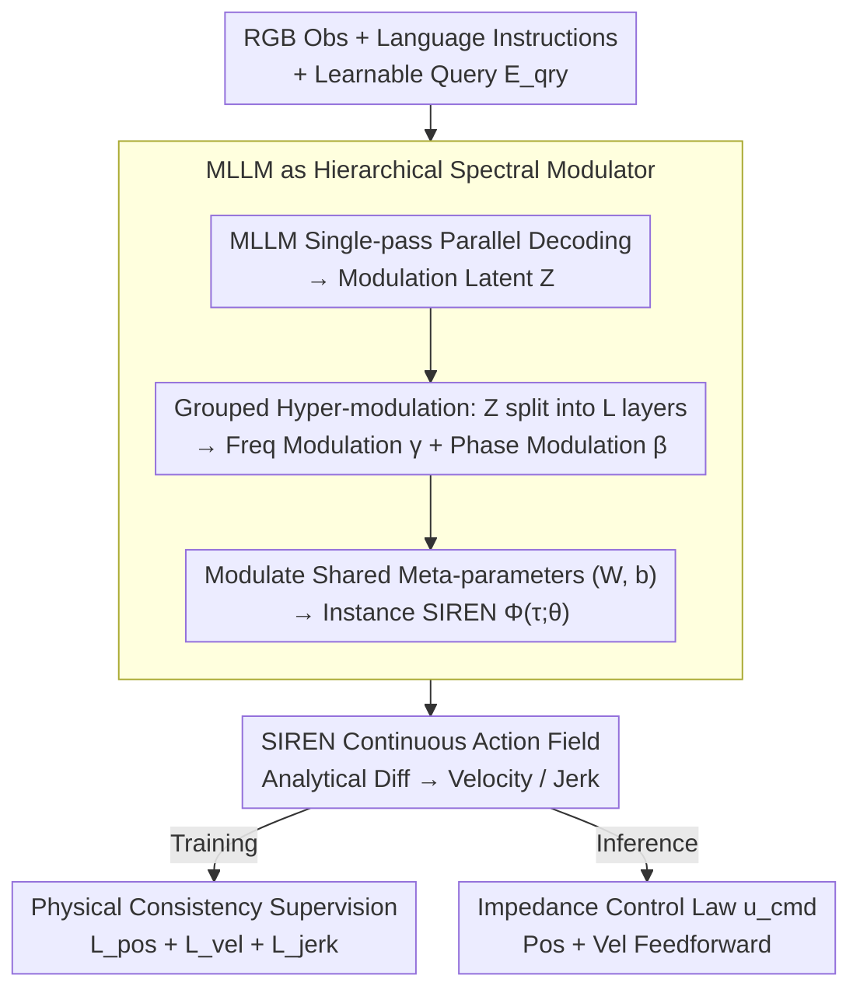

# Neural Implicit Action Fields: From Discrete Waypoints to Continuous Functions for Vision-Language-Action Models

**Conference**: ICML 2026  
**arXiv**: [2603.01766](https://arxiv.org/abs/2603.01766)  
**Code**: To be confirmed  
**Area**: Robotics / VLA / Embodied AI  
**Keywords**: VLA, SIREN, Implicit Neural Representation, Impedance Control, Action Chunking  

## TL;DR
NIAF redefines the "action chunk" of VLA models from a sequence of discrete waypoints to a continuous time function $\mathcal{A}(\tau)=\Phi(\tau;\theta)$. By utilizing an MLLM as a "hierarchical spectral modulator" to output parameters $\theta$ for a SIREN, the model achieves $C^\infty$ smooth trajectories, arbitrary frequency querying, and analytically derivable velocity/jerk signals. It achieves SOTA results on CALVIN/LIBERO and eliminates jitter in real-robot impedance control.

## Background & Motivation

**Background**: Vision-Language-Action (VLA) models have evolved from single-step token autoregressive prediction (RT-2 / OpenVLA) to "action chunking" (ACT / Diffusion Policy), and further to compressing action sequences into discrete tokens using B-spline control points or DCT coefficients (BEAST / FAST). A common characteristic is that the final actions are represented as a sequence of discrete waypoints, tied to the training data collection frequency.

**Limitations of Prior Work**: Forcing the discretization of continuous physical motion introduces three specific problems: (1) **Time resolution binding**: Models can only output points at the training frequency; higher frequency execution requires interpolation, which introduces artifacts. (2) **Lack of high-order dynamics supervision**: BEAST destroys the analytical continuity of splines by quantizing control points into a codebook, while other methods lack high-order constraints entirely, leading to discontinuous velocity curves and motor jitter. (3) **Inability to perform analytical differentiation**: Discrete representations rely on numerical differentiation to recover velocity, amplifying quantization noise and failing to provide clean feedforward terms for impedance control. Consequently, robots are often restricted to rigid position control, performing poorly in compliant operations like insertion or stacking.

**Key Challenge**: Physical control is fundamentally a continuous function $\mathcal{A}: t\to \mathbb{R}^{\dim}$, yet the LLM-token paradigm naturally produces discrete sequences. This structural mismatch means that to achieve smooth velocity/jerk, one must either abandon tokenization or accept quantization losses.

**Goal**: Define a new representation where "Action = Parameterized Continuous Function," repurposing the MLLM as a "parameter predictor" rather than a "waypoint predictor," while ensuring the representation is $C^\infty$ continuous and analytically derivable to provide both position and velocity feedforward for impedance control.

**Key Insight**: Neural Implicit Representations (INR) have proven capable of representing signals with high fidelity in NeRF; the $\sin$ activation of SIREN (Sinusoidal Representation Network) ensures all derivatives are analytically computable. By representing action chunks as SIRENs and using a hypernetwork mechanism to let the MLLM predict SIREN parameters, one gains both the semantic understanding of LLMs and the physical smoothness of continuous functions.

**Core Idea**: Action chunking is formulated as $\mathcal{A}(\tau)=\Phi(\tau;\theta)$, where $\theta$ is mapped by the MLLM through a set of learnable query embeddings. The latents output by the MLLM are not waypoints but "frequency modulation $\gamma$ + phase modulation $\beta$" for each SIREN layer, which perturb a set of shared motion-prior meta-parameters.

## Method

### Overall Architecture
The framework consists of two stages:

1. **Multimodal Context Encoding**: RGB observations $\mathcal{o}$, instructions $\mathcal{t}$, and a set of learnable query embeddings $\mathbf{E}_{qry}\in\mathbb{R}^{Q\times d}$ are fed into a pre-trained MLLM decoder. A **single-pass parallel decoding** outputs $\mathbf{Z}=\text{MLLM}(\mathbf{E}_{qry};\mathcal{o},\mathcal{t})\in\mathbb{R}^{Q\times d}$.
2. **Action Manifold Decoding**: $\mathbf{Z}$ is partitioned into $L$ blocks, each projected into $(\boldsymbol{\gamma}^{(\ell)}, \boldsymbol{\beta}^{(\ell)})$ for the $\ell$-th layer of the SIREN. These modulate the meta-parameters $(\mathbf{W},\mathbf{b})$ shared across all tasks, resulting in an instance-specific SIREN $\Phi(\tau;\theta)$. Position is obtained by querying any time $\tau\in[-1,1]$, while velocity, acceleration, and jerk are obtained via automatic differentiation.

The input side requires only one forward pass. During inference, $K$ time points $\tau_k = -1 + \frac{2k}{K-1}$ are sampled as needed, completely decoupling from the training frequency.

### Key Designs

**1. MLLM as a Hierarchical Spectral Modulator (Hypernetwork): Modulating a shared motion prior using semantic understanding instead of regressing SIREN weights from scratch**

If the MLLM were to output the entire SIREN weights directly, the parameter count would explode and easily overfit to single tasks. NIAF adopts a modulation approach: constraining the number of queries to $Q = L\times (G+1)$, partitioning the MLLM output $\mathbf{Z}$ by SIREN layers. For each layer, the first $G$ tokens are projected into frequency modulation $\boldsymbol{\gamma}^{(\ell)} = \text{Concat}(\psi_{\gamma_1}(\mathbf{Z}_{(\ell,1)}),\dots,\psi_{\gamma_G}(\mathbf{Z}_{(\ell,G)}))$, and the last token into phase modulation $\boldsymbol{\beta}^{(\ell)} = \psi_\beta(\mathbf{Z}_{(\ell,bias)})$. These perturb the shared meta-parameters: $\hat{\mathbf{W}}^{(\ell)} = \mathbf{W}^{(\ell)}\odot(\mathbf{1}+\boldsymbol{\gamma}^{(\ell)})$ and $\hat{\mathbf{b}}^{(\ell)} = \mathbf{b}^{(\ell)} + \boldsymbol{\beta}^{(\ell)}$.

This division has clear physical meaning: $\gamma$ adjusts frequency and $\beta$ adjusts phase. "Universal motion laws" reside in the shared $(\mathbf{W},\mathbf{b})$, while "task specificities" are placed in the lightweight $(\gamma,\beta)$, similar to LoRA or modulated INR design philosophies. Layer-wise modulation is more expressive than a single global embedding, preventing information bottlenecks.

**2. SIREN for $C^\infty$ Continuity + Analytical High-order Derivatives: Unifying position, velocity, and jerk under an isomorphic derivative chain**

Discrete waypoints require numerical differentiation for velocity, which amplifies quantization noise. ReLUs in INRs are not twice-differentiable, and quantizing B-spline control points destroys differentiability. SIREN’s $\sin$ activation is the only choice that allows all derivative orders to be written in analytical closed-form: forward pass $\mathbf{h}^{(\ell)} = \sin(\omega_0(\hat{\mathbf{W}}^{(\ell)}\mathbf{h}^{(\ell-1)} + \hat{\mathbf{b}}^{(\ell)}))$, $\mathcal{A}(\tau) = \mathbf{W}_{out}\mathbf{h}^{(L)} + \mathbf{b}_{out}$. Velocity is recursively derived via the chain rule $\dot{\mathbf{h}}^{(\ell)} = \cos(\mathbf{u}^{(\ell)})\odot(\hat{\mathbf{W}}^{(\ell-1)}\dot{\mathbf{h}}^{(\ell-1)})$, and jerk is obtained by differentiating twice more.

Due to the isomorphism of $\sin/\cos$ derivatives, the "position predictor" is simultaneously a "velocity predictor" and "jerk predictor," fundamentally avoiding numerical differentiation noise. The frequency factor $\omega_0$ ensures the network operates at the appropriate scale from the start, providing the clean feedforward signals required for impedance control.

**3. Physical Consistency Supervision: Grounding trajectories in physics using position, analytical velocity, and jerk regularization**

Fitting waypoints alone is insufficient; compliant operation requires smooth, physically consistent velocity curves. In simulation, where velocity feedback is missing, only the position term is used: $\mathcal{L}_{\text{pos}} = \frac{1}{K}\sum_k \|\Phi(\tau_k) - \mathbf{a}_{gt,k}\|_2^2$. On real robots, additional velocity supervision $\mathcal{L}_{\text{vel}} = \frac{1}{K}\sum_k \|\frac{2}{T}\nabla_\tau \Phi(\tau_k) - \mathbf{v}_{gt,k}\|_2^2$ (ground truth velocity from FOC drive estimation) and jerk regularization $\mathcal{L}_{\text{jerk}} = \frac{1}{K}\sum_k \|(\frac{2}{T})^3 \nabla_\tau^3 \Phi(\tau_k)\|_2^2$ are used to form $\mathcal{L}_{\text{real}} = \lambda_p \mathcal{L}_{\text{pos}} + \lambda_v \mathcal{L}_{\text{vel}} + \lambda_j \mathcal{L}_{\text{jerk}}$.

The elegance lies in position and velocity coming from two independent measurement sources (vision vs. FOC encoders). Constraining the same $\Phi$ by both creates a cross-signal regularization that encourages the model to discard inconsistent noise, yielding physically self-consistent trajectories. During inference, the impedance law $\mathbf{u}_{cmd} = \mathbf{K}_p(\Phi(\tau)-\mathbf{a}_{curr}) + \mathbf{K}_d(\frac{2}{T}\nabla_\tau\Phi(\tau) - \mathbf{v}_{curr})$ benefits from both position and velocity feedforward, which discrete representations cannot provide.

### Loss & Training
- Simulation (CALVIN / LIBERO): Only $\mathcal{L}_{\text{pos}}$ is used; the $C^\infty$ bias of SIREN acts as an implicit regularizer.
- Real Robot: All three $\mathcal{L}_{\text{real}}$ terms.
- Employs single-pass parallel decoding (no iterative denoising like flow-matching), offering significant inference speed advantages.
- Experiments performed across multiple backbones: Florence-2 Large / Qwen3-VL / $\pi_{0.5}$.

## Key Experimental Results

### Main Results

| Dataset | Metric | NIAF (Ours) | Prev. SOTA | Gain |
|--------|------|------|----------|------|
| CALVIN ABCD→D | Avg. Len | **4.66** | 4.62 (FLOWER) | +0.04 |
| CALVIN ABC→D | Avg. Len | **4.47** | 4.44 (FLOWER) | +0.03 |
| LIBERO-Object (Florence-2) | Success % | **100.0** | 98.8 ($\pi_0$) | +1.2 |
| LIBERO Average (Florence-2) | Success % | **97.9** | 95.7 (FLOWER) | +2.2 |
| LIBERO Average (Qwen3-VL) | Success % | **97.7** | 96.6 (OFT) | +1.1 |
| Real Item Placement | Success % | **90** | < (BEAST/OFT) | Significant |
| Real Cup Stacking | Success % | **80** | < (BEAST/OFT) | Significant |

Note: NIAF beats the 9B UniVLA on CALVIN with only 0.77B parameters and **no large-scale robot data pre-training**.

### Ablation Study

| Configuration | Key Metric | Description |
|------|---------|------|
| Full NIAF (Florence-2) | LIBERO-Long 95.5 | Complete model |
| BEAST-F (Discrete Ctrl Pts) | LIBERO-Long ~86 | Accuracy loss due to quantization |
| BEAST-CT (Continuous Ctrl Pts) | LIBERO-Long < NIAF | Discards "only winning because of continuity" |
| OFT (MLP direct waypoints) | LIBERO-Long < NIAF | Lacks analytical continuity |
| FAST (Autoregressive) | LIBERO-Long < NIAF | Slow token serializing and non-smooth |
| $\pi_{0.5}$-NIAF vs. $\pi_{0.5}$-BEAST | Shape Insertion (Better) | Continuous representation is decisive for precision |

### Key Findings
- **Continuous $\neq$ Just Not Discrete**: BEAST-CT uses continuous control points but still lags behind NIAF. The true advantage is $C^\infty$ smoothness + analytical differentiability, not just the absence of quantization.
- **Real-robot Velocity Curves**: Measured velocity for BEAST/OFT shows high-frequency jitter and oscillates around zero (forcing rigid position control). NIAF's velocity curves follow the actual motion trend as non-zero mean continuous lines—essential for usable impedance control.
- **Small Models + No Pre-training Can Win**: NIAF with 0.77B parameters outperforms the 9B UniVLA on CALVIN, suggesting that structural improvements to action representation are more effective than scaling parameters/data alone.

## Highlights & Insights
- **Proper Application of Hypernetworks**: While others have used MLLMs as hypernets, NIAF is the first to use it to output a continuous action function in a space previously dominated by tokens. The layer-wise spectral modulation ($\gamma, \beta$) is physically grounded.
- **Shared Motion-Prior is Underrated**: Modulating rather than overwriting allows a shared $(\mathbf{W},\mathbf{b})$ to carry a "universal motion grammar." All tasks learn only the differences, reducing MLLM output burden and overfitting risks. This is applicable to any generation scenario requiring fast task adaptation.
- **Analytical Differentiation as a System Lever**: Many papers treat high-order regularization as a nice-to-have. NIAF turns it into a binary switch for impedance control feasibility. Discrete $\to$ numerical diff $\to$ noise $\to$ rigid control; continuous $\to$ analytical velocity $\to$ impedance law (14). This is the key link from representation to systems.

## Limitations & Future Work
- NIAF modifies the action head and does not inherently improve high-level reasoning or zero-shot generalization of the base VLM. Advantages in unseen objects/instructions still largely depend on the backbone and data diversity.
- Real-robot velocity supervision depends on high-frequency FOC feedback. Low-cost platforms might only provide numerical differentiation of positions, potentially amplifying noise and lowering $\mathcal{L}_{\text{vel}}$ quality.
- Suitable for compliant/long-horizon/varied-frequency execution; for short-range picking tasks with fixed frequencies, discrete waypoints remain simple and practical.
- $\pi_{0.5}$-NIAF performs worse than the original $\pi_{0.5}$ on Towel Folding, as replacing the action head may cause "forgetting" of pre-trained flow-matching knowledge. Safely inheriting pre-training remains an open problem.

## Related Work & Insights
- **vs BEAST** (Zhou et al., 2026): BEAST uses B-spline control points but quantizes them, breaking differentiability; NIAF uses SIREN to maintain both compression and analytical derivatives.
- **vs $\pi_0$ / GR00T N1** (Black et al., 2024; Bjorck et al., 2025): Flow-matching requires iterative denoising; NIAF provides a complete continuous function in a single-pass, ensuring faster inference and natural smoothness.
- **vs ACT / Diffusion Policy** (Zhao et al., 2023; Chi et al., 2025): Early chunking addressed trajectory coherence but remained waypoint-based; NIAF reformulates chunking as a function.
- **vs OpenVLA-OFT** (Kim et al., 2025): OFT uses an MLP to project queries to one-step waypoints; NIAF projects to SIREN parameters, offering superior expressiveness and differentiability.

## Rating
- Novelty: ⭐⭐⭐⭐⭐ The trio of "MLLM as SIREN hypernet," "hierarchical spectral modulation," and "analytical dynamics supervision" represents a true paradigm shift.
- Experimental Thoroughness: ⭐⭐⭐⭐⭐ Covers CALVIN, LIBERO, 4 real-robot tasks, and 3 backbones. Velocity curve visualizations are highly illustrative.
- Writing Quality: ⭐⭐⭐⭐⭐ Three definitions clearly explain the paradigm shift, and the derivation chain (6)-(14) is complete and self-consistent.
- Value: ⭐⭐⭐⭐⭐ Targets the bottleneck from "capable of motion" to "capable of compliant motion" in VLA; expected to be widely adopted as a default action head.

<!-- RELATED:START -->

## Related Papers

- [\[ICML 2026\] Discrete Diffusion VLA: Bringing Discrete Diffusion to Action Decoding in Vision-Language-Action Policies](discrete_diffusion_vla_bringing_discrete_diffusion_to_action_decoding_in_vision-.md)
- [\[ICML 2026\] LangForce: Bayesian Decomposition of Vision-Language-Action Models via Latent Action Queries](langforce_bayesian_decomposition_of_vision_language_action_models_via_latent_act.md)
- [\[ICML 2026\] StableVLA: Towards Robust Vision-Language-Action Models without Extra Data](stablevla_towards_robust_vision-language-action_models_without_extra_data.md)
- [\[ICML 2026\] Latent Reasoning VLA: Latent Thinking and Prediction for Vision-Language-Action Models](latent_reasoning_vla_latent_thinking_and_prediction_for_vision-language-action_m.md)
- [\[ICML 2026\] Spatial Memory for Out-of-Vision Manipulation in Vision-Language-Action](spatial_memory_for_out-of-vision_manipulation_in_vision-language-action.md)

<!-- RELATED:END -->
