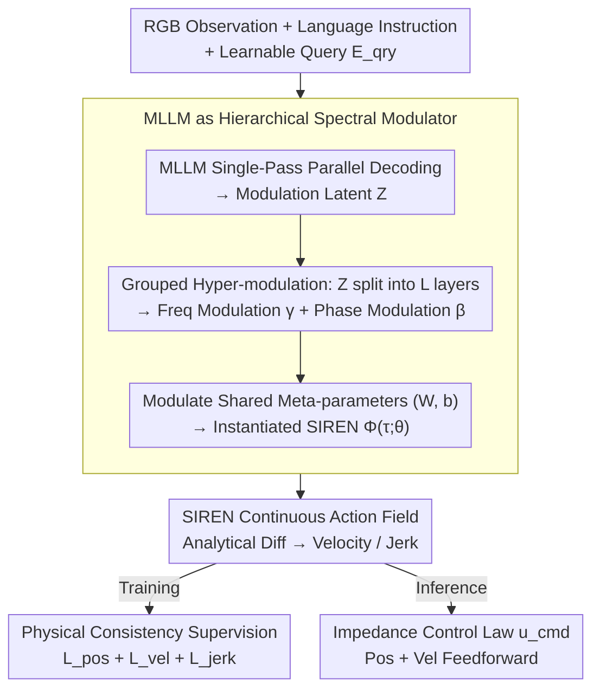

# Neural Implicit Action Fields: From Discrete Waypoints to Continuous Functions for Vision-Language-Action Models

**Conference**: ICML 2026  
**arXiv**: [2603.01766](https://arxiv.org/abs/2603.01766)  
**Code**: TBD  
**Area**: Robotics / VLA / Embodied AI  
**Keywords**: VLA, SIREN, Neural Implicit Representation, Impedance Control, Action Chunking  

## TL;DR
NIAF redefines VLA "action chunks" from a sequence of discrete waypoints into a continuous time function $\mathcal{A}(\tau)=\Phi(\tau;\theta)$. By using MLLMs as "hierarchical spectral modulators" to output parameters $\theta$ for SIREN, the method achieves $C^\infty$ smooth trajectories, arbitrary frequency queries, and analytically derivable velocity/jerk signals. It achieves SOTA on CALVIN/LIBERO and eliminates jitter in real-world impedance control.

## Background & Motivation

**Background**: Vision-Language-Action (VLA) models have evolved from single-step token autoregressive prediction (RT-2 / OpenVLA) to "action chunking" (ACT / Diffusion Policy), and further to compressing action sequences into discrete tokens using B-spline control points or DCT coefficients (BEAST / FAST). A commonality is that final actions are represented as a sequence of discrete waypoints, which are tied to the training data collection frequency.

**Limitations of Prior Work**: Forcing the discretization of continuous physical motion leads to three specific problems: (1) **Time Resolution Lock-in**: Models can only output points at the training frequency; higher frequency execution requires interpolation, which introduces artifacts. (2) **Lack of High-order Dynamics Supervision**: BEAST destroys the analytical continuity of splines by quantizing control points into a codebook, while other methods lack high-order constraints entirely, leading to discontinuous velocity curves and motor jitter. (3) **Inability to Analytically Differentiate**: Discrete representations rely on numerical differentiation to recover velocity, which amplifies quantization noise and fails to provide a clean feedforward term for impedance control. Consequently, robots are limited to rigid position control, performing poorly in compliant tasks (e.g., insertion, stacking).

**Key Challenge**: Physical control is essentially a continuous function $\mathcal{A}: t\to \mathbb{R}^{\dim}$, but the LLM-token paradigm naturally produces discrete sequences. This mismatch in mathematical structures means that achieving smooth velocity/jerk requires either abandoning tokenization or accepting quantization loss.

**Goal**: Define a new representation where "action = parameterized continuous function," repurposing MLLMs as "parameter predictors" rather than "waypoint predictors." Simultaneously, ensure the representation itself is $C^\infty$ continuous and analytically differentiable, providing position and velocity feedforward required for impedance control in one go.

**Key Insight**: Neural Implicit Representations (INR) have proven capable of representing signals with high fidelity via continuous functions in NeRF. The $\sin$ activation of SIREN (sinusoidal representation network) allows all orders of derivatives to be written analytically. By representing an action chunk as a SIREN and using a hypernetwork mechanism to let the MLLM predict SIREN parameters, one can combine the semantic understanding of LLMs with the physical smoothness of continuous functions.

**Core Idea**: Action chunking is formulated as $\mathcal{A}(\tau)=\Phi(\tau;\theta)$, where $\theta$ is mapped from the MLLM via a set of learnable query embeddings. The latents output by the MLLM are not waypoints but "frequency modulation $\gamma$ + phase modulation $\beta$" for each SIREN layer, which perturb a set of shared motion-prior meta-parameters.

## Method

### Overall Architecture
The framework consists of two stages:

1. **Multimodal Context Encoding**: RGB observations $\mathcal{o}$ + instructions $\mathcal{t}$ + a set of learnable query embeddings $\mathbf{E}_{qry}\in\mathbb{R}^{Q\times d}$ are fed into a pre-trained MLLM decoder. A **single-pass parallel decoding** outputs $\mathbf{Z}=\text{MLLM}(\mathbf{E}_{qry};\mathcal{o},\mathcal{t})\in\mathbb{R}^{Q\times d}$.
2. **Action Manifold Decoding**: $\mathbf{Z}$ is partitioned into $L$ blocks, each projected into $(\boldsymbol{\gamma}^{(\ell)}, \boldsymbol{\beta}^{(\ell)})$ for the $\ell$-th layer of SIREN. These modulate task-agnostic meta-parameters $(\mathbf{W},\mathbf{b})$ to obtain an instance-specific SIREN $\Phi(\tau;\theta)$. Position is obtained by querying at any time $\tau\in[-1,1]$, and velocity, acceleration, and jerk are obtained via automatic differentiation.

The input side requires only one forward pass. During inference, $K$ time points $\tau_k = -1 + \frac{2k}{K-1}$ are sampled as needed to obtain the action sequence, completely decoupling it from the training frequency.

### Key Designs

**1. MLLM as Hierarchical Spectral Modulator (Hypernetwork): Modulating a shared motion prior with semantic understanding rather than regressing entire SIREN weights from scratch.**

Directly outputting all SIREN weights from an MLLM would lead to parameter explosion and overfitting. NIAF uses a modulation approach: restricting the number of queries $Q = L\times (G+1)$, splitting MLLM output $\mathbf{Z}$ by SIREN layers. For each layer $\ell$, the first $G$ tokens are projected as frequency modulation $\boldsymbol{\gamma}^{(\ell)} = \text{Concat}(\psi_{\gamma_1}(\mathbf{Z}_{(\ell,1)}),\dots,\psi_{\gamma_G}(\mathbf{Z}_{(\ell,G)}))$, and the last token as phase modulation $\boldsymbol{\beta}^{(\ell)} = \psi_\beta(\mathbf{Z}_{(\ell,bias)})$. These perturb the shared meta-parameters: $\hat{\mathbf{W}}^{(\ell)} = \mathbf{W}^{(\ell)}\odot(\mathbf{1}+\boldsymbol{\gamma}^{(\ell)})$ and $\hat{\mathbf{b}}^{(\ell)} = \mathbf{b}^{(\ell)} + \boldsymbol{\beta}^{(\ell)}$.

This partitioning has clear physical meaning: $\gamma$ adjusts frequency and $\beta$ adjusts phase. "Universal motion patterns" are stored in the shared $(\mathbf{W},\mathbf{b})$, while "task variations" are handled by the lightweight $(\gamma,\beta)$, similar to LoRA or modulated INR. Layer-wise modulation offers stronger expressiveness than a single global embedding, avoiding the bottleneck of compressing all task information.

**2. SIREN for $C^\infty$ Continuity + Analytical High-order Derivatives: Position, velocity, and jerk share an isomorphic derivative chain.**

Obtaining velocity from discrete waypoints requires numerical differentiation, which amplifies noise. ReLU-based INRs lack second-order derivatives, and quantized B-spline control points break differentiability. SIREN’s $\sin$ activation is the only choice that allows all orders of derivatives to be written in analytical closed form: forward pass $\mathbf{h}^{(\ell)} = \sin(\omega_0(\hat{\mathbf{W}}^{(\ell)}\mathbf{h}^{(\ell-1)} + \hat{\mathbf{b}}^{(\ell)}))$ and $\mathcal{A}(\tau) = \mathbf{W}_{out}\mathbf{h}^{(L)} + \mathbf{b}_{out}$. Velocity is derived via the chain rule $\dot{\mathbf{h}}^{(\ell)} = \cos(\mathbf{u}^{(\ell)})\odot(\hat{\mathbf{W}}^{(\ell-1)}\dot{\mathbf{h}}^{(\ell-1)})$, and jerk is obtained by differentiating twice more.

Since $\sin/\cos$ derivatives are isomorphic, the "position predictor" is simultaneously the "velocity predictor" and "jerk predictor," fundamentally avoiding numerical differentiation noise. The frequency factor $\omega_0$ ensures the network operates at the correct scale from the start, providing the foundation for clean feedforward signals in impedance control.

**3. Physical Consistency Supervision: Anchoring trajectories to physical consistency via Position + Analytical Velocity + Jerk regularization.**

Fitting waypoints alone is insufficient; compliant operations require smooth and physically consistent velocity curves. In simulation, where velocity feedback is absent, only the position term is used: $\mathcal{L}_{\text{pos}} = \frac{1}{K}\sum_k \|\Phi(\tau_k) - \mathbf{a}_{gt,k}\|_2^2$. For real-world robots, additional velocity supervision $\mathcal{L}_{\text{vel}} = \frac{1}{K}\sum_k \|\frac{2}{T}\nabla_\tau \Phi(\tau_k) - \mathbf{v}_{gt,k}\|_2^2$ (ground truth velocity from FOC drive estimation) and jerk regularization $\mathcal{L}_{\text{jerk}} = \frac{1}{K}\sum_k \|(\frac{2}{T})^3 \nabla_\tau^3 \Phi(\tau_k)\|_2^2$ are used, formulated as $\mathcal{L}_{\text{real}} = \lambda_p \mathcal{L}_{\text{pos}} + \lambda_v \mathcal{L}_{\text{vel}} + \lambda_j \mathcal{L}_{\text{jerk}}$.

The advantage is that position and velocity come from independent measurement sources (vision vs. FOC encoders). Constraining $\Phi$ with both creates cross-signal regularization, encouraging the model to discard inconsistent noise from either signal and obtain physically consistent trajectories. Jerk regularization further suppresses motor vibration. During inference, the impedance law $\mathbf{u}_{cmd} = \mathbf{K}_p(\Phi(\tau)-\mathbf{a}_{curr}) + \mathbf{K}_d(\frac{2}{T}\nabla_\tau\Phi(\tau) - \mathbf{v}_{curr})$ leverages both position and velocity feedforward, which is impossible with discrete representations.

### Loss & Training
- Simulation (CALVIN / LIBERO): Only $\mathcal{L}_{\text{pos}}$ is used; the $C^\infty$ bias of SIREN acts as an implicit regularizer.
- Real-world: All three terms in $\mathcal{L}_{\text{real}}$.
- Uses single-pass parallel decoding (no iterative denoising like flow-matching), providing significant inference speed advantages.
- Experiments conducted across various backbones: Florence-2 Large / Qwen3-VL / $\pi_{0.5}$.

## Key Experimental Results

### Main Results

| Dataset | Metric | NIAF (Ours) | Prev. SOTA | Gain |
|--------|------|------|----------|------|
| CALVIN ABCD→D | Avg. Len | **4.66** | 4.62 (FLOWER) | +0.04 |
| CALVIN ABC→D | Avg. Len | **4.47** | 4.44 (FLOWER) | +0.03 |
| LIBERO-Object (Florence-2) | Success % | **100.0** | 98.8 ($\pi_0$) | +1.2 |
| LIBERO Mean (Florence-2) | Success % | **97.9** | 95.7 (FLOWER) | +2.2 |
| LIBERO Mean (Qwen3-VL) | Success % | **97.7** | 96.6 (OFT) | +1.1 |
| Real-world Item Placement | Success % | **90** | < (BEAST/OFT) | Significant |
| Real-world Cup Stacking | Success % | **80** | < (BEAST/OFT) | Significant |

Note: NIAF beats the 9B UniVLA on CALVIN with only 0.77B parameters and **no large-scale robotic data pre-training**.

### Ablation Study

| Configuration | Key Metric | Note |
|------|---------|------|
| Full NIAF (Florence-2) | LIBERO-Long 95.5 | Complete model |
| BEAST-F (Discrete Control Pts) | LIBERO-Long ~86 | Quantization loss |
| BEAST-CT (Continuous Control Pts) | LIBERO-Long < NIAF | Disproving "it's just about non-discretization" |
| OFT (MLP direct waypoints) | LIBERO-Long < NIAF | Lacks analytical continuity |
| FAST (autoregressive) | LIBERO-Long < NIAF | Token serializing is slow and unsmooth |
| $\pi_{0.5}$-NIAF vs. $\pi_{0.5}$-BEAST | Shape Insertion | Continuous representation is decisive for precision |

### Key Findings
- **Continuous $\neq$ Non-discrete is enough**: BEAST-CT also uses continuous control points but still lags behind NIAF. The true advantage lies in $C^\infty$ smoothness and analytical differentiability, not just avoiding quantization.
- **Real-world Velocity Curve Comparison**: Velocity measured from BEAST/OFT shows high-frequency jitter oscillating around zero (forcing rigid position control), while NIAF’s velocity curve follows the true motion trend in a non-zero-mean continuous line—the essence required for impedance control.
- **Small Models + No Pre-training Can Win**: NIAF (0.77B) outperforms UniVLA (9B) on CALVIN, suggesting that structural improvements to action representation are more effective than simply scaling parameters or data.

## Highlights & Insights
- **Correct Application of Hypernetwork**: While prior works proved "MLLM as hypernet" is feasible, NIAF is the first to use it to output continuous action functions in place of tokens. The hierarchical modulation (layer-wise $\gamma, \beta$) is physically grounded.
- **Underrated Design of Shared Motion-Prior**: Modulating rather than rewriting allows a shared $(\mathbf{W},\mathbf{b})$ to carry the "universal robot motion grammar," while tasks only learn the differences. This reduces MLLM output burden and lowers the risk of task-specific overfitting.
- **Analytical Differentiation as a System Lever**: While many papers view jerk regularization as "nice-to-have," NIAF makes it a binary switch for impedance control feasibility. Discrete $\to$ Numerical Diff $\to$ Noise $\to$ Rigid Position Control; Continuous $\to$ Analytical Velocity $\to$ Impedance law (14) becomes usable.

## Limitations & Future Work
- NIAF modifies the action head and does not improve the base VLM's high-level reasoning or zero-shot generalization.
- Velocity supervision depends on high-frequency FOC feedback. Low-cost platforms can only provide numerical differentiation of position, which may amplify noise and degrade $\mathcal{L}_{\text{vel}}$ quality.
- Most applicable to compliant, long-horizon, or variable-frequency execution. For short-range, fixed-frequency, simple pick-and-place tasks, discrete waypoints remain practical.
- $\pi_{0.5}$-NIAF performs worse than original $\pi_{0.5}$ on Towel Folding, indicating that replacing action heads can "forget" pre-trained flow-matching knowledge. How to inherit pre-training safely remains an open question.

## Related Work & Insights
- **vs BEAST** (Zhou et al., 2026): BEAST uses B-spline control points but quantizes them, breaking differentiability; NIAF uses SIREN to maintain both compression and analytical differentiability.
- **vs $\pi_0$ / GR00T N1** (Black et al., 2024; Bjorck et al., 2025): Flow-matching requires multi-step iterative denoising; NIAF provides a complete continuous function in a single-pass, enabling faster and naturally smooth inference.
- **vs ACT / Diffusion Policy** (Zhao et al., 2023; Chi et al., 2025): Early chunking solved trajectory coherence but remained waypoint-based; NIAF rewrites the chunk itself as a function.
- **vs OpenVLA-OFT** (Kim et al., 2025): OFT projects queries to waypoints; NIAF projects queries to SIREN parameters, offering superior expressiveness and differentiability.

## Rating
- Novelty: ⭐⭐⭐⭐⭐ "MLLM as SIREN hypernet" + "Hierarchical Spectral Modulation" + "Analytical Dynamics Supervision" represents a true paradigm shift.
- Experimental Thoroughness: ⭐⭐⭐⭐⭐ Comprehensive evaluation across CALVIN, LIBERO, four real-world tasks, and three backbones. Velocity curve visualizations are highly persuasive.
- Writing Quality: ⭐⭐⭐⭐⭐ Clearly defined paradigms and a self-consistent derivation chain from (6) to (14).
- Value: ⭐⭐⭐⭐⭐ Addresses the critical bottleneck of moving from "able to move" to "able to move compliantly" in VLA, likely to become a default action head option.

<!-- RELATED:START -->

## Related Papers

- [\[ICML 2026\] Discrete Diffusion VLA: Bringing Discrete Diffusion to Action Decoding in Vision-Language-Action Policies](discrete_diffusion_vla_bringing_discrete_diffusion_to_action_decoding_in_vision-.md)
- [\[ICML 2026\] LangForce: Bayesian Decomposition of Vision-Language-Action Models via Latent Action Queries](langforce_bayesian_decomposition_of_vision_language_action_models_via_latent_act.md)
- [\[ICML 2026\] StableVLA: Towards Robust Vision-Language-Action Models without Extra Data](stablevla_towards_robust_vision-language-action_models_without_extra_data.md)
- [\[ICML 2026\] Latent Reasoning VLA: Latent Thinking and Prediction for Vision-Language-Action Models](latent_reasoning_vla_latent_thinking_and_prediction_for_vision-language-action_m.md)
- [\[CVPR 2026\] Closed-Loop Neural Activation Control in Vision-Language-Action Models](../../CVPR2026/robotics/closed-loop_neural_activation_control_in_vision-language-action_models.md)

<!-- RELATED:END -->
