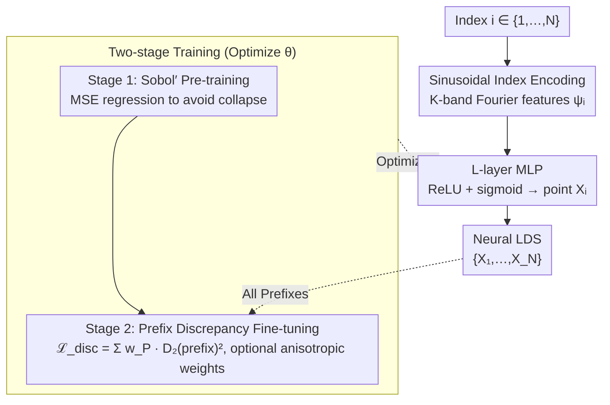

# Neural Low-Discrepancy Sequences

**Conference**: ICML 2026  
**arXiv**: [2510.03745](https://arxiv.org/abs/2510.03745)  
**Code**: https://github.com/camail-official/neuro-lds  
**Area**: Scientific Computing / Quasi-Monte Carlo / Neural Network Sampling  
**Keywords**: Low-discrepancy sequences, Quasi-Monte Carlo, MLP, Sobol, Path Planning  

## TL;DR
NeuroLDS utilizes a small MLP that maps integer indices via sinusoidal position encoding to points. By first regressing against Sobol' sequences and then fine-tuning using a closed-form $L_2$ discrepancy loss over all prefixes, it generates the first extensible neural low-discrepancy sequence. It consistently outperforms Sobol'/Halton across 4D discrepancy metrics, Borehole integration, RRT motion planning, and Black–Scholes PDE solving.

## Background & Motivation

**Background**: Quasi-Monte Carlo (QMC) relies on low-discrepancy point sets/sequences to approximate IID Monte Carlo errors at a rate closer to $\mathcal{O}(N^{-1})$ than $\mathcal{O}(N^{-1/2})$ on $[0,1]^d$. Classical constructions (Halton, Sobol', rank-1 lattice, digital nets) are based on number theory—using radical-inverse with prime bases or primitive polynomials over $\mathbb{F}_2$ to generate direction numbers. Recently, Message-Passing Monte Carlo (MPMC) first formalized "finding minimum discrepancy point sets" as a differentiable optimization problem, using GNNs to learn a mapping for a fixed $N$ and achieving historically low discrepancy values on a small scale.

**Limitations of Prior Work**: MPMC can only provide "sets," not "sequences." Once trained for a fixed $N=1024$, adding a single point requires retraining the entire network. However, incremental sampling planners like RRT require extensible sequences that remain as uniform as possible across every prefix. On the other hand, the discrepancy of classical LDS is particularly low at $N=2^m$ but fluctuates significantly in the $2^m < N < 2^{m+1}$ interval—for example, in the first $2^{14}$ points of van der Corput, "non-power-of-2" $N$ values are always worse than the corresponding $2^m$.

**Key Challenge**: In QMC, "low discrepancy" and "extensibility" represent a structural trade-off. Sets can be globally optimized for extremely low discrepancy, but adding points destroys uniformity; sequences must satisfy the strong constraint that "every prefix has low discrepancy," so their discrepancy curves are naturally worse than the optimal sets of the same length. MPMC focuses on the former, while classical Sobol'/Halton focus on the latter, but neither is Pareto-optimal on the same curve.

**Goal**: Train a neural network $f_\theta: \{1,\dots,N\}\to [0,1]^d$ such that for any prefix $P\le N$, the discrepancy of $\{f_\theta(i)\}_{i=1}^P$ is minimized, and the discrepancy decreases smoothly across the entire range of $N$ rather than oscillating.

**Key Insight**: The essence of classical LDS is "using the digit expansion of $i$ (radical-inverse / Gray-coded direction numbers) as input features to perform a deterministic transformation into coordinates." This is naturally suited for imitation by neural networks—by feeding $i$ into the network and letting it learn a set of "generalized digital rules." Discrepancy has a closed-form $L_2$ kernel representation (Eq. 2), which is fully differentiable and can be used directly as a loss function.

**Core Idea**: Represent the "index → point" mapping with a small MLP, using $K$-band sinusoidal features to simulate digit expansion at the input. Training follows a two-stage process: first, supervised fitting of Sobol' as an inductive bias (to avoid collapsing to corners), followed by fine-tuning using the "sum of all prefix discrepancies" as an unsupervised loss.

## Method

### Overall Architecture
NeuroLDS is a deterministic sequence generator $f_\theta: \{1,\dots,N\}\to [0,1]^d$. The pipeline is as follows:

1. Index $i$ → $K$-band sinusoidal position encoding $\psi_i \in \mathbb{R}^{1+2K}$;
2. $\psi_i$ passes through an $L$-layer MLP (ReLU + terminal sigmoid) → point $\mathbf{X}_i \in [0,1]^d$;
3. The collective sequence $\{\mathbf{X}_1,\dots,\mathbf{X}_N\}$ constitutes the generated LDS.

Training consists of two stages: pre-training via MSE regression to a Sobol' sequence, and fine-tuning using the weighted sum of all prefix discrepancies as the loss.

### Key Designs

**1. Sinusoidal Index Encoding to Mimic Digit Expansion: Exposing integer $i$ as multi-frequency continuous features**

Classical LDS achieve low discrepancy because they map "different bits of $i$" to different scales of the point coordinates—Halton uses base-$b$ digits, and Sobol' uses binary direction bits $g_k(i)$. NeuroLDS aims to let the MLP learn these "digital rules" by first encoding the integer index into network-friendly features using Fourier features inspired by NeRF/Transformers:

$$\psi(i) = \big[\,i/N,\; \sin(2^k\pi i/N),\; \cos(2^k\pi i/N)\,\big]_{k=0}^{K-1} \in \mathbb{R}^{1+2K}$$

Each frequency axis $2^k\pi$ conceptually corresponds to a "base bit," providing a continuous relaxation of base-$b$ digits. This allows the MLP to freely combine multi-frequency bands to generate novel digital rules not present in classical constructions. Ablations show that larger $K\in\{8,16,32\}$ leads to smoother discrepancy curves (small $K$ causes significant oscillation) at the cost of slightly increased training time.

**2. Two-stage Training (Sobol' Pre-training + Closed-form $L_2$ Discrepancy Fine-tuning): Anchoring before optimizing to avoid collapse**

Directly training from scratch with discrepancy loss leads to major issues—the network collapses into a single corner of $[0,1]^d$ (a degenerate solution), failing across all 2/3/4-dimensional tests. NeuroLDS bypasses this with two stages: Stage 1 regresses the network to a Sobol' sequence (discarding the first 128 burn-in points):

$$\mathcal{L}_{\text{pre}}(\theta) = \frac{1}{N}\sum_i \|f_\theta(\psi_i) - q_i\|_2^2$$

This pulls the network onto a "known good" initial manifold. Stage 2 then minimizes the weighted sum of all prefix discrepancies:

$$\mathcal{L}_{\text{disc}}(\theta) = \sum_{P=2}^N w_P \cdot D_2^\bullet\big(\{\mathbf{X}_i\}_{i=1}^P\big)^2$$

where $D_2^\bullet$ is the closed-form kernel integral (selectable among star / sym / ctr / per / ext / asd), with a complexity of $\mathcal{O}(dN^2)$ per prefix. Using the Sobol' topology as a strong inductive bias is key to success—with it, fine-tuning converges stably to better results; without it, the model collapses. This discrepancy loss is inherently differentiable and does not rely on surrogate estimators.

**3. Prefix-wise Discrepancy Loss + Optional High-dimensional Weights: Embedding sequence extensibility into the objective**

The fundamental difference between a sequence and a set is that a sequence requires **every prefix** to have low discrepancy, whereas classical LDS discrepancy is only optimal at $N=2^m$. NeuroLDS addresses this by calculating the closed-form $L_2$ discrepancy for any $P\le N$ and including it in the loss:

$$\big(D_2^k(\{\mathbf{X}_i\}_{i=1}^P)\big)^2 = \iint k\,d\boldsymbol{x}\,d\boldsymbol{y} - \frac{2}{P}\sum_i \int k(\mathbf{X}_i,\boldsymbol{y})\,d\boldsymbol{y} + \frac{1}{P^2}\sum_{i,j} k(\mathbf{X}_i,\mathbf{X}_j)$$

Equally weighting all prefixes naturally "flattens" the discrepancy curve and eliminates oscillations. In high dimensions, product weight kernels are used: $\tilde k(\boldsymbol{x},\boldsymbol{y}) = \prod_j (1 + \gamma_j\, k(x_j,y_j))$, reducing the impact of less important coordinates. The Borehole case study validated that using $\boldsymbol{\gamma}$ estimated from sensitivity analysis allows NeuroLDS to further outperform NM-Greedy in anisotropic integration.

### Loss & Training
- Stage 1: MSE $\mathcal{L}_{\text{pre}}$, targeting Sobol' sequences after burn-in.
- Stage 2: $\mathcal{L}_{\text{disc}}(\theta) = \sum_{P=2}^N w_P D_2^\bullet(\{\mathbf{X}_i\}_{i=1}^P)^2$. $w_P$ is uniform $1/(N-2)$ by default; optionally $w_P^* = 2P/(N^2+N-2)$ proportional to length—the latter performs better on long prefixes but slightly worse on short ones.
- Kernel function $\bullet \in \{\text{star, sym, ctr, per, ext, asd}\}$ is interchangeable. Optuna is used to tune the best hyperparameters (learning rate, width, depth, $K$) for each loss.

## Key Experimental Results

### Main Results

| Dataset | Metric | NeuroLDS (Ours) | Prev. SOTA | Gain |
|--------|------|------|----------|------|
| Borehole 8D Integration ($N=460$) | Absolute Error | **0.0657** | 0.1086 (Sobol') | ~40% Error Reduction |
| Borehole 8D Integration ($N=260$) | Absolute Error | **0.0239** | 0.4516 (Halton) | Significant Lead |
| RRT Kinematic Chain (Width 0.64) | Success Rate % | **96.58** | 87.95 (Halton) | +8.6 |
| RRT Kinematic Chain (Width 0.40) | Success Rate % | **80.00** | 67.32 (Halton) | +12.7 |
| 2D Black–Scholes PDE Training | MSE ($\times 10^{-4}$) | **3.34** ($D_2^{\text{ctr}}$) | 4.04 (Sobol') | ~17% Error Reduction |

To achieve the same average success rate as NeuroLDS, Sobol' requires 2.50× points, Halton requires 1.55×, and uniform sampling requires 2.27×.

### Ablation Study

| Configuration | Key Metrics | Explanation |
|------|---------|------|
| Full model (Pre-train + FT) | Stable convergence | Complete model |
| w/o Sobol' Pre-training (Direct) | Collapse to a corner | Direct discrepancy minimization failed in 2/3/4D |
| Index Encoding $K=8$ | High variance curve | Insufficient frequency bands to cover all scales |
| Index Encoding $K=32$ | Smoothest curve | Slightly increased training time |
| Linear layers (no ReLU) | Failed to fit Sobol' | Confirms necessity of deep non-linearity |
| AR-GNN instead of MLP | Discrepancy degrades | Training signals decay over long contexts |
| LSTM instead of MLP | Slightly better but 6× slower | Gains did not justify the cost |
| $w_P^*$ length weighting | Better long prefixes | Consistent with bias towards later segments |

### Key Findings
- Sobol' pre-training is crucial—without it, the discrepancy loss causes the network to "collapse to a corner," failing in all dimensions. This aligns with findings from Clément et al., 2025.
- In RRT, low discrepancy not only improves average success rates but also yields the largest improvements in "difficult" scenarios like narrow passages (width 0.4)—validating that extensible LDS are more suitable for incremental exploration than sets.
- In Black–Scholes PDE solving, continuous kernels (centered $D_2^{\text{ctr}}$ and average squared $D_2^{\text{asd}}$) show the largest gains, suggesting kernel selection should match the smoothness assumptions of the task.

## Highlights & Insights
- **Reinterpreting digit expansion as position encoding**: Halton’s radical-inverse digits and Sobol’s Gray-code direction numbers both map different bits of $i$ to different scales. NeuroLDS does the same with sinusoidal multi-frequency encoding but changes the "mapping rule" from hard-coded to learnable. This perspective connects QMC with NeRF/Transformers in terms of mathematical structure.
- **Discrepancy closed-form as loss as a design philosophy**: Many deep-learning approaches for LDS use Stein discrepancy surrogates; NeuroLDS directly uses the classical $L_2$ discrepancy $\mathcal{O}(dN^2)$ closed-form expression + automatic differentiation. This aligns theory with practice and retains the flexibility to swap kernels (including weighted anisotropic kernels).
- **Pre-training as a "safety anchor" for inductive bias**: Neural network optimization of non-convex losses naturally tends toward collapse. By first pulling the network to a "known good" initial manifold (Sobol'), subsequent discrepancy minimization becomes stable and consistently progressive. This strategy is worth emulating in other geometric optimization problems like optimal transport or sampling design.

## Limitations & Future Work
- The authors acknowledge that success depends on number-theoretic constructions like Sobol'/Halton as pre-training targets, meaning a "completely ML-only" LDS has not yet been achieved; how pre-training on a specific classical sequence biases the final result remains an open question.
- The $\mathcal{O}(dN^2)$ discrepancy calculation is still expensive for large $N$—the paper only demonstrates up to $N=10^4$; scaling to $N=10^6$ (common in high-resolution QMC) would require discrepancy approximations or randomized acceleration.
- Evaluation focuses on "traditional QMC-friendly" tasks (integration, PDE, RRT); its transferability to "open" scenarios like reinforcement learning exploration or generative model sample quality remains to be tested.
- In high dimensions, weighted $\boldsymbol{\gamma}$ depends on a-priori sensitivity knowledge, which requires a coarse sampling to estimate weights in blind scenarios, introducing "startup" overhead.

## Related Work & Insights
- **vs MPMC** (Rusch & Kirk, 2024): MPMC uses GNNs to learn optimal sets for a fixed $N$, achieving extremely low discrepancy but no extensibility. NeuroLDS uses MLP + index to learn sequences; discrepancy is slightly higher than MPMC at its target point count but decreases smoothly throughout. They are complementary "Set SOTA" vs "Sequence SOTA."
- **vs Sobol'/Halton classical constructions**: Classical constructions are optimal at $N=2^m$ but oscillate; NeuroLDS weights all prefixes equally, shifting the entire curve downward and removing "sawtooth" patterns.
- **vs NM-Greedy** (Chen et al., 2018): NM-Greedy also supports weighted discrepancy minimization but uses Nelder–Mead global search, which doesn't generalize—adding points requires rerunning. NeuroLDS is trained once and can generate points for any length.
- **vs Neural Fields (NeRF / SIREN)**: NeuroLDS implements the "index → point" relationship as a coordinate network, representing an interesting migration of INR (Implicit Neural Representation) logic from "signal representation" to "sampling design."

## Rating
- Novelty: ⭐⭐⭐⭐⭐ First method to truly generate extensible neural LDS, clarifying the "digit expansion ↔ position encoding" link.
- Experimental Thoroughness: ⭐⭐⭐⭐ Covers discrepancy, integration, planning, and PDEs, but $N$ scale is small ($\le 10^4$) and limited to $d=8$.
- Writing Quality: ⭐⭐⭐⭐⭐ Clear mathematical derivations, detailed appendices for 6 kernel forms, low barrier to reproduction.
- Value: ⭐⭐⭐⭐⭐ Immediately impactful for scientific computing pipelines requiring uniform sampling; open-sourced by MIT-CSAIL/Rus Lab.

<!-- RELATED:START -->

## Related Papers

- [\[CVPR 2026\] Contact-Aware Neural Dynamics](../../CVPR2026/robotics/contact-aware_neural_dynamics.md)
- [\[ICML 2026\] Neural Implicit Action Fields: From Discrete Waypoints to Continuous Functions for Vision-Language-Action Models](neural_implicit_action_fields_from_discrete_waypoints_to_continuous_functions_fo.md)
- [\[ICLR 2026\] RRNCO: Towards Real-World Routing with Neural Combinatorial Optimization](../../ICLR2026/robotics/rrnco_towards_real-world_routing_with_neural_combinatorial_optimization.md)
- [\[NeurIPS 2025\] BEAST: Efficient Tokenization of B-Splines Encoded Action Sequences for Imitation Learning](../../NeurIPS2025/robotics/beast_efficient_tokenization_of_b-splines_encoded_action_sequences_for_imitation.md)
- [\[CVPR 2025\] Mitigating the Human-Robot Domain Discrepancy in Visual Pre-training for Robotic Manipulation](../../CVPR2025/robotics/mitigating_the_human-robot_domain_discrepancy_in_visual_pre-training_for_robotic.md)

<!-- RELATED:END -->
