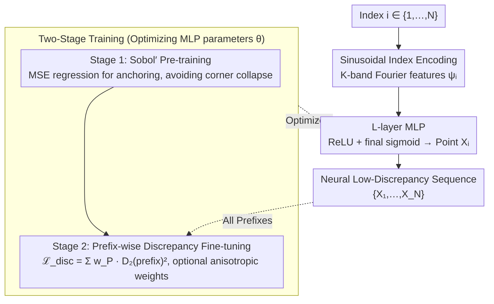

# Neural Low-Discrepancy Sequences

**Conference**: ICML 2026  
**arXiv**: [2510.03745](https://arxiv.org/abs/2510.03745)  
**Code**: https://github.com/camail-official/neuro-lds  
**Area**: Scientific Computing / Quasi-Monte Carlo / Neural Sampling  
**Keywords**: Low-Discrepancy Sequences, Quasi-Monte Carlo, MLP, Sobol, Path Planning  

## TL;DR
NeuroLDS utilizes a small MLP that maps integer indices through sinusoidal positional encoding. It first regresses to Sobol' sequences and is then fine-tuned using a closed-form $L_2$ discrepancy loss across all prefixes. This results in the first neural low-discrepancy sequence that is both extensible and supports arbitrary lengths, outperforming Sobol'/Halton across 4D discrepancy metrics, Borehole integration, RRT motion planning, and Black–Scholes PDE solving.

## Background & Motivation

**Background**: Quasi-Monte Carlo (QMC) relies on low-discrepancy point sets or sequences to approximate integration errors at a rate close to $\mathcal{O}(N^{-1})$ in $[0,1]^d$, compared to $\mathcal{O}(N^{-1/2})$ for IID Monte Carlo. Classic constructions (Halton, Sobol', rank-1 lattice, digital nets) are based on number theory—using radical-inverse with prime bases or primitive polynomials over $\mathbb{F}_2$ to generate direction numbers. Recently, Message-Passing Monte Carlo (MPMC) formalized "finding the minimum discrepancy point set" as a differentiable optimization problem, using GNNs to learn a mapping for a fixed $N$ end-to-end, achieving historically low discrepancy values on small scales.

**Limitations of Prior Work**: MPMC can only generate "sets," not "sequences." Once training is completed for a fixed $N=1024$, adding a single point requires retraining the entire network. Conversely, incremental sampling planners like RRT require extensible sequences where every prefix is as uniform as possible. Furthermore, the discrepancy of classic LDS is notably low at $N=2^m$ but fluctuates significantly in the $2^m < N < 2^{m+1}$ intervals—for example, in the first $2^{14}$ points of van der Corput, "non-power-of-2" $N$ values are consistently worse than the corresponding $2^m$.

**Key Challenge**: In QMC, "low discrepancy" and "extensibility" represent a structural contradiction. Sets can be optimized globally for extremely low discrepancy, but adding points disrupts uniformity. Sequences must satisfy the strong constraint that "every prefix must have low discrepancy," which naturally makes the discrepancy curve worse than that of an optimal set of the same length. MPMC focuses on the former, while Sobol'/Halton focus on the latter; neither is Pareto optimal on the same curve.

**Goal**: Train a neural network $f_\theta: \{1,\dots,N\}\to [0,1]^d$ such that for any prefix $P\le N$, the discrepancy of $\{f_\theta(i)\}_{i=1}^P$ is minimized, and the discrepancy decreases smoothly across all $N$ rather than oscillating.

**Key Insight**: The essence of classic LDS is "using the digital expansion of $i$ (radical-inverse / Gray-coded direction numbers) as input features to perform a deterministic transformation." This is naturally suited for neural network imitation—feeding $i$ into a network and allowing it to learn a "generalized digital rule." Discrepancy has a closed-form $L_2$ kernel representation (Equation 2) that is fully differentiable and can be used directly as a loss function.

**Core Idea**: Represent the "index → point" mapping with a small MLP, using $K$-band sinusoidal features at the input to simulate digital expansion. Training occurs in two stages: first, supervised fitting of Sobol' sequences to provide an inductive bias (preventing collapse into corners), followed by fine-tuning with an unsupervised loss consisting of the "sum of discrepancies for all prefixes."

## Method

### Overall Architecture
NeuroLDS is a deterministic sequence generator $f_\theta: \{1,\dots,N\}\to [0,1]^d$. The pipeline involves:

1. Index $i$ → $K$-band sinusoidal positional encoding $\psi_i \in \mathbb{R}^{1+2K}$;
2. $\psi_i$ passes through an $L$-layer MLP (ReLU + final layer sigmoid) → point $\mathbf{X}_i \in [0,1]^d$;
3. The overall sequence $\{\mathbf{X}_1,\dots,\mathbf{X}_N\}$ constitutes the generated LDS.

Training is divided into two stages: first, MSE regression to Sobol' sequences (pre-training), followed by fine-tuning using a weighted sum of discrepancies for all prefixes.

### Key Designs

**1. Sinusoidal Index Encoding Mimics Digital Expansion: Exposing $i$ as Multi-frequency Continuous Features**

Classic LDS achieve low discrepancy by mapping "different digits of $i$" to different scales of the point without interference—Halton uses base-$b$ digits, and Sobol' uses binary direction bits $g_k(i)$. NeuroLDS aims to let the MLP learn these "digital rules" by first transforming integer indices into useful features via Fourier features (as in NeRF/Transformer), encoding $i$ as:

$$\psi(i) = \big[\,i/N,\; \sin(2^k\pi i/N),\; \cos(2^k\pi i/N)\,\big]_{k=0}^{K-1} \in \mathbb{R}^{1+2K}$$

Each frequency axis $2^k\pi$ conceptually corresponds to a "base digit," acting as a continuous relaxation of base-$b$ digits. This allows the MLP to freely combine frequency bands to produce novel digital rules absent in classic constructions. Ablations show that larger $K \in \{8, 16, 32\}$ leads to smoother discrepancy curves (small $K$ causes large oscillations) at the cost of slightly increased training time.

**2. Two-Stage Training (Sobol' Pre-training + Closed-form $L_2$ Discrepancy Fine-tuning): Anchoring then Optimizing to Avoid Collapse**

Training from scratch with discrepancy loss alone leads to failure—the network collapses into a single corner of $[0,1]^d$ (a degenerate solution), failing across 2D/3D/4D experiments. NeuroLDS bypasses this using a two-stage process. Stage 1 regresses the network to a Sobol' sequence (discarding the first 128 burn-in points):

$$\mathcal{L}_{\text{pre}}(\theta) = \frac{1}{N}\sum_i \|f_\theta(\psi_i) - q_i\|_2^2$$

This pulls the network onto a "known good" initial manifold. Stage 2 then minimizes the weighted sum of all prefix discrepancies:

$$\mathcal{L}_{\text{disc}}(\theta) = \sum_{P=2}^N w_P \cdot D_2^\bullet\big(\{\mathbf{X}_i\}_{i=1}^P\big)^2$$.

Where $D_2^\bullet$ uses the closed-form kernel integral (selectable among star / sym / ctr / per / ext / asd), with a complexity of $\mathcal{O}(dN^2)$ per prefix. Using the Sobol' topology as a strong inductive bias is key—with it, fine-tuning converges stably to better results; without it, the model collapses. This discrepancy loss is natively differentiable and does not rely on surrogate estimators.

**3. Prefix-wise Discrepancy Loss + Optional High-Dimensional Weights: Embedding Extensibility Constraints Directly into the Objective**

The fundamental difference between a sequence and a set is that a sequence requires **every prefix** to have low discrepancy, whereas classic LDS discrepancy is only minimal at $N=2^m$. NeuroLDS addresses this by calculating the closed-form $L_2$ discrepancy for any $P \le N$:

$$\big(D_2^k(\{\mathbf{X}_i\}_{i=1}^P)\big)^2 = \iint k\,d\boldsymbol{x}\,d\boldsymbol{y} - \frac{2}{P}\sum_i \int k(\mathbf{X}_i,\boldsymbol{y})\,d\boldsymbol{y} + \frac{1}{P^2}\sum_{i,j} k(\mathbf{X}_i,\mathbf{X}_j)$$

Weighting all prefixes equally naturally "flattens" the discrepancy curve and removes oscillations. In high dimensions, product weight kernels $\tilde k(\boldsymbol{x},\boldsymbol{y}) = \prod_j (1 + \gamma_j\, k(x_j,y_j))$ are used to suppress the influence of unimportant coordinates. The Borehole case study verified that weights $\boldsymbol{\gamma}$ estimated via sensitivity analysis allow NeuroLDS to further outperform NM-Greedy in anisotropic integration.

### Loss & Training
- Stage 1: MSE $\mathcal{L}_{\text{pre}}$ targeting burn-in Sobol' sequences;
- Stage 2: $\mathcal{L}_{\text{disc}}(\theta) = \sum_{P=2}^N w_P D_2^\bullet(\{\mathbf{X}_i\}_{i=1}^P)^2$, with $w_P$ defaulting to uniform $1/(N-2)$; optional length-proportional weighting $w_P^* = 2P/(N^2+N-2)$—the latter performs better on long prefixes but slightly worse on short ones;
- Kernels $\bullet \in \{\text{star, sym, ctr, per, ext, asd}\}$ are interchangeable; Optuna is used to tune optimal hyperparameters (LR, width, depth, $K$) for each loss.

## Key Experimental Results

### Main Results

| Dataset | Metric | NeuroLDS (Ours) | Prev. SOTA | Gain |
|--------|------|------|----------|------|
| Borehole 8D Integration ($N=460$) | Abs Error | **0.0657** | 0.1086 (Sobol') | ~40% reduction |
| Borehole 8D Integration ($N=260$) | Abs Error | **0.0239** | 0.4516 (Halton) | Significant lead |
| RRT Kinematic Chain (Width 0.64) | Success % | **96.58** | 87.95 (Halton) | +8.6 |
| RRT Kinematic Chain (Width 0.40) | Success % | **80.00** | 67.32 (Halton) | +12.7 |
| 2D Black–Scholes PDE Training | MSE ($\times 10^{-4}$) | **3.34** ($D_2^{\text{ctr}}$) | 4.04 (Sobol') | ~17% reduction |

To reach the same average success rate as NeuroLDS, Sobol' requires 2.50× points, Halton requires 1.55×, and uniform sampling requires 2.27×.

### Ablation Study

| Configuration | Key Metric | Explanation |
|------|---------|------|
| Full model (Pre-train + FT) | Stable convergence | Complete model |
| w/o Sobol' Pre-training (Direct) | Collapse to a corner | Direct discrepancy minimization failed across 2/3/4 dims |
| Index Encoding $K=8$ | High variance curve | Insufficient frequency bands to cover all scales |
| Index Encoding $K=32$ | Smoothest curve | Slightly increased training time |
| Linear layers (No ReLU) | Failed to fit Sobol' | Verified necessity of deep non-linearity |
| AR-GNN instead of MLP | Discrepancy degenerates | Training signal decays over long contexts |
| LSTM instead of MLP | Slightly better but 6× slower | Gains did not justify the overhead |
| $w_P^*$ Length weighting | Better long prefixes | Consistent with bias towards later stages |

### Key Findings
- Sobol' pre-training is critical—without it, the discrepancy loss causes the network to "collapse into a corner," failing in all dimensions; this aligns with phenomena reported by Clément et al., 2025.
- In RRT, low discrepancy not only improves average success rates but yields the largest gains in "hard-to-pass" scenarios like narrow passages (width 0.4)—validating the intuition that extensible LDS are better suited for incremental exploration than sets.
- In the Black–Scholes PDE, continuous kernels (centered $D_2^{\text{ctr}}$ and average squared $D_2^{\text{asd}}$) showed the most reduction, suggesting kernel selection should match the smoothness assumptions of the task.

## Highlights & Insights
- **Reinterpreting "Digital Expansion" as "Positional Encoding"**: Halton’s radical-inverse digits and Sobol’s Gray-code direction numbers both map different bits of $i$ to different point scales. NeuroLDS does the same using sinusoidal multi-frequency encoding but changes the "mapping rule" from hard-coded to learnable. This perspective connects QMC with NeRF / Transformers in terms of mathematical structure.
- **Discrepancy Closed-form as Loss as a Design Philosophy**: Many deep-learning LDS works use Stein discrepancy surrogates; NeuroLDS directly uses the classic $L_2$ discrepancy closed-form $\mathcal{O}(dN^2)$ expression + autodiff. This aligns theory with practice perfectly and retains the flexibility to swap any kernel (including weighted anisotropic kernels).
- **Pre-training as a "Safety Anchor" for Inductive Bias**: Neural network optimization for non-convex losses tends toward collapse. However, by pulling the network to a "known good" initial manifold (Sobol') first, subsequent discrepancy minimization becomes stable and yields tangible progress. This strategy is worth emulating in other geometric optimization problems like optimal transport or sampling design.

## Limitations & Future Work
- The authors admit success depends on number-theoretic constructions like Sobol' / Halton as pre-training targets; thus, a "purely ML" LDS without number theory has not yet been achieved. How the choice of pre-training sequence affects the final bias remains an open question.
- Discrepancy calculation at $\mathcal{O}(dN^2)$ remains expensive for large $N$—the paper only demonstrates up to $N=10^4$. Scaling to $N=10^6$ (common in high-resolution QMC) would require discrepancy approximations or randomized acceleration.
- Validation is focused on "QMC-friendly" tasks (integration, PDEs, RRT planning). Whether this transfers to "open" scenarios like exploration in RL or sample quality in generative models requires further testing.
- High-dimensional weighting $\boldsymbol{\gamma}$ relies on a-priori sensitivity knowledge; blind scenarios require an initial coarse sampling to estimate weights, adding "startup" overhead.

## Related Work & Insights
- **vs MPMC** (Rusch & Kirk, 2024): MPMC uses GNNs to learn optimal sets for a fixed $N$, achieving extremely low discrepancy but zero extensibility. NeuroLDS uses MLP + indices to learn sequences; discrepancy is slightly higher at the "target N" but significantly smoother across all lengths. They represent "Set SOTA" vs. "Sequence SOTA."
- **vs Classic Sobol'/Halton**: Classic constructions are optimal at $N=2^m$ but oscillate in between. NeuroLDS weights all prefixes equally, lowering the overall curve and removing the "sawtooth" patterns.
- **vs NM-Greedy** (Chen et al., 2018): NM-Greedy also supports weighted discrepancy minimization but uses Nelder–Mead global search, which doesn't generalize—adding points requires a full rerun. NeuroLDS is trained once and generates points for any length.
- **vs Neural Fields (NeRF / SIREN)**: NeuroLDS implements the "index → point" relationship as a coordinate network, extending the INR concept from "signal representation" to "sampling design."

## Rating
- Novelty: ⭐⭐⭐⭐⭐ The first method to generate truly extensible neural LDS, clarifying the "Digital Expansion ↔ Positional Encoding" link.
- Experimental Thoroughness: ⭐⭐⭐⭐ Covers discrepancy, integration, planning, and PDEs, but $N$ scale is small ($\le 10^4$) and limited to $d=8$.
- Writing Quality: ⭐⭐⭐⭐⭐ Clear mathematical derivations; the appendix provides closed-forms for 6 kernels and Borehole formulas, ensuring a low reproduction barrier.
- Value: ⭐⭐⭐⭐⭐ Immediately impactful for scientific computing pipelines requiring uniform sampling; code is open-sourced by MIT-CSAIL/Rus Lab.

<!-- RELATED:START -->

## Related Papers

- [\[CVPR 2026\] Contact-Aware Neural Dynamics](../../CVPR2026/robotics/contact-aware_neural_dynamics.md)
- [\[ICML 2026\] Neural Implicit Action Fields: From Discrete Waypoints to Continuous Functions for Vision-Language-Action Models](neural_implicit_action_fields_from_discrete_waypoints_to_continuous_functions_fo.md)
- [\[NeurIPS 2025\] BEAST: Efficient Tokenization of B-Splines Encoded Action Sequences for Imitation Learning](../../NeurIPS2025/robotics/beast_efficient_tokenization_of_b-splines_encoded_action_sequences_for_imitation.md)
- [\[ICLR 2026\] RRNCO: Towards Real-World Routing with Neural Combinatorial Optimization](../../ICLR2026/robotics/rrnco_towards_real-world_routing_with_neural_combinatorial_optimization.md)
- [\[CVPR 2025\] Mitigating the Human-Robot Domain Discrepancy in Visual Pre-training for Robotic Manipulation](../../CVPR2025/robotics/mitigating_the_human-robot_domain_discrepancy_in_visual_pre-training_for_robotic.md)

<!-- RELATED:END -->
