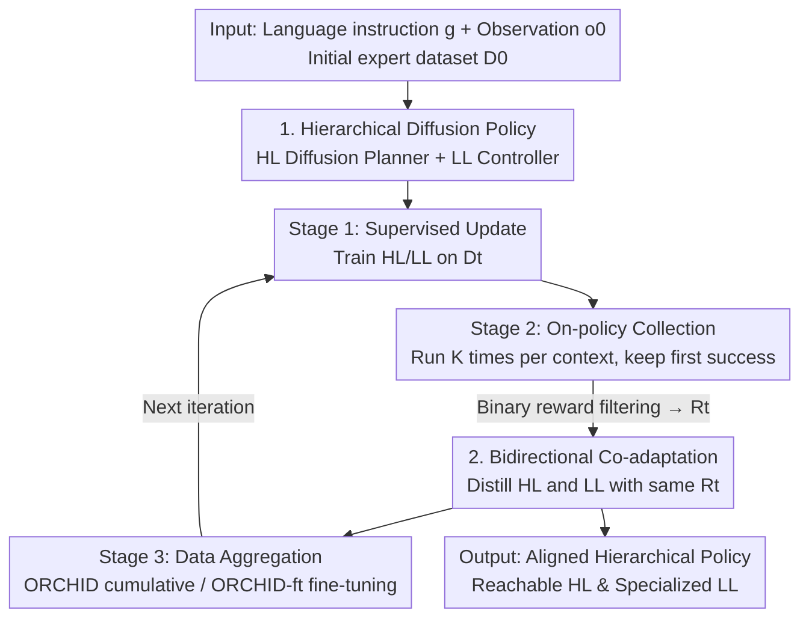

# Online Self-Training for Co-Adaptation in Hierarchical Diffusion Policies

**Conference**: ICML 2026  
**arXiv**: [2603.05291](https://arxiv.org/abs/2603.05291)  
**Code**: https://github.com/clemgris/ORCHID.git  
**Area**: Robotics / Embodied AI / Hierarchical Policies / Diffusion Policies  
**Keywords**: Hierarchical Policy, Diffusion Policy, Self-training, Online Fine-tuning, Language-Conditioned Manipulation

## TL;DR
ORCHID utilizes "self-training" to enable hierarchical diffusion robot policies to improve online. By repeatedly sampling trajectories and filtering for those where both the planner and controller succeed using sparse environment signals, it distills these successes back into both the **high-level planner** and **low-level controller**. This mechanism induces bidirectional co-adaptation between the high-level (HL) and low-level (LL) layers, allowing a lightweight model to outperform VLAs twice its size on the CALVIN benchmark.

## Background & Motivation

**Background**: Language-conditioned robot manipulation requires mapping visual observations and natural language instructions to continuous actions. While monolithic Vision-Language-Action (VLA) models are effective, they require massive pre-training. To achieve comparable performance on long-horizon, diverse tasks with lower costs, **hierarchical policies** have become popular. These systems employ a high-level (HL) planner for long-horizon planning in sparse sub-goal spaces and a low-level (LL) controller for precise execution to reach each sub-goal. Sub-goals can be keypoints, end-effector poses, or visual targets, where diffusion models serve as powerful planners capable of representing high-dimensional sub-goal distributions.

**Limitations of Prior Work**: The primary bottleneck in hierarchical policies is the **interface** between the HL and LL. HL-generated sub-goals must be task-relevant and reachable by the LL, while the LL must learn to succeed under the specific planning distributions of the HL. This is termed the **HL-LL coupling problem**. Existing solutions include: (1) inserting intermediate "glue" modules to filter for LL-preferred plans, which introduces extra proxy models and complexity; (2) using cross-layer shared representations, which struggle to satisfy the conflicting requirements of planning and control simultaneously.

**Key Challenge**: All aforementioned methods rely on **offline training**. The planner never receives direct signals about whether its sub-goals fall within the controller's actual reachability range, a gap that cannot be bridged solely by scaling the dataset. Closing this gap requires **online environment interaction** for direct reachability feedback. However, online training for hierarchical policies is notoriously unstable, and the multi-step stochastic denoising of diffusion planners produces high-variance gradient estimates, causing most language-conditioned methods to remain confined to fixed human-annotated datasets.

**Goal**: To enable hierarchical diffusion policies to stably improve online from **sparse binary environment feedback** and achieve true alignment between the HL and LL, without auxiliary models, shared latent constraints, or gradient-based collaborative losses.

**Key Insight**: The authors take inspiration from the success of self-training in LLMs (e.g., STaR, SPIN, ReST). These methods **do not require derivatives of the generation process**; as long as candidate outputs can be sampled and filtered by quality, performance can be bootstrapped via distillation. Hierarchical diffusion policies under binary rewards naturally satisfy this property: they are sample-able and filterable by success.

**Core Idea**: Replace unstable hierarchical diffusion RL with supervised distillation of filtered on-policy samples. By updating both HL and LL using the same "jointly successful" trajectories, the system induces **bidirectional co-adaptation**.

## Method

### Overall Architecture

ORCHID (Online Self-TRaining for Co-adaptation in Hierarchical Diffusion policies) organizes training as a self-reinforcing cycle. The system is a hierarchical agent: a diffusion-based HL generates an entire visual sub-goal sequence (plan $\hat{\zeta}=\langle\hat{o}_1,\dots,\hat{o}_M\rangle$) at once, and a goal-conditioned LL visuomotor policy outputs action chunks $a_c$ to reach each sub-goal. The objective is to maximize the expected return $J(\pi^{HL}_\phi, \pi^{LL}_\psi)$ with a binary reward $R$ (1 for success).

Distinct from independent offline training, ORCHID aligns both ends through a three-stage iterative cycle: **Stage 1 Supervised Update** → **Stage 2 On-policy Collection (filtered by environment reward)** → **Stage 3 Data Aggregation**. The key is that the set of successful trajectories $\mathcal{R}_t$ filtered each round is fed to both HL and LL: the actual intermediate observations visited by the LL serve as "reachable sub-goal" targets for the HL, while successful actions under the HL's planning serve as targets for the LL.

### Key Designs

**1. Hierarchical Diffusion Policy: One-shot full-horizon planning + Variable-length action chunk controller**

The HL $\pi^{HL}_\phi$ is a diffusion model that **generates the entire visual plan once** to reduce computation and simplify failure detection. Training uses a velocity-parameterized diffusion objective $\mathcal{L}_{\mathrm{HL}}(\phi)=\lVert v_\phi(\zeta^j,j,o_0^\ast,g)-(\alpha_j\epsilon_j-\beta_j\zeta^0)\rVert_2^2$. The LL $\pi^{LL}_\psi$ maps source observations and sub-goals to action chunks $a_c$. During training, **variable-length action chunks** $m\sim\mathcal{U}[n_\text{min}, n-1]$ are sampled, allowing the LL to learn how to reach sub-goals across various timescales, enhancing robustness to HL planning difficulty.

**2. On-policy collection with Environment Feedback Filtering: Only "joint success" as supervision**

This transforms the RL problem into supervised learning. For each context $(s_0,l)$, the current policy $\pi_t$ executes $K$ rollouts, and **only the first successful trajectory is retained**: $\mathcal{R}_t=\bigcup_{(s_0,l)}\{\tau_{k^\ast}\mid k^\ast=\min\{k\in[K]:R(\tau_k,s_0,l)=1\}\}$. By filtering on binary rewards, the process bypasses gradients of the diffusion denoising process, inheriting the stability of self-distillation and avoiding the high-variance gradients typical of hierarchical RL.

**3. Bidirectional Co-adaptation: Aligning planner and controller with the same $\mathcal{R}_t$**

This is the core mechanism for resolving HL-LL mismatch. Instead of human-teleoperated sub-goals, the HL's training target $\zeta^0$ for $t>0$ comes from observations $O(s_{x_i})$ **actually reached by the LL** during successful rollouts. Simultaneously, the LL is fine-tuned on actions that led to success under the HL's specific planning structure. As both parts converge toward the filtered successful samples, the HL shifts toward reachability and the LL specializes in the HL's outputs.

**4. Rich Contexts + Two Data Aggregation Strategies**

To ensure exploration, the authors use standard **environment reset contexts** and **replay contexts** (using endpoints of successful trajectories as new starts). Stage 3 provides two options: **ORCHID** (cumulative $D_{t+1}=D_t\cup\mathcal{R}_t$ with retraining), which prevents catastrophic forgetting at the cost of increasing compute, and **ORCHID-ft** (fine-tuning on $\mathcal{R}_t$), which maintains constant compute but risks forgetting.

### Loss & Training
The HL uses the diffusion loss $\mathcal{L}_\text{HL}$, and the LL uses the action chunk regression loss $\mathcal{L}_\text{LL}$. Both are **supervised learning** throughout. A **reachability error** $\mathcal{E}$ is introduced to measure interface quality: $\mathcal{E}=\mathbb{E}[\frac{1}{M}\sum_i d(O(s_{x_i}),\hat{o}_i)]$, calculated as the $\ell_2$ distance in observation embedding spaces (Pixel/R3M/DINOv2) between planned sub-goals and reached states.

## Key Experimental Results

### Main Results (CALVIN LH-MTLC, Avg. Success Length, ↑)

| Method | 1 Task | 5 Tasks | Avg. Len. | Note |
|------|------------|--------|-----------|------|
| HULC* | 82.7% | 28.3% | 2.64 | No HL-LL coupling |
| TaKSIE* | 90.4% | 40.8% | 3.18 | Glue model |
| MDT* | 93.7% | 55.6% | 3.72 | Shared representation |
| FLOWER* | 97.4% | 74.9% | 4.35 | 950M VLA, web-scale pre-training |
| HD (iter 0) | 83.9% | 29.2% | 2.69 | Base model, offline D0 |
| **ORCHID-ft (iter 3)** | 93.2% | 57.3% | **3.80** | Constant compute fine-tuning |
| **ORCHID (iter 3)** | **97.5%** | **71.3%** | — | Cumulative training |

### Key Findings
- **Lightweight Models can Surpass VLAs**: The initial HD (iter 0) is weak, but after 3 iterations of ORCHID, it rivals FLOWER (a 950M parameter VLA pre-trained on 250k trajectories), demonstrating that online self-training can extract high performance from smaller models.
- **Bidirectional Co-adaptation is the Source of Gain**: The reachability error $\mathcal{E}$ decreases across iterations as the LL specializes, verifying the efficacy of the joint distillation mechanism.
- **Stability from Supervised Signals**: Avoiding gradients of the diffusion process is the fundamental reason for the stability of this method compared to gradient-based hierarchical RL.

## Highlights & Insights
- **Transferring the Self-Training Paradigm to Hierarchical Robotics**: Leveraging the insight that hierarchical diffusion policies under binary rewards are "sample-able and filterable" allows the application of LLM-style distillation.
- **Simultaneous Update with Shared Filtered Data**: Implicitly achieves HL-LL alignment without extra losses or auxiliary models by using actual reached states as planner targets and successful actions as controller targets.
- **Replay Contexts for Expanded Coverage**: Starting new tasks from previous success locations allows for exploration of states unreachable by standard resets without requiring expert oracles.

## Limitations & Future Work
- **Dependence on Initial Success**: The method requires the initial policy to succeed occasionally to bootstrap; tasks with zero success in $K$ trials cannot be learned.
- **Binary Reward Information**: Sparse binary rewards do not distinguish between "near-success" and complete failure, potentially lowering sample efficiency.
- **Compute vs. Forgetting**: ORCHID's cumulative version scales compute with data, while the fine-tuned version risks forgetting. A balance that requires neither has yet to be found.

## Related Work & Insights
- **vs. Glue Models (TaKSIE)**: These use extra models to filter plans; ORCHID achieves alignment implicitly through data with lower complexity.
- **vs. Shared Representations (MDT)**: These enforce coupling via architecture; ORCHID allows separate specialization that naturally converges.
- **vs. Online Diffusion RL**: ORCHID uses stable supervision rather than high-variance gradients over denoising steps, requiring only sparse feedback.

## Rating
- Novelty: ⭐⭐⭐⭐⭐ 
- Experimental Thoroughness: ⭐⭐⭐⭐ 
- Writing Quality: ⭐⭐⭐⭐ 
- Value: ⭐⭐⭐⭐⭐ 

<!-- RELATED:START -->

## Related Papers

- [\[NeurIPS 2025\] Generalizable Domain Adaptation for Sim-and-Real Policy Co-Training](../../NeurIPS2025/robotics/generalizable_domain_adaptation_for_sim-and-real_policy_co-training.md)
- [\[ICML 2026\] Turning Adaptation into Assets: Cross-Domain Bridging for Online Vision-Language Navigation](turning_adaptation_into_assets_cross-domain_bridging_for_online_vision-language_.md)
- [\[ICML 2026\] HDFlow: Hierarchical Diffusion-Flow Planning for Long-horizon Tasks](hdflow_hierarchical_diffusion-flow_planning_for_long-horizon_tasks.md)
- [\[ICML 2026\] Discrete Diffusion VLA: Bringing Discrete Diffusion to Action Decoding in Vision-Language-Action Policies](discrete_diffusion_vla_bringing_discrete_diffusion_to_action_decoding_in_vision-.md)
- [\[ICML 2026\] Lagrangian Perturbation Diffusion Steering: Latent Reinforcement Learning for Generative Policies](lagrangian_perturbation_diffusion_steering_latent_reinforcement_learning_for_gen.md)

<!-- RELATED:END -->
