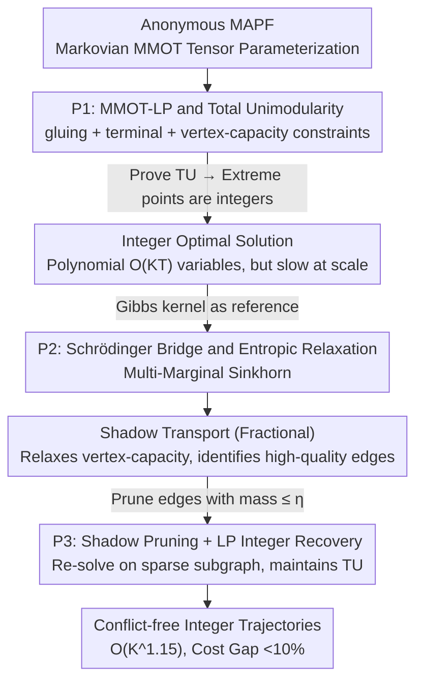

# Optimal and Scalable MAPF via Multi-Marginal Optimal Transport and Schrödinger Bridges

**Conference**: ICML 2026 Spotlight  
**arXiv**: [2605.10917](https://arxiv.org/abs/2605.10917)  
**Code**: Not released  
**Area**: Robotics / Multi-Agent Path Finding / Optimal Transport  
**Keywords**: MAPF, Multi-Marginal Optimal Transport, Schrödinger bridge, Total Unimodularity, Sinkhorn

## TL;DR
This paper characterizes anonymous Multi-Agent Path Finding (MAPF) as a class of **Markovian Multi-Marginal Optimal Transport (MMOT)**, compressing the $K^{T+1}$ dimensional transport tensor into a polynomial-scale LP (P1) and guaranteeing integer optimality through Total Unimodularity (TU). It further generalizes this into a Schrödinger bridge for Sinkhorn-style entropic relaxation (P2) to produce a "shadow transport," followed by pruning the graph based on the shadow and solving a sparse LP (P3) to recover integer solutions, achieving 3.6×–7.1× speedup under $K^{1.15}$ complexity with a cost gap <10%.

## Background & Motivation

**Background**: Classical solutions for MAPF (conflict-free navigation on shared graphs) primarily include Conflict-Based Search (CBS), SAT encoding, and time-expanded flow networks. While optimal algorithms are feasible for medium scales, large-scale anonymous MAPF (where any robot can go to any target) remains a challenge.

**Limitations of Prior Work**: Existing IP/LP formulations (time-expanded network flow) provide optimal solutions, but **none systematically characterize the structural source of LP integrality**. Researchers empirically know integer solutions exist for certain cases but lack a unified framework identifying "which structural conditions are sufficient to guarantee Total Unimodularity (TU)." Additionally, for large-scale instances (thousands of nodes, tens of thousands of variables), only approximations are feasible.

**Key Challenge**: Achieving both "optimality + integrality" usually implies IP (NP-hard), while "scalability" usually implies distributed heuristics (without guarantees). MAPF lacks a unified framework with theoretical guarantees that can handle large scales.

**Goal**: 1) Establish a unified Optimal Transport perspective for MAPF; 2) Prove that the LP is polynomial and integer-optimal under this perspective; 3) Develop a scalable Sinkhorn algorithm via probabilistic relaxation (Schrödinger bridge); 4) Map the benefits of probabilistic relaxation back to integer executable trajectories.

**Key Insight**: Treating all possible joint trajectories of $N$ robots over $T$ steps as a $(T+1)$-order tensor $\mathbf{P}\in\mathbb{R}_{\ge 0}^{K\times\cdots\times K}$, where each entry is the probability mass of a path. MAPF is then finding the minimum cost transport plan matching start/end marginals. This is naturally MMOT, but since robot motion is Markovian, the tensor has a standard factorization $\mathbf{P}_{i_0,\ldots,i_T} \propto \prod_t [\Pi_t]_{i_{t-1}i_t}$, reducing variables from $O(K^{T+1})$ to $O(K^2T)$.

**Core Idea**: MAPF = Markovian MMOT; its LP under anonymous settings is Totally Unimodular under natural assumptions, enabling polynomial-time integer optimal solutions. A scalable solver is derived via Schrödinger bridge (entropic relaxation) and integer recovery via shadow pruning.

## Method

### Overall Architecture
The pipeline follows a three-step approach: "Rigorous Modeling → Probabilistic Relaxation → Pruning back to Integer": (1) **P1**: Formulation of MAPF as an LP of transport plans $\{\Pi_t\}_{t=1}^T$ between adjacent time steps under Markovian parameterization, proving TU for integer optimality; (2) **P2**: Formulating the Schrödinger bridge using a Gibbs kernel $\bar g_{ij,t} \propto \exp(-c_{ij,t}/\varepsilon)$ as the reference distribution, obtaining the entropic regularization of P1, solved by Multi-marginal Sinkhorn for a "shadow" fractional transport $\tilde\Pi_t$; (3) **P3**: Graph pruning using high-mass edges from the shadow, then re-solving the LP on the reduced graph to recover the integer solution $\hat\Pi_t$. This combined pipeline reduces the complexity from $O(K^{1.68})$ of classical IPMs to $O(K^{1.15})$.

### Key Designs

**1. P1: MMOT-LP for MAPF and TU Guarantees**

Classic time-expanded IP formulas provide MAPF optimal solutions, but a clean answer was missing—"Why do these LPs yield integer solutions?" P1 clarifies this. Decision variables are transition matrices $\{\Pi_t\}$ between time steps, minimizing total cost $\sum_t \langle \Pi_t, C_t\rangle$. Three constraint sets are used: **gluing** constraints $\Pi_t^\top\mathbf{1} = \Pi_{t+1}\mathbf{1}$ for conservation of mass (Markov property), **terminal** constraints $\Pi_1\mathbf{1}=\mu, \Pi_T^\top\mathbf{1}=\nu$ for start/end distributions, and **vertex-capacity** constraints $0\le\Pi_t^\top\mathbf{1}\le\mathbf{1}$ to prevent collisions. Under Assumption 3.1 (permitting self-loops, parallel edges for non-shared nodes, move cost > wait cost > 0, target wait cost = 0), Lemma 3.3 proves the constraint matrix is Totally Unimodular (TU), ensuring extreme points are naturally integers with $O(KT)$ variables. Theorem 3.4 translates this back to non-overlapping spatio-temporal trajectories. This first-principles TU approach also unifies different objectives (min-cost/move/makespan) by adjusting $C_t$; e.g., Assumption 3.5 uses exponentially growing costs $c_{ij,t} = B^t \tilde c_{ij}$ to approximate min-makespan.

**2. P2: Schrödinger Bridge and Entropic Relaxation**

Directly solving P1 is slow for large scales. P2 generalizes P1 into a probabilistic problem: find a joint distribution $\mathbf{P}$ in constraint set $\mathcal{C}$ that minimizes $\mathrm{KL}(\mathbf{P}\,\|\,\mathbf{G})$, where $\mathbf{G}$ is a reference Markovian tensor. Lemma 4.1 proves this KL decomposes by time layer as $\sum_t \mathrm{KL}(\frac{1}{N}\Pi_t\|\mathbf{G}_t)$ plus boundary terms. Using a Gibbs kernel $g_{ij,t}=\exp(-c_{ij,t}/\varepsilon)$ as reference, Lemma 4.2 converts the objective into the entropic version of P1:

$$\min \sum_t \langle\Pi_t,C_t\rangle + \varepsilon\sum_{i,j}\pi_{ij,t}(\log\pi_{ij,t}-1)$$

This is solved efficiently via Multi-marginal Sinkhorn block coordinate descent. While P2 relaxes vertex-capacity resulting in fractional solutions, this "shadow" indicates where the optimal transport tends to flow. As $\varepsilon\to 0$, the shadow converges to the min-cost geometric corridor.

**3. P3: Shadow Pruning + LP Integer Recovery**

P3 uses the shadow from P2 as a "feature selector." By adding a KL penalty (linearized) towards the shadow $\tilde\Pi_t$ to the P1 objective, and pruning edges where mass $\le\eta$, the search is restricted to the sparse subgraph $\Pi_t \subseteq [\tilde\Pi_t]_\eta$. This remains TU and integer-optimal but reduces the variable count from $|\mathcal{E}|T$ to $\zeta|\mathcal{E}|T$ (where $\zeta\in[0.2, 0.4]$). Three hyperparameters form an "optimality-scalability" slider: $\lambda=\eta=0$ reverts to P1; larger $\varepsilon$ results in a blurrier shadow and higher cost gap but more speed. This approach bridges P1's optimality and P2's scalability, reducing overall complexity to $O(K^{1.15})$.

### Loss & Training
N/A (Non-learning method). Hyperparameters based on 260 runs at $K=10000$: $\varepsilon=0.2, \lambda=0$ are robust defaults, yielding 4.3% cost gap and 5× speedup. Sinkhorn iterations required in practice are few.

## Key Experimental Results

### Main Results
On $K = W\times H$ grids (side lengths 50–150, 5% robot density, $T=30$, Gurobi solver) across 162 runs:

| Method | Scaling w.r.t. $K$ | Speedup | Cost Gap | Integrality |
|------|--------------------|---------|---------|--------|
| P1 (Original LP) | $O(K^{1.68})$ | 1× | 0% (Optimal) | 100% |
| P2 + P3 pipeline | $O(K^{1.15})$ | **3.6× – 7.1×** | **< 10%** | 100% (Verified) |

### Ablation Study

| Setting | Key Observation |
|------|---------|
| Edge retention from 100% to ~20-40% | Cost gap < 10%, feasibility maintained. |
| $\varepsilon = 0.2, \lambda = 0$ (Default) | 4.3% cost gap, 5× speedup. |
| Increasing $\varepsilon$ | Shadow diffuses, pruning increases, cost gap rises. |
| $\lambda$ variation | Minor impact; linearized KL weight is secondary. |

### Key Findings
- Shadow pruning efficiency increases with problem scale: as $K\uparrow$, fewer edges are needed to maintain feasibility.
- TU property is preserved after pruning, which is central to P3's integer stability.
- The complexity reduction from $O(K^{1.68})$ to $O(K^{1.15})$ makes large-scale optimal MAPF much more practical.

## Highlights & Insights
- Mapping MAPF to MMOT/Schrödinger bridge provides a clean first-principles explanation for LP integrality via TU while introducing modern OT tools for acceleration.
- The "Shadow as Feature Selector" concept is highly transferable: any integer LP with a corresponding entropic relaxation can use Sinkhorn to identify "important variables" before re-solving as an LP.
- Exploiting the $B^t$ exponential cost to approximate min-makespan is cleverer than explicit max-min formulations that break TU, though numerical stability requires care (addressed via binary search).

## Limitations & Future Work
- Focuses on **anonymous** MAPF; non-anonymous settings (fixed robot-target pairs) require generalized MMOT formulations.
- Assumption 3.1 (no diagonal collisions) requires discretization for robots with complex continuous dynamics (e.g., turning radii).
- Schrödinger bridge reference $\mathbf{G}$ is limited to Gibbs kernels here for entropic regularization; other priors (risk-aversion) would require new solver derivations.

## Related Work & Insights
- **vs CBS / SAT-based MAPF**: Provides a first-principles explanation of polytope integrality, bridging the gap between heuristics and guarantees.
- **vs Time-expanded network flow**: Formally proves the integrity of the solution using TU and adds the probabilistic Schrödinger perspective.
- **vs Sinkhorn-based MMOT**: First application of Multi-marginal Sinkhorn to a scenario requiring strict 0/1 integer solutions like MAPF.

## Rating
- Novelty: ⭐⭐⭐⭐⭐ 
- Experimental Thoroughness: ⭐⭐⭐⭐ 
- Writing Quality: ⭐⭐⭐⭐⭐ 
- Value: ⭐⭐⭐⭐⭐ 

<!-- RELATED:START -->

## Related Papers

- [\[ICCV 2025\] Certifiably Optimal Anisotropic Rotation Averaging](../../ICCV2025/robotics/certifiably_optimal_anisotropic_rotation_averaging.md)
- [\[ICML 2025\] Learning to Stop: Deep Learning for Mean Field Optimal Stopping](../../ICML2025/robotics/learning_to_stop_deep_learning_for_mean_field_optimal_stopping.md)
- [\[ICLR 2026\] Time Optimal Execution of Action Chunk Policies Beyond Demonstration Speed](../../ICLR2026/robotics/time_optimal_execution_of_action_chunk_policies_beyond_demonstration_speed.md)
- [\[ICML 2026\] WestWorld: Scalable Trajectory World Models with Knowledge Encoding](westworld_a_knowledge-encoded_scalable_trajectory_world_model_for_diverse_roboti.md)
- [\[AAAI 2026\] Scalable Multi-Objective and Meta Reinforcement Learning via Gradient Estimation](../../AAAI2026/robotics/scalable_multi-objective_and_meta_reinforcement_learning_via_gradient_estimation.md)

<!-- RELATED:END -->
## Related Papers

- [\[ICCV 2025\] Certifiably Optimal Anisotropic Rotation Averaging](../../ICCV2025/robotics/certifiably_optimal_anisotropic_rotation_averaging.md)
- [\[ICML 2025\] Learning to Stop: Deep Learning for Mean Field Optimal Stopping](../../ICML2025/robotics/learning_to_stop_deep_learning_for_mean_field_optimal_stopping.md)
- [\[AAAI 2026\] Scalable Multi-Objective and Meta Reinforcement Learning via Gradient Estimation](../../AAAI2026/robotics/scalable_multi-objective_and_meta_reinforcement_learning_via_gradient_estimation.md)
- [\[CVPR 2026\] Scalable Trajectory Generation for Whole-Body Mobile Manipulation](../../CVPR2026/robotics/scalable_trajectory_generation_for_whole-body_mobile_manipulation.md)
- [\[ICLR 2026\] Scalable Exploration for High-Dimensional Continuous Control via Value-Guided Flow](../../ICLR2026/robotics/scalable_exploration_for_high-dimensional_continuous_control_via_value-guided_fl.md)

<!-- RELATED:END -->
