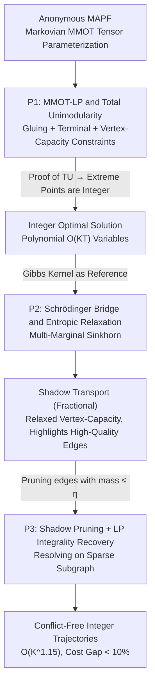

# Optimal and Scalable MAPF via Multi-Marginal Optimal Transport and Schrödinger Bridges

**Conference**: ICML 2026 Spotlight  
**arXiv**: [2605.10917](https://arxiv.org/abs/2605.10917)  
**Code**: Not publicly available  
**Area**: Robotics / Multi-Agent Pathfinding / Optimal Transport  
**Keywords**: MAPF, Multi-Marginal Optimal Transport, Schrödinger bridge, Total Unimodularity, Sinkhorn

## TL;DR
This paper proves that anonymous Multi-Agent Pathfinding (MAPF) belongs to a class of **Markovian Multi-Marginal Optimal Transport (MMOT)**. This formulation compresses the original $K^{T+1}$-dimensional transport tensor into a polynomial-scale LP (P1), ensuring integer optimality via total unimodularity. This is further generalized to a Schrödinger bridge to obtain a Sinkhorn-style entropic relaxation (P2) yielding "shadow transports." Finally, pruning is performed on the shadows followed by solving a simplified LP (P3) to recover integer solutions, achieving 3.6×–7.1× speedup with <10% cost gap at $K^{1.15}$ complexity.

## Background & Motivation

**Background**: Classical solutions for MAPF (conflict-free navigation of multiple robots on a shared graph) primarily include Conflict-Based Search (CBS), SAT encoding, and time-expanded flow networks. While optimal algorithms are feasible for medium-scale problems, large-scale anonymous MAPF (where any robot can go to any goal) remains a challenge.

**Limitations of Prior Work**: Although existing IP/LP formulations (time-expanded network flow) can provide optimal solutions, **the theoretical source of their LP integrality hasn't been systematically characterized**. It is empirically known that integer solutions exist in certain cases, but a unified framework defining the structural conditions sufficient for Total Unimodularity (TU) is lacking. Furthermore, these methods struggle with large-scale instances involving thousands of nodes and tens of thousands of variables.

**Key Challenge**: Achieving both "optimality + integrality" usually implies IP (NP-hard), while "scalability" typically implies distributed heuristics (without guarantees). MAPF lacks a unified framework that bridges these two ends with theoretical guarantees and large-scale efficiency.

**Goal**: 1) Establish a unified optimal transport perspective for MAPF; 2) Prove that the LP can be polynomial and integer under this perspective; 3) Derive a scalable Sinkhorn algorithm via probabilistic relaxation (Schrödinger bridge); 4) Map the benefits of probabilistic relaxation back to integer executable trajectories.

**Key Insight**: The joint trajectories of $N$ robots over $T$ steps can be viewed as a $(T+1)$-order tensor $\mathbf{P}\in\mathbb{R}_{\ge 0}^{K\times\cdots\times K}$, where each entry is the probability mass of a path. MAPF is then the problem of finding a minimum-cost transport plan satisfying start/end marginals. This is naturally an MMOT. Since robot motion is Markovian, the tensor has a standard factorization $\mathbf{P}_{i_0,\ldots,i_T} \propto \prod_t [\Pi_t]_{i_{t-1}i_t}$, reducing variables from $O(K^{T+1})$ to $O(K^2T)$.

**Core Idea**: MAPF = Markovian MMOT; its LP under the anonymous setting is totally unimodular under natural assumptions, allowing polynomial-time integer optimal solutions; a scalable Sinkhorn solver is obtained via Schrödinger bridge relaxation, and integrality is recovered using a pruned LP.

## Method

### Overall Architecture
The framework follows a three-step pipeline: (1) **P1**: Formulate MAPF as an LP of transport plans $\{\Pi_t\}_{t=1}^T$ between adjacent time steps under Markovian tensor parameterization, proving TU for integer optimality; (2) **P2**: Formulate the Schrödinger bridge with a Gibbs kernel $\bar g_{ij,t} \propto \exp(-c_{ij,t}/\varepsilon)$ as the reference distribution to obtain the entropic regularization of P1, solved via multi-marginal Sinkhorn for "shadow" fractional transports $\tilde\Pi_t$; (3) **P3**: Perform graph pruning on high-quality edges from the shadow (retaining edges with high mass) and resolve the LP on the reduced graph to recover integer solutions $\hat\Pi_t$. This pipeline bridges optimality and scalability, reducing complexity from $O(K^{1.68})$ (classical IPM) to $O(K^{1.15})$.

### Key Designs

**1. P1: MMOT-LP and Total Unimodularity Guarantees**

While time-expanded IP formulations provide optimal MAPF solutions, they lack a clean explanation for why their LP relaxations are often integer. P1 clarifies this. The decision variables are transition matrices $\{\Pi_t\}$ between adjacent time steps. The objective is the total transport cost $\sum_t \langle \Pi_t, C_t\rangle$. The constraints cover: **gluing** ($\Pi_t^\top\mathbf{1} = \Pi_{t+1}\mathbf{1}$) for mass conservation, **terminal** ($\Pi_1\mathbf{1}=\mu, \Pi_T^\top\mathbf{1}=\nu$), and **vertex-capacity** ($0\le\Pi_t^\top\mathbf{1}\le\mathbf{1}$) to prevent collisions. Lemma 3.3 proves that under natural structures (allowing self-loops, non-conflicting parallel edges, move cost > wait cost), the constraint matrix is TU. Thus, extreme points are naturally integer with $O(KT)$ variables. Theorem 3.4 maps these back to conflict-free trajectories. This first-principle unified approach handles multiple objectives (min-cost, min-move, min-makespan) by modifying $C_t$.

**2. P2: Schrödinger Bridge and Entropic Relaxation**

Solving P1 directly for large-scale instances (thousands of nodes) remains slow. P2 generalizes P1 into a probabilistic problem: find a joint distribution $\mathbf{P}$ in constraint set $\mathcal{C}$ that minimizes $\mathrm{KL}(\mathbf{P}\,\|\,\mathbf{G})$, where $\mathbf{G}$ is a reference Markovian tensor. Using the Gibbs kernel $g_{ij,t}=\exp(-c_{ij,t}/\varepsilon)$, Lemma 4.2 transforms the objective into the entropic regularized version of P1:

$$\min \sum_t \langle\Pi_t,C_t\rangle + \varepsilon\sum_{i,j}\pi_{ij,t}(\log\pi_{ij,t}-1)$$

This is P2, solvable efficiently via parallel multi-marginal Sinkhorn. The resulting "shadow" may be fractional, but as $\varepsilon\to 0$, it converges to the min-cost geometric corridor.

**3. P3: Shadow Pruning and LP Integrality Recovery**

P3 uses the P2 shadow as a "feature selector." A linearized KL penalty towards the shadow $\tilde\Pi_t$ is added to the objective: $\sum_t \sum_{i,j}\pi_{ij,t}(c_{ij,t} - \lambda\log(\tilde\pi_{ij,t}+\delta))$. Simultaneously, edges with mass $\le\eta$ are pruned. This is equivalent to resolving P1 on a sparse subgraph—remaining TU and integer, but with variable counts reduced from $|\mathcal{E}|T$ to $\zeta|\mathcal{E}|T$ (where $\zeta\in[0.2, 0.4]$). This reduces total complexity to $O(K^{1.15})$.

### Loss & Training
N/A (Non-learning method). Hyperparameters based on 260 experiments with $K=10000$: $\varepsilon=0.2, \lambda=0$ are robust defaults, yielding a 4.3% cost gap and 5× speedup. Sinkhorn iterations are typically low (dozens).

## Key Experimental Results

### Main Results
Evaluated on $K = W\times H$ grids (50–150 side length, 5% density, $T=30$, Gurobi):

| Method | Scaling with $K$ | Speedup | Cost Gap | Integrality |
|------|--------------------|---------|---------|--------|
| P1 (Original LP) | $O(K^{1.68})$ | 1× | 0% (Opt) | 100% |
| P2 + P3 pipeline | $O(K^{1.15})$ | **3.6× – 7.1×** | **< 10%** | 100% |

### Ablation Study

| Setting | Observation | Description |
|------|---------|------|
| Edge retention 100% → 20-40% | Cost gap < 10%, Feasibility maintained | Efficient shadow pruning |
| $\varepsilon = 0.2, \lambda = 0$ | 4.3% gap, 5× speedup | Robust balance |
| Increasing $\varepsilon$ | Dispersed shadow, more pruning, higher gap | $\varepsilon$ is the dominant factor |

### Key Findings
- Shadow pruning becomes more beneficial as problem scale increases: fewer edges are needed to maintain feasibility at higher $K$.
- TU property is preserved after pruning, ensuring integer stability in P3.
- The tradeoff between optimality (P1) and scalability (P2→P3) is continuously adjustable via $\varepsilon, \lambda, \eta$.

## Highlights & Insights
- Framing MAPF as MMOT/Schrödinger bridge provides a clean first-principle explanation for LP integrality (TU) and introduces modern Sinkhorn acceleration.
- The use of "shadows as feature selectors" is a powerful motif: solve a fast entropic relaxation first to identify important variables, then resolve the exact discrete problem.
- The continuous "optimality vs. scalability" slider via three hyperparameters allows engineering flexibility.

## Limitations & Future Work
- Primarily focused on **anonymous** MAPF; non-anonymous variants require more general MMOT formulations.
- Assumes graph conditions (Assumption 3.1) like no diagonal collisions; continuous motion needs discretization.
- The Schrödinger reference $\mathbf{G}$ is limited to the Gibbs kernel for entropic form; other structural priors require new solver derivations.

## Related Work & Insights
- **vs CBS / SAT-based MAPF**: This work provides an integrality explanation via polytope structure, complementing heuristic-based guarantees.
- **vs Time-expanded networks**: Formally establishes TU where previous works relied on empirical observation.
- **vs Sinkhorn-based MMOT**: First instance of applying multi-marginal Sinkhorn to binary MAPF requirements with a pruning-based recovery mechanism.

## Rating
- Novelty: ⭐⭐⭐⭐⭐ 
- Experimental Thoroughness: ⭐⭐⭐⭐ 
- Writing Quality: ⭐⭐⭐⭐⭐ 
- Value: ⭐⭐⭐⭐⭐ 

<!-- RELATED:START -->

## Related Papers

- [\[ICCV 2025\] Certifiably Optimal Anisotropic Rotation Averaging](../../ICCV2025/robotics/certifiably_optimal_anisotropic_rotation_averaging.md)
- [\[ICML 2025\] Learning to Stop: Deep Learning for Mean Field Optimal Stopping](../../ICML2025/robotics/learning_to_stop_deep_learning_for_mean_field_optimal_stopping.md)
- [\[AAAI 2026\] Scalable Multi-Objective and Meta Reinforcement Learning via Gradient Estimation](../../AAAI2026/robotics/scalable_multi-objective_and_meta_reinforcement_learning_via_gradient_estimation.md)
- [\[CVPR 2026\] Multi-SpatialMLLM: Multi-Frame Spatial Understanding with Multi-Modal Large Language Models](../../CVPR2026/robotics/multi-spatialmllm_multi-frame_spatial_understanding_with_multi-modal_large_langu.md)
- [\[CVPR 2026\] Scalable Trajectory Generation for Whole-Body Mobile Manipulation](../../CVPR2026/robotics/scalable_trajectory_generation_for_whole-body_mobile_manipulation.md)

<!-- RELATED:END -->
