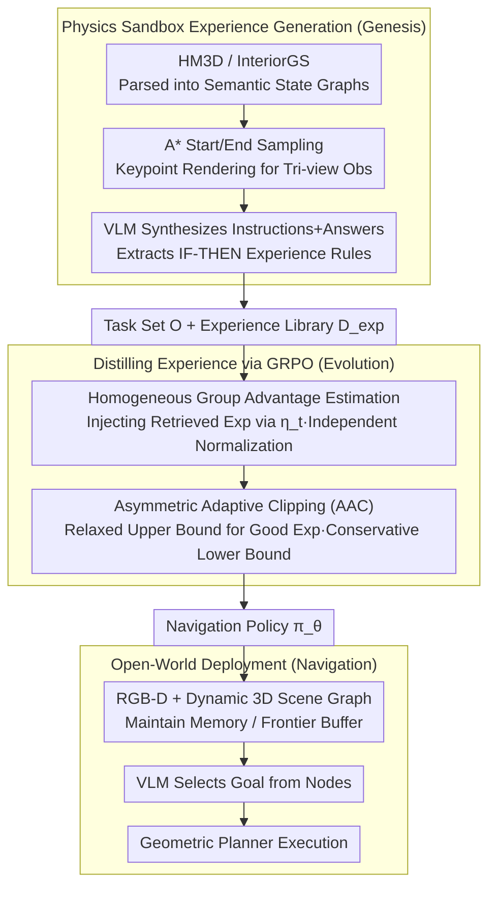

# Plan in Sandbox, Navigate in Open Worlds: Learning Physics-Grounded Abstracted Experience for Embodied Navigation

**Conference**: ICML 2026  
**arXiv**: [2605.10118](https://arxiv.org/abs/2605.10118)  
**Code**: Not released  
**Area**: Embodied Navigation / VLM Reinforcement Learning / Sim2Real  
**Keywords**: Physics Sandbox, Generative Experience, GRPO, Asymmetric Clipping, A-EQA, GOAT-Bench

## TL;DR
This paper proposes SAGE: automatically synthesizing large-scale navigation tasks and IF-THEN experience rules within a physics-constrained semantic sandbox. These experiences are distilled into a VLM policy using GRPO with mixed-prompt sampling and asymmetric adaptive clipping, improving the LLM-Match success rate on A-EQA from 43.5% to 53.2% (2B) / 60.2% (4B), with successful zero-shot transfer to real indoor robots.

## Background & Motivation
**Background**: VLMs (e.g., GPT-4o, Qwen3-VL) exhibit strong open-world perception and reasoning, catalyzing VLM-driven embodied navigation in two paradigms: object-oriented (ObjectNav, IIN) and QA-oriented (A-EQA, OpenEQA). RL methods (SenseAct) attempt end-to-end policy learning, while modular methods (3D-Mem, Explore-EQA) utilize VLMs as high-level planners.

**Limitations of Prior Work**: (1) "Vision-Robot control" data aligned with the real world is scarce; the modal gap between VLMs and continuous action spaces causes slow RL convergence and severe Sim2Real degradation. (2) Policies often rely on closed-source models like GPT-4o; open-source medium-scale VLMs show a significant performance gap in practice.

**Key Challenge**: VLMs possess rich priors but cannot continuously learn low-level control online, while RL has learning mechanisms but suffers from low sample efficiency; a bridge to combine their strengths is missing. Simulators that are either visually realistic but physically inconsistent, or vice versa, fail to address the core problem.

**Goal**: (1) Provide large-scale, diverse, and physically executable navigation experience for VLM policies without relying on real-world collection. (2) Design an RL algorithm to stably distill these experiences. (3) Enable policies learned in a sandbox to transfer zero-shot to the open world.

**Key Insight**: Humans rehearse in a "mental sandbox" before execution—abstract physical constraints and semantic scene graphs are sufficient, without the need for photorealistic rendering. Thus, a VLM can generate tasks, record successful paths, and extract IF-THEN rules in a "physically-constrained + semantically-abstracted" sandbox (HM3D/InteriorGS parsed into discrete semantic nodes + collision-constrained graphs).

**Core Idea**: Treat the sandbox as an "experience factory" to generate a structured task set $\mathcal O$ and an experience rule library $\mathcal K_{exp}$. Then, use GRPO combined with "asymmetric adaptive clipping" to "internalize" external retrieved experiences into a parameterized VLM policy.

## Method

### Overall Architecture
SAGE consists of three stages: (1) **Genesis**: Samples start/end points in a sandbox environment $\mathcal E_S=(\mathcal S,\mathcal A,\mathcal P)$, performs A* planning, and renders three-view observations $\mathcal V_t=\{v_{t,0°},v_{t,+120°},v_{t,-120°}\}$ at keypoints. A VLM synthesizes natural language instructions $I$ and answers $a^*$ from the scene graph and goal descriptions to form tasks $o=(I,\tau^*,a^*,\mathcal K)$. Simultaneously, the VLM encodes the rationale for view selection into "IF task X AND observation Y THEN priority path Z" rules stored in a vector library $\mathcal D_{exp}$. (2) **Evolution**: Optimizes the policy $\pi_\theta$ on $\mathcal O$ using GRPO. Inputs are injected with retrieved experiences $\mathcal K_{ret}$ based on Bernoulli probability $\eta_t$. Advantages are calculated using homogeneous groups, and PPO clip bounds are determined by masks. (3) **Navigation**: Deployment follows a "retrieved experience + VLM decision + geometric planner" pipeline, maintaining a Memory Buffer $\mathcal M_t$ (seen objects) and a Frontier Buffer $\mathcal F_t$ via RGB-D and dynamic 3D scene graphs. The VLM selects target nodes from $\mathcal F_t\cup\mathcal M_t$ for execution by a Habitat-Sim/ROS planner.

### Key Designs

**1. Physics Sandbox Experience Generation (Genesis): Sandbox as a VLM "Experience Factory"**

Photorealistic simulators are discarded due to high rendering costs and Sim2Real degradation; realistic rendering is not essential for VLM navigation decisions. SAGE parses HM3D/InteriorGS into "semantic state graphs" where rooms are split into discrete navigable nodes, and state transitions strictly follow traversability constraints. Task synthesis follows a pipeline of A* + keypoint rendering + VLM captioning, using the forward view $v_{t,0°}$ as the optimal answer $a^*$. Meanwhile, the VLM articulates "why this view was chosen" into IF-THEN rules, stored in $\mathcal D_{exp}$. Physical constraints + semantic abstraction are not only cost-effective but also align naturally with the "3D scene graph + buffer" representation during real deployment, reducing distribution shift.

**2. Homogeneous Group Advantage Estimation: Preventing Bias from Experience-Augmented Samples**

In GRPO training, mixing "augmented samples with retrieved experience prompts" and "standard samples without prompts" to calculate advantages creates issues: augmented samples naturally have higher rewards. Mixing them during $\mu,\sigma$ calculation suppresses the advantages of standard samples, misclassifying good behavior as bad. SAGE isolates these distributions using homogeneous groups—sampling $G$ rollouts per input $x_i$, but forcing the mask $m_i$ to be consistent within a group: $x_t=[I_t,v_t,\mathcal K_{ret}]$ ($m=1$) or $[I_t,v_t]$ ($m=0$). Advantages $A_{i,j}=(r_\phi(x_i,a_{i,j})-\mu)/(\sigma+\epsilon)$ are normalized within the group. The injection probability is dynamic:

$$\eta_t=\max\Big(\eta_{\min},\ \eta_{init}\cdot\big(1-\min(R_{val}^{(t)},R_{target})/R_{target}\big)\Big)$$

As validation rewards increase, $\eta_t$ decreases, transitioning the policy from "imitating retrieval" to "autonomous exploration" in a curriculum.

**3. Asymmetric Adaptive Clipping (AAC): Relaxing Upper Bounds for Experience Absorption**

Standard PPO/GRPO symmetric clipping implies that "even good behavior should not update too much," which contradicts the need to rapidly absorb high-quality experience. AAC utilizes a mask-adaptive upper bound and a uniformly conservative lower bound. Defining the importance ratio $\rho_{i,t}(\theta)=\pi_\theta(a_{i,t}\mid x_{i,t})/\pi_{\theta_{old}}(a_{i,t}\mid x_{i,t})$, the upper bound is $\epsilon_{up}(m_i)=\epsilon_{exp}$ (augmented) or $\epsilon_{std}$ (standard), where $\epsilon_{exp}\gg\epsilon_{std}$, while the lower bound remains $1-\epsilon_{std}$ for all:

$$L_{i,t}^{CLIP}=\min\big(\rho_{i,t}A_{i,t},\ \text{clip}(\rho_{i,t},1-\epsilon_{std},1+\epsilon_{up}(m_i))A_{i,t}\big)$$

The objective includes a KL constraint $J_\phi(\theta)=\mathbb E[L^{CLIP}-\beta\mathbb D_{KL}(\pi_\theta\|\pi_{ref})]$. Enlarging the upper bound allows the policy to boldly absorb high-reward augmented samples while keeping the lower bound conservative to prevent policy collapse from mislabeled golden samples.

### Loss & Training
Reward $r_\phi(s_t,a_t)=w_f\mathbb I_f+w_{acc}(\mathbb I_m(1+\text{sim}(a_t,a_t^*))-\mathcal P_{err})$, including format compliance, correct image selection, text similarity, and error penalties. The optimizer is a GRPO variant with KL regularization and AAC. Training data: 14,526 synthesized trajectories (7,988 HM3D + 6,538 InteriorGS), with $\eta_{init}=0.8, \eta_{min}=0, R_{target}=1.5, \epsilon_{exp}=1.0$.

## Key Experimental Results

### Main Results
Evaluated on two benchmarks: A-EQA (184 QA-oriented questions, SR†/SPL† scored by Qwen3-235B) and GOAT-Bench (278 object-oriented subtasks).

| Method | A-EQA SR† | A-EQA SPL† | GOAT SR | GOAT SPL |
|------|-----------|------------|---------|----------|
| SenseAct-NN Skill Chain (RL) | 24.7 | 13.3 | 29.5 | 11.3 |
| Explore-EQA (GPT-4o) | 46.9 | 23.4 | 55.0 | 37.9 |
| 3D-Mem (GPT-4o) | 52.6 | 42.0 | 69.1 | 48.9 |
| 3D-Mem (Qwen3-2B) | 44.3 | 19.4 | 46.4 | 20.3 |
| **SAGE (Qwen3-2B)** | **53.2** | **37.1** | **56.7** | **38.9** |
| **SAGE (Qwen3-4B)** | **60.2** | **47.2** | **64.8** | **44.9** |

SAGE-2B outperforms 3D-Mem (GPT-4o version) in A-EQA SR† while nearly doubling SPL compared to the Qwen3-2B baseline. SAGE-4B sets a new SOTA on A-EQA at 60.2%.

### Ablation Study
**Cumulative Ablation (Qwen3-VL-2B → SAGE Full):**

| Configuration | A-EQA SR† | A-EQA SPL† | GOAT SR |
|------|-----------|------------|---------|
| Zero-shot VLM | 43.51 | 27.53 | 49.17 |
| +$C_{ret}$ (Retrieval only) | 46.47 | 30.72 | 50.58 |
| +Task (Synthetic task training) | 50.71 | 33.68 | 53.72 |
| +Task+Exp (Exp. rules) | 51.42 | 34.67 | 54.05 |
| +Task+Exp+AAC | 51.88 | 36.29 | 55.35 |
| **SAGE Full (plus $C_{ret}$)** | **53.21** | **37.07** | **56.69** |

### Key Findings
- **Dynamic $\eta_t$** significantly outperforms fixed values, confirming that "imitation before exploration" is a necessary curriculum.
- **$\epsilon_{exp}$ sweet spot** is at 1.0; updates are insufficient at 0.4 and collapse after 100 steps at 1.2, showing the upper bound must be calibrated.
- **Sandbox data scaling**: Performance increases monotonically from 12.5% to 100% data, though marginal returns diminish. 12.5% already achieves 44.75% SR†.
- **Input frame count $v_t$**: Optimization from 2 to 4 frames shows significant gains, while 5 frames slightly degrade performance due to token dilution.
- **Sim2Real**: Successful deployment on real indoor robots demonstrates that sandbox abstraction through discrete node selection effectively bridges the gap.

## Highlights & Insights
- **Mental Rehearsal Analogy**: Moving away from photorealistic simulators to abstract physics/semantic graphs as training grounds is cost-effective and aligns with deployment representations.
- **AAC as a Portable RLHF Modification**: The "adaptive upper bound, conservative lower bound" approach is broadly applicable where prompt-based expert traces are introduced to RL.
- **Discrete Action Space via Buffers**: Simplifying continuous control to "selecting from enumerable nodes" allows VLM token-level reasoning to serve as direct decision-making, avoiding the opacity of continuous actions.
- **Homogeneous Grouping**: A critical detail for applying GRPO to mixed-distribution data, providing a clear template for future work.

## Limitations & Future Work
- **Static Focus**: Sandbox environments rely on static datasets; generalization to dynamic environments (moving people/objects) is not covered.
- **Real-world Metrics**: Robot experiments are in the appendix; larger-scale deployment data and system-level metrics (e.g., battery, long-term reliability) are missing.
- **Reward Risks**: Reliance on text similarity for rewards introduces potential "format hack" risks for abstract spatial tasks.
- **Rule Representation**: Storing IF-THEN rules as strings may face scalability issues regarding retrieval precision and noise; more structured knowledge graphs might be required.

## Related Work & Insights
- **vs 3D-Mem (yang2025b)**: Both use scene memory, but 3D-Mem relies on GPT-4o frozen; SAGE trains medium-scale VLMs to surpass it.
- **vs SenseAct-NN (khanna2024)**: SAGE leverages VLM priors, which SenseAct lacks, leading to significantly better performance.
- **vs Explore-EQA (ren2024)**: Lacks an explicit experience library; SAGE deposits experience into a retrievable structure via the sandbox.
- **vs Vanilla GRPO**: AAC and homogeneous grouping refine GRPO for scenarios combining priors with RL.

## Rating
- Novelty: ⭐⭐⭐⭐ (Physics/semantic abstraction + experience rules is a solid combination)
- Experimental Thoroughness: ⭐⭐⭐⭐ (Comprehensive evaluation across A-EQA, GOAT, and real-world robots)
- Writing Quality: ⭐⭐⭐⭐ (Clear narrative, though reward design details are slightly brief)
- Value: ⭐⭐⭐⭐ (Provides a viable alternative to GPT-4o for embodied AI; AAC is a transferable RLHF insight)

## Related Papers

- [\[CVPR 2026\] Dejavu: Towards Experience Feedback Learning for Embodied Intelligence](../../CVPR2026/robotics/dejavu_towards_experience_feedback_learning_for_embodied_intelligence.md)
- [\[ICML 2026\] R2R2: Robust Representation for Intensive Experience Reuse via Redundancy Reduction in Self-Predictive Learning](r2r2_robust_representation_for_intensive_experience_reuse_via_redundancy_reducti.md)
- [\[CVPR 2026\] FloVerse: Floor Plan-Guided Multi-Modal Navigation](../../CVPR2026/robotics/floverse_floor_plan-guided_multi-modal_navigation.md)
- [\[CVPR 2026\] OctoNav: Towards Generalist Embodied Navigation](../../CVPR2026/robotics/octonav_towards_generalist_embodied_navigation.md)
- [\[ICLR 2026\] ExoPredicator: Learning Abstract Models of Dynamic Worlds for Robot Planning](../../ICLR2026/robotics/exopredicator_learning_abstract_models_of_dynamic_worlds_for_robot_planning.md)

<!-- RELATED:END -->

<!-- RELATED:START -->

## Related Papers

- [\[CVPR 2026\] Dejavu: Towards Experience Feedback Learning for Embodied Intelligence](../../CVPR2026/robotics/dejavu_towards_experience_feedback_learning_for_embodied_intelligence.md)
- [\[ICLR 2026\] Lifelong Embodied Navigation Learning](../../ICLR2026/robotics/lifelong_embodied_navigation_learning.md)
- [\[CVPR 2026\] FloVerse: Floor Plan-Guided Multi-Modal Navigation](../../CVPR2026/robotics/floverse_floor_plan-guided_multi-modal_navigation.md)
- [\[ICML 2026\] R2R2: Robust Representation for Intensive Experience Reuse via Redundancy Reduction in Self-Predictive Learning](r2r2_robust_representation_for_intensive_experience_reuse_via_redundancy_reducti.md)
- [\[ICML 2026\] Scaling by Diversified Experience for Vision-Language-Action Models](scaling_by_diversified_experience_for_vision-language-action_models.md)

<!-- RELATED:END -->
