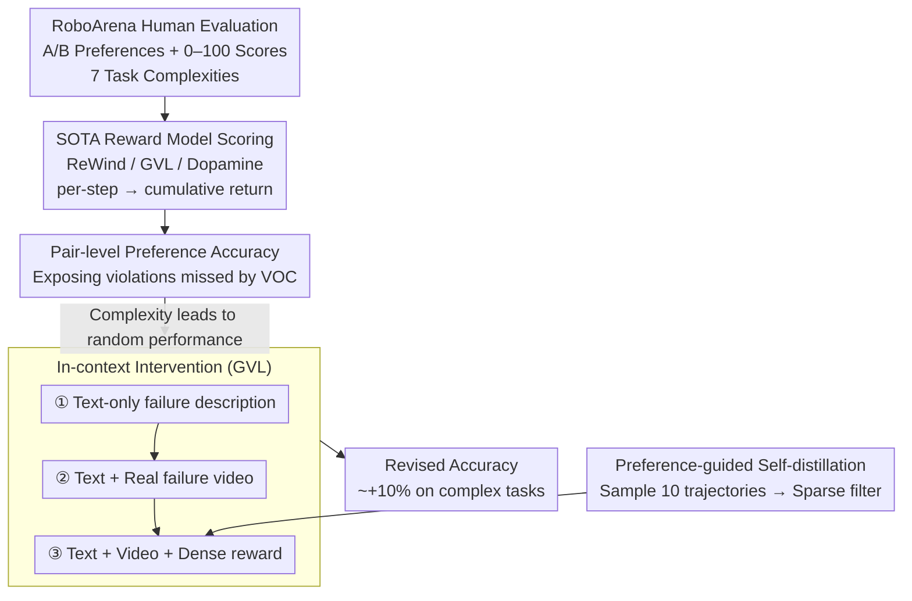

# Position: Good Embodied Reward Models Need Bad Behavior Data

**Conference**: ICML 2026 Spotlight  
**arXiv**: [2606.01036](https://arxiv.org/abs/2606.01036)  
**Code**: None  
**Area**: Embodied AI / Robotics / Reward Modeling  
**Keywords**: Embodied Reward Models, Failure Data, RoboArena, VLM Reward, Preference Alignment

## TL;DR
This position paper utilizes human ratings from RoboArena to empirically demonstrate that three types of SOTA embodied reward models (ReWind, GVL, and Dopamine) systematically "overestimate" actual failed robot behaviors. The root cause is identified as the training data consisting almost exclusively of expert success demonstrations. By inserting real "bad" behavior videos and dense negative reward labels into GVL's in-context prompts, the authors prove that even a minimal amount of negative samples significantly corrects preference ranking, thus calling for the community to actively collect and release "bad" robot data.

## Background & Motivation

**Background**: Vision-Language-Action (VLA) embodied foundation models have developed rapidly. Whether for RL post-training, test-time best-of-K, or large-scale automatic evaluation, they increasingly rely on a "general embodied reward model" $R_\theta(o_{1:T}; c)$ — scoring a sequence of visual observations and a language task instruction to replace expensive human evaluation. Current mainstream approaches fall into three categories: preference-based synthetic negative sample training (ReWind), zero-shot VLM scoring (GVL / GPT-5), and VLM scorers fine-tuned on expert data (Dopamine).

**Limitations of Prior Work**: These three types of reward models consistently fail on behaviors that "look successful but actually violate rules." The authors evaluated them on RoboArena real robot rollout and human rating data. Findings show that while accuracy in simple Pick/Place tasks (0.72–0.77) is usable, performance in fine-grained tasks like Pour Liquid and Tool Use drops to just above random guessing (0.52–0.62). Qualitatively, reward models produce monotonically increasing curves for clear failures, such as "a spoon hitting a bowl" or "nuts spilling outside a plate," nearly ignoring key moments used by humans for qualitative judgment.

**Key Challenge**: The "negative signals" in these methods are substitutes rather than real data—ReWind relies on shuffling expert trajectories for pseudo-negatives, GVL relies on general priors from VLM pre-training, and Dopamine relies on heuristic progress labels. While LLM success stems from the internet's "bad text" (errors, toxicity), embodied "bad data" is systematically filtered due to hardware safety costs and the imitation learning paradigm's natural focus on expert data (e.g., OpenX, DROID). Consequently, reward models are calibrated to be overly optimistic.

**Goal**: To diagnose "why embodied reward models fail" at the data level and empirically demonstrate that small amounts of real failure videos can significantly correct existing SOTA models.

**Key Insight**: The authors select GVL for intervention because it supports in-context learning. This allows injecting negative samples at different granularities—text, text + video, or text + video + dense rewards—without retraining, cleanly isolating the contributions of negative samples versus their representation forms.

**Core Idea**: Effective embodied reward models must encounter real "bad" behaviors. The community should release failure datasets, build failure synthesis engines, promote decentralized physical evaluation, and design benchmarks specifically for reward models.

## Method

As a position paper, no new model architecture is proposed. The "method" consists of: (a) an evaluation protocol quantifying reward model alignment with human preferences; and (b) controlled in-context negative sample injection experiments.

### Overall Architecture

The workflow follows a three-stage pipeline: First, human A/B preferences and scores (0–100) from RoboArena are treated as ground-truth across 7 task complexities. Second, three SOTA reward models perform per-step scoring for each rollout to calculate trajectory returns $\hat{y}^i = \sum_t \hat{r}_t$, determining pair-level agreement with human rankings. Third, controlled interventions on GVL increase negative sample information in the in-context prompt to prove that reward quality scales with representation richness.

### Key Designs

**1. Pair-level Preference Ranking Accuracy: A Ruler for Violations**
Standard Value-Order Correlation fails to detect quality violations (e.g., finishing a task but knocking over a bowl). The authors adopt pair-level preference ranking: for task context $c$, they pair rollouts where human scores differ $P_c = \{(i,j): i<j, y^i \ne y^j\}$. They calculate the disagreement rate:
$$D_c = \frac{1}{|P_c|}\sum_{(i,j)\in P_c}\mathbf{1}[s^{ij}_H \ne s^{ij}_M],\quad s^{ij}_H = \text{sign}(y^i - y^j)$$
Global accuracy is defined as $A = 1 - \frac{\sum_c |P_c| D_c}{\sum_c |P_c|}$. This forces the reward model to align with the ultimate human goal, penalizing "progress with violations."

**2. Gradual In-Context Intervention: Isolating Signal Quality**
To isolate the contribution of data, negative sample information is added to GVL in three levels: 
- Level 1: Distilled text descriptions (e.g., "grabbed object but did not release"). 
- Level 2: Real failure videos providing temporal evidence. 
- Level 3: Per-step dense reward curves $r_{1:T}$ specifying which frame triggered the failure. 
Results showed text is negligible, videos help with coarse errors, and dense rewards are required for fine-grained tasks like Tool Use.

**3. Preference-Guided Self-Distilled Dense Rewards: Amplifying Sparse Supervision**
Since per-step dense rewards are rare, the authors use the model to generate them and humans to filter them. For A/B rollouts, GVL samples $m=10$ reward sequences $\{r^{(k)}_{1:T}\}$ at temperature 0.8. Only sequences whose implicit ranking matches human preference are used as in-context demonstrations. This "multi-sampling + sparse selector" amplifies human annotation density by orders of magnitude.

### Loss & Training
The core experiments use frozen pre-trained weights. Only the baseline ReWind involves training on Open-X embodiment using the objective:
$$\theta^* = \arg\min_{R_\theta} \mathbb{E}_{c, \tau \sim \mathcal{D}}\left[\sum_t (r_t - t/T)^2 + (r_t^-)^2\right]$$
This optimizes temporal progress for positive samples and zero-reward suppression for synthetic negatives. The positioning emphasizes that the bottleneck is data, not model capacity.

## Key Experimental Results

### Main Results

| Task Complexity | ReWind / GVL / Dopamine Accuracy | vs. Random (0.5) | Observation |
|:---|:---|:---|:---|
| Pick/Place | 0.72–0.77 | Significantly Higher | Large visual differences; models usable |
| Reorient / Pour | mid-0.6 | Moderate | Quality matters; performance drops |
| Tool Use | 0.52–0.62 | Near Random | Reward models fail on complex tasks |

Qualitatively, in a task where a robot hits a bowl while replacing a lid, all three models predicted monotonically increasing rewards. Similarly, when nuts spilled outside a plate, models continued to assign points, suggesting they overweigh progress and underweigh negative events.

### In-Context Intervention (GVL)

| Context Configuration | Simple Task Gain | Complex Task Gain | Explanation |
|:---|:---|:---|:---|
| Text-only Description | ≈ 0 | ≈ 0 | Abstract descriptions fail to ground |
| Text + Real Video | ≈ +8% | Minimal | Video helps coarse errors only |
| Text + Video + Dense Reward | ≈ +8% | ≈ +10% | Time-aligned signals are essential |

### Key Findings
- Failure modes are isomorphic across models—all over-reward "seeming progress" and under-reward violations.
- The "form" of negative data is more critical than its "volume." Abstract rules cannot replace time-aligned dense penalties.
- Preference-guided self-distillation provides a cost-effective path for creating dense supervision from sparse labels.

## Highlights & Insights
- The argument is tightly coupled with empirical evidence: authors both diagnose the failure and demonstrate a fix via in-context injection.
- "Preference-Guided Self-Distillation" is a versatile trick for upgrading model outputs into supervision signals without massive human labor.
- The rebuttal to alternative views (observability, UQ, etc.) is robust, clarifying that UQ cannot calibrate false positive rates without observed negative samples.

## Limitations & Future Work
- **Small Scale**: Evaluation is limited to RoboArena and tabletop tasks, excluding navigation or bimanual collaboration.
- **Base Model Dependence**: If a reward model's samples are all poor, the "sparse selector" fails to produce valid dense rewards.
- **Data Release Barriers**: Institutional compliance and safety policies often prevent sharing footage of hardware damage or safety incidents, making the call for "bad data" difficult to implement in industry.

## Related Work & Insights
- **vs. ReWind**: Proves that synthetic perturbations ("imagined failures") are insufficient substitutes for real closed-loop failure modes.
- **vs. Constitutional AI**: Shows that text-based principles fail to ground in physical tasks, requiring visual temporal data.
- **vs. UQ**: UQ and bad data are complementary; UQ alone cannot define the boundaries of the negative distribution without anchor points.

<!-- RELATED:START -->

## Related Papers

- [\[ICLR 2026\] Task Tokens: A Flexible Approach to Adapting Behavior Foundation Models](../../ICLR2026/robotics/task_tokens_a_flexible_approach_to_adapting_behavior_foundation_models.md)
- [\[ICML 2026\] StableVLA: Towards Robust Vision-Language-Action Models without Extra Data](stablevla_towards_robust_vision-language-action_models_without_extra_data.md)
- [\[ICML 2026\] TimeRewarder: Learning Dense Reward from Passive Videos via Frame-wise Temporal Distance](timerewarder_learning_dense_reward_from_passive_videos_via_frame-wise_temporal_d.md)
- [\[CVPR 2026\] REACH: Explicit Recovery Behavior for Diffusion Policies](../../CVPR2026/robotics/reach_explicit_recovery_behavior_for_diffusion_policies.md)
- [\[ICLR 2026\] D2E: Scaling Vision-Action Pretraining on Desktop Data for Transfer to Embodied AI](../../ICLR2026/robotics/d2e_scaling_vision-action_pretraining_on_desktop_data_for_transfer_to_embodied_a.md)

<!-- RELATED:END -->
