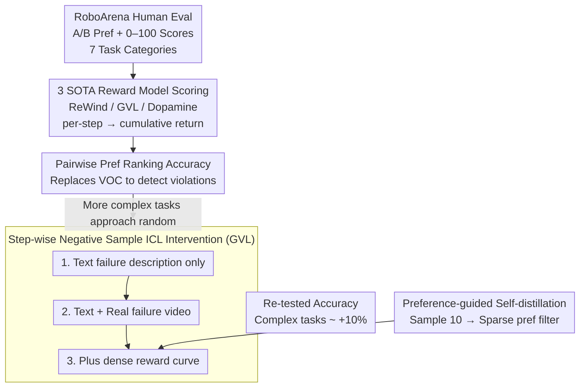

# Position: Good Embodied Reward Models Need Bad Behavior Data

**Conference**: ICML 2026 Spotlight  
**arXiv**: [2606.01036](https://arxiv.org/abs/2606.01036)  
**Code**: None  
**Area**: Embodied AI / Robotics / Reward Modeling  
**Keywords**: Embodied Reward Models, Failure Data, RoboArena, VLM Reward, Preference Alignment

## TL;DR
A position paper providing empirical evidence via RoboArena human ratings that three types of SOTA embodied reward models (ReWind / GVL / Dopamine) systematically "overestimate" actual failed robotic behaviors. The root cause is identified as training data consisting almost exclusively of expert success demonstrations. By injecting real "bad" behavior videos + dense negative reward labels into the in-context prompts of GVL, the authors demonstrate that even a minimal amount of negative samples can significantly correct preference ranking, thereby calling on the community to actively collect and release "bad" robotic data.

## Background & Motivation

**Background**: Vision-Language-Action (VLA) embodied foundation models have developed rapidly over the past two years. Whether for RL post-training, test-time best-of-K, or large-scale automated evaluation, these models increasingly rely on a "universal embodied reward model" $R_\theta(o_{1:T}; c)$—which scores a sequence of visual observations and linguistic task instructions—to replace expensive human evaluation. Current mainstream approaches fall into three categories: synthetic negative sample training based on preferences (ReWind), zero-shot VLM scoring (GVL / GPT-5), and VLM scorers fine-tuned on expert data (Dopamine).

**Limitations of Prior Work**: These three types of reward models consistently fail on behaviors that "appear successful but actually violate rules." When tested on RoboArena real robot rollouts + human scoring data for preference ranking, the authors found that while accuracy is usable at 0.72–0.77 on simple Pick/Place tasks, it drops to just above random chance (0.52–0.62) for fine-grained tasks like Pour Liquid and Tool Use. Worse are the qualitative results—reward models still provide monotonically increasing reward curves for clear failure frames such as "spoon hitting the bowl" or "nuts spilling outside the plate," almost entirely ignoring the key moments humans use to judge quality.

**Key Challenge**: The "negative signals" in all three methodologies are substitutes rather than real data—ReWind relies on pseudo-negatives synthesized by shuffling expert trajectories, GVL relies on general priors from VLM pre-training, and Dopamine relies on heuristic progress labels. The success of LLMs is inseparable from the massive amount of naturally occurring "bad text" (erroneous reasoning, toxic language) on the internet. In contrast, "bad data" in the embodied domain is systematically filtered by two mechanisms: first, hardware safety and wall-clock costs discourage the proactive creation of failures; second, the imitation learning paradigm naturally filters out non-expert data (as seen in large datasets like OpenX and DROID). Consequently, the training distribution is heavily biased toward "success," calibrating reward models to be overly optimistic.

**Goal**: To diagnose "why embodied reward models fail" at the data level and empirically demonstrate that even a small amount of real failure videos can significantly correct the judgments of existing SOTA models.

**Key Insight**: The authors choose GVL as the subject for intervention because it supports in-context learning, allowing the injection of negative samples at different granularities (text description only / text + video / text + video + dense reward) without retraining, cleanly isolating the contributions of "negative samples themselves" vs. "negative sample representation formats."

**Core Idea**: Good embodied reward models must have seen truly "bad" behavior. The community should actively release failure datasets, build failure data synthesis engines, promote decentralized physical evaluation, and design benchmarks specifically for reward models themselves.

## Method

As a position paper, this work does not propose a new model architecture. The "Method" primarily consists of two lines of inquiry: (a) an evaluation protocol to quantify the alignment between reward models and human preferences; (b) a set of controlled in-context negative sample injection experiments. Together, these form the empirical backbone of the argument.

### Overall Architecture

The entire work can be viewed as a three-stage pipeline: The first stage treats human A/B preferences and continuous scores (0–100) from RoboArena as ground-truth, split across 7 categories of increasing task complexity (Pick/Place → Push/Pull → Open/Close → Stack → Reorient → Pour → Tool Use). The second stage involves the three SOTA reward models performing per-step scoring for each rollout, accumulating into a trajectory return $\hat{y}^i = \sum_t \hat{r}_t$, which is then compared with human rankings to calculate "pair-level" consistency. The third stage performs controlled interventions on GVL, gradually increasing the information content of negative samples in in-context prompts (Text only → Text + Video → Text + Video + Dense Reward), and re-testing the same metrics to prove that reward model quality improves monotonically with the richness of negative sample representation.

### Key Designs

**1. Pairwise Preference Accuracy: A metric truly capable of detecting violations**

Previous evaluations of reward models often used Value-Order Correlation—checking if the reward curve increases monotonically over time. However, this is insensitive to cases like "knocking over a bowl mid-task but eventually completing it," failing to reflect safety and quality violations. The authors switch to pairwise preference accuracy: for each task context $c$, all rollouts with strictly unequal human scores are paired $P_c = \{(i,j): i<j, y^i \ne y^j\}$. First, the inconsistency rate between human and model preference directions is calculated:

$$D_c = \frac{1}{|P_c|}\sum_{(i,j)\in P_c}\mathbf{1}[s^{ij}_H \ne s^{ij}_M],\quad s^{ij}_H = \text{sign}(y^i - y^j)$$

Then, the global accuracy is defined as $A = 1 - \frac{\sum_c |P_c| D_c}{\sum_c |P_c|}$. This aligns the metric directly with the ultimate goal of "which rollout humans find better," ensuring that "seemingly progressing but violating" failure modes are penalized and exposing the true deficiencies of reward models.

**2. Step-wise negative sample ICL intervention (Text → Video → Dense Reward): Isolating the effective signals**

To argue that "the problem lies in the data gap," one must cleanly separate the contributions of "negative samples themselves" and their "representation format" without retraining. Using GVL, the authors escalate the information content of negative samples: the first level uses an LLM to distill RoboArena reviewer feedback into general failure descriptions like "grasped the object but failed to release" (aligned with Constitutional AI, cheap but abstract); the second level pairs each description with a real failure video, adding fine-grained temporal evidence; the third level adds a per-step dense reward curve $r_{1:T}$ to the video, explicitly telling the model at which frame to begin penalizing. The three levels show: text alone is nearly useless; adding video only works for coarse errors; and time-aligned dense rewards are necessary to catch fine-grained violations like those in Tool Use—proving that the "format" of negative samples is more critical than "quantity."

**3. Preference-guided self-distillation for dense rewards: Using sparse preferences to "amplify" dense supervision**

The per-step dense reward curves required for the third level are almost non-existent in the physical world; RoboArena only provides single scalar scores. The authors' clever solution is to let the reward model generate them and use human preferences as a filter: for every A/B rollout pair, GVL samples $m=10$ complete reward sequences $\{r^{(k)}_{1:T}\}$ at temperature 0.8. The sequence whose implicit return ranking matches the human preference is retained, and the curve corresponding to the human-rejected side is used as the in-context demonstration of "how to evaluate negative samples." Although sparse preference labels contain little information, they suffice as filters to select dense trajectories aligned with human intuition, effectively amplifying the information density of human annotations by one to two orders of magnitude while avoiding the astronomical cost of dense labeling from scratch.

### Loss & Training

The core experiments of this paper do not retrain any models—the three baselines use their respective original repositories or pre-trained checkpoints, and interventions are performed solely by modifying GVL's in-context prompts. The only baseline involving training, ReWind, is trained on Open-X embodiments following the original objective $\theta^* = \arg\min_{R_\theta} \mathbb{E}_{c, \tau \sim \mathcal{D}}\left[\sum_t (r_t - t/T)^2 + (r_t^-)^2\right]$, which simultaneously fits a temporal progress regression on positive samples and zero-reward suppression on synthetic negative samples. This "zero-training cost" design reinforces the argument: the problem is not model capacity, but the data gap.

## Key Experimental Results

### Main Results

| Task Complexity | ReWind / GVL / Dopamine Accuracy | Relative to Random (0.5) | Key Observation |
|:---|:---|:---|:---|
| Pick/Place | 0.72–0.77 | Significantly Higher | Large visual differences; models usable |
| Reorient / Pour | mid-0.6 | Moderate | Requires execution quality; performance drops |
| Tool Use | 0.52–0.62 | Near Random | Reward models fail completely on complex tasks |

Qualitatively, in an "uncovering" task, the robot clearly hits a bowl, yet all three reward models predict monotonically increasing per-frame rewards; in a "pouring nuts" task where nuts spill outside the plate, GVL and ReWind continue to increase scores. These cases illustrate that the problem is not reward models "failing to see" the failure, but rather over-weighting progress signals and underestimating negative events.

### Ablation Study (GVL + in-context negative samples)

| Context Configuration | Gain on Simple Tasks (Pick/Place, Push/Pull) | Gain on Complex Tasks (Tool Use, Pour) | Note |
|:---|:---|:---|:---|
| Text-only failure description | ≈ 0 | ≈ 0 | Abstract descriptions fail to ground to physical behavior |
| Text + Real failure video | ≈ +8% | Minimal gain | Videos help with "obvious failures" but not subtle violations |
| Text + Video + Dense Reward labels | ≈ +8% | ≈ +10% | Time-aligned dense penalties are key for fine-grained tasks |

### Key Findings

- Failure modes across the three reward model types are highly isomorphic—all bias toward "seemingly progressing" trajectories and systematically underestimate safety violations and shortcut behaviors, with the gap widening as task complexity increases.
- The "format" of negative samples is more important than "quantity": text alone is useless, videos only work for coarse errors, and time-aligned dense reward labels are required to catch fine-grained violations in tasks like Tool Use. This confirms that VLM backbones remain weak at grounding abstract principles into physical features.
- The "Preference-guided self-distillation" provides a cheap path: using sparse human preferences to select reward sequences amplifies human annotation density by orders of magnitude, a paradigm worth migrating to other scenarios lacking oracle rewards.

## Highlights & Insights

- The argument and empirical evidence are tightly coupled—instead of simply claiming "we need bad data," the authors use RoboArena data both to diagnose SOTA failures (quantitatively and qualitatively) and to prove that simply injecting bad data as in-context examples into GVL corrects preference ranking.
- "Preference-guided self-distillation" is a practical, independent trick: in any evaluation scenario with only sparse labels, one can use "multiple sampling + sparse label selection" to upgrade model outputs into dense supervision, saving significant annotation costs.
- The rebuttal of "Alternative Views" is robust: the authors do not deny that VLM pre-training sees failures, that observability is an issue, or that UQ is a remedy. Instead, they explain why these are "insufficient substitutes" for real embodied bad data, avoiding the common "straw man" fallacy in position papers.

## Limitations & Future Work

- Small empirical scale: The evaluation only covers one robotic benchmark (RoboArena) and seven types of tabletop manipulation, lacking navigation, long-horizon multi-step tasks, or bimanual collaboration. The intervention was only verified on GVL via in-context injection, not via retraining on ReWind/Dopamine.
- Dependency of "dense reward labels" on GVL's sampling quality: If the base reward model fails to produce even one sequence aligned with human preferences in 10 samples, the selector degrades to random choice, failing to obtain valid dense negative samples.
- Practical hurdles for releasing failure data: Failure rollouts often involve hardware damage, human intervention, or even safety accident footage, making industrial teams reluctant to release such data despite "calls for action." While the synthetic real2sim2real path is feasible, the sim-to-real gap in contact-rich/deformable tasks remains unsolved.

## Related Work & Insights

- **vs. ReWind**: ReWind synthesizes pseudo-negatives via perturbations, which are essentially "imagined failures." This paper proves that synthetic negatives cannot cover closed-loop failure modes, serving as a warning against the perturbation-based negative sample route.
- **vs. Constitutional AI**: Constitutional AI injects values via text principles. The authors contrast this by showing that text principles are nearly ineffective for physical grounding tasks, highlighting the need to ground "values" in visual temporal data within the embodied domain.
- **vs. GVL / Dopamine (VLM-as-reward)**: This paper does not negate the value of VLMs as reward backbones but proves that zero-shot/heuristic supervision is insufficient and requires real human evaluation and failure videos for in-context calibration.
- **vs. UQ Approaches**: The authors acknowledge the effectiveness of UQ in reward modeling but point out a crucial asymmetry—training on positive samples alone cannot calibrate the false positive rate, as FP is defined relative to unobserved negative samples. Thus, UQ and bad data are complementary rather than substitutes.

<!-- RELATED:START -->

## Related Papers

- [\[ICML 2026\] StableVLA: Towards Robust Vision-Language-Action Models without Extra Data](stablevla_towards_robust_vision-language-action_models_without_extra_data.md)
- [\[ICML 2026\] TimeRewarder: Learning Dense Reward from Passive Videos via Frame-wise Temporal Distance](timerewarder_learning_dense_reward_from_passive_videos_via_frame-wise_temporal_d.md)
- [\[CVPR 2026\] DAWN: Pixel Motion Diffusion is What We Need for Robot Control](../../CVPR2026/robotics/dawn_pixel_motion_diffusion_robot_control.md)
- [\[ICLR 2026\] D2E: Scaling Vision-Action Pretraining on Desktop Data for Transfer to Embodied AI](../../ICLR2026/robotics/d2e_scaling_vision-action_pretraining_on_desktop_data_for_transfer_to_embodied_a.md)
- [\[NeurIPS 2025\] Trust Region Reward Optimization and Proximal Inverse Reward Optimization Algorithm](../../NeurIPS2025/robotics/trust_region_reward_optimization_and_proximal_inverse_reward_optimization_algori.md)

<!-- RELATED:END -->
