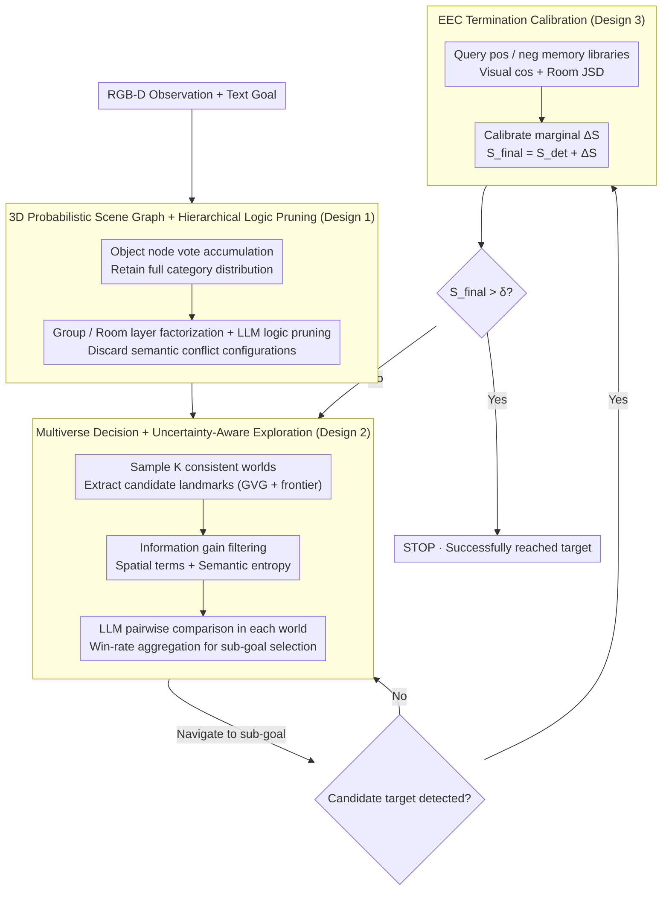

# PSG-Nav: Probabilistic Scene Graph Navigation via Multiverse Decision Making

**Conference**: ICML 2026  
**arXiv**: [2606.01313](https://arxiv.org/abs/2606.01313)  
**Code**: https://psg-nav.github.io/  
**Area**: Robotics / Embodied AI / Open-Vocabulary Navigation / Uncertainty Modeling  
**Keywords**: ObjectNav, Probabilistic Scene Graph, Multiverse Sampling, Evidential Calibration, Lifelong Adaptation

## TL;DR
This paper proposes PSG-Nav, which replaces traditional deterministic scene graph navigation with a "three-piece suite": a 3D probabilistic scene graph that retains full category distributions, a multiverse decision-making process that samples multiple consistent worlds from a joint distribution, and an evidential calibration library based on success/failure memories. It achieves new SOTA results on three major ObjectNav benchmarks—HM3D, MP3D, and HSSD—with SR of 66.1%, 44.8%, and 67.9%, respectively.

## Background & Motivation

**Background**: The mainstream approach for open-vocabulary ObjectNav is modular, using open-vocabulary detectors like GLIP or Grounded-SAM to construct 3D scene graphs (e.g., SG-Nav, CogNav, ASCENT, ApexNav) and utilizing LLMs for high-level planning. Given a natural language goal (e.g., "blue sofa"), the agent must find and stop near the object in an unseen indoor environment.

**Limitations of Prior Work**: Current mainstream scene graphs assign only a single "hard label with highest confidence" to each object for LLM compatibility and storage efficiency, discarding the full category probability distribution. This leads to three cascading disasters: (1) perception noise is permanently written into the map (a sofa misdetected as a bed can never be corrected); (2) logically inconsistent layouts appear in the scene graph (e.g., "a toilet in a bedroom"), causing downstream LLM reasoning to fail; (3) high-frequency false positives under sim-to-real domain shifts cause the agent to execute STOP in front of the wrong object, leading to early episode failure.

**Key Challenge**: Perception models are inherently uncertain (the same object might be 70% sofa and 30% bed), but downstream planning requires a "deterministic" scene as an LLM prompt. Hard truncation loses global reasoning capabilities, while planning directly on the full joint distribution leads to a combinatorial explosion (where even the most probable global configuration may account for < 10%).

**Goal**: (a) Retain full distributions at the mapping layer; (b) transform probabilistic reasoning into tractable discrete decisions at the planning layer; (c) combat sim-to-real false positives at the termination layer to achieve true online lifelong adaptation.

**Key Insight**: The authors draw inspiration from "Multiverse Decision Making." Since a single deterministic world is either overconfident or loses information, $K$ "logically consistent possible worlds" are sampled from the joint distribution. The agent evaluates the same landmark across multiple parallel universes and aggregates decisions via win rates. Simultaneously, a RAG-style success/failure memory library is used for posterior calibration of detection confidence.

**Core Idea**: A hierarchical probabilistic scene graph (object → group → room) is used for factorization to avoid joint explosion. Robust decisions are made via Monte Carlo sampling of multiple worlds combined with LLM pairwise comparisons. EEC is employed to incrementally update the memory library after each episode, upgrading "zero-shot navigation" to "online lifelong learning."

## Method

### Overall Architecture
The input consists of an RGB-D observation sequence $O_t = \{I_t^{rgb}, I_t^{depth}, p_t\}$ and a free-text goal $c$. The output is a discrete action $a_t \in \{\text{MOVE\_FORWARD}, \text{TURN\_LEFT/RIGHT}, \text{LOOK\_UP/DOWN}, \text{STOP}\}$. Success is defined as stopping within 1m of the target within a 500-frame budget. The pipeline comprises three components: (A) **3D-PSG** online construction of a hierarchical probabilistic scene graph, where each object node maintains a full category distribution; (B) **Multiverse Decision** sampling $K$ consistent worlds from the 3D-PSG to perform pairwise comparisons and information gain scoring on candidate landmarks for sub-goal selection; (C) **EEC** for confidence calibration using success/failure memories when a candidate object is detected, determining whether to execute STOP. These components form a closed loop of "mapping → planning → moving → verification → (continue if not stopped)."

### Key Designs

**1. 3D Probabilistic Scene Graph + LLM-guided Hierarchical Logic Pruning: Retaining Full Distributions Without Combinatorial Explosion**

Traditional scene graphs collapse each object into an argmax hard label for LLM compatibility, which is self-defeating—once a sofa is misdetected as a bed, there is no "alternative explanation" to fall back on. PSG-Nav retains the full distribution at the mapping layer: the scene graph $\mathcal{G}_t = (\mathcal{V}, \mathcal{E})$ is divided into object, group, and room layers. Each object node maintains a category vote counter vector $\mathbf{n}_{i,t}$, with confidence normalized as $P_t(o_i = c_k) = n_{i,t}^{(k)} / \sum_j n_{i,t}^{(j)}$ (using vote accumulation rather than Bayesian updates because open-vocabulary detector confidence is uncalibrated and Bayesian updates would diverge). Group nodes store the joint configuration probability of child objects $P(g_j = s) = \prod_{i=1}^{N_j} P(o_{j,i} = c_{j,i}^s)$, e.g., 70% table × 80% chair = 56% "table+chair" configuration. To avoid combinatorial explosion during planning, hierarchical factorization is followed by LLM logic pruning: the top-$K_g$ configurations within a group are enumerated, and an LLM binary filter $f_{\text{LLM}}(s) \in \{0,1\}$ discards logical conflicts like "a toilet in a living room." The same applies to the room layer. This mechanism compresses the combinatorial space into enumerable configurations while filtering out "high confidence but semantically nonsensical" setups in favor of "low confidence but globally consistent" correct explanations.

**2. Multiverse Decision + Intrinsic Uncertainty-Aware Exploration: Voting for the Same Landmark Across Parallel Worlds**

Planning in a single deterministic world is essentially a gamble that fails upon ambiguity. PSG-Nav samples $K$ logically consistent deterministic worlds $\mathcal{M} = \{\mathcal{G}^{(1)}, \dots, \mathcal{G}^{(K)}\}$ from the 3D-PSG joint distribution, effectively marginalizing over perception noise. Candidate landmarks are extracted from a Generalized Voronoi Graph and geometric frontiers, then filtered using intrinsic information gain:

$$U_{\text{gain}}(l_{i,t}) = \alpha \cdot I_{\text{spa}}(l_{i,t}) + I_{\text{sem}}(l_{i,t})$$

The spatial term $I_{\text{spa}} = |\mathcal{U}(l_{i,t})| / (\pi r_{\text{max}}^2)$ measures the visible unknown area, while the semantic term $I_{\text{sem}} = -\sum_{o_i \in \mathcal{O}_p} \sum_c P_t(o_i = c) \log P_t(o_i = c)$ is the sum of Shannon entropy for nearby objects, reflecting the intuition that moving toward high-uncertainty areas resolves ambiguity. Remaining high-potential landmarks undergo stochastic pairwise comparisons where an LLM acts as a preference oracle $\mathbb{I}(l_i \succ l_j | \mathcal{G}^{(m)})$ for each world. The final win-rate score $S(l_{i,t}) = \frac{1}{M(|\mathcal{L}'_t|-1)} \sum_m \sum_{j \neq i} \mathbb{I}(l_i \succ l_j | \mathcal{G}^{(m)})$ determines the sub-goal $l^* = \arg\max(S(l_{i,t}) + \beta U_{\text{gain}}(l_{i,t}))$. Pairwise comparison avoids LLM position bias, win-rate aggregation estimates expected utility via Monte Carlo, and intrinsic gain encourages active disambiguation.

**3. EEC: RAG-style Termination Calibration Based on Success/Failure Memories**

Sim-to-real domain shifts often cause high-frequency false positives, leading the agent to STOP prematurely. EEC maintains two memory libraries—positive examples $\mathcal{B}^+$ (successfully identified targets) and negative examples $\mathcal{B}^-$ (historical false positives). Each memory stores $m = (\mathbf{v}_{\text{vis}}^m, \mathbf{v}_{\text{struct}}^m)$, where the structural embedding $\mathbf{v}_{\text{struct}} = (p_R^m, p_G^m)$ consists of room and neighbor group distributions. Before a candidate object $o_c$ triggers STOP, a hybrid similarity query is performed:

$$\text{sim}(o_c, m) = \cos(\mathbf{v}_{\text{vis}}, \mathbf{v}_{\text{vis}}^m) + w_1 \cos(p_G, p_G^m) + w_2 (1 - \text{JSD}(p_R, p_R^m))$$

The room distribution uses Jensen-Shannon Divergence (aligning with probability geometry), while the visual embedding uses cosine similarity. Calibration is calculated as $S_{\text{pos}} = \max_{m \in \mathcal{B}^+} \text{sim}$, $S_{\text{neg}} = \max_{m \in \mathcal{B}^-} \text{sim}$, and the calibration margin $\Delta S = S_{\text{pos}} - \gamma S_{\text{neg}}$. STOP is executed only if $S_{\text{final}} = S_{\text{det}} + \Delta S > \delta$. When the bank is full, redundant pruning is performed based on the highest internal average similarity to preserve diversity. Unlike traditional RAG which only stores image crops, EEC reuses the 3D-PSG's room + group structures as context, enabling it to distinguish between a "fireplace illusion in a bedroom" and a "real fireplace in a living room."

### Loss & Training
PSG-Nav is a training-free zero-shot framework that does not update any network parameters. All probability updates (vote accumulation / EEC bank modification) are online state updates within or across episodes. Detection utilizes GLIP, segmentation uses Grounded-SAM, and the reasoning engine is Qwen2.5-7B-Instruct. Key hyperparameters: multiverse samples $K = 3$, information gain threshold $\tau = 0.1$, weights $\alpha = 1, \beta = 0.5$, EEC capacity $N_{\max} = 10$, negative penalty $\gamma = 2$, termination threshold $\delta = 0.61$. Each episode is limited to 500 steps with an 800×800 occupancy grid.

## Key Experimental Results

### Main Results

Comparison with 16 SOTA methods across HM3D (2000 episodes / 6 classes), MP3D, and HSSD (1248 episodes):

| Method | HM3D SR | HM3D SPL | MP3D SR | MP3D SPL | HSSD SR | HSSD SPL |
|------|---------|----------|---------|----------|---------|----------|
| SG-Nav | 54.0 | 24.9 | 40.2 | 16.0 | — | — |
| BeliefMapNav | 61.4 | 30.6 | 37.3 | 17.6 | 65.2 | 32.1 |
| ApexNav | 59.6 | 33.0 | 39.2 | 17.8 | — | — |
| ASCENT | 65.4 | 33.5 | 44.5 | 15.5 | — | — |
| **PSG-Nav (w/o EEC, Strict Zero-Shot)** | 63.5 | 31.2 | 43.3 | 17.6 | 66.1 | 32.2 |
| **PSG-Nav (Adaptive, with EEC)** | **66.1** | 32.1 | **44.8** | **17.9** | **67.9** | **33.4** |

PSG-Nav outperforms the deterministic baseline SG-Nav by 12.1 percentage points in SR on HM3D. The zero-shot variant (without EEC) already surpasses BeliefMapNav and ApexNav. The full version achieves SOTA SR across all three datasets. Real-robot deployment further validates sim-to-real transferability.

### Ablation Study

| Configuration | HM3D SR | HSSD SR | Description |
|------|---------|---------|------|
| Full PSG-Nav | 66.1 | 67.9 | Full Framework |
| w/o 3D-PSG (Back to Deterministic) | 58.4 | 58.5 | SR drops 9.4 pt on HSSD, proving distribution retention is key |
| w/o Group Nodes | 58.8 | 59.9 | Close to deterministic, proving hierarchical factorization is essential |
| w/o Room Nodes | 59.7 | 61.7 | Slightly better than w/o Group, but still > 6 pt gap |
| w/o Spa. & Sem. Info Gain | 62.1 | — | 4 pt drop without intrinsic exploration |

### Key Findings
- Removing 3D-PSG to return to deterministic scene graphs results in a 9.4 pt SR drop on HSSD (67.9 → 58.5), proving that "retaining distributions + hierarchical reasoning" is a performance lifeblood.
- Removing Group nodes (58.8 SR) results in performance nearly identical to being fully deterministic (58.4 SR). This suggests that without hierarchical factorization, the flat joint distribution of objects explodes such that any global configuration probability approaches zero, making multiverse sampling ineffective.
- The zero-shot variant (without EEC) already exceeds most SOTA; EEC provides an additional 2.6 / 1.5 / 1.8 pt boost, acting as a robustness amplifier.
- Real-robot deployment validates successful sim-to-real transfer, a rare empirical confirmation in the ObjectNav field.

## Highlights & Insights
- **Methodological Value of "Retaining Distributions over Hard Labels"**: Perception models output logits; discarding them for argmax is self-defeating. This paper proves that with proper hierarchical factorization and sampling approximations, full distributions can be fully exploited. This approach can adapt to any "perception uncertainty + long-range planning" embodied task.
- **Multiverse Decision-making as a General Paradigm for Robust LLM Reasoning**: Estimating expected utility $E[\mathbb{I}(l^* \succ l_j)]$ via pairwise aggregation across $K$ worlds avoids LLM position bias and marginalizes perception noise. This could be applied to tool selection, code generation, or dialogue reasoning.
- **EEC Upgrading Zero-Shot to Online Lifelong Learning**: The dual-bank design and diversity pruning based on "probabilistic geometry (JSD) vs. representation geometry (cosine)" provide a rigorous engineering solution for embodied scenarios.
- **LLM as a Commonsense Filter**: Using the LLM for binary logic filtering rather than direct planning is an intelligent, lightweight application of the model to its strengths.

## Limitations & Future Work
- The fallback to "vote accumulation" from Bayesian updates loses confidence magnitude information; future lightweight calibration heads might offer improvements.
- Multiverse sampling is limited to $K=3$; the trade-off between higher $K$ and computational cost in larger scenes or multi-goal tasks remains unexplored.
- The EEC bank capacity $N_{\max} = 10$ and its pruning strategy might lose important modes during significant distribution shifts.
- Real-time deployment is limited by multiple LLM calls per step; distillation into specialized smaller models may be necessary.
- Evaluation is confined to indoor ObjectNav; extensibility to outdoor or multi-floor scenarios (where ASCENT excels) requires further validation.

## Related Work & Insights
- **vs. SG-Nav / CogNav**: Both use 3D scene graphs, but their nodes are hard labels; PSG-Nav's probabilistic nodes and hierarchical pruning provide a 12.1 pt SR upgrade on HM3D.
- **vs. ASCENT**: ASCENT emphasizes geometric exploration (stair-aware); PSG-Nav focuses on semantic uncertainty modeling. These are orthogonal and could be combined.
- **vs. BeliefMapNav**: Similar belief modeling, but BeliefMapNav uses continuous 3D voxel maps; PSG-Nav uses discrete probabilistic graphs, which are more compatible with LLM reasoning.
- **vs. Conformal Prediction**: While Conformal Prediction provides rigorous intervals at the perception layer, it often doesn't propagate them to decision-making; PSG-Nav transmits uncertainty from perception to planning.

<!-- RELATED:START -->

## Related Papers

- [\[ICML 2026\] Dive into the Scene: Breaking the Perceptual Bottleneck in Vision-Language Decision Making via Focus Plan Generation](dive_into_the_scene_breaking_the_perceptual_bottleneck_in_vision-language_decisi.md)
- [\[CVPR 2026\] Probabilistic Concept Graph Reasoning for Multimodal Misinformation Detection](../../CVPR2026/robotics/probabilistic_concept_graph_reasoning_for_multimodal_misinformation_detection.md)
- [\[CVPR 2025\] Decision SpikeFormer: Spike-Driven Transformer for Decision Making](../../CVPR2025/robotics/decision_spikeformer_spike-driven_transformer_for_decision_making.md)
- [\[NeurIPS 2025\] ESCA: Contextualizing Embodied Agents via Scene-Graph Generation](../../NeurIPS2025/robotics/esca_contextualizing_embodied_agents_via_scene-graph_generation.md)
- [\[ICML 2026\] Embodied Task Planning via Graph-Informed Action Generation with Large Language Models](embodied_task_planning_via_graph-informed_action_generation_with_large_language_.md)

<!-- RELATED:END -->
