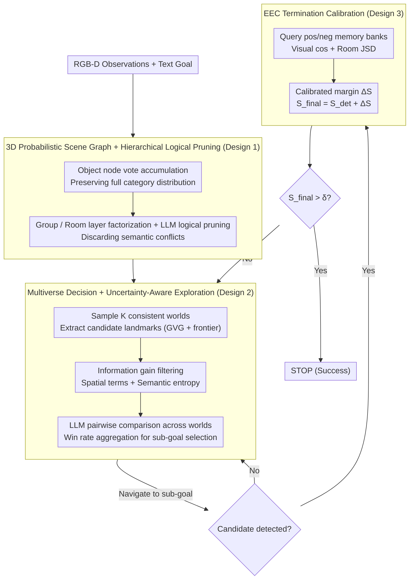

# PSG-Nav: Probabilistic Scene Graph Navigation via Multiverse Decision Making

**Conference**: ICML 2026  
**arXiv**: [2606.01313](https://arxiv.org/abs/2606.01313)  
**Code**: https://psg-nav.github.io/  
**Area**: Robotics / Embodied AI / Open-Vocabulary Navigation / Uncertainty Modeling  
**Keywords**: ObjectNav, Probabilistic Scene Graph, Multiverse Sampling, Evidence Calibration, Lifelong Adaptation

## TL;DR
This work proposes PSG-Nav, which replaces traditional deterministic scene graph navigation with a three-component system: a 3D probabilistic scene graph that preserves full category distributions, multiverse sampling of multiple consistent worlds from the joint distribution for decision making, and evidence calibration using a success/failure memory bank. It achieves new SOTA results on HM3D, MP3D, and HSSD with 66.1%, 44.8%, and 67.9% SR, respectively.

## Background & Motivation

**Background**: Mainstream open-vocabulary ObjectNav follows modular solutions, using open-vocabulary detectors like GLIP/Grounded-SAM to construct 3D scene graphs (e.g., SG-Nav, CogNav, ASCENT, ApexNav) and Large Language Models (LLMs) for high-level planning. Given a natural language goal (e.g., "blue sofa"), the agent must locate and stop near the object in unseen indoor environments.

**Limitations of Prior Work**: To accommodate LLM input constraints and storage efficiency, current scene graphs typically assign a single "maximum confidence hard label" to each object, discarding the full category probability distribution. This leads to three cascading disasters: (1) perceptual noise is permanently written into the map (e.g., a sofa misdetected as a bed cannot be corrected); (2) logical inconsistencies occur in the layout (e.g., "a toilet in a bedroom"), causing downstream LLM reasoning to fail; (3) high false positive rates under sim-to-real domain shifts cause the agent to stop at the wrong object, leading to premature episode failure.

**Key Challenge**: Perception models are inherently uncertain (e.g., an object might be 70% sofa and 30% bed), but downstream planning requires a "deterministic" scene as an LLM prompt. Hard truncation loses global reasoning capabilities, while planning directly over the full joint distribution leads to a combinatorial explosion (where even the most probable global configuration may account for < 10%).

**Goal**: (a) Preserve the full distribution at the map layer; (b) transform probabilistic reasoning into tractable discrete decisions at the planning layer; (c) combat sim-to-real false positives at the termination layer for true online lifelong adaptation.

**Key Insight**: The authors draw inspiration from "Multiverse Decision Making." Since a single deterministic world is either overconfident or loses information, $K$ "logically consistent possible worlds" are sampled from the joint distribution. This allows the agent to evaluate the same landmark across multiple parallel universes simultaneously and aggregate decisions via win rates. Additionally, a RAG-style success/failure memory bank is used for posterior calibration of detection confidence.

**Core Idea**: Use a hierarchical probabilistic scene graph (object → group → room) for factorization to avoid combinatorial explosion, employ Monte Carlo multiverse sampling with LLM pairwise comparisons for robust decision making, and use EEC to incrementally update the memory bank after each episode, upgrading "zero-shot navigation" to "online lifelong learning."

## Method

### Overall Architecture
The input consists of RGB-D observation sequences $O_t = \{I_t^{rgb}, I_t^{depth}, p_t\}$ and a free-text goal $c$. The output is a discrete action $a_t \in \{\text{MOVE\_FORWARD}, \text{TURN\_LEFT/RIGHT}, \text{LOOK\_UP/DOWN}, \text{STOP}\}$. Success is defined as stopping within 1m of the target within a 500-frame budget. The pipeline consists of three parts: (A) **3D-PSG** for online construction of a hierarchical probabilistic scene graph where object nodes maintain full category distributions; (B) **Multiverse Decision** which samples $K$ consistent worlds from the 3D-PSG to perform pairwise comparisons and information gain scoring for sub-goal selection; (C) **EEC** for confidence calibration using success/failure memories to decide whether to STOP. These components form a closed loop of "mapping → planning → moving → verifying → (continuing if not stopped)."

### Key Designs

**1. 3D Probabilistic Scene Graph + LLM-guided Hierarchical Logical Pruning**

Traditional scene graphs reduce each object to an argmax hard label for LLM compatibility, which discards alternative explanations. PSG-Nav maintains the full distribution at the map layer. The scene graph $\mathcal{G}_t = (\mathcal{V}, \mathcal{E})$ is organized into three layers: object, group, and room. Each object node maintains a category vote count vector $\mathbf{n}_{i,t}$, normalized as $P_t(o_i = c_k) = n_{i,t}^{(k)} / \sum_j n_{i,t}^{(j)}$. Vote accumulation is used instead of Bayesian updates because open-vocabulary detector confidence is often uncalibrated, causing Bayesian updates to diverge. Group nodes store the joint configuration probability of child objects $P(g_j = s) = \prod_{i=1}^{N_j} P(o_{j,i} = c_{j,i}^s)$. To prevent combinatorial explosion, hierarchical factorization is followed by LLM logical pruning: the top-$K_g$ configurations are enumerated, and an LLM binary filter $f_{\text{LLM}}(s) \in \{0,1\}$ discards conflicts (e.g., "toilet in a living room"). This maintains a tractable number of configurations while preserving "low-confidence but globally consistent" correct interpretations.

**2. Multiverse Decision Making + Intrinsic Uncertainty-Aware Exploration**

PSG-Nav samples $K$ logically consistent deterministic worlds $\mathcal{M} = \{\mathcal{G}^{(1)}, \dots, \mathcal{G}^{(K)}\}$ from the 3D-PSG joint distribution, effectively marginalizing over perceptual noise. Candidate landmarks extracted from the Generalized Voronoi Graph and geometric frontiers are first filtered by intrinsic information gain:

$$U_{\text{gain}}(l_{i,t}) = \alpha \cdot I_{\text{spa}}(l_{i,t}) + I_{\text{sem}}(l_{i,t})$$

The spatial term $I_{\text{spa}} = |\mathcal{U}(l_{i,t})| / (\pi r_{\text{max}}^2)$ measures exploration of unknown areas, while the semantic term $I_{\text{sem}} = -\sum_{o_i \in \mathcal{O}_p} \sum_c P_t(o_i = c) \log P_t(o_i = c)$ represents the Shannon entropy of nearby objects. The remaining landmarks undergo random pairwise comparisons where the LLM acts as a preference oracle $\mathbb{I}(l_i \succ l_j | \mathcal{G}^{(m)})$ for each world. The final win rate $S(l_{i,t}) = \frac{1}{M(|\mathcal{L}'_t|-1)} \sum_m \sum_{j \neq i} \mathbb{I}(l_i \succ l_j | \mathcal{G}^{(m)})$ determines the sub-goal $l^* = \arg\max(S(l_{i,t}) + \beta U_{\text{gain}}(l_{i,t}))$.

**3. EEC: RAG-style Termination Calibration based on Success/Failure Memories**

To combat false positives under sim-to-real domain shifts, EEC maintains two memory banks: positive instances $\mathcal{B}^+$ (successfully identified targets) and negative instances $\mathcal{B}^-$ (historical false positives). Each memory entry stores $m = (\mathbf{v}_{\text{vis}}^m, \mathbf{v}_{\text{struct}}^m)$, where the structural embedding $\mathbf{v}_{\text{struct}} = (p_R^m, p_G^m)$ includes room and neighbor group distributions. Before a candidate object $o_c$ triggers a STOP, a hybrid similarity query is performed:

$$\text{sim}(o_c, m) = \cos(\mathbf{v}_{\text{vis}}, \mathbf{v}_{\text{vis}}^m) + w_1 \cos(p_G, p_G^m) + w_2 (1 - \text{JSD}(p_R, p_R^m))$$

Room distributions are compared using Jensen-Shannon Divergence. With $S_{\text{pos}} = \max_{m \in \mathcal{B}^+} \text{sim}$ and $S_{\text{neg}} = \max_{m \in \mathcal{B}^-} \text{sim}$, the calibrated score is $S_{\text{final}} = S_{\text{det}} + (S_{\text{pos}} - \gamma S_{\text{neg}})$. A STOP is executed only if $S_{\text{final}} > \delta$. Diversity-based pruning is used to maintain the memory bank.

### Loss & Training
PSG-Nav is a completely training-free zero-shot framework. No network parameters are updated. All probability updates and EEC bank management are performed as online state updates. Detection uses GLIP, segmentation uses Grounded-SAM, and the reasoning engine is Qwen2.5-7B-Instruct. Key hyperparameters: $K=3, \tau=0.1, \alpha=1, \beta=0.5, N_{\max}=10, \gamma=2, \delta=0.61$.

## Key Experimental Results

### Main Results

Comparison against 16 SOTA methods on HM3D (2000 episodes), MP3D, and HSSD (1248 episodes):

| Method | HM3D SR | HM3D SPL | MP3D SR | MP3D SPL | HSSD SR | HSSD SPL |
|------|---------|----------|---------|----------|---------|----------|
| SG-Nav | 54.0 | 24.9 | 40.2 | 16.0 | — | — |
| BeliefMapNav | 61.4 | 30.6 | 37.3 | 17.6 | 65.2 | 32.1 |
| ApexNav | 59.6 | 33.0 | 39.2 | 17.8 | — | — |
| ASCENT | 65.4 | 33.5 | 44.5 | 15.5 | — | — |
| **PSG-Nav (w/o EEC)** | 63.5 | 31.2 | 43.3 | 17.6 | 66.1 | 32.2 |
| **PSG-Nav (Adaptive, with EEC)** | **66.1** | 32.1 | **44.8** | **17.9** | **67.9** | **33.4** |

PSG-Nav outperforms the deterministic baseline SG-Nav by 12.1 percentage points in SR on HM3D. The zero-shot variant (without EEC) already exceeds BeliefMapNav and ApexNav, while the full version achieves SOTA results across all three datasets.

### Ablation Study

| Configuration | HM3D SR | HSSD SR | Description |
|------|---------|---------|------|
| Full PSG-Nav | 66.1 | 67.9 | Complete framework |
| w/o 3D-PSG (Deterministic) | 58.4 | 58.5 | HSSD drops by 9.4 pt, proving probability preservation is key |
| w/o Group nodes | 58.8 | 59.9 | Near-deterministic performance, proving hierarchy is necessary |
| w/o Room nodes | 59.7 | 61.7 | Better than w/o Group, but still significant drop |
| w/o Spa. & Sem. Information Gain | 62.1 | — | 4 pt drop without intrinsic exploration |

### Key Findings
- Removing 3D-PSG and reverting to a deterministic scene graph leads to a 9.4 pt drop on HSSD SR, proving that preserving the full distribution with hierarchical reasoning is a performance lifeline.
- Removing Group nodes results in performance nearly identical to a fully deterministic graph, indicating that without hierarchical factorization, the joint distribution of objects explodes such that multiverse sampling cannot find valid samples.
- The zero-shot variant already exceeds most SOTA methods, while EEC provides an additional 1.5–2.6 pt gain as a robustness amplifier.
- Real-world robot deployment successfully validates sim-to-real transferability.

## Highlights & Insights
- **Methodological Value of Preserving Distributions**: Perception models naturally output logits; discarding them for "convenience" is counterproductive. This work demonstrates that with proper hierarchical factorization and sampling-based approximation, full distributions can be effectively utilized.
- **Multiverse Decision Making as a General Paradigm**: Using win-rate aggregation across $K$ worlds essentially employs Monte Carlo to estimate expected utility, avoiding LLM position bias and marginalizing over perceptual noise.
- **Upgrading Zero-Shot to Lifelong Learning via EEC**: The dual-bank design and use of "probabilistic geometry" (JSD for rooms) versus "representation geometry" (cosine for visual embeddings) provides a sophisticated yet practical way to incorporate experience.
- **LLM as a Commonsense Filter**: Utilizing LLMs for binary logical pruning of configurations leverages their strengths in judging consistency rather than placing the entire planning burden on them.

## Limitations & Future Work
- Vote accumulation ignores the magnitude of confidence (e.g., two "70% bed" detections are treated the same as two "55% bed" detections); future work could incorporate lightweight calibration.
- Multiverse sampling is limited to $K=3$ for efficiency; higher $K$ values and their utility/cost trade-offs in massive scenes require further study.
- EEC bank capacity is small ($N_{\max} = 10$), which might be insufficient for long-term deployments or significant distribution shifts.
- Dependence on LLM multiple calls per step may limit real-time deployment; distillation into specialized smaller models is a potential path.
- The framework has 5 key hyperparameters that may require environment-specific tuning.

## Related Work & Insights
- **vs SG-Nav / CogNav**: While also using 3D scene graphs, those methods use hard labels. PSG-Nav’s probabilistic nodes and hierarchical pruning provide a direct performance upgrade (+12.1 pt on HM3D).
- **vs ASCENT**: ASCENT focuses on stair-aware geometric exploration for multi-floor navigation. PSG-Nav focuses on semantic uncertainty modeling; the two approaches are orthogonal and could be combined.
- **vs BeliefMapNav**: BeliefMapNav uses 3D voxel belief maps. PSG-Nav’s discrete probabilistic scene graph is more compatible with LLM reasoning.

<!-- RELATED:START -->

## Related Papers

- [\[ICML 2026\] Dive into the Scene: Breaking the Perceptual Bottleneck in Vision-Language Decision Making via Focus Plan Generation](dive_into_the_scene_breaking_the_perceptual_bottleneck_in_vision-language_decisi.md)
- [\[CVPR 2025\] Decision SpikeFormer: Spike-Driven Transformer for Decision Making](../../CVPR2025/robotics/decision_spikeformer_spike-driven_transformer_for_decision_making.md)
- [\[NeurIPS 2025\] ESCA: Contextualizing Embodied Agents via Scene-Graph Generation](../../NeurIPS2025/robotics/esca_contextualizing_embodied_agents_via_scene-graph_generation.md)
- [\[ICML 2026\] Embodied Task Planning via Graph-Informed Action Generation with Large Language Models](embodied_task_planning_via_graph-informed_action_generation_with_large_language_.md)
- [\[NeurIPS 2025\] Spatial-Aware Decision-Making with Ring Attractors in Reinforcement Learning Systems](../../NeurIPS2025/robotics/spatial-aware_decision-making_with_ring_attractors_in_reinforcement_learning_sys.md)

<!-- RELATED:END -->
