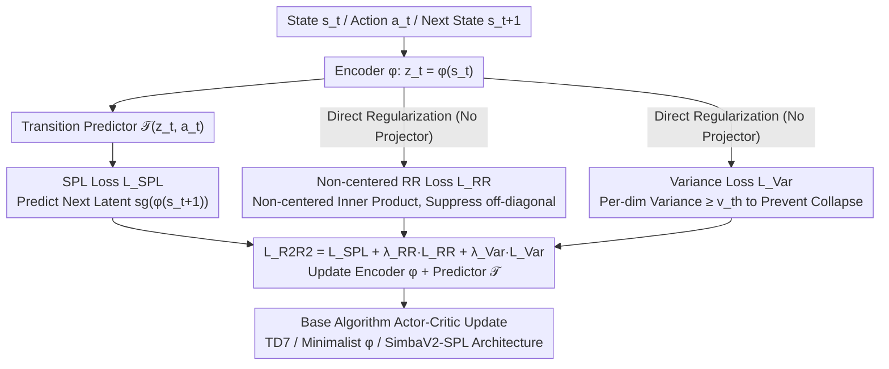

# R2R2: Robust Representation for Intensive Experience Reuse via Redundancy Reduction in Self-Predictive Learning

**Conference**: ICML 2026  
**arXiv**: [2605.14026](https://arxiv.org/abs/2605.14026)  
**Code**: Yes (github.com/songsang7/R2R2)  
**Area**: Reinforcement Learning / Self-Predictive Representation Learning / High UTD Training  
**Keywords**: Self-Predictive Learning, Redundancy Reduction, VICReg, High UTD, Representation Collapse

## TL;DR
R2R2 incorporates VICReg-style redundancy reduction constraints into Self-Predictive Learning (SPL) to stabilize high UTD training. A **key modification is the removal of zero-centering**—theoretically proving that zero-centering eliminates constant eigenmodes (i.e., global dynamics information) in SPL spectral decomposition. Experiments on TD7 with UTD=20 improved scores from 1.02 to 1.24 (+22%), and the newly proposed SimbaV2-SPL architecture achieved a new SOTA in continuous control.

## Background & Motivation

**Background**: The quest for sample efficiency in reinforcement learning has produced two main branches: off-policy algorithms that reuse replay buffers, and model-based/SPL methods that extract extra signals from dynamics via auxiliary tasks (predicting the next latent state). Increasing the Update-to-Data (UTD) ratio is an orthogonal approach, but high UTD (e.g., 20) almost inevitably triggers overfitting. Current high UTD research (REDQ, CrossQ, SimbaV2, BRO) focuses primarily on the **value function side**—stabilizing critic bias using ensembles, BatchNorm, LayerNorm, etc.

**Limitations of Prior Work**: These value-centric methods do not address **instability at the representation layer**. When UTD is increased, the SPL encoder and latent dynamics predictor also overfit, leading to subspace collapse and a continuous decline in effective rank. Existing SSL redundancy reduction methods (Barlow Twins, VICReg) were natively designed for vision representations and **default to zero-centering** (covariance matrices are calculated after subtracting the mean); directly applying these to SPL actually degrades performance.

**Key Challenge**: Spectral analysis of SPL (Tang et al., 2023) shows that minimizing SPL loss is equivalent to making the representation matrix $\Phi$ span the top-$k$ right eigenvector subspace of the transition matrix $P^\pi$. Markov chains always have an eigenvalue of 1, with a corresponding constant eigenvector $\mathbf 1$ ($P\mathbf 1=\mathbf 1$), which carries "global dynamics/probability conservation" information. The **zero-centering operator $H=I_N-\frac{1}{N}\mathbf 1\mathbf 1^\top$ is 0 for any constant vector**—meaning the seemingly harmless "mean subtraction" in SSL precisely eliminates this dominant eigenmode, directly conflicting with the goal of SPL.

**Goal**: (i) Add representation-layer regularization to high UTD training; (ii) ensure the regularization is compatible with SPL spectral properties; (iii) keep the design algorithm/architecture agnostic for plug-and-play capability.

**Key Insight**: The authors start from the mathematical detail of "constant eigenmodes" in SPL spectral decomposition—a perspective untouched by the SSL community—discovering that zero-centering is a structural issue rather than a simple hyperparameter tuning problem.

**Core Idea**: Use **non-centered covariance (direct inner product matrix without mean subtraction)** for redundancy reduction regularization, while removing the extra projector to attach the mechanism directly to the SPL encoder output, unifying "redundancy reduction" and "SPL spectral preservation."

## Method

### Overall Architecture
R2R2 adds two regularization terms to the encoder output $z_t=\phi(s_t)$ within the standard SPL training loop: a non-centered redundancy reduction loss $\mathcal L_{\text{RR}}$ and a variance loss $\mathcal L_{\text{Var}}$. The main SPL loss $\mathcal L_{\text{SPL}}=\mathbb E[\|\mathcal T(\phi(s),a)-\text{sg}(\phi(s'))\|_2^2]$ remains unchanged. After each environment step, $G$ high UTD updates are performed: encode states, calculate $\mathcal L_{\text{SPL}}+\lambda_{\text{RR}}\mathcal L_{\text{RR}}+\lambda_{\text{Var}}\mathcal L_{\text{Var}}$ to update the encoder and predictor, and then perform actor-critic updates for the base algorithm (TD7, Minimalist $\phi$, SimbaV2-SPL, etc.). Additionally, the paper constructs the SimbaV2-SPL architecture to integrate the SPL module (encoder + transition predictor) into SimbaV2, allowing R2R2 to stack with SOTA architectures. The pipeline incorporates two key changes reflected in "where and how losses are calculated": the redundancy reduction term uses a non-centered form (Design 1) and is attached directly to the encoder output without a projector (Design 2), alongside the architectural integration of the SPL module into SimbaV2 (Design 3).

### Key Designs

**1. Non-centered Redundancy Reduction Loss: Removing "mean subtraction" to prevent the sacrifice of constant eigenmodes.**

This is the central contribution. SPL theoretical analysis shows that minimizing SPL loss is equivalent to making the representation span the top-$k$ right eigenvector subspace of the transition matrix $P^\pi$. Markov chains always have an eigenvalue of 1 corresponding to the constant vector $\mathbf 1$ ($P\mathbf 1=\mathbf 1$), which carries global dynamics information. The zero-centering operator $H=I_N-\frac{1}{N}\mathbf 1\mathbf 1^\top$ used in VICReg/Barlow Twins is 0 for any constant vector, meaning it precisely erases this dominant eigenmode. R2R2’s fix is simple: replace standard covariance with a non-centered correlation matrix $[C(Z)]_{ij}=\frac{1}{N-1}\sum_b z_{b,i}z_{b,j}$ (no mean subtraction). The loss $\mathcal L_{\text{RR}}=\frac{1}{d(d-1)}\sum_{i\neq j}[C(Z)]_{ij}^2$ pushes off-diagonal inner products toward 0, forcing feature dimensions to be "uncorrelated but not zero-mean."

Lemma 1 + Proposition 2 strictly prove that $H\mathbf c=\mathbf 0$ means zero-centering perfectly eliminates the projection of the representation in the $\mathbf 1$ direction. While network bias parameters could theoretically compensate for this signal, it creates an unnecessary optimization detour compared to preserving it in the loss—"theory telling you which line of code not to change."

**2. Direct Regularization: Removing the projector and applying regularization directly to encoder outputs.**

Standard VICReg/Barlow Twins pass $z$ through a projector $g$ before calculating redundancy loss. However, R2R2's analysis reveals that SPL spectral properties constrain the encoder output $\phi(s)$ itself. Inserting a projector blurs the regularization's constraint on the "representation actually used downstream." Therefore, R2R2 calculates $\mathcal L_{\text{RR}}$ and $\mathcal L_{\text{Var}}$ directly on $\phi(s)$, ensuring constraints target the layer required by SPL's spectral properties. Removing a module also reduces the overfitting surface area under high UTD.

**3. SimbaV2-SPL Architecture: Integrating SPL into SOTA model-free architectures to prove orthogonal improvements.**

To ensure the method is not just a trick for specific algorithms like TD7, the authors integrated the SPL framework into the model-free SimbaV2. They added an extra encoder $\phi$ and transition predictor $\mathcal T$, and concatenated the linear projection + L2 normalized raw state with the latent representation $z$ before feeding it into the actor/critic. This injects latent dynamics while preserving the high-frequency details of raw signals in SimbaV2. Stacking R2R2 on this orthogonal architecture still yielded improvements, demonstrating complementarity with modern architectural advances.

### Loss & Training
$\mathcal L_{\text{R2R2}}=\mathcal L_{\text{SPL}}+\lambda_{\text{RR}}\mathcal L_{\text{RR}}+\lambda_{\text{Var}}\mathcal L_{\text{Var}}$. All experiments use fixed $\lambda_{\text{RR}}=\lambda_{\text{Var}}=0.01$ and variance threshold $v_{th}=1$ **without per-task tuning**. All other hyperparameters for the base algorithms remain unchanged.

## Key Experimental Results

### Main Results
11 continuous control environments (4 Gym MuJoCo + 7 DMC-Hard), normalized scores (relative to UTD=1 baseline); tested at UTD=1 and UTD=20; 500k step budget.

| Algorithm | Environment | UTD=1 | UTD=20 |
|---|---|---|---|
| TD7 | Total | 1.00 | 1.02 |
| TD7 + R2R2 | Total | **1.06** | **1.24** (+22%) |
| TD7 | DMC-Hard | 1.00 | 1.02 |
| TD7 + R2R2 | DMC-Hard | 1.05 | **1.32** |
| Minimalist $\phi$ | Gym | 1.00 | 0.41 (Collapse) |
| Minimalist $\phi$ + R2R2 | Gym | 1.00 | **0.57** |
| TD7+LN | Total | 1.00 | 0.88 (Regression) |
| TD7+LN + R2R2 | Total | 1.08 | **1.10** |
| SimbaV2 | Total | 1.00 | 1.20 |
| SimbaV2 + SPL | Total | 1.16 | **1.34** (New SOTA) |
| SimbaV2 + SPL + R2R2 | Total | 1.15 | **1.38** |

### Ablation Study

| Configuration | Dog-Trot at UTD=20 | Conclusion |
|---|---|---|
| Full R2R2 (non-centered) | High | Complete method |
| R2R2 + zero-centering | Significant degradation | Verifies Proposition 2 |
| Without $\mathcal L_{\text{RR}}$ | Severe degradation | Main contribution from RR |
| Without $\mathcal L_{\text{Var}}$ | Moderate degradation | Var prevents collapse |
| TD7 baseline (no R2R2) | Lowest | No protection |

### Key Findings
- **R2R2 is complementary to LayerNorm**: TD7+LN performed worse than the baseline at high UTD (0.88), while adding R2R2 restored it to 1.10, indicating architectural normalization cannot solve representation collapse.
- **Singular Value Spectrum Visualization (Humanoid-Stand)**: At UTD=1, R2R2 compressed the effective rank from 76.5 to 65.0 (concentrating the spectrum on task-relevant components). At UTD=20, the baseline showed sharp tail singular value collapse, while R2R2 maintained a heavy-tailed distribution, preventing subspace collapse.
- **Effective Rank (ER) Evolution**: Under UTD=20, the baseline's ER declined progressively. R2R2 maintained a stable high ER. Adding zero-centering caused the ER to collapse alongside the baseline, confirming the theoretical analysis.

## Highlights & Insights
- **Compatibility of SSL and RL via "Spectral Decomposition"**: Previously, it was unrecognized that the "mean subtraction" step in VICReg would precisely kill Markov chain constant eigenmodes. This observation challenges the assumption that "generic SSL tricks can be directly ported to RL," reminding us that SSL design premises (unordered data, mean-insensitivity) may not hold for structured data like RL latent dynamics.
- **Theoretically Guided Minimal Changes**: Simply removing "mean subtraction" from the covariance formula and "removing the projector" provides stable gains across SOTA architectures. The clean structure of the paper, where "theory tells you **which line of code not to change**," is exemplary.
- **Robust Orthogonality Argument**: Gains were observed across three SPL baselines of varying complexity (TD7, Minimalist $\phi$, TD7+LN) and even when R2R2 was integrated into the strongest backbone (SimbaV2-SPL), ensuring the improvement is not a TD7-specific trick.
- **Zero Hyperparameter Tuning**: Using the same $\lambda$ across all tasks makes the method highly practical for real-world deployment.

## Limitations & Future Work
- The theoretical analysis relies on the "SPL $\approx$ spectral decomposition" equivalence (Tang et al. 2023); the tightness for non-SimSiam-style frameworks (e.g., BYOL+predictor) is not fully discussed.
- The introduction of SimbaV2-SPL mixes "adding SPL" and "adding R2R2" variables, partially diluting the pure comparison (though the paper reports +SPL and +SPL+R2R2 separately).
- Experiments focus on continuous control (MuJoCo + DMC-Hard); discrete actions (Atari), sparse rewards, and pixel inputs are not yet verified.
- Training time overhead is approximately +12% wall-clock, which might require optimization for extremely large-scale tasks.

## Related Work & Insights
- **vs VICReg / Barlow Twins**: Native SSL redundancy reduction; zero-centering is structurally destructive to SPL; R2R2 repairs this with a non-centered form.
- **vs REDQ / CrossQ**: Value-centric high UTD methods addressing critic bias; R2R2 addresses orthogonal representation collapse and is stackable.
- **vs SimBa / SimbaV2 / BRO**: Rely on architectural normalization (LN) and dropout to stabilize high UTD; R2R2 proves architecture alone is insufficient and regularization is a necessary supplement.
- **vs SPR / TD7 (SPL family)**: Native SPL representations are unstable under high UTD; R2R2 injects redundancy reduction to stabilize the encoder directly.

## Rating
- Novelty: ⭐⭐⭐⭐⭐ The insight using spectral analysis to explain why SSL centering is incompatible with SPL is very original.
- Experimental Thoroughness: ⭐⭐⭐⭐⭐ Comprehensive coverage across 11 environments, 4 baselines, 2 UTD settings, plus ER/spectrum/wall-clock analysis.
- Writing Quality: ⭐⭐⭐⭐⭐ Logical flow from theoretical lemmas/propositions to experiments and ablations.
- Value: ⭐⭐⭐⭐ Provides a new representation-layer stabilization mechanism for high UTD RL that is orthogonally stackable with SOTA architectures.

<!-- RELATED:START -->

## Related Papers

- [\[ICLR 2026\] Experience-based Knowledge Correction for Robust Planning in Minecraft](../../ICLR2026/robotics/experience-based_knowledge_correction_for_robust_planning_in_minecraft.md)
- [\[ICML 2026\] Plan in Sandbox, Navigate in Open Worlds: Learning Physics-Grounded Abstracted Experience for Embodied Navigation](plan_in_sandbox_navigate_in_open_worlds_learning_physics-grounded_abstracted_exp.md)
- [\[NeurIPS 2025\] Sample-Efficient Tabular Self-Play for Offline Robust Reinforcement Learning](../../NeurIPS2025/robotics/sample-efficient_tabular_self-play_for_offline_robust_reinforcement_learning.md)
- [\[CVPR 2026\] Dejavu: Towards Experience Feedback Learning for Embodied Intelligence](../../CVPR2026/robotics/dejavu_towards_experience_feedback_learning_for_embodied_intelligence.md)
- [\[ICML 2026\] Contrastive Representation Regularization for Vision-Language-Action Models](contrastive_representation_regularization_for_vision-language-action_models.md)

<!-- RELATED:END -->
