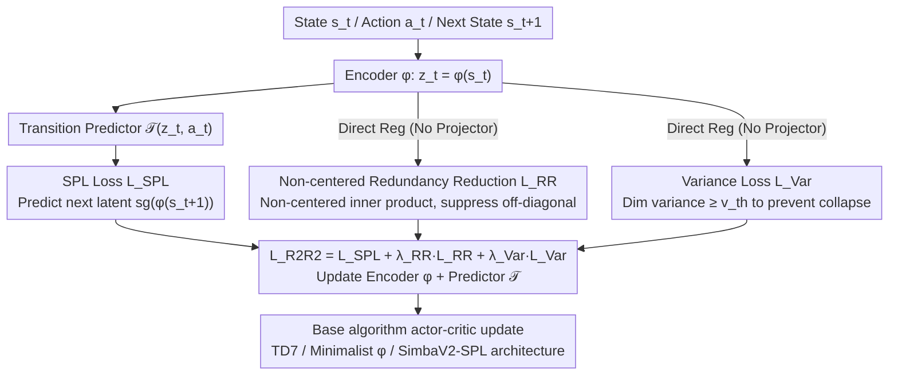

# R2R2: Robust Representation for Intensive Experience Reuse via Redundancy Reduction in Self-Predictive Learning

**Conference**: ICML 2026  
**arXiv**: [2605.14026](https://arxiv.org/abs/2605.14026)  
**Code**: Available (github.com/songsang7/R2R2)  
**Area**: Reinforcement Learning / Self-Predictive Representation Learning / High UTD Training  
**Keywords**: Self-Predictive Learning, Redundancy Reduction, VICReg, High UTD, Representation Collapse

## TL;DR
R2R2 integrates VICReg-style redundancy reduction constraints into Self-Predictive Learning (SPL) to stabilize high UTD training. The **key modification is the removal of zero-centering**—theoretically proving that zero-centering eliminates constant eigenmodes (i.e., global dynamics information) in the SPL spectral decomposition. Experiments on TD7 at UTD=20 improved the score from 1.02 to 1.24 (+22%) and established a new continuous control SOTA using the proposed SimbaV2-SPL architecture.

## Background & Motivation

**Background**: The pursuit of sample efficiency in reinforcement learning has led to two main paths—off-policy algorithms reusing the replay buffer, and model-based/SPL methods extracting extra signals from dynamics using auxiliary tasks (predicting the next latent state). Increasing the Update-to-Data (UTD) ratio is another orthogonal approach, but high UTD (e.g., 20) almost inevitably triggers overfitting. Current high UTD works (REDQ, CrossQ, SimbaV2, BRO) focus almost exclusively on the **value function side**—using ensembles, BatchNorm, LayerNorm, etc., to stabilize critic bias.

**Limitations of Prior Work**: These value-centric methods do not address **instability at the representation layer**. When UTD is increased, the SPL encoder and latent dynamics predictor also overfit, leading to subspace collapse and a persistent decline in effective rank. Existing SSL redundancy reduction methods (Barlow Twins, VICReg) are natively designed for vision representations and **default to zero-centering** (covariance matrices calculated after subtracting the mean); applying them directly to SPL leads to performance degradation.

**Key Challenge**: Spectral analysis of SPL (Tang et al., 2023) shows that minimizing SPL loss is equivalent to making the representation matrix $\Phi$ span the top-$k$ right eigenvector subspace of the transition matrix $P^\pi$. A Markov chain always has an eigenvalue of 1, with a corresponding constant eigenvector $\mathbf 1$ ($P\mathbf 1=\mathbf 1$), carrying "global dynamics/probability conservation" information. The **zero-centering operator $H=I_N-\frac{1}{N}\mathbf 1\mathbf 1^\top$ is 0 for any constant vector**—meaning that the seemingly harmless "mean subtraction" in SSL precisely erases this dominant eigenmode, directly conflicting with the goal of SPL.

**Goal**: (i) Add representation-layer regularization to high UTD training; (ii) ensure the regularization is compatible with the spectral properties of SPL; (iii) make the design algorithm/architecture-agnostic and plug-and-play.

**Key Insight**: The authors start from the mathematical detail of the "constant eigenmode" in SPL spectral decomposition—a perspective entirely untouched in the SSL community—finding that zero-centering is a structural issue rather than a simple hyperparameter tuning problem.

**Core Idea**: Use **non-centered covariance (direct inner product matrix without mean subtraction)** for redundancy reduction regularization, while removing the extra projector to attach the mechanism directly to the SPL encoder output, unifying "redundancy reduction" and "SPL spectral preservation."

## Method

### Overall Architecture
R2R2 adds two regularization terms to the encoder output $z_t=\phi(s_t)$ within the standard SPL training loop: a non-centered redundancy reduction loss $\mathcal L_{\text{RR}}$ and a variance loss $\mathcal L_{\text{Var}}$. The main SPL loss $\mathcal L_{\text{SPL}}=\mathbb E[\|\mathcal T(\phi(s),a)-\text{sg}(\phi(s'))\|_2^2]$ remains unchanged. After each environment step, $G$ high UTD updates are performed. Each involves: encoding states, calculating $\mathcal L_{\text{SPL}}+\lambda_{\text{RR}}\mathcal L_{\text{RR}}+\lambda_{\text{Var}}\mathcal L_{\text{Var}}$ to update the encoder and predictor, followed by actor-critic updates for the base algorithm (TD7, Minimalist $\phi$, SimbaV2-SPL, etc.). The paper also constructs the SimbaV2-SPL architecture to integrate the SPL module (encoder + transition predictor) into SimbaV2, allowing R2R2 to stack with SOTA architectures. Two key changes in the pipeline are reflected in "where the loss is attached and how it is calculated": the redundancy reduction term uses a non-centered form (Design 1) and is attached directly to the encoder output without a projector (Design 2); plus the architectural modification of embedding the SPL module into SimbaV2 (Design 3).

### Key Designs

**1. Non-centered Redundancy Reduction Loss: Removing "mean subtraction" to prevent the regularization from mis-killing constant eigenmodes**

This is the crux of the paper. SPL theoretical analysis indicates that minimizing SPL loss is equivalent to spanning the top-$k$ right eigenvector subspace of the transition matrix $P^\pi$. Since Markov chains always have an eigenvalue of 1 corresponding to the constant vector $\mathbf 1$ ($P\mathbf 1=\mathbf 1$), this carries global dynamics info. The zero-centering operator $H=I_N-\frac{1}{N}\mathbf 1\mathbf{1}^\top$ used in VICReg/Barlow Twins is 0 for any constant vector, meaning it erases this dominant eigenmode. R2R2's fix is minimal: replace standard covariance with a non-centered correlation matrix $[C(Z)]_{ij}=\frac{1}{N-1}\sum_b z_{b,i}z_{b,j}$ (no mean subtraction). The loss $\mathcal L_{\text{RR}}=\frac{1}{d(d-1)}\sum_{i\neq j}[C(Z)]_{ij}^2$ pushes off-diagonal inner products toward 0, forcing feature dimensions to be "uncorrelated but not zero-mean."

Lemma 1 + Proposition 2 strictly prove that $H\mathbf c=\mathbf 0$ implies zero-centering exactly eliminates the projection of the representation in the $\mathbf 1$ direction. While network bias parameters could theoretically compensate for this signal, it is an unnecessary optimization detour.

**2. Direct Regularization: Removing the projector and applying regularization directly to the encoder output**

Standard VICReg/Barlow Twins pass $z$ through a projector $g$ before calculating redundancy loss. However, R2R2 analysis reveals that SPL spectral constraints act on the encoder output $\phi(s)$ itself—an intermediate projector obscures the regularization constraint on the "representation actually used by downstream tasks." Therefore, R2R2 calculates $\mathcal L_{\text{RR}}$ and $\mathcal L_{\text{Var}}$ directly on $\phi(s)$, ensuring constraints fall precisely on the layer required by SPL spectral properties. Removing one module also reduces the overfitting surface area under high UTD.

**3. SimbaV2-SPL Architecture: Integrating SPL into SOTA model-free architectures to prove orthogonal improvements**

To avoid being perceived as a specific "trick" for TD7, the authors integrate the SPL framework into the purely model-free SimbaV2. They add an extra encoder $\phi$ and transition predictor $\mathcal T$, then concatenate the linear projection + L2 normalization of the raw state with the latent representation $z$ as input to the actor/critic. This injects latent dynamics while preserving SimbaV2's high-frequency details from the raw signal. Improvements gained by stacking R2R2 on this orthogonal architecture demonstrate complementarity with modern structural progress.

### Loss & Training
$\mathcal L_{\text{R2R2}}=\mathcal L_{\text{SPL}}+\lambda_{\text{RR}}\mathcal L_{\text{RR}}+\lambda_{\text{Var}}\mathcal L_{\text{Var}}$. Across all experiments, $\lambda_{\text{RR}}=\lambda_{\text{Var}}=0.01$ and variance threshold $v_{th}=1$ are fixed **without task-specific tuning**. All other hyperparameters of the base algorithms remain unchanged.

## Key Experimental Results

### Main Results
11 continuous control environments (4 Gym MuJoCo + 7 DMC-Hard), normalized scores (relative to UTD=1 baseline); tested at UTD=1 and UTD=20; 500k step budget.

| Algorithm | Env | UTD=1 | UTD=20 |
|---|---|---|---|
| TD7 | Total | 1.00 | 1.02 |
| TD7 + R2R2 | Total | **1.06** | **1.24** (+22%) |
| TD7 | DMC-Hard | 1.00 | 1.02 |
| TD7 + R2R2 | DMC-Hard | 1.05 | **1.32** |
| Minimalist $\phi$ | Gym | 1.00 | 0.41 (Collapse) |
| Minimalist $\phi$ + R2R2 | Gym | 1.00 | **0.57** |
| TD7+LN | Total | 1.00 | 0.88 (Regress) |
| TD7+LN + R2R2 | Total | 1.08 | **1.10** |
| SimbaV2 | Total | 1.00 | 1.20 |
| SimbaV2 + SPL | Total | 1.16 | **1.34** (New SOTA) |
| SimbaV2 + SPL + R2R2 | Total | 1.15 | **1.38** |

### Ablation Study

| Configuration | Dog-Trot at UTD=20 | Conclusion |
|---|---|---|
| Full R2R2 (non-centered) | High | Full method |
| R2R2 + zero-centering | Significant drop | Validates Prop 2 |
| Remove $\mathcal L_{\text{RR}}$ | Severe drop | RR term is main contributor |
| Remove $\mathcal L_{\text{Var}}$ | Moderate drop | Var term prevents collapse |
| TD7 baseline (No R2R2) | Lowest | Unprotected |

### Key Findings
- **R2R2 complements LayerNorm**: TD7+LN performs worse than the baseline at high UTD (0.88), while adding R2R2 recovers it to 1.10, showing that architectural normalization alone cannot solve representation collapse.
- **Singular Value Spectrum Visualization (Humanoid-Stand)**: At UTD=1, R2R2 compresses effective rank from 76.5 to 65.0 (concentrating the spectrum on task-relevant components). At UTD=20, the baseline shows a sharp collapse of tail singular values, while R2R2 maintains a heavy-tailed distribution, preventing subspace collapse.
- **Effective Rank Evolution**: Under UTD=20, the ER of the baseline decreases progressively, while R2R2 maintains a stable high ER. Adding zero-centering causes the ER to collapse alongside the baseline—directly validating the theoretical analysis.

## Highlights & Insights
- **Revisiting SSL and RL compatibility via spectral decomposition**: Previously, it was not considered that the "mean subtraction" in VICReg could specifically kill the constant eigenmodes of Markov chains. This observation breaks the optimistic assumption of "directly porting SSL tricks to RL," reminding us that SSL design premises (unordered data, mean-insensitivity) may not hold for structured RL latent dynamics.
- **Theoretically guided minimal changes**: Simply removing "mean subtraction" from the covariance formula and "projectors" stabilizes SOTA architectures. The clean paper structure of "theory tells you **which line of code NOT to change**" is worth emulating.
- **Solid orthogonality arguments**: Improvements are shown across SPL baselines of varying complexity (TD7, Minimalist $\phi$, TD7+LN), and by creating SimbaV2-SPL to attach R2R2 to the strongest backbone.
- **Zero hyperparameter tuning**: Using the same $\lambda$ across all tasks is highly favorable for practical deployment.

## Limitations & Future Work
- Theoretical analysis relies on the "SPL $\approx$ spectral decomposition" equivalence (Tang et al. 2023); the tightness for non-SimSiam-style frameworks (e.g., BYOL+predictor) is not fully discussed.
- The introduction of SimbaV2-SPL mixes "adding SPL" and "adding R2R2" variables, partially diluting the purity of the comparison (though +SPL and +SPL+R2R2 are reported separately).
- Experiments focus on continuous control; discrete actions (Atari), sparse rewards, and pixel inputs are not yet verified.
- Training overhead is approximately +12% wall-clock time, which may require optimization for extreme scales.

## Related Work & Insights
- **vs VICReg / Barlow Twins**: Native SSL redundancy reduction; zero-centering structurally destroys SPL; R2R2 fixes this with a non-centered form.
- **vs REDQ / CrossQ**: Value-centric high UTD methods solving critic bias; R2R2 addresses orthogonal representation collapse and can be stacked.
- **vs SimBa / SimbaV2 / BRO**: Rely on architectural normalization (LN) and dropout to stabilize high UTD; R2R2 proves architecture alone is insufficient and regularization is a necessary supplement.
- **vs SPR / TD7 (SPL-based)**: Native SPL representations are unstable at high UTD; R2R2 injects redundancy reduction to stabilize the encoder directly.

## Rating
- Novelty: ⭐⭐⭐⭐⭐ The insight using spectral analysis to explain "why SSL centering is incompatible with SPL" is highly original.
- Experimental Thoroughness: ⭐⭐⭐⭐⭐ Comprehensive coverage across 11 environments × 4 baselines × 2 UTD settings + ER/spectral/wall-clock analysis.
- Writing Quality: ⭐⭐⭐⭐⭐ Logical flow from theoretical lemmas to propositions to experiments and ablations is very clean.
- Value: ⭐⭐⭐⭐ Provides a new representation-layer stabilization mechanism for high UTD RL, proven to stack with SOTA architectures.

<!-- RELATED:START -->

## Related Papers

- [\[ICLR 2026\] Experience-based Knowledge Correction for Robust Planning in Minecraft](../../ICLR2026/robotics/experience-based_knowledge_correction_for_robust_planning_in_minecraft.md)
- [\[CVPR 2026\] Learning Predictive Visuomotor Coordination](../../CVPR2026/robotics/learning_predictive_visuomotor_coordination.md)
- [\[ICML 2026\] Plan in Sandbox, Navigate in Open Worlds: Learning Physics-Grounded Abstracted Experience for Embodied Navigation](plan_in_sandbox_navigate_in_open_worlds_learning_physics-grounded_abstracted_exp.md)
- [\[NeurIPS 2025\] Sample-Efficient Tabular Self-Play for Offline Robust Reinforcement Learning](../../NeurIPS2025/robotics/sample-efficient_tabular_self-play_for_offline_robust_reinforcement_learning.md)
- [\[CVPR 2026\] Dejavu: Towards Experience Feedback Learning for Embodied Intelligence](../../CVPR2026/robotics/dejavu_towards_experience_feedback_learning_for_embodied_intelligence.md)

<!-- RELATED:END -->
