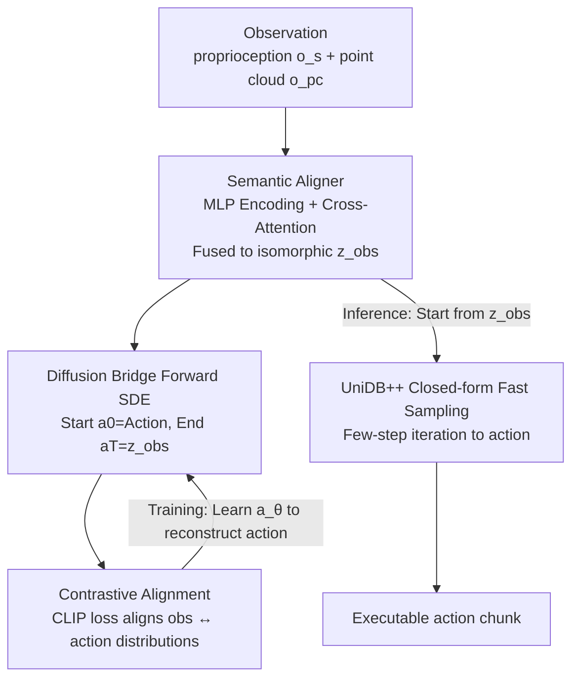

# Sample from What You See: Visuomotor Policy Learning via Diffusion Bridge with Observation-Embedded Stochastic Differential Equation

**Conference**: ICML2026  
**arXiv**: [2512.07212](https://arxiv.org/abs/2512.07212)  
**Code**: https://jianghcsr.github.io/BridgePolicy_page/  
**Area**: Robotics / Embodied AI  
**Keywords**: Diffusion Bridge, Visuomotor Policy, Imitation Learning, Modality Alignment, Stochastic Optimal Control

## TL;DR
BridgePolicy reformulates the diffusion policy paradigm—moving from "observation as a condition with sampling starting from random noise" to using a diffusion bridge that embeds observations directly into the endpoint of the forward SDE. This allows action sampling to originate from an "information-rich observation prior." By utilizing a semantic aligner to compress heterogeneous observations into an isomorphic representation with actions, the method consistently outperforms existing generative policies across 52 simulation tasks and 5 real-robot tasks.

## Background & Motivation
**Background**: Imitation learning using diffusion models or flow matching is currently the mainstream approach for robot control. Methods like Diffusion Policy (DP), 3D Diffusion Policy (DP3), and FlowPolicy follow a common paradigm: an expert action chunk is transformed into random noise through a forward process defined by SDEs/ODEs, and a network **conditioned on observations** is trained to reverse this process, iteratively turning noise into executable actions. Their advantages lie in characterizing multi-modal action distributions and modeling long-term temporal dependencies.

**Limitations of Prior Work**: These methods treat observations $\boldsymbol{o}$ (point clouds, robot proprioception, etc.) **only as high-level conditioning signals** fed into the denoising network, rather than integrating them into the stochastic dynamics of the diffusion process itself. Consequently, sampling is forced to start from an **uninformative random Gaussian noise** $\boldsymbol{a}_T\sim\mathcal{N}(0,I)$, which weakens the coupling between perception and control, often compromising precision and reliability.

**Key Challenge**: Observations actually carry rich information about "what action to take," but the mathematical structure of standard diffusion paradigms dictates that the endpoint must be a fixed noise distribution. Observations cannot enter the SDE trajectory and can only enter through the "side door" of network conditioning.

**Key Insight**: The authors note that diffusion bridges in image inpainting/translation have proven that the **forward process can be modified such that the endpoint distribution naturally aligns with the desired conditional distribution**. Thus, the reverse process can start from an "informative prior" (the learned observation representation) instead of noise. If this works for image tasks, why not for policy learning?

**Core Idea**: Reformulate policy learning as **learning a diffusion bridge**. The forward process starts at action $\boldsymbol{a}_0=\boldsymbol{a}$ and ends at observation $\boldsymbol{a}_T=\boldsymbol{o}$, where the observation is explicitly written into the endpoint of the SDE trajectory rather than serving only as a condition. The reverse process then samples actions directly from the observation prior. The difficulty lies in the requirement that diffusion bridges must have **isomorphic** (same dimension) endpoints, whereas robot observations (proprioception, RGB-D, language) and actions are naturally heterogeneous and dimensionally misaligned. This necessitates a semantic aligner to "create" an observation representation isomorphic to the action.

## Method

### Overall Architecture
The BridgePolicy pipeline can be summarized as follows: **During training**, heterogeneous observations (robot state $\boldsymbol{o}_s$ + point cloud $\boldsymbol{o}_{pc}$) are encoded via MLPs and fused using cross-attention into an observation representation $\boldsymbol{z}_{obs}$ that is **isomorphic to the action chunk**. This is set as the diffusion bridge endpoint $\boldsymbol{a}_T$, while expert actions are set as the starting point $\boldsymbol{a}_0$. Noise is added along the optimal controlled forward SDE provided by UniDB, and a data prediction network $\boldsymbol{a}_\theta$ is trained to reconstruct the clean action. **During inference**, sampling no longer starts from noise but from the fused $\boldsymbol{z}_{obs}$, using the training-free closed-form update rules of UniDB++ for a few iterations to directly output executable actions.

### Key Designs

**1. Observation-Embedded Diffusion Bridge: Starting Sampling from "What is Seen" Rather than Noise**

This is the core contribution, directly addressing the bottleneck of sampling from uninformative noise. Utilizing the UniDB framework under Stochastic Optimal Control (SOC), the authors construct a diffusion bridge by formulating the forward process as an optimal control problem with trajectory and endpoint costs:
$$\min_{\mathbf{u}_{t,\gamma}}\ \mathbb{E}\left[\int_{0}^{T}\tfrac{1}{2}\|\mathbf{u}_{t,\gamma}\|_{2}^{2}\,dt+\tfrac{\gamma}{2}\|\boldsymbol{a}_{T}^{u}-\boldsymbol{a}_{T}\|_{2}^{2}\right],\quad \mathrm{d}\boldsymbol{a}_t=[\theta_t(\boldsymbol{a}_T-\boldsymbol{a}_t)+g_t\mathbf{u}_{t,\gamma}]\mathrm{d}t+g_t\mathrm{d}\boldsymbol{w}_t$$
where the penalty coefficient $\gamma$ for the endpoint cost forces the system to drive the state from action $\boldsymbol{a}_0=\boldsymbol{a}$ to observation $\boldsymbol{a}_T=\boldsymbol{o}$. UniDB provides the closed-form optimal controlled forward SDE (with an additional correction term $\frac{g_t^2 e^{-2\bar\theta_{t:T}}}{\gamma^{-1}+\bar\sigma_{t:T}^2}$ in the drift), bridging "action ↔ observation." The fundamental difference from DP/DP3 is that the endpoint is no longer $\mathcal{N}(0,I)$ but the observation itself—allowing the reverse process to start from a prior carrying "action-relevant" information. The training objective is an $\ell_1$ reconstruction loss $\mathcal{L}_{DB}=\mathbb{E}\|\boldsymbol{a}_\theta(\boldsymbol{a}_t,\boldsymbol{a}_T,t)-\boldsymbol{a}\|$.

**2. Semantic Aligner: Compressing Heterogeneous Observations into Isomorphic Action-like Endpoints**

The mathematical prerequisite for a diffusion bridge is that both ends are **isomorphic**. However, robot observations and actions vary significantly in shape and modality. The semantic aligner solves this in two steps: first, converting depth maps to point clouds and downsampling them (512/1024 points for sim, 2048 for real), then encoding state and point clouds into $\boldsymbol{z}_s, \boldsymbol{z}_{pc}$ using lightweight MLPs. Finally, **cross-attention** is used for multi-modal fusion:
$$\boldsymbol{a}_T:=\boldsymbol{z}_{obs}=\mathbf{softmax}\!\left(\frac{\boldsymbol{z}_{pc}\boldsymbol{z}_s^{\top}}{\sqrt{d_s}}\right)\boldsymbol{z}_s$$
This yields a unified observation representation **isomorphic to the action chunk**, serving as the diffusion bridge endpoint. This step simultaneously resolves "heterogeneous distribution bridging" and "shape mismatch." Ablations show cross-attention outperforms simple concatenation (see Table 3).

**3. Contrastive Alignment Loss: Ensuring the Prior is "Samplable and Semantically Near Actions"**

Isomorphism alone does not guarantee that the distributions of observations and actions align, nor does it ensure "samplability" from $\boldsymbol{z}_{obs}$. The authors use a CLIP-style contrastive loss to pull the observation representation and action closer in semantic space:
$$\mathcal{L}_{align}=\mathcal{L}_{clip}(\boldsymbol{a},\boldsymbol{z}_{obs})+\mathcal{L}_{clip}(\boldsymbol{z}_{obs},\boldsymbol{a})$$
The total loss is $\mathcal{L}=\mathcal{L}_{DB}+\alpha\mathcal{L}_{align}$. This loss ensures the endpoint prior is semantically close to the action distribution, making sampling from observations both stable and accurate. Combined with the theoretical perturbation bound (Theorem 3.1: action output error is linearly bounded by observation MLP error $\|\tilde{\boldsymbol{a}_0}-\boldsymbol{a}_0\|\le C\|\tilde{\boldsymbol{a}_T}-\boldsymbol{a}_T\|$, where $C$ is empirically found to be $10^{-2}\sim10^{-3}$), it indicates that even with reconstruction errors in the encoder, generated actions will not drift significantly.

### Loss & Training
Training jointly optimizes the diffusion bridge reconstruction loss $\mathcal{L}_{DB}$ ($\ell_1$ norm, following UniDB) and the alignment loss $\mathcal{L}_{align}$ with a positive weight $\alpha$. Inference uses the training-free accelerator provided by UniDB++: given a data prediction model $\boldsymbol{a}_\theta$ and timesteps decreasing from $t_0=T$ to $t_M=0$, actions are generated iteratively starting from $\boldsymbol{a}_T=\boldsymbol{z}_{obs}$ using closed-form update rules (Eq. 4 in the original paper). All baseline NFEs are set to 10 (except FlowPolicy, set to 1 to avoid error accumulation in consistency flow matching).

## Key Experimental Results

### Main Results
Simulation covers three benchmarks—Adroit, DexArt, and MetaWorld—totaling 52 tasks. The metric is success rate (mean of the top 5 evaluations across 3 random seeds).

| Method | MW-Easy | MW-Medium | MW-Hard | MW-VeryHard | DexArt | Adroit | Average |
|--------|---------|-----------|---------|-------------|--------|--------|---------|
| DP | 0.79 | 0.31 | 0.10 | 0.26 | 0.45 | 0.31 | 0.37 |
| DP3 | 0.87 | 0.61 | 0.40 | 0.51 | 0.57 | 0.68 | 0.60 |
| FlowPolicy | 0.86 | 0.67 | **0.59** | 0.76 | 0.54 | 0.70 | 0.68 |
| VITA | 0.85 | 0.58 | 0.48 | 0.62 | 0.55 | 0.77 | 0.64 |
| **BridgePolicy** | **0.91** | **0.75** | 0.58 | **0.79** | **0.60** | **0.81** | **0.74** |

Real-robot experiments used a Franka Emika Panda with a ZED-2i camera, evaluating 10 episodes across 5 tasks:

| Method | Oven-Closing | Oven-Opening | Pick-Place | Pour | Unplug | Average |
|--------|--------------|--------------|-----------|------|--------|---------|
| Simple DP3 | 0.8 | 0.6 | 0.6 | 0.6 | 0.7 | 0.66 |
| DP3 | 0.9 | 0.9 | 0.7 | 0.6 | 0.7 | 0.76 |
| FlowPolicy | 1.0 | 0.7 | 0.5 | 0.1 | 0.5 | 0.56 |
| **BridgePolicy** | 1.0 | **1.0** | **0.8** | **0.8** | **0.9** | **0.90** |

### Ablation Study

| Configuration | Adroit-Pen | Adroit-Door | MW-Handle-Pull | Description |
|---------------|------------|-------------|----------------|-------------|
| Concatenation | 0.78 | 0.59 | 0.55 | Simple feature concatenation |
| Cross-Attention | **0.81** | **0.665** | **0.63** | Adopted in full model |

### Key Findings
- BridgePolicy's average success rate of 0.74 is significantly higher than the runner-up FlowPolicy (0.68). The advantage is more pronounced in harder tasks (MetaWorld Hard/Very Hard), suggesting that "starting from an observation prior" is more stable for complex tasks.
- On real hardware, it achieves 0.90, far exceeding DP3's 0.76. FlowPolicy failed significantly on tasks like "Pour" (0.1) which requires continuous fine control, as NFE=1 single-step sampling accumulates errors in real-world settings.
- Cross-attention for modality fusion is consistently superior to concatenation, confirming that heterogeneous observations require semantic fusion rather than simple stacking.
- Ablations on the number of demonstrations (Figure 4) show BridgePolicy maintains its advantage with less data, demonstrating sample efficiency gains from the observation prior.

## Highlights & Insights
- **Elevating "Conditioning" to "Trajectory Endpoint"**: The most brilliant insight is realizing that observations should not just enter through the "side door" of network conditioning but should be embedded into the diffusion SDE endpoint. This correctly migrates the diffusion bridge concept from image inpainting to policy learning.
- **Isomorphism is the Key to Deployment**: The "hard constraint" of equal dimensions in a diffusion bridge is exactly why others failed to apply it directly. The semantic aligner (cross-attention for isomorphism + CLIP contrastive loss for distribution alignment) systematically removes this barrier, providing a reusable engineering template.
- **Theoretical Perturbation Bound**: Theorem 3.1, with a linear bound and empirical $C\sim10^{-2}$, proves that "errors in the observation encoder are not amplified into catastrophic action errors," providing theoretical grounding for "starting from a learned prior."
- **Transferability**: This paradigm—embedding conditions into the generation trajectory endpoint + aligners for heterogeneous isomorphism—can be transferred to any generative decision task where conditions are information-rich but heterogeneous to the target space (e.g., multi-modal trajectory planning).

## Limitations & Future Work
- **Reliance on Point Clouds/Depth**: The method primarily uses 3D point clouds as visual input. Its applicability to pure RGB scenes without reliable depth or cases with poor calibration remains uncertain.
- **Bridge Endpoints are "Action ↔ Fused Observation" rather than Raw Multimodalities**: Truly heterogeneous modalities like language instructions are eventually compressed into the isomorphic $\boldsymbol{z}_{obs}$. Whether fine-grained semantics are lost or if this suffices for long-range language-conditioned tasks is not fully verified.
- **Sampler Complexity**: The UniDB++ closed-form update rules involve many coefficients (Eq. 4). While computational overhead is low, the threshold for engineering implementation and numerical stability is not trivial.
- **Empirical Estimation of Constant $C$**: The constant $C$ in the perturbation bound is difficult to determine analytically and was only small on the tasks tested; there is no guarantee it remains small under distribution shifts or new tasks.

## Related Work & Insights
- **vs DP / DP3 / FlowPolicy**: These treat observations as external conditions for a denoising network and sample from random noise. BridgePolicy embeds observations into the SDE endpoint and samples from an observation prior—essentially moving from an "uninformative prior" to an "informative prior," improving both accuracy and sample efficiency.
- **vs BRIDGER**: BRIDGER trains a coarse policy first and then refines it with a diffusion bridge; its performance depends heavily on the quality of the coarse policy. BridgePolicy builds heterogeneous observations directly into the bridge and generates actions end-to-end without a coarse policy.
- **vs VITA**: VITA performs flow matching in a joint image-action latent space and uses a decoder to recover executable actions (introducing generalization errors, with performance between DP3 and FlowPolicy). BridgePolicy models observations directly within the SDE trajectory and generates actions directly, bypassing the decoding stage.

## Rating
- Novelty: ⭐⭐⭐⭐⭐ First to correctly migrate the "observation-embedded endpoint" paradigm from diffusion bridges to visuomotor policies, systematically solving the heterogeneous isomorphism challenge.
- Experimental Thoroughness: ⭐⭐⭐⭐ 52 sim + 5 real tasks, comparison with 5 SOTAs, and theoretical bounds; ablations could be further expanded.
- Writing Quality: ⭐⭐⭐⭐ Clear logic from motivation to challenges to method; sampling formulas are dense but supported by pseudocode.
- Value: ⭐⭐⭐⭐ Provides a new framework for "starting from observation" for generative policies, holding significant practical value for robot imitation learning.

<!-- RELATED:START -->

## Related Papers

- [\[ICLR 2026\] H$^3$DP: Triply-Hierarchical Diffusion Policy for Visuomotor Learning](../../ICLR2026/robotics/h3dp_triplyhierarchical_diffusion_policy_for_visuomotor_learning.md)
- [\[ICLR 2026\] Cosmos Policy: Fine-Tuning Video Models for Visuomotor Control and Planning](../../ICLR2026/robotics/cosmos_policy_fine-tuning_video_models_for_visuomotor_control_and_planning.md)
- [\[NeurIPS 2025\] Act to See, See to Act: Diffusion-Driven Perception-Action Interplay for Adaptive Policies](../../NeurIPS2025/robotics/act_to_see_see_to_act_diffusion-driven_perception-action_interplay_for_adaptive_.md)
- [\[CVPR 2026\] GraspLDP: Towards Generalizable Grasping Policy via Latent Diffusion](../../CVPR2026/robotics/graspldp_towards_generalizable_grasping_policy_via_latent_diffusion.md)
- [\[ICLR 2026\] VITA: Vision-to-Action Flow Matching Policy](../../ICLR2026/robotics/vita_vision-to-action_flow_matching_policy.md)

<!-- RELATED:END -->
